# 通过案例解释 Spring Boot 的自定义验证，第 2 部分

> 原文：<https://betterprogramming.pub/custom-validation-in-spring-boot-best-explained-part-2-f99bfb4e66a4>

## 案例 2——使用数据库实现“主-细节”验证

迈克尔·泽兹奇在 [Unsplash](https://unsplash.com?utm_source=medium&utm_medium=referral) 上拍摄的照片

# 介绍

这是如何在 Spring Boot 实现自定义验证的第二部分。因此，为了让您更好地理解，如果您之前已经经历过[案例 1](https://medium.com/@zzpzaf.se/custom-validation-in-spring-boot-best-explained-part-1-1105a8c2711) 就更好了:

 [## 通过案例解释 Spring Boot 的自定义验证，第 1 部分

### 探索用数组进行验证等等

better 编程. pub](/custom-validation-in-spring-boot-best-explained-part-1-1105a8c2711) 

正如我们在开始时提到的，我们现在准备实现一个“主-细节”定制验证示例。

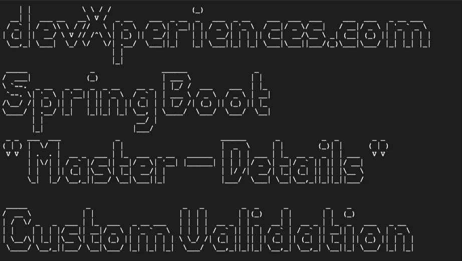

# 问题是

> 像我这样“成熟”的人可能对术语(或概念)“主细节”很熟悉无论是在我们使用 MS-DOS 的“古代”，还是在我们必须为给定的订单带来产品——细节——主数据的时候

假设您想要控制销售 POST 请求，并且您想要将销售仅限于给定供应商(“主”)的特定类别(“细节”)的项目。假设您希望限制所有或部分供应商销售仅属于每个供应商特定类别的商品。

例如，一个带有 `vendorId = 2`的卖家允许你发布带有`categoryId`的`{2, 17, 33, 5, 28}`的商品。带有`vendorId = 7`的卖家可以发布带有`categoryId` : `{3, 12, 41, 28}`的商品，以此类推。

最初，您可能认为如果我们在前面的案例上做更多的工作，这是可以实现的。也许您是对的，但是您应该花更多的精力使用两个字段来定义自定义验证:供应商和类别。你可以自己尝试，也可以按照下面的例子来做。

# 数据准备

正如我们已经说过的，这里我们将实现一个基于数据库的解决方案。这允许我们在数据库层中定义示例 case 逻辑，使我们的代码独立于固定的数据值。

为了简化我们的示例，我们必须定义三个主数据库表和最后一个多对多表:

*   `CATEGORIES` —用于物品类别
*   `VENDORS` —针对供应商、品牌等。,
*   `ITEMS` —用于物品
*   `VENDORCATEGORIES` —用于将`vendorId`与允许的`categoryIds`匹配

三个主要表格不言自明:

`CATEGORIES`

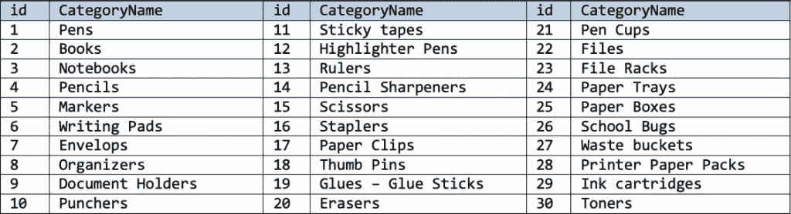

`VENDORS`

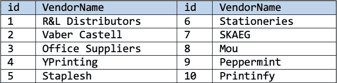

`ITEMS`

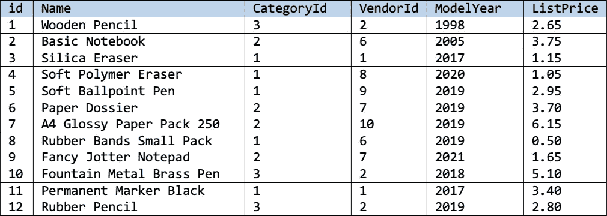

`VENDORCATEGORIES`

最后，对于我们的逻辑，我们还必须定义一个多对多表，即表。`VENDORCATEGORIES`表用于将一个`vendorId`与`categoryIds`匹配，它们被允许发送物品销售的 post 请求。

这里的方法是再使用一列(布尔列`0`或`1`)来表示特定的供应商是否允许某个特定的类别。将`true`切换到`false`，反之亦然，可以快速允许/禁止类别(无需添加或删除条目)。对于我们的例子，只定义两个供应商就足够了。

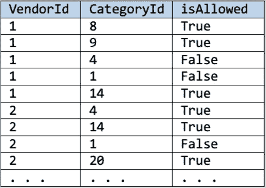

# 数据库ˌ资料库

作为数据库，我们要用 [MariaDB](https://mariadb.org/) 。MariaDB 是 MySQL 的开源(二进制)替代品。如果您尚未在您的计算机上安装它，您可以通过选择以下两个选项之一来完成:

*   [通过 Docker](https://www.devxperiences.com/pzwp1/2022/05/21/installing-and-using-mariadb-via-docker/) 安装和使用 MariaDB
*   [安装 MariaDB (10.5.8。-GA)通过 macOS 上的自制软件](https://www.devxperiences.com/pzwp1/2021/01/08/install-mariadb-10-5-8-ga-via-homebrew-on-macos/)

如果您想了解如何将 REST API 项目连接到 MariaDB，需要添加到项目的`pom.xml`中的 Maven [MariaDB 依赖关系](https://mvnrepository.com/artifact/org.mariadb.jdbc/mariadb-java-client)是什么，并开始使用 MariaDB 数据库，请看看我下面的文章:

 [## Spring Boot Rest API 开发快速入门

### 一个快速、简单、解释清晰且真正有效的 Spring Boot REST API 项目。提供回购！

blog.devgenius.io](https://blog.devgenius.io/quick-intro-to-rest-api-development-with-spring-boot-64583dabbe8c) 

现在是时候开始使用 MariaDB 数据库创建表并添加上面的采样数据了。你可以通过使用你的终端和 [MySQL CLI](https://mariadb.com/kb/en/mysql-command-line-client/) 或者使用 GUI，比如 [MySQL Workbench](https://www.mysql.com/products/workbench/) 或者基于 web 的 [phpMyAdmin](https://www.phpmyadmin.net/) 来实现。其他工具也可以。

为了方便起见，下面是可用于生成表并将采样数据添加到表中的 SQL 脚本:

**注**:该。带有上述脚本的 sql 文件也包含在下面的启动存储库中。

# 项目的起始存储库

到目前为止，一切顺利。现在是时候开始实现我们的“主-细节”自定义验证了。

👉我们的起点将是这个[回购](https://github.com/zzpzaf/customvalidation2/tree/3ac01cee488fffb97256cb1ec9c99ca31d98de24) (the。zip 文件[此处](https://github.com/zzpzaf/customvalidation2/archive/3ac01cee488fffb97256cb1ec9c99ca31d98de24.zip))。repo 是一个简单的 REST API 应用程序，用于处理我们之前见过的 MariaDB 数据库中的数据表。

它公开了三个主表(实体)的三个主要端点:

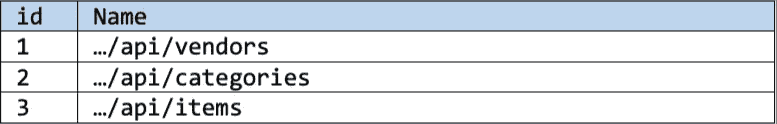

repo 为上述实体/端点提供所有标准的 [CRUD 操作](https://en.wikipedia.org/wiki/Create,_read,_update_and_delete)。

项目结构:

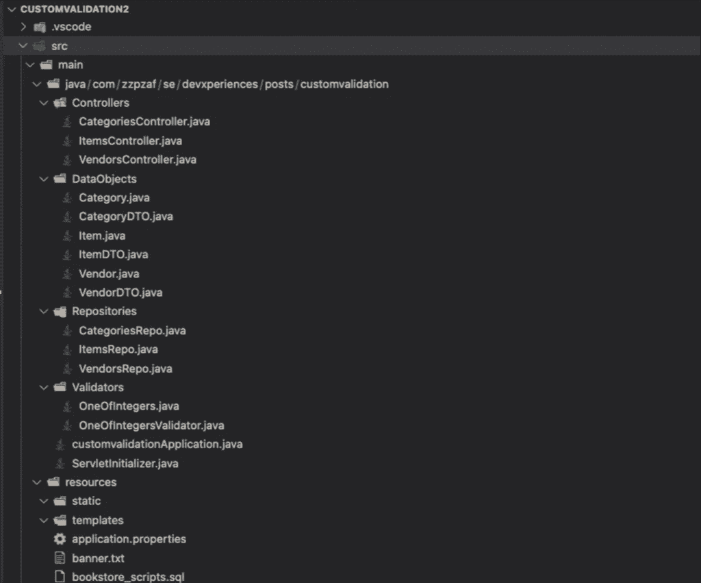

正如您所看到的，这里有所有的“标准”包(项目文件夹):

–服务于端点的控制器
–数据类的数据对象和数据传输对象(dto)
–通过 JDBCTemplate 和原始 SQL 查询访问数据库数据的存储库。

请注意:我们已经在`Validators`文件夹包中留下了`OneOfIntegers`定制验证文件，只是为了在任何情况下您都想使用我们之前的案例/例子中的约束。然而，我们已经移除了(实际上，我们已经注释掉了)这个为`itemDTO.java`文件中的`itemVendorId`字段定制的约束注释。

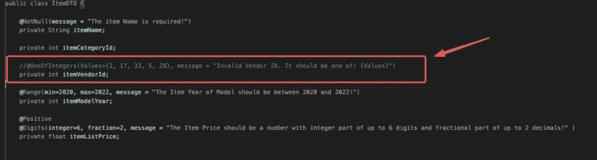

这是因为我们将为字段`itemVendorId`和`itemCategoryId`的组合实现我们的“主-细节”定制验证。

最后，请注意，正如我们已经说过的，我们不会使用 JPA/Hibernate 或任何其他 ORM，我们也避免了拥有单独的服务类。

# `Maven/pom.xml`依赖关系

下面给出了为 MariaDB 和核心 JDBC 功能(JDBCTemplate)添加到我们的`pom.xml`中的依赖项:

# MariaDB 连接参数

下面是添加到`application.properties` 文件中的连接参数(在参考资料中):

# “主-详细信息”自定义验证的实现

我们所要做的，与我们在之前的案例中所做的非常相似。

首先，让我们将新的定制注释命名为`DBMasterDetails`。

之后，我们必须创建`DBMasterDetails`验证接口和`DBMasterDetailsValidator`类。它们都位于 Validators 文件夹/包中。

下面给出了`DBMasterDetails`约束注释接口的初始版本:

将它与前一个案例`OneOfIntegers`约束注释接口进行比较，我们可以分辨出一些变化:

*   首先，我们将目标限制为字段类型(这里没有参数)。这是因为“主-细节自定义验证器”应该只应用于类(DTO)级别的字段，我们很快就会看到。
*   其次，我们必须为我们的“主-详细信息”自定义验证定义两个将参与组合的字段。这里，我们使用两个字符串变量，分别命名为`fieldName1`和`fieldName2`。
*   最后，(也是最重要的)，我们还使用一个“内部”注释接口，它将处理我们将结合使用的`Itemdto`的两个字段(前面提到过的`itemVendorId`和`itemCategoryId`)。我们使用一个相同类型的注释接口的列表(一个数组)(`DBMasterDetails`)，我们将这个列表命名为`value`。

现在让我们继续进行`DBMasterDetailsIDsValidator`类。

首先，我们必须获得先前定义的两个字段(在注释接口中)。类似地，对于前一种情况(带有`OneOfIntegersValidator`的情况)，我们通过覆盖`initialize()`方法来实现。

之后，我们可以读取它们的值，并通过检查它们是否为空来执行我们在`isValid()`方法中的第一次检查(否则，我们可以返回一个早期的`false`)。

初始`DBMasterDetailsIDsValidator`等级如下所示:

现在我们可以继续构建`DBMasterDetailsIDsValidator`类，通过处理来自我们的回购协议的数据。为此，我们将在我们的`VendorsRepo`中添加一个方法(我们将其命名为`getVendorAllowedCategories()`),该方法应该用于从`vendorcategories`表中只获取允许的类别 id(对于给定的`vendorId`)。

`getVendorAllowedCategories()`(在`VendorsRepo.java`内部)如下图所示:

该方法将`vendorId`作为一个参数，并返回一个整数列表，其中为特定的`vendorId`启用(允许)了所有类别 id。

现在，我们通过将 ItemsRepo 类“自动连接”到`DBMasterDetailsIDsValidator`类来访问它。然后，在`isValid()`方法中，我们调用回购的`getVendorAllowedCategories()`方法，并向其传递在那里获得的`vendorId`值。最后，我们检查返回的类别 id 整数列表是否包含也在那里获得的`categoryId`。如果列表包含它，则验证成功。否则，它会失败。

你可以在下面看到`DBMasterDetailsIDsValidator`类的更新版本:

这里的最后一步是通过用我们的`DBMasterDetails`验证约束在类级别更新`ItemsDTO.java`来准备它。注释应该在类级别，因为它处理字段的组合(列表)。我们必须传递相关的字段名，如果我们愿意，还可以传递一条我们更喜欢的消息，而不是在验证注释接口中定义的消息。这是多么简单:

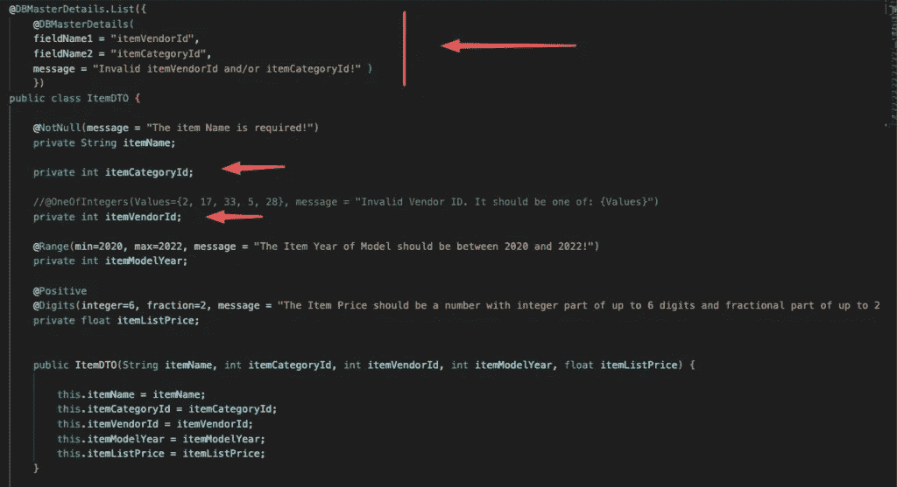

请注意，我们没有向相关字段添加任何验证。(但是，您可以添加应用程序和/或业务逻辑所需的任何验证约束注释)。

现在，是测试的时候了！(使用邮递员)。下面，我们在 POST 请求中使用一个 JSON body 对象，其中`vendorId`的值为`2`，而`categoryId`的值为`1`(因此我们预计验证会失败)。

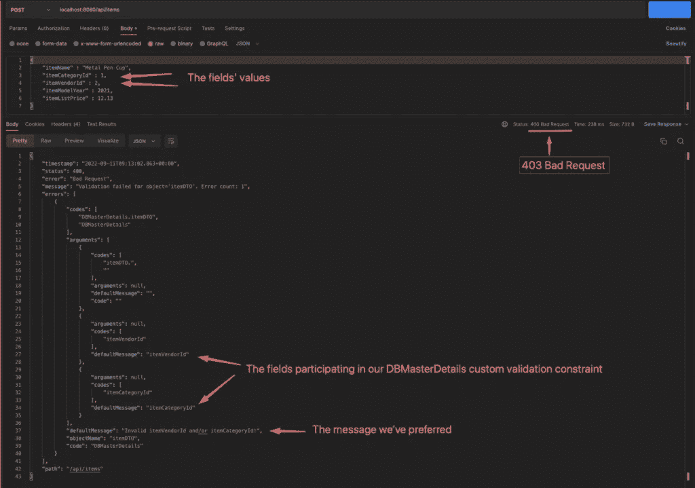

正如你所看到的，这是不成功的(403 错误请求)，正如我们所料。

然后使用值`vendorId=2`和`categoryId=4`进行尝试，POST 成功，一个新的条目被添加到条目表中。

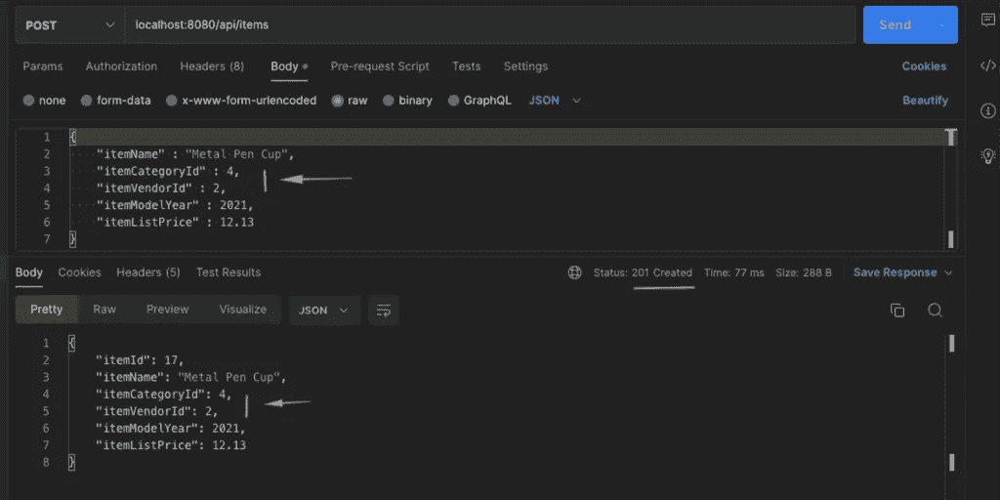

👉你可以下载[完整回购](https://github.com/zzpzaf/customvalidation2/tree/01da96dd0d50a1c9af91d78d1fff956c2d298f83)和我们在这里看到的[的代码](https://github.com/zzpzaf/customvalidation2/archive/01da96dd0d50a1c9af91d78d1fff956c2d298f83.zip)！

# 丰富

到目前为止，一切顺利！然而，我们的代码还有改进的空间。

## 将全权委托给回购公司

一个小而快速的升级是将检查返回的类别 id 列表中是否存在`categoryId`字段值的任务委托给`VendorsRepo`的功能。例如，这可以通过向该回购添加一个方法来实现，如下所示:

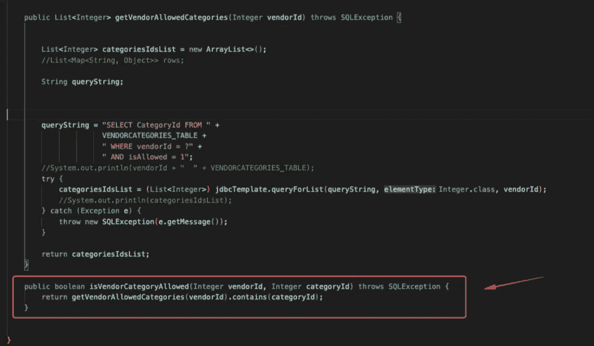

然后我们可以在“DBMasterDetailsValidator”中使用它:

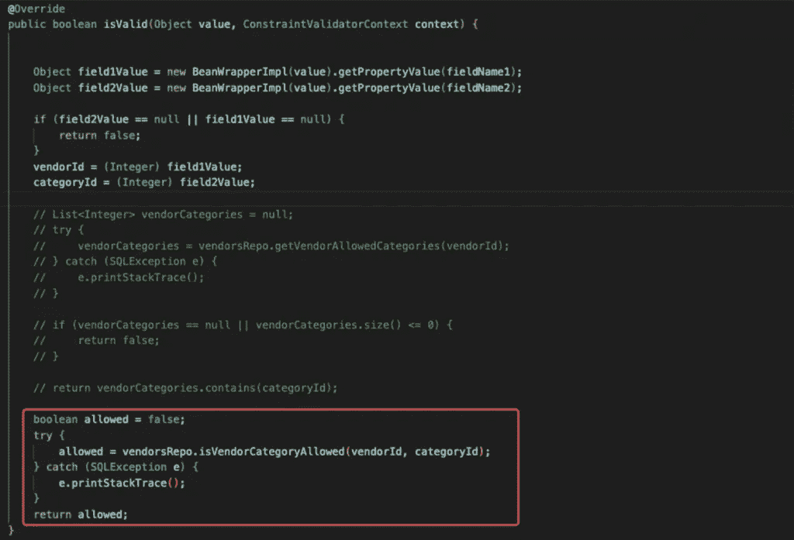

## 将特定消息传递到验证上下文中

这是可以的。然而，这并不重要。最重要的是在验证不成功(403 错误请求)的情况下给出更好的信息响应信息。到目前为止，我们只使用了一个通用消息(默认的或首选的消息，以及类级注释的字段定义)，例如，“无效的`itemVendorId`和/或`itemCategoryId`！”关于这两个领域。

更好的方法是提供更具体的消息，通知导致失败的字段。

我们可以区分许多不同的情况，但出于演示目的，我们可以停留在以下情况:

*   无效的供应商 id
*   此`Vendor`不允许`Category`

我们可以通过取消默认验证上下文并重新构建它，传递导致失败的字段和所需的消息来实现这一点。下面，你可以看到我们可以添加到我们的`DBMasterDetailsValidator`类的方法:

然后我们可以在`isValid()`方法中检查这些情况，并相应地构建验证上下文。

下面给出了`DBMasterDetailsIDsValidator`类的更新版本:

最后，您可以通过 Postman 测试它，并查看具体的消息:

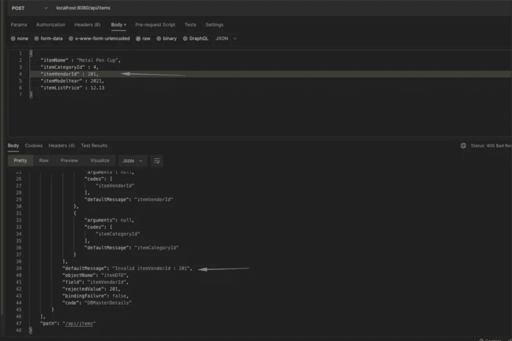

或者

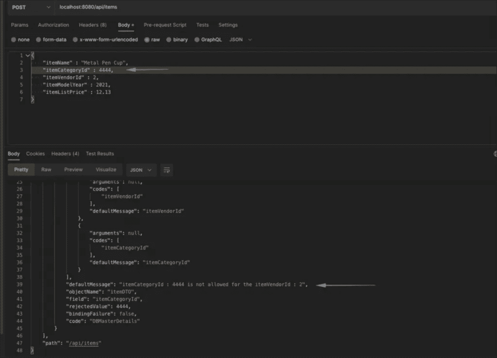

当然，您可以进行任何其他定制的内部检查，并返回更详细的失败消息(例如，检查类别 Id 是否驻留在来自`CategoriesRepo`的`categoryIds`范围内)，但是现在您更清楚该如何做了！

就是这样！你做到了！

👉你可以在这里找到[整个回购的最终版本。下载最后一次提交(最终实现)。zip 文件](https://github.com/zzpzaf/customvalidation2)[此处](https://github.com/zzpzaf/customvalidation2/archive/5cc509f94e16340b7e29244704070963d0583631.zip)。用它来深入春天和 Spring Boot 冒险！

我希望你喜欢这篇文章！

感谢阅读！👏