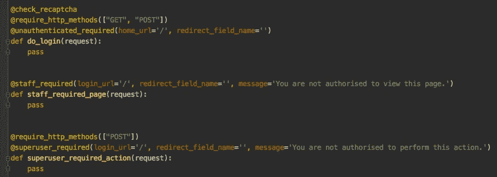
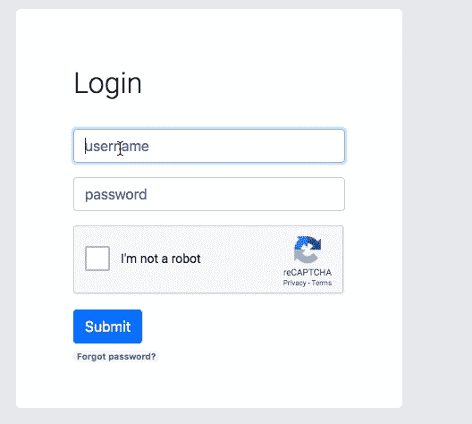

# 如何在 Django 中使用定制视图@decorators

> 原文：<https://betterprogramming.pub/custom-view-decorators-in-django-af50ea9b3994>

## 防止未经授权的用户访问视图，并使用@decorator 方法提供反馈，例如 RECAPTCHA 受保护的表单提交



图片来源:作者

在本文中，我将尝试概述如何使用 Django 的`user_passes_test`函数在 Django 中编写自己的定制装饰器。装饰器是一种基于请求方法或控制缓存行为来限制对视图的访问的方式。当您希望将登录用户与未经身份验证的用户分开，或者创建只有特权用户才能访问的管理页面时，这尤其有用。

Django 有几个内置的装饰器，但是它们的主要问题是不提供用户反馈。Django 还有一个内置的 messages 框架，它使用`SESSION_COOKIE`来存储消息，并在提交或重新加载网页后显示这些消息，作为用户反馈的一种方式。我们将把这一点纳入我们的自定义装饰。我们还将使用谷歌的`RECAPTCHA`来保护我们的表单提交免受垃圾邮件和滥用，并将它包含在一个装饰器中。

总之，本文中我们要做的是:

*   调整 Django 的`user_passes_test`,以便它使用 Django 的消息框架提供用户反馈
*   写三个自定义装饰:`@superuser_required`、`@staff_required`和`@unauthenticated_required`
*   使用 Google 的`RECAPTCHA`提供一个`@check_recaptcha`装饰器来保护表单提交不被滥用

# 为什么是装修工？

装饰器是清理代码并将视图认证过程与视图功能分离的一种简单方法。Django 有几个有用的内置装饰器，比如用于用户权限的`@login_required`、`@permission_required`和用于限制请求方法的`@require_http_methods`(`GET|POST`)。

当您想要执行某种定制视图认证时，您可以在视图本身中执行，如下所示。但是，当您将此身份验证应用于多个路由时，在每个路由中复制粘贴此示例会变得冗长。那时我开始编写定制装饰器，因为只需要一行代码`@custom_decorator(args*)`来认证和保护视图。

我们将在主应用程序文件夹的`decorators.py`文件中编写这些自定义装饰器，这样我们就可以在所有应用程序中导入它们:

```
[projectname]/
├── [projectname]/
│   ├── __init__.py
│   ├── **decorators.py**
│   ├── forms.py
│   ├── models.py
│   ├── settings.py
│   ├── urls.py
│   ├── views.py
│   ├── wsgi.py
└── manage.py
```

# 有用户反馈的装饰者

首先，我们将调整 Django 的`user_passes_test`，这样它也可以通过[消息框架](https://docs.djangoproject.com/en/3.0/ref/contrib/messages/)提供用户反馈。我们将在检查用户认证的装饰器中使用这个自定义函数。

为此我们需要做的就是添加行`26-27`，提示如果我们的`test_function`不成立，我们通过带有`messages.add_message`的消息框架返回参数`message`。`redirect_field_name`是一个有用的参数，用于指示用户在登录后应该被重定向到哪里(例如，如果您正在访问一个`login_required`路由>登录页面>回到相同的路由)，而`login_url`是如果`test_function`未被通过，您将被重定向到的路由。

**注意:**我在一个`config`对象中保存了我的配置，其中存储了我的 Django 项目的密钥，也存储了诸如 Google `RECAPTCHA`或电子邮件客户端等第三方的密钥。源代码来自 [Django 项目](https://docs.djangoproject.com/en/2.2/_modules/django/contrib/auth/decorators/)。我设置了两个全局默认消息，在调用函数`user_passes_test`时可以覆盖它们。

# 用户认证装饰者

现在我们将使用我们的自定义`user_passes_test`来编写我们的三个自定义装饰器。使用`lambda`符号，我们可以创建一个无名函数来检查用户`u`是否是`active`，是否具有`superuser`属性、`is_staff`或`is_authenticated`。这些用户属性都来自 Django 包含的[认证系统](https://docs.djangoproject.com/en/3.0/topics/auth/default/)。如果这些属性不成立，则返回错误消息。

然后我们可以在我们的视图中使用这些`@decorators`。注意，您可以自顶向下链接多个 decorators，如下所示。

# RECAPTCHA 受保护视图



感谢[熊伟·弗雷塔斯](https://simpleisbetterthancomplex.com/tutorial/2017/02/21/how-to-add-recaptcha-to-django-site.html)为这个`@check_recaptcha`装饰器提供代码。按照他的指南设置谷歌的`RECAPTCHA`和设置`@check_recaptcha`，这是超级简单的。你可以选择`RECAPATCHA v2`或`RECAPTCHA v3`。如果你想了解更多关于两者的区别和利弊，请阅读这篇文章。在 RECAPTCHAs 的 HTML 中包含元素，如下所示:

Django Jinja2 模板中带有 RECAPTCHA 的 HTML 表单

这个装饰器所做的是通过发送请求并从 Google 获得响应来检查`RECAPTCHA`。然后它用布尔值`True|False`设置一个键`recaptcha_is_valid`。然后，我们通过调用请求中的键来检查这个值:

```
**@check_recaptcha**
@require_http_methods(["GET", "POST"])
def register(request):
    if request.method == 'POST':
        form = LoginForm(request.POST)
        if form.is_valid() and **request.recaptcha_is_valid**:
            form.save()
```

自定义装饰器的完整代码可以在 GitHub 上找到。在下一篇文章中，我们将通过`@check_recaptcha`装饰器和电子邮件验证来介绍完整的用户注册路线。享受编码吧！