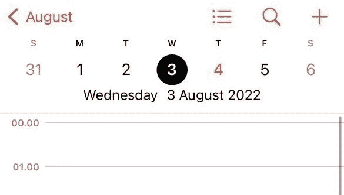
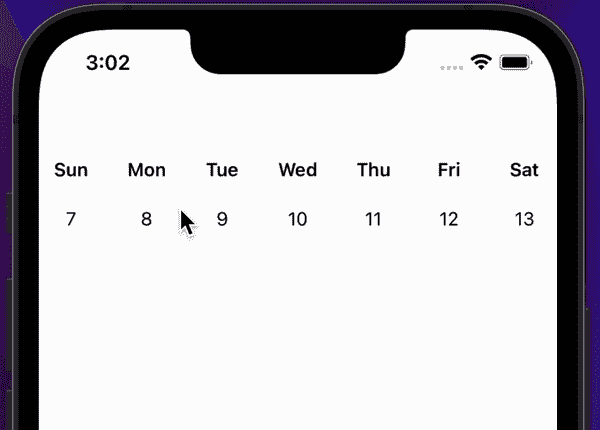

# 在 SwiftUI 中创建自定义周视图

> 原文：<https://betterprogramming.pub/custom-weekview-in-swiftui-f89ed640f38d>

## 构建可滚动视图

照片由 [Jazmin Quaynor](https://unsplash.com/@jazminantoinette?utm_source=medium&utm_medium=referral) 在 [Unsplash](https://unsplash.com?utm_source=medium&utm_medium=referral) 上拍摄

第一次尝试 SwiftUI，我想我会做一些任务管理应用程序。我想制作一个类似于 iOS 设备上的日历应用程序的标题——最重要的是实现顶部可滚动的周视图。

下面的预览是这篇文章的主要目标。显示一周几天的标题部分是我们仅使用 SwiftUI 想要实现的。首先要提到的是，这可以使用一个名为 [CalendarKit](https://github.com/richardtop/CalendarKit) 的库轻松实现，它看起来与原生日历应用程序完全相同，但这不是我们的目标。

我们想要达到的顶部和滚动效果

# **创建模型**

首先，我们必须创建一个新的结构`WeekValue`,它保存一周的日期和一个作为标识符的 id。

我们需要这样做，因为当试图使用`ForEach()`创建视图时，不能迭代`Dates`的数组，因为它们不符合`identifiable`协议，这意味着我们需要能够识别它们。

周值

# **创建一个 ObservableObject 来管理日期数据**

完成后，我们可以前进到下一部分，即创建一个`ObservableObject`，它将管理所有数据，在本例中，这些数据是进入我们想要构建的视图的日期数组。

为了实现这一点，我们创建了一些变量来帮助管理流量和生成刷卡的周数。

我想到的方法是让 3 个视图循环，并在滑动时生成日期。我是从看到一个实现了循环轮播视图的[帖子](https://stackoverflow.com/questions/72343827/carousel-view-swiftui) 中得到这个想法的，我认为这可能会有用。

周末商店

我在上面使用的大多数函数和方法并没有像我希望的那样优化，但目前它还能工作，所以当有新想法出现时我会更新它。

在本例中，初始函数用于生成起始周，并将它们添加到我们拥有的数组 allWeeks 中。

这是如何工作的，我们有三个我们之前创建的`WeekValue`结构的数组，保存我们需要的一周的日期，即当前、上一周和下一周，这样，我们就可以在滑动完成时更新每个中的日期数组。

# **创建自定义视图**

CustomHeaderView

最后，我们有保存两个状态变量`snappedItem`和`draggingItem`的`CustomWeekView`的主视图，当我们滑动它们时，它们用于定位和移动视图，为了阅读更多关于这方面的内容，我使用我之前提到的[帖子](https://stackoverflow.com/questions/72343827/carousel-view-swiftui)作为主要参考。

这个视图的工作方式是使用一个由我们在`WeekStore`结构上生成的三个`allWeeks`数组组成的循环，然后使用另一个循环根据日期生成文本，该日期正好是一周天数的七倍。

要生成其他周，我们所要做的就是滑动或`DragGesture`在这种情况下，在手势本身的`.onEnded`属性上，我们从`WeekStore`调用一个名为`update()`的函数，该函数管理将什么插入到日期数组中。

演示

动画本身看起来不是最好的，但经过一些调整，它肯定可以修复，甚至可以使用另一种方法来显示日期的视图。

我尝试的另一个方法是使用一个`TabView`,当索引改变时它会更新，但是当索引更新时视图会刷新，动画也会加倍。我还试图通过创建一个足够大的 Int 值来创建视图，这样它就不会自己刷新，但这肯定不是优化的。

这就是这篇文章的全部内容，同样，我主要将它用于我创建的一个个人应用程序，以帮助我理解 SwiftUI。大多数函数仍然可以重构，以创建更清晰的代码，我使用的大多数方法都可以优化，但现在，我将保持这种方式。我也希望这有所帮助，因为我没有找到很多关于这个话题的资源。

# **参考文献**

[https://stack overflow . com/questions/72343827/carousel-view-swift ui](https://stackoverflow.com/questions/72343827/carousel-view-swiftui)