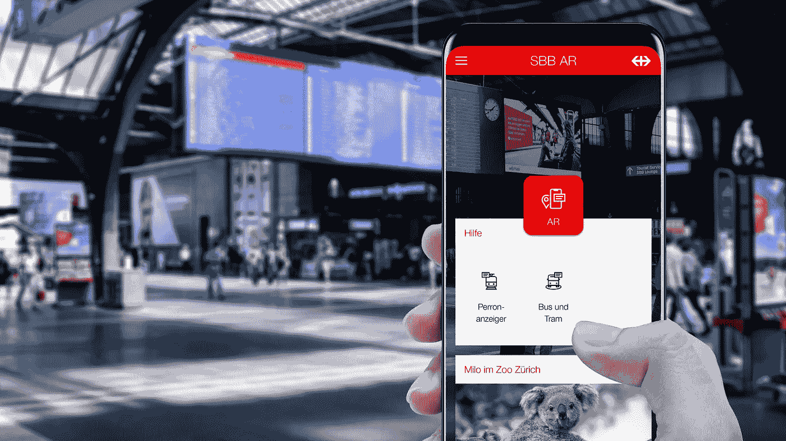
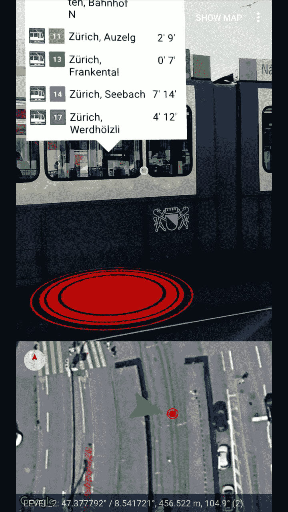
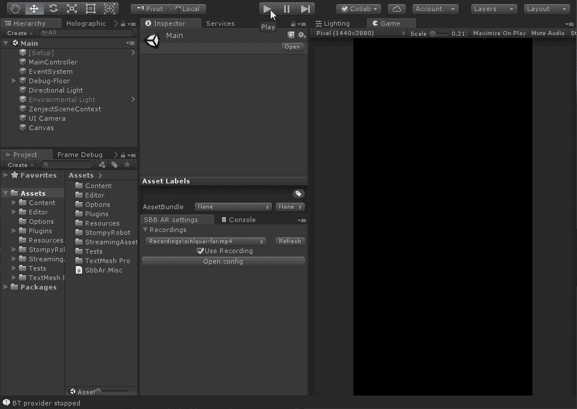
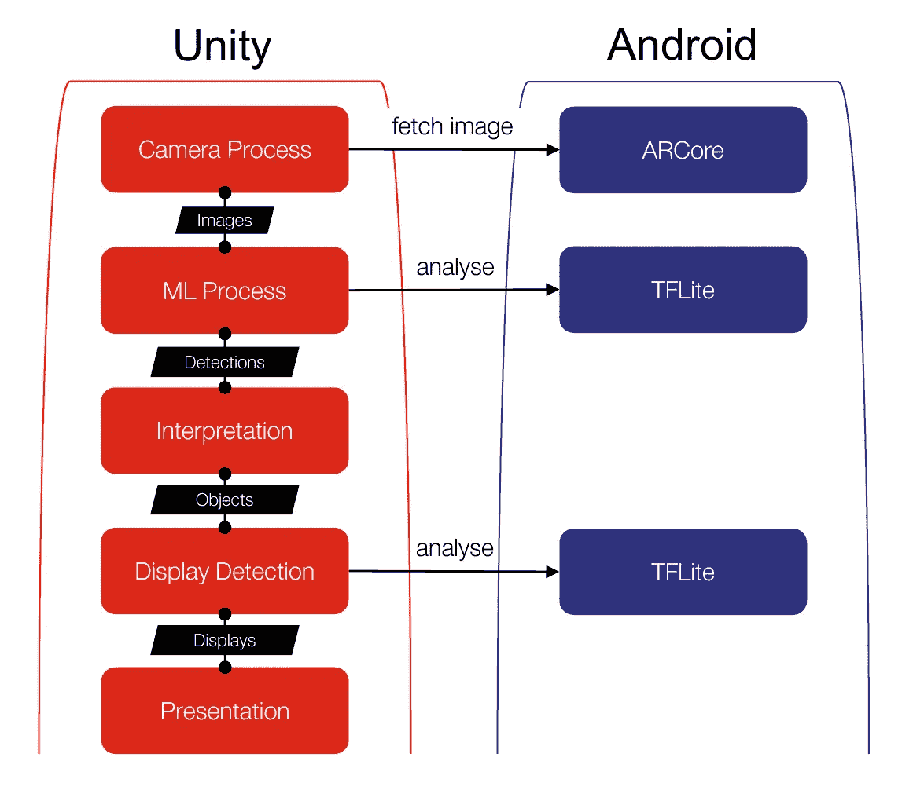

# 增强现实的未来客户信息

> 原文：<https://betterprogramming.pub/customer-information-of-the-future-with-augmented-reality-a-report-straight-from-the-workshop-883d73a0e7d5>

## 直接来自车间的报告

超越噱头的增强现实功能。精确定位和实时数据的结合为火车站的客户信息提供了巨大的潜力。

四月初，我们冒险做了一个新的预览版应用程序，可以在谷歌 Play 商店下载。这款名为“SBB AR”的应用为感兴趣的用户提供了测试和反馈 AR 功能的机会。这个预览版应用程序背后的想法是验证用例，并有机会在集成到一个完全开发状态的现有 SBB 应用程序之前，详细测试已开发功能的可用性。

## **两个功能已经上线**

第一个特征可用于扫描平台显示板。然后，下面会显示关于相应服务的详细的交互式信息(虚拟地集成到真实图像中),包括停靠、延误或中断，以及单个教练的占用率预测。

第二个特征包括用户环顾车站前院，并直接查看当地公共服务的各个站点。该应用程序还根据需要以互动方式显示即将到来的服务和出发时间及其停靠站。

# 那么，我们是怎么做到的呢？

一开始，我们问自己——我们将使用哪种技术来开发应用程序？

在过去，人们在开发一个 AR 应用程序时必须依赖于库，这在某些情况下工作得很好，而在其他情况下就不那么好了。但如今，iOS 和 Android 设备都天生支持 AR。考虑到我们的专业知识以及我们与谷歌的合作关系，我们决定在开发应用程序时从一开始就专注于 Android。

事实上，第一次掷骰子完全落在了基于 ARCore 的 Android 应用的原生技术 [Kotlin](https://developer.android.com/kotlin/) 和 [Sceneform](https://developers.google.com/ar/develop/java/sceneform/) 身上。

这在最初的测试中表现得非常好，但是将我们紧密地束缚在平台上。

为了在这方面有尽可能多的未来自由，我们最终选择了一种混合方法——原生 Kotlin 代码仅用于用户界面，而 [Unity](https://unity.com/) 用于细节方面。每个平台的简介、主菜单等等都必须重新实现。多亏了 Unity，复杂的代码仍然独立于任何平台。

然而，在实践中，这种方法带来了一系列挑战。虽然 Unity 可以在所有可能的设备上运行，但是它也指定了构建过程。换句话说，我们很难渗透我们的 UI 代码。

最后，我们选定了一个多层解决方案:

1.Unity 导出一个 Android 项目。

2.脚本用我们需要的库和设置覆盖了一系列文件。

3.我们的 UI 代码作为一个模块导入到项目中。

4.该项目是使用 Gradle 建立的，可以安装。

但这还不是全部——还有一系列进一步的问题等待解决。这包括最快的启动速度、相互冲突的依赖性、硬件加速和 64 位支持。(TK-are a range is BE 所以我把它和 BE 拼写放在一起。)

# 挑战:远程测试

我们的 SBB 信息技术办公室在伯尔尼，但该应用程序是为苏黎世总站设计的。这种位置上的差异给测试过程带来了挑战。

在开发过程中，我们测试应用程序的方式在不同的时间点发生了变化。

第一阶段:开始时，我们只处理在伯尔尼的数据。不幸的是，在古色古香的沃布劳芬镇没有苏黎世市中心那么热闹，所以这种方式是不可持续的。

第二阶段:即使在相对较短的一段时间后，我们从我们的位置中抽象出来，以至于我们能够在(虚拟)地图上来回跳跃，并让应用程序相信我们一直都在苏黎世。

第三阶段:一旦我们开始通过机器学习来识别图像中的物体，这种方法就不再足够了。在最后的尝试中，我们从车站拆下几块显示板，安装在我们的办公室，纯粹是为了测试我们的应用程序是否能正确地检测到它们。

这就是为什么我们创建了一个单独的应用程序，例如，允许我们拍摄简单的相机图像和位置，并将它们保存为二进制文件。多亏了现有的抽象，我们能够将这些数据上传到编程环境中，而不需要花费大量的费用和时间，并且可以在办公室中随时播放有趣的场景。

# 精确定位是一大挑战

在大多封闭的多层车站建筑中，精确的位置检测是最大的挑战。谷歌为 SBB 提供本地化支持——该技术基于 ARCore，SBB 项目团队一直与谷歌的开发团队保持联系。

为了精确定位展示板——精确到几厘米——还使用了普通计算机视觉和机器学习的结合。

然而，对我们来说，这意味着拍摄、深入搜索和注释成堆成堆的照片。过了一段时间，我们用 SSD 训练了 MobileNetV2，使它能够成功识别指示器。

但这并不是集成到我们的应用程序中的结束——尤其是 Unity。选择的方法是最终在本机代码中执行识别(用户界面处于休眠状态)，并通过 JSON 包与 Unity 通信。为了保持两个世界之间的低延迟，两者共享内存空间——Unity 插入最后一张相机图像，Android 负责内容识别。

然而，该识别仅提供指示器周围的矩形和它们的数字，这不足以将 3D 对象放置在正确的位置。因此，我们通过使用点云过滤掉不好的结果，并使用 OpenCV 分析图像，分几个步骤改进了结果。

整个应用程序基于[可观察的数据流](http://reactivex.io/)。该图显示了不同的进程如何通过流连接，以及数据如何在每个阶段传递。如果现在要实现一个新功能，你可以简单地*把它*锁到任何步骤中，并引用数据。

# 当然，应用程序需要用户友好，并产生附加值

在可用性和设计方面，AR 的标准仍然很少。很明显，用户不应该把智能手机放在面前走来走去。这不仅危险，而且对用户也不友好。这就是为什么今天当用户开始四处走动时屏幕会变黑——但当用户只是轻微移动或只是转身时，它不应该这样做。确保这一点是进一步的挑战。

我们目前正在收集客户对我们应该如何放置信息的反馈。互动信息层的呈现应该如何与屏幕上的真实环境相关联？例如，信息应该显示为超出平台显示板，还是应该始终取决于用户的位置？我们仍在努力寻找最佳平衡，使信息易于阅读，并仍可分配。

仍然有许多问题，但也有潜力。我们尤其在路线引导和定位领域看到了有趣的应用——客户应该在平台的什么地方等待？他们应该走哪个出口？车站提供什么服务？

更多的功能正在开发中——目前还不清楚哪些功能会加入到应用程序中。所有功能都将在今年进行测试。我们很想知道 AR 应用程序是如何工作的。