# 在 Flutter 中自定义默认启动画面

> 原文：<https://betterprogramming.pub/customize-default-splash-screen-in-flutter-4f0a3d872377>

## 发现颤动——第 11 周

## 当你的用户打开你的应用时，用一个欢迎的、专业的闪屏来问候他们

照片由[阿齐兹·阿查基](https://unsplash.com/@acharki95?utm_source=unsplash&utm_medium=referral&utm_content=creditCopyText)在 [Unsplash](https://unsplash.com/?utm_source=unsplash&utm_medium=referral&utm_content=creditCopyText) 上拍摄

因为不可能覆盖默认的闪屏，所以你在 Flutter 中创建的任何闪屏小部件都会显示，但是只能在默认的闪屏之后——在 Flutter 完成加载之前，你会有一个白屏，这是一个糟糕的设计。

我们现在面临的挑战是如何定制默认的 Flutter 闪屏。

# 1.为不同的设备尺寸准备您的徽标图像

不是每个人都可以从这一点开始，但我认为这是令人鼓舞的准备所有的投入，并使我们心中的想法尽可能接近现实。

对于 iOS 和 Android 平台，App Icon Generator 是一个很好的生成器，可以生成应用程序中需要的所有图标和图像。

 [## 应用程序图标生成器

### 为移动应用程序、android 和 iOS 生成图标和图像。无需上传或下载。适用于您的浏览器

appicon.co](https://appicon.co/) 

在我们插入我们的标志之前，我们将把它命名为`launch_image`。然后选择图像集*和*选项，并将你的 logo 图像拖入生成器。

注意，图像越大，效果越好！

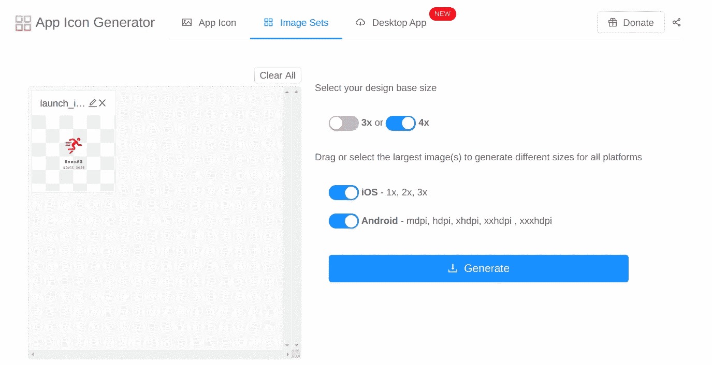

点击生成按钮后，一组用于两个平台的**图像将以名称`ImageSets`下载到您的计算机上。解压缩 ZIP 文件夹。**

# 2.将你的徽标图像集导入你的应用

## 机器人

在你的项目中导航到`android/app/src/main/res`。`res`文件夹的文件夹结构包括不同设备尺寸的文件夹:

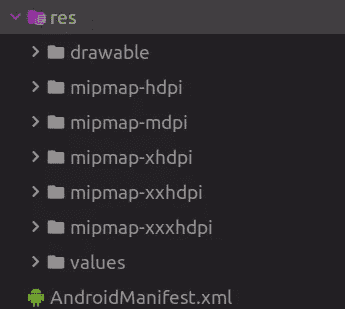

如果我们打开`ImageSets`文件夹中的`android`文件夹，我们会看到其中还有`mdpi`、`hdpi`、`xhdpi`、`xxhdpi`和`xxxhdpi`文件夹。

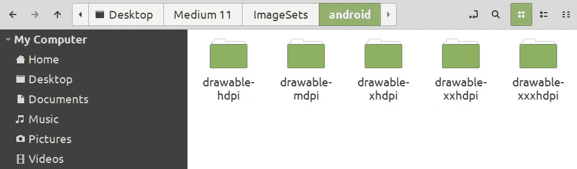

在每个文件夹中，都有一个对应于给定维度的启动图像。我们将启动图像拖到应用程序中同名的文件夹中，并对所有指定的文件夹重复该过程。

**注意:**`ic_launcher.png`图片是默认的 Flutter logo 图片，所以你可以把它从你所有的文件夹里移除。

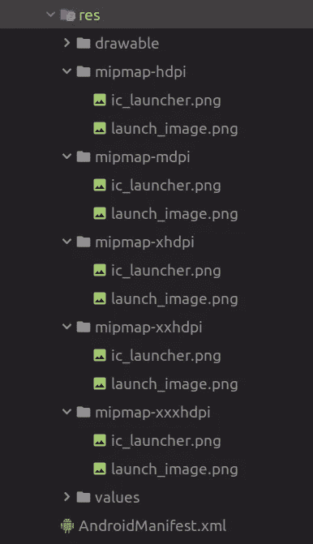

## ios

我不会描述这一步以及 iOS 平台的所有后续步骤，因为 Pawan Kumar 的文章[已经很好地解释了这一部分。](https://medium.com/flutter-community/flutter-2019-real-splash-screens-tutorial-16078660c7a1)

# 3.将默认的 Flutter 闪屏和你的 Logo 连接起来

默认闪屏的定制将在名为`launch_background.xml`的文件中完成。它位于`res`文件夹中，更确切地说是在`drawable`文件夹中。

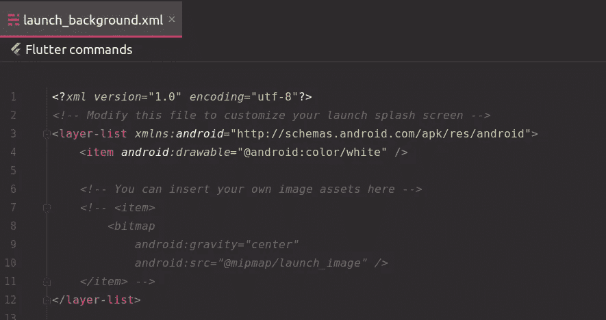

' launch_background.xml '

要应用品牌形象，我们必须取消该文件中一些 XML 代码的注释。

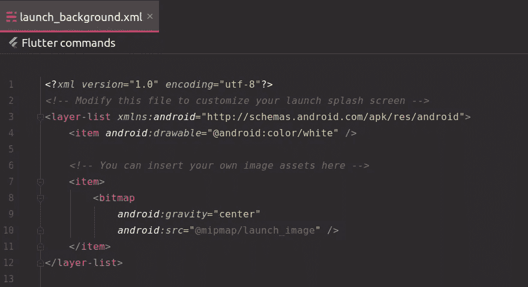

取消注释后的“launch_background.xml”

因为我们将我们的徽标图像命名为`launch_image`，并预先将它们放在所有的 mipmap 文件夹中，所以我们在`android:src`属性中设置了正确的内容。

如果我们运行我们的项目，我们将在初始屏幕上看到品牌形象。

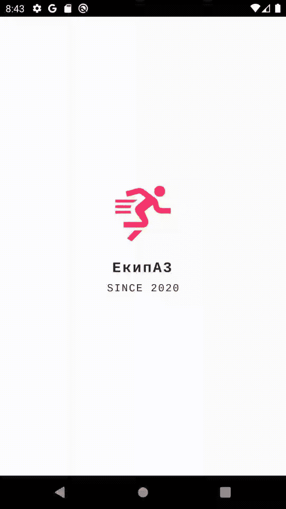

# 4.准备您的自定义背景颜色

为了改变白色背景并使用您的自定义背景，需要在`values`文件夹中创建一个名为`colors.xml`的新文件。

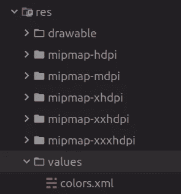

在这个 XML 文件中，我们将使用一个`resources`标签，在这个标签中，我们需要在`color`标签中指定我们的自定义颜色。

除了需要设置您选择的十六进制颜色之外，您还需要在`color`标签的`name`属性中指定颜色名称。在我的情况下，那就是`backround_color`。

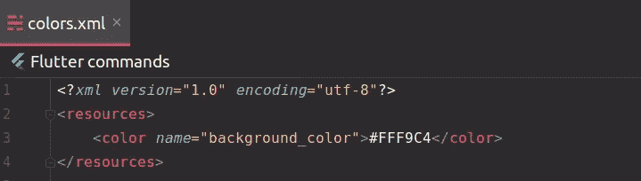

[这里是](https://www.materialpalette.com/yellow/orange)关于背景颜色的灵感的绝佳去处。

# 5.将默认的颤动启动画面与您自定义的背景颜色连接起来

同样，该连接将在`launch_background.xml`文件中设置。由于我们使用了在`colors.xml`文件中定义的自定义颜色，我们需要通过插入颜色名称并删除`android:`部分来更改`android:drawable`属性。

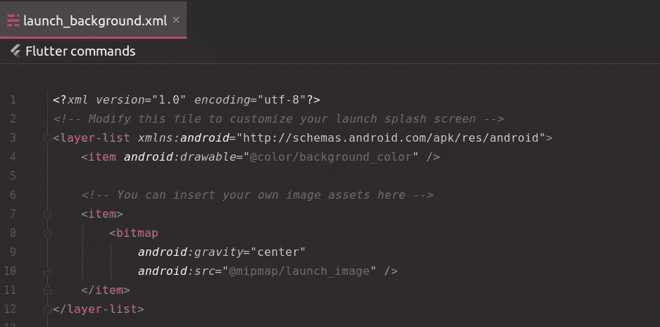

如果我们运行我们的项目，我们将在启动屏幕上看到我们的自定义背景颜色。

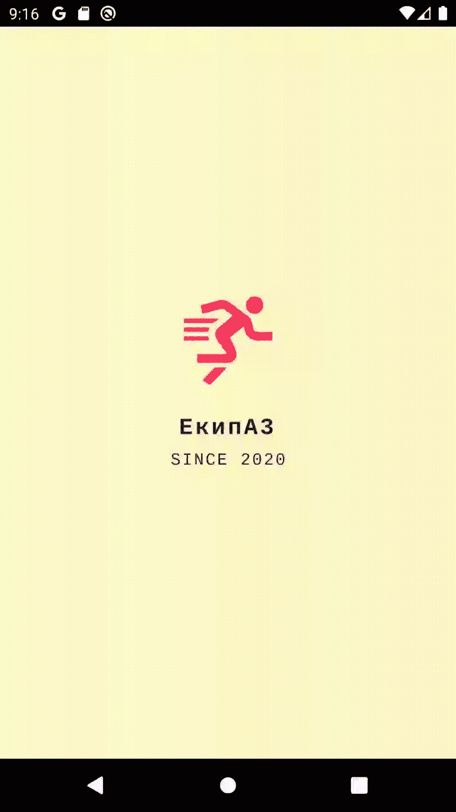

飞溅背景

# 加分:渐变背景色

如果你想使用渐变颜色作为你的背景颜色，你需要在`drawable`文件夹中创建一个新文件并命名为`gradient_background.xml`。

由于渐变背景是颜色的组合，在`colors.xml`中指定您想要用作渐变的自定义颜色。最多可以使用三种颜色:开始颜色、中心颜色和结束颜色。

在这个文件中，在`shape`标签中，指定你的渐变。在我的例子中，这是一个线性渐变，有所有可能的三种颜色。

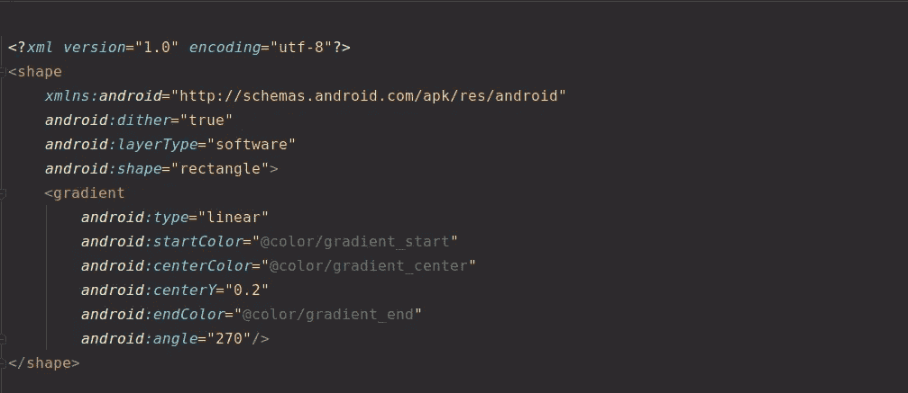

要选择你的渐变颜色和你想要的渐变角度，你可以使用[在线 CSS 渐变生成器](https://angrytools.com/gradient/)。

最后一步是使用我们自定义的渐变颜色。因为这个文件是在`android:drawable`属性的`drawable`文件夹中创建的，所以我们首先注释文件夹名，然后注释文件名。

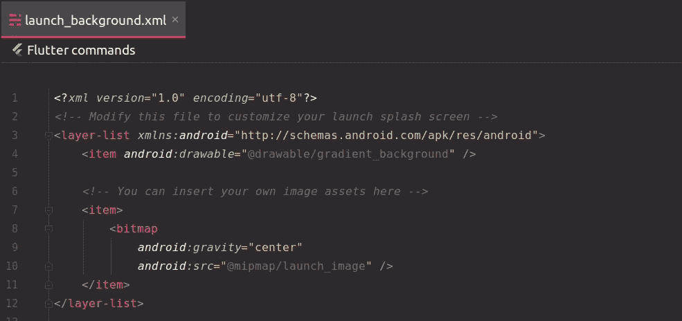

# 结论

如果你是涵盖各种 Flutter 主题的简短有趣文章的粉丝，并且你想养成在接下来的 19 周内和我一起学习 Flutter 的习惯，你可以每周二阅读我的文章。

如果你对这篇文章有任何问题或评论，请在评论区告诉我。

对于那些想加入我们的颤振之旅的人，可以在下面找到前几周的链接:

*   [第一周](https://medium.com/the-innovation/discover-flutter-roadmap-for-learning-flutter-why-textalign-property-does-not-work-aa055a469025)——“学习颤振的路线图”
*   [第 2 周](https://medium.com/@jelenajjovanoski/discover-flutter-how-to-create-sliders-how-to-create-cool-text-designs-8adb0e1feea3)——“如何创建简介滑块”
*   [第 3 周](https://medium.com/@jelenajjovanoski/discover-flutter-how-to-easily-generate-routes-how-to-flatten-deeply-nested-widget-trees-9c66dae99a73)——“如何轻松生成路线”
*   [第 4 周](https://medium.com/datadriveninvestor/discover-flutter-great-packages-for-pdf-viewing-tagging-flush-bar-26066e3c0d3b)——“某些颤振包的建议”
*   [第 5 周](https://medium.com/@jelenajjovanoski/discover-flutter-bottom-navigation-bar-generate-hex-color-code-easily-d6d949dd860b)——“底部导航栏”
*   [第六周](https://medium.com/@jelenajjovanoski/discover-flutter-the-holy-trinity-of-every-animation-circular-reveal-animation-example-ea1b89904a5d)——“每个动画的神圣三位一体”
*   [第 7 周](https://medium.com/@jelenajjovanoski/discover-flutter-new-material-buttons-in-flutter-version-1-22-39b8f1887d8)——“Flutter 1.22 版本中的新材料按钮”
*   [第 8 周](https://medium.com/@jelenajjovanoski/discover-flutter-october-recommendation-for-flutter-packages-9d1b07f3490f)——“我 10 月份对颤振套件的建议”
*   [第九周](https://levelup.gitconnected.com/discover-flutter-flutter-version-manager-fvm-411dc2bff4b4)——“Flutter 版本经理——FVM”
*   [第 10 周](https://medium.com/better-programming/discover-flutter-november-recommendation-for-flutter-packages-4b7cb2470323)——“我 11 月份的颤振包推荐”

下周见。不要打破记录！