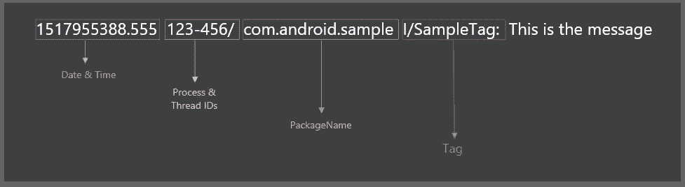
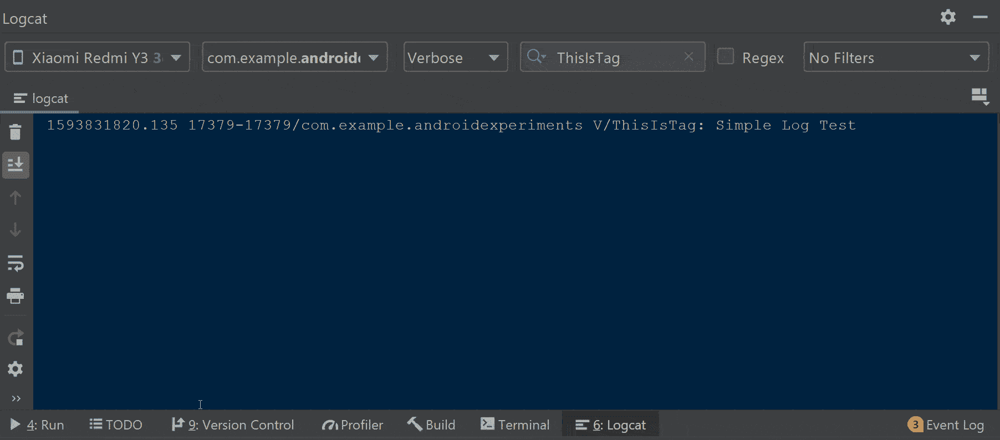
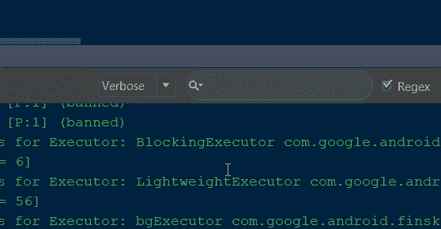
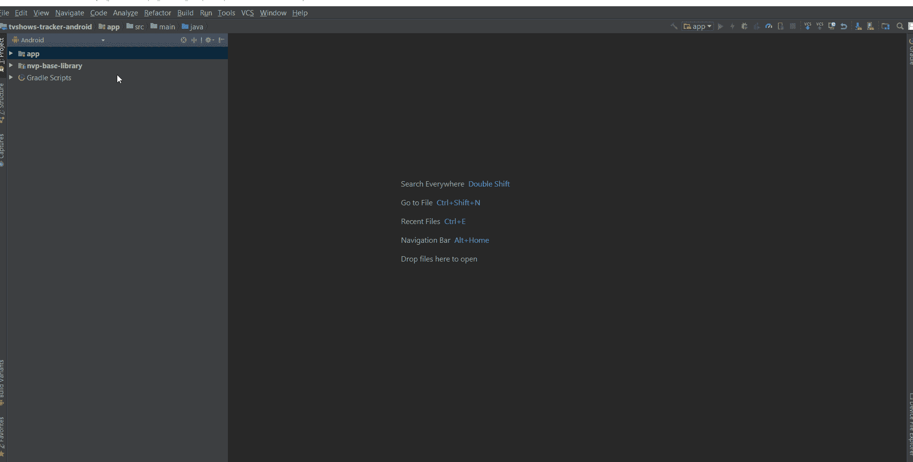
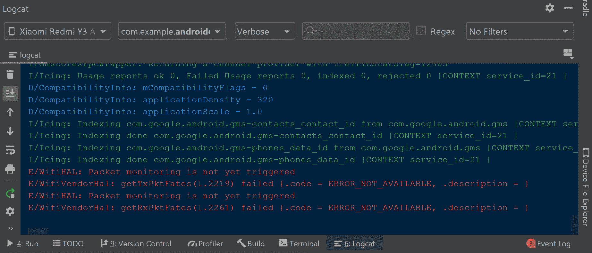

# 在 Android Studio 中自定义 Logcat

> 原文：<https://betterprogramming.pub/customize-the-logcat-in-android-studio-8f58d39222ef>

## 显示格式>自定义颜色>过滤不必要的数据>查看模式

由 [Pakata Goh](https://unsplash.com/@pakata?utm_source=medium&utm_medium=referral) 在 [Unsplash](https://unsplash.com?utm_source=medium&utm_medium=referral) 上拍摄的照片

武器再厉害也没用，除非你知道怎么用。Android Studio 是最强大的 ide 之一。它有大量的快捷方式，强大的功能，如实时模板，内置模拟器，数据库检查器，等等。

然而，大多数开发人员甚至不知道这些特性的存在。作为开发人员，我们应该了解 IDE 的优势，并利用它们来提高生产率，而不是相反。

不管我们有多少强大的功能，调试是开发人员需要 IDE 尽可能多的支持的关键领域。Android Studio 不仅是智能编码的好工具，也是深入调试代码的好工具。

在本文中，我将重点介绍如何在 Android Studio 中自定义 logcat。我们将讨论如何应用过滤器，自定义颜色，删除不必要的信息，等等。

# 显示形式

一般来说，每个 IDE 开发者都试图在 logcat 中显示尽可能多的数据，以满足每个开发者的最终需求。从制造者的角度来看，你可能是一名应用程序开发人员或系统工程师。他们将设计默认行为，使大多数开发者受益。

但是当涉及到个人偏好时，这可能不是有效的。例如，如果您是一名应用程序开发人员，您不需要监控日期、时间、处理器、线程 id 和包名等数据。

为了更好地理解格式化日志的好处，让我们显示一个没有定制格式的简单日志。作为一名应用程序开发人员，我打算看看日志。

默认情况下，当我们打印日志时，它会如上所示显示。一般来说，大多数应用程序开发人员不关心日期和时间、进程和线程 id 以及包名。

我们可以通过单击左侧面板上的设置图标并取消选择我们不需要的字段来删除它们。看一看:

# Logcat 中的自定义颜色

Android studio 中有五种类型的日志，如 Log.v()、Log.d()、Log.i()、Log.w()和 Log.e()，还有三个详细级别(详细、调试、信息、警告、错误)。您还可以过滤要在 logcat 中显示的日志，如下所示。

现在我们知道了日志的基本类型，让我们看看如何为每种类型分配自定义颜色。将错误日志指定为红色，将信息日志指定为绿色，这有助于我们在调试时对日志有一个清晰明了的认识。

要在 logcat navigate 中自定义颜色，请遵循以下步骤:
**文件>设置>编辑器>颜色方案> Android Logcat** 。

然后，我们需要选择需要更新颜色的日志类型。之后，勾选前景复选框；它将启用日志类型的颜色选择区域。

一旦你点击那种颜色，它会显示一个调色板，我们可以从中选择。我们还可以在面板中给出 RGB 或十六进制代码格式的颜色代码。看一看:

# 过滤不必要的数据

如果您在 Android Studio 上工作，不可避免地要使用 logcat 来调试或查看崩溃的堆栈跟踪。Android Studio logcat 显示了大量关于设备活动的数据。

实际上，我们只需要一些次要信息，比如堆栈跟踪、异常或错误日志。默认情况下，logcat 显示整个设备的活动；我们可以通过使用**仅显示选定的应用程序**选项来改变这一点，如下所示:

这将通过只显示与当前应用程序相关的日志来清除 logcat 中 90%的数据。

# 查看模式

在 Android Studio 中，默认情况下，logcat 窗口附在底部面板上。就我个人而言，我对此感到不舒服，所以我做了一些调查，看看是否有办法改变默认行为。

我发现我们可以使用 logcat 窗口右上角设置图标下的*视图模式*选项来改变 logcat 窗口的默认行为。看一看:

开箱即用，有五种视图模式可供我们选择。让我们来看看每种模式是如何工作的:

*   **Dock pinned:** 这是 logcat 附加到底部面板时的默认行为，并且总是与编辑器和其他固定窗口一起可见。
*   **Dock unpinned:** 在这种模式下，logcat 连接到底部面板，但只有在它处于活动状态时才可见。它不会妨碍编辑器或其他窗口。
*   **取消停靠:**logcat 附在底部面板上，在活动时覆盖编辑器或其他窗口的一部分。当另一个窗口处于活动状态时，它不可见。
*   **浮动:**在这种情况下，logcat 从底部面板分离，浮动在主窗口的顶部。它仅在主项目窗口中可见。
*   **窗口:**在这里，logcat 似乎是一个单独的应用程序窗口。您可以在主项目窗口中单独查看它，甚至可以将它移到不同的监视器上。

# 奖金

要了解有关 Android Studio 和调试的更多信息，请阅读以下文章:

*   [探索 Android Studio 4.0 中新的布局检查器](https://medium.com/better-programming/explore-the-new-layout-inspector-in-android-studio-4-0-6f9ffb1505f2)
*   [使用实时模板的约束布局-少做多完成](https://medium.com/@sgkantamani/constraint-layout-with-live-templates-do-less-finish-more-b62397725835)
*   [Android Studio 提示&招数——第一部分(针对初学者)](https://medium.com/android-dev-hacks/android-studio-tips-tricks-for-beginners-703bc9a36259)
*   [安卓工作室提示&招数——第二部分(高级)](https://medium.com/android-dev-hacks/android-studio-tips-tricks-part-2-advanced-3cfd23fc493e)
*   [安卓工作室提示&招数——第三部分(调试)](https://medium.com/android-dev-hacks/android-studio-tips-tricks-part-3-debugging-107d34b40220)

目前就这些——希望你学到了有用的东西，感谢你的阅读。