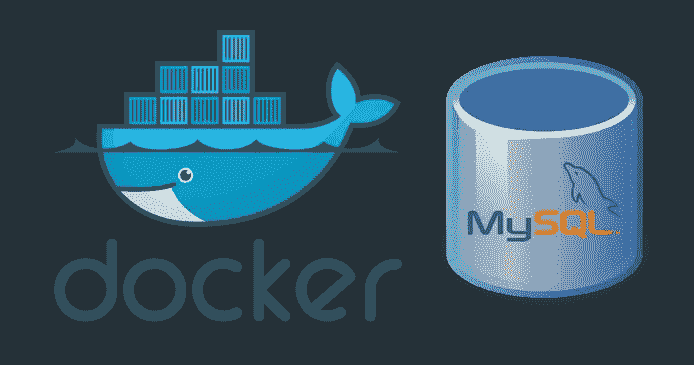

# 在 Docker 中定制你的 MySQL 数据库

> 原文：<https://betterprogramming.pub/customize-your-mysql-database-in-docker-723ffd59d8fb>

## 创建 Docker 映像并使用绑定挂载来自定义您的 MySQL 数据库



许多开发人员使用 Docker 来构建本地数据库。这使得测试他们的代码和编写数据变得容易，而不需要安装和配置很多工具。在这篇文章中，我将解释如何定制 Docker 数据库。虽然我将解释 MySQL 的步骤，但它同样适用于 PostgreSQL！
继续，让我们创建一个包含您想要的表和数据的自定义 MySQL。

# 创建 SQL 脚本

我们将创建 SQL 脚本，其中包含我们希望在数据库上执行的 SQL 语句。创建一个我们将在其中工作的目录。此外，创建一个子目录，我们将在其中存储我们的`.sql`脚本。

```
$ mkdir -p ~/my-mysql/sql-scripts
$ cd ~/my-mysql/sql-scripts
```

我想用一个名为 employees 的表定制我的数据库。该表需要包含一个雇员行(名、姓、部门和电子邮件)。

写个`CreateTable.sql`。该文件包含创建名为 employees 的表的 SQL 语句。我们将在表中添加四列

写一个`InsertData.sql`。这个文件包含我们在表‘employees’中插入数据的语句。

执行`tree`命令来验证您的两个脚本存在并且保存在正确的目录中。

```
$ cd ~/my-mysql
$ tree
└── sql-scripts
    ├── CreateTable.sql
    └── InsertData.sql
```

# 为定制的 MySQL 数据库创建 Docker 映像

现在脚本已经准备好了，我们可以编写一个 Docker 文件来创建我们自己的 Docker 映像(基于 MySQL 的[官方映像)。](https://hub.docker.com/_/mysql/)

```
$ cd ~/my-mysql/
$ vi Dockerfile
```

Dockerfile 文件的内容:

```
# Derived from official mysql image (our base image)
FROM mysql# Add a database
ENV MYSQL_DATABASE company# Add the content of the sql-scripts/ directory to your image
# All scripts in docker-entrypoint-initdb.d/ are automatically
# executed during container startup
COPY ./sql-scripts/ /docker-entrypoint-initdb.d/
```

创建您的 Docker 图像:

```
$ cd ~/my-mysql/
$ docker build -t my-mysql .
Sending build context to Docker daemon  4.608kB
Step 1/2 : FROM mysql
latest: Pulling from library/mysql
Digest: sha256:691c55aabb3c4e3b89b953dd2f022f7ea845e5443954767d321d5f5fa394e28c
Status: Downloaded newer image for mysql:latest
 ---> 5195076672a7
Step 2/2 : ADD sql-scripts/ /docker-entrypoint-initdb.d/
 ---> 25065c3d93c0
Successfully built 25065c3d93c0
Successfully tagged my-mysql:latest
```

并从映像启动您的 MySQL 容器:

```
$ docker run -d -p 3306:3306 --name my-mysql \
-e MYSQL_ROOT_PASSWORD=supersecret my-mysql
```

现在我们可以验证。我们将`exec`放入集装箱内:

```
$ docker exec -it my-mysql bash
root@c86ff80d7524:/# mysql -uroot -p
Enter password: (supersecret)
mysql> show databases;
+--------------------+
| Database           |
+--------------------+
| information_schema |
| company            |
| mysql              |
| performance_schema |
| sys                |
+--------------------+
5 rows in set (0.00 sec)mysql> use company;
Reading table information for completion of table and column names
You can turn off this feature to get a quicker startup with -ADatabase changed
mysql> show tables;
+-------------------+
| Tables_in_company |
+-------------------+
| employees         |
+-------------------+
1 row in set (0.00 sec)mysql> show columns from employees;
+------------+-------------+------+-----+---------+-------+
| Field      | Type        | Null | Key | Default | Extra |
+------------+-------------+------+-----+---------+-------+
| first_name | varchar(25) | YES  |     | NULL    |       |
| last_name  | varchar(25) | YES  |     | NULL    |       |
| department | varchar(15) | YES  |     | NULL    |       |
| email      | varchar(50) | YES  |     | NULL    |       |
+------------+-------------+------+-----+---------+-------+
4 rows in set (0.00 sec)mysql> select * from employees;
+------------+-----------+------------+-------------------+
| first_name | last_name | department | email             |
+------------+-----------+------------+-------------------+
| Lorenz     | Vanthillo | IT         | [lvthillo@mail.com](mailto:lvthillo@mail.com) |
+------------+-----------+------------+-------------------+
1 row in set (0.01 sec)
```

有用！我们有我们定制的 MySQL 数据库 Docker 图像！对于多个开发者之间的本地开发来说，这是一个很好的解决方案。通过共享 Docker 映像，每个开发人员都可以通过从映像启动一个容器来使用数据库。

但是，需要注意的是，这并不总是最佳解决方案:

*   如果您插入大量数据，您的图像大小将会显著增加
*   当您想要更新数据时，需要构建新的映像

这就是为什么有另一种方法来定制你的 Docker MySQL。

# 使用绑定挂载在 Docker 中定制您的 MySQL 数据库

在最后一节中，我们将简单地在官方的 MySQL Docker 容器中安装脚本。

```
$ docker run -d -p 3306:3306 --name my-mysql \
-v ~/my-mysql/sql-scripts:/docker-entrypoint-initdb.d/ \
-e MYSQL_ROOT_PASSWORD=supersecret \
-e MYSQL_DATABASE=company \
mysql
```

我们可以再次验证！使用与我们之前相同的步骤:`exec`在容器中检查表和数据是否存在！

这种方法更加灵活，但是在开发人员之间分发会有点困难。他们都需要将脚本存储在本地机器上的某个目录中，并且在执行`docker run` 命令时需要指向该目录。

# 结论

在这篇文章中，我描述了如何在 Docker 中创建自定义的 MySQL 数据库。我们探讨了两种方法:

*   自定义 MySQL Docker 图像
*   将装载绑定到容器中的装载脚本

我们还讨论了每种方法的优缺点。

我们希望你喜欢它！

[](https://www.buymeacoffee.com/dZb8fLN)

如果真的对你有帮助…:)