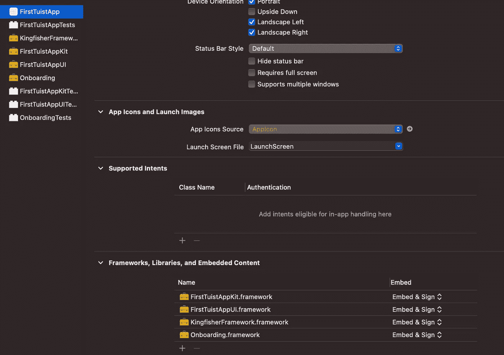

# 使用 Tuist 定制您的 Xcode 项目

> 原文：<https://betterprogramming.pub/customize-your-xcodeproject-with-tuist-6fc41fb59262>

## 添加依赖项和自定义模块来个性化您的 iOS 项目


照片由[德鲁·海斯](https://unsplash.com/@drew_hays?utm_source=medium&utm_medium=referral)在 [Unsplash](https://unsplash.com?utm_source=medium&utm_medium=referral) 上拍摄。

*这是关于使用 Tuist 配置项目的系列文章的第二部分。如果你还没有看完第一部分* *，请查看* [*。*](https://medium.com/better-programming/stop-committing-the-xcodeproj-fa83527ba156)

[Tuist](https://tuist.io) 是一个神奇的工具，可以通过编程创建 Xcode 项目和一个`xcworkspace`。项目使用 Swift 进行定义，并通过可重用的功能和类型进行描述。

上周，我们探索了 Tuist 创建的默认配置。我们看到了 Tuist 如何用两个支持模块准备 app target:一个用于 UI，一个用于逻辑。

迟早，我们需要向我们的项目添加其他依赖项。我们如何才能做到这一点？让我们探索我们的替代方案。

# 向项目添加依赖项

让我们假设我们想要在我们的 UI 目标中添加 [Kingfisher](https://github.com/onevcat/Kingfisher) 库，以便能够从远程 URL 加载图像。从 Swift Package Manager (SPM)添加新的依赖关系非常简单。我们必须:

1.  在`Project`结构中安装依赖项。这是通过在`Project`中添加`packages`参数来完成的。
2.  在`makeFrameworkTargets`中指定依赖关系。
3.  运行`tuist generate`。

代码应该如下所示:

然而，如果我们用这样的代码运行`tuist generate`，我们会看到一个小小的警告:

```
Package “Kingfisher” has been linked against [“FirstTuistAppKit”, “FirstTuistAppUI”], it is a static product so may introduce unwanted side effects.
```

酷的是 Tuist 为我们解决了 SPM 依赖性。令人不快的是`static`产品必须与单一目标挂钩。默认情况下，`makeFrameworkTarget`功能在应用程序定义的所有目标上运行。因此，依赖性被添加到所有附加目标中。

我们有两种选择:

1.  更改模板以指定哪个目标具有哪个依赖项。在`Kit`框架中加入翠鸟是没有意义的，它没有 UI 组件。
2.  定义一个目标来托管静态依赖项，并使所有其他目标都依赖于该静态依赖项。

# 添加框架结构

为了实现第一种选择，我们可以引入一个支持结构。这个结构允许我们定义一个带有名称的框架，一组主目标的依赖项，以及一组测试目标的依赖项。

上面的代码显示了如何更新`Project+Template.swift`文件来适应这些变化。我在示例中只留下了相关的代码。

1.  定义`Framework`结构。
2.  更新`app`函数的签名，并在`makeAppTarget`调用中使用新的`Framework`结构。
3.  更改`makeFrameworkTargets`的签名。
4.  使用`framework.dependencies`属性创建框架的依赖关系。
5.  使用`framework.testDependencies`属性来创建测试目标的依赖项。
6.  使用新参数更新我们创建框架目标的行。

现在，我们只需使用`Project.swift`文件中的新结构来声明框架及其依赖关系。这可以通过下面的代码轻松完成:

在示例中，有一种情况是使用`Project.Framework`来定义一个没有依赖关系的框架(第 5 行)，还有一种情况是我们添加了`Kingfisher`依赖关系(第 6 到 9 行)。

如果我们现在运行`tuist generate`，警告已经消失。这是件好事。我们现在可以只向需要它们的目标添加特定的依赖项。但是如果我们引入另一个需要`Kingfisher`的 UI 模块会怎么样呢？我们会遇到同样的问题。因此，我们可以实施第二种选择。

# 创建依赖关系主机模块

一个`host`模块是一个空的框架，它唯一的任务是托管来自 SPM 的包。我们可以将一个`host`模块链接到其他几个我们称之为`code`模块的目标。通过这种设置，我们解决了以前解决方案的局限性。

为了实现这个选择，我们必须修改项目定义的结构。

*注意:Tuist 还不能创建所需的文件夹结构。因此，一个初步的步骤是在* `*Targets*` *文件夹下创建* `*KingfisherFramework*` *。*

我们注意到的第一件事是，`host`和`code`模块共享两条信息:模块的`name`和它的`dependencies`。`code`模块有额外的信息:T5。我们可以用两种情况定义一个`Framework`枚举:`code`情况和`host`情况。每个案例都有自己的相关值来指定此信息。以下代码阐释了这些模型:

从这个核心模型开始，我们可以为`Project.Framework` enum 定义一系列属性，从而简化框架的创建。这些属性提供了一个有用的快捷方式来检索有用的信息，如`name`、源的`path`、`target`等等。以下`extension`展示了这些属性:

有了所有这些属性，我们最终可以更改`app`函数，使其利用新的数据结构。这个新组织提供了很多好处:

1.  我们可以完全删除`makeFrameworkTargets`功能。
2.  `app`函数实现变得更具声明性。
3.  `Project.swift`文件中的项目定义也是声明性的。

以下代码片段显示了 Tuist 项目的其余部分是如何更改的:

app 功能应该如何改变。看看“目标”变量。

项目的新面貌。再看附加的“目标”属性的表现性。

现在，如果我们运行`tuist generate`命令，Tuist 会创建一个包含所有必需依赖项的项目。我们可以用`open {appName}.xcworkspace`打开`xcworkspace`，如果我们点击`⌘+B`，我们可以看到项目构建完成。

# 添加新目标

最后，我们想在我们的应用程序中添加新的目标。这有助于创建模块化的应用程序。也许我们希望有一个处理小教程的 onboarding 模块，它依赖于同一个 [Kingfisher](https://github.com/onevcat/Kingfisher) 框架。

现在我们有了所有这些组件，添加一个新的`code`模块就非常简单了。

首先，让我们创建一个非常简单的脚本来配置模块的基本结构:

我们可以使用下面一行来运行这个命令:

```
./create_module.sh Onboarding
```

*注意:记住更改脚本的执行权限。这可以通过运行* `*chmod +x create_module.sh*` *来实现。如果我们忘记了这一步，我们可以使用* `*shell create_module.sh Onboarding*` *来运行脚本。*

该脚本在`Targets`文件夹中创建一个`Onboarding`文件夹。然后它创建了`Targets/Onboarding/Sources`和`Target/Onboarding/Tests`子文件夹，以及在`Sources`和`Tests`文件夹中分别命名为`Onboarding.swift`和`OnboardingTests.swift`的两个 Swift 文件。

然后，我们运行`tuist edit`来打开 Tuist 项目。一旦 Xcode 启动，我们就可以添加新的`Onboarding`框架。这可以通过在`Project.swift`文件的`additionalTargets`属性中添加一个新条目来完成(下面代码片段的第 8 行):

最后，通过运行`tuist generate`，Tuist 创建最终的项目。在 Xcode 中打开时，我们可以看到这张图:



Tuist 创建了`Onboarding`和`OnboardingTests`目标。`Onboarding`框架已经作为依赖项添加到了`FirstTuistApp`目标中。

# 结论

在今天的文章中，我们探讨了如何将`Project+Templates.swift`文件更新为:

*   向我们的项目添加第三方依赖项。
*   定义主机框架和代码框架。
*   创建更具声明性的项目定义。
*   添加更多自定义框架来模块化我们的应用程序。

有了所有这些要素，我们就可以利用一个强大的工具来描述我们的项目，并与我们的团队分享，从而限制合并冲突的可能性。