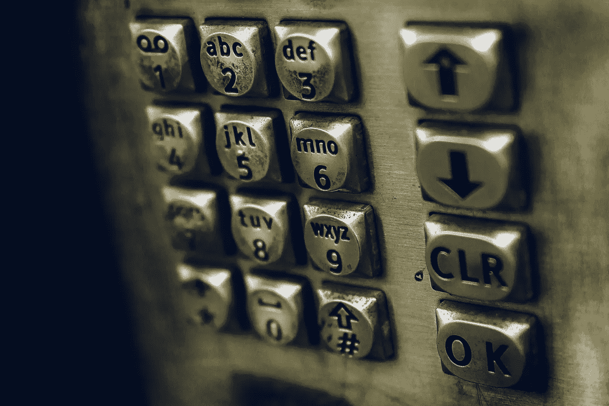
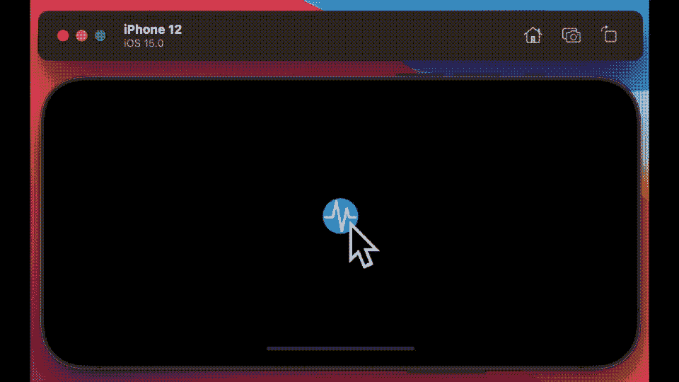
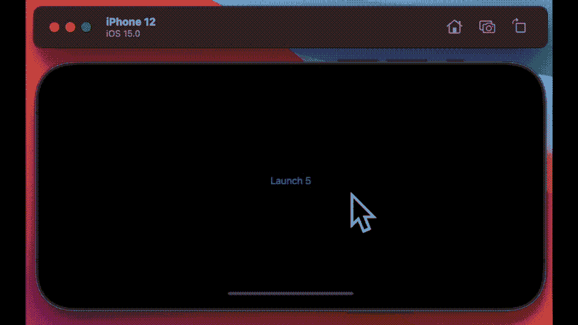

# 在 SwiftUI 中自定义按钮

> 原文：<https://betterprogramming.pub/customizing-buttons-in-swiftui-5fc2916d17a5>

## 为你的应用程序制作漂亮的界面



詹姆斯·萨顿在 [Unsplash](https://unsplash.com/s/photos/button-icons?utm_source=unsplash&utm_medium=referral&utm_content=creditCopyText) 拍摄的照片

去年这个时候，我写了一篇关于使用 Swift 风格定制交换机的文章。我打算试着也涵盖一些其他的 UI 元素，但是不知何故从来没有时间这样做——我想在这篇文章中试着补上一点。

编程中最大的挑战之一是管理复杂性和组织，以及开发结构化编程的存在理由。当前对此的思考背后的支柱之一是更高层次的抽象概念。万维网的开发者们认为，与当时的技术相比，级联样式表(CSS)可以更好地解决这个抽象问题。这是一个被开发人员热情采纳并被其他编程语言复制的提议，Swift 也不例外。

整个概念是，使用样式协议可以显著减少需要编写和维护的代码量。本质上链接到不同 UI 元素的样式修饰符。

我想在这篇文章中谈谈按钮，你有什么选择来定制它们，包括一些技巧和窍门。

# 序文

SwiftUI 中 button 的基本语法如下所示—

```
Button {
  print("Launching!")
} label: {
  Text("Launch")
}
```

尽管我必须承认，这样做也同样诱人——

```
Text("Launch")
  .onTapGesture {
    print("Launching!")
  }
```

两者都不过是在屏幕上呈现一些你可以点击的文本，而不是一个按钮。

可以说，修饰这些按钮的正确方法是使用样式协议，对于 SwiftUI 按钮来说，样式协议有两种风格。当然，你也可以修饰你的可点击文本，但是为此，你需要使用一个 viewModifier，一种不同的方式来做同样的事情。

# `**ButtonStyle**`协议

基本的按钮样式协议只允许你改变一件事——按钮的外观——其他什么都不能改变，基本的模板是这样的。

```
struct EmptyStyle: ButtonStyle {
  func makeBody(configuration: Configuration) -> some View {
    configuration.label
  }
}
```

简单地使用`buttonStyle(EmptyStyle)`标签将它添加到您的按钮定义中——尽管在这种情况下，它不会添加任何内容来显示。一个更好的例子是这个，一个构建闪烁按钮的样式。

现在假设你想在游戏中使用它，限制是你需要打开或关闭动画。

我通过使用带有 Combine 框架的发布者解决了这个问题。您可以在下面的代码中远程打开和关闭脉冲按钮的效果。注意我有两个标签，它们根据布尔值`isPulsing`的值交替变化。



脉冲按钮

# PrimitiveButtonStyle

当然，我们只是改变了按钮的外观——这很好——但也许你想做得更多。使用带有按钮的第二个协议选项，您可以做更多的事情。基本语法如下——这是我在与 Swift 的[黑客攻击中发现的一段优秀代码。](https://www.hackingwithswift.com/)

注意`configuration.trigger()`，可以用它来管理按钮的动作。这是另一个例子——在这段代码中，我创建了一个你必须点击四次的按钮，每次它返回一个不同的标签，然后最终重置。

这是使用`PrimitiveButtonStyle`的可取消按钮的最后一个例子。你有 5 秒钟的时间取消，如果你这样做，它会重置，如果你不这样做，星星会变成红色。再次点按它以重置并重试。



可取消按钮

所有这些都让我想到这篇短文的结尾。我希望你喜欢读它，就像我喜欢写它一样。

你可以在这里找到所有代码的完整列表，在 bitbucket 上还有更多的[在这里](https://bitbucket.org/wizard1066/buttonstyles/commits/e6c433112b483e2c53628246ac60f32c4825b75d)。