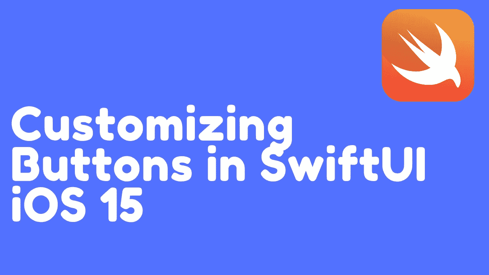
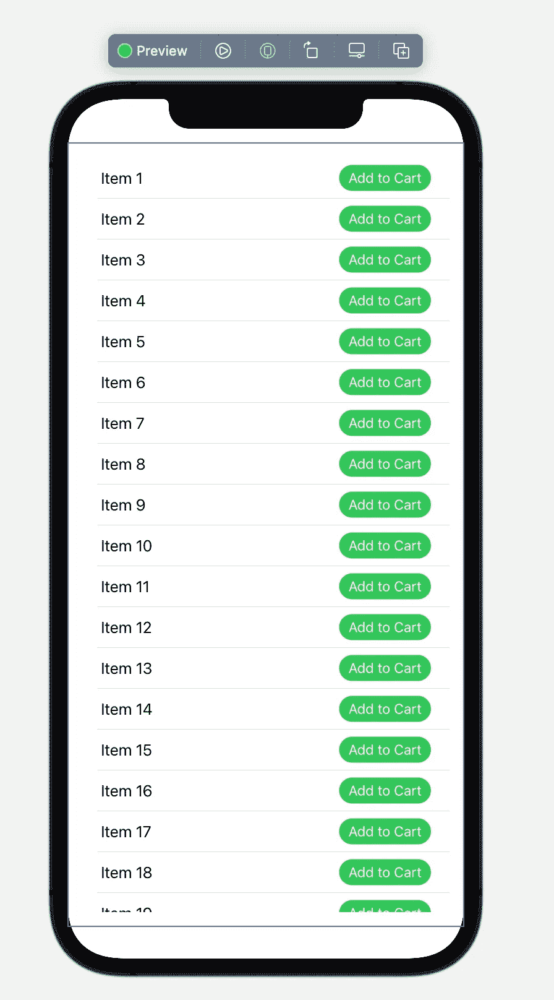
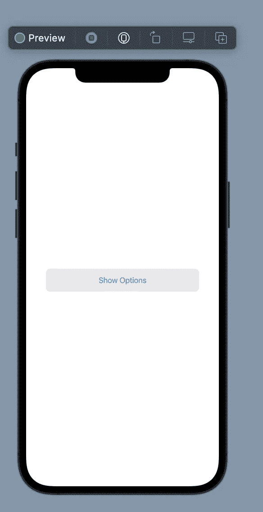
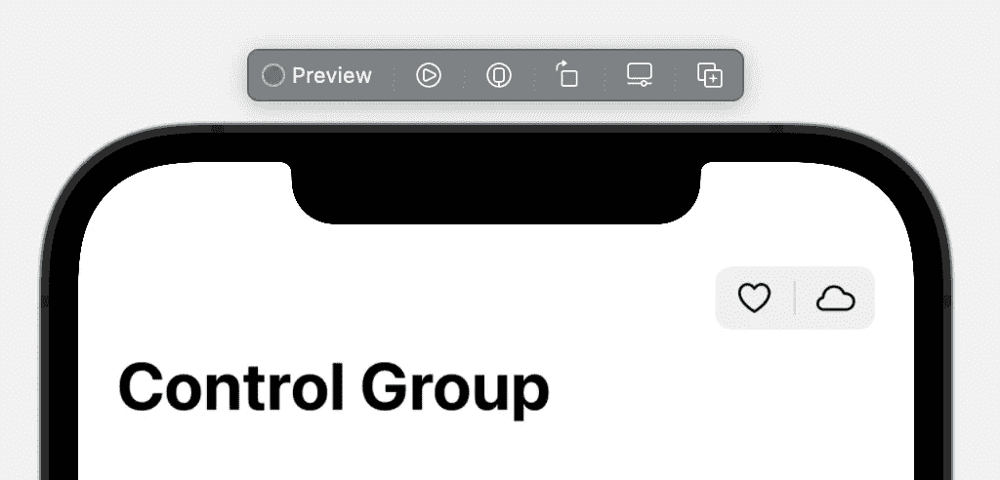

# 在 SwiftUI iOS 15 中自定义按钮

> 原文：<https://betterprogramming.pub/customizing-buttons-in-swiftui-ios-15-97a02394417c>

## 新的按钮角色，控制突出，控制组，等等

作者图片

按钮是任何 iOS 应用的重要组成部分，在 iOS 15 中，SwiftUI 引入了几种不同的方式来实现和定制按钮视图。在这篇文章中，我们将学习所有自定义按钮的新方法。

让我们开始吧…

# 圆角

在之前的 iOS 版本中，如果我们必须创建一个漂亮的圆角大按钮，那么我们可能必须编写以下代码:

结果如下所示:

在 iOS 15 中，如果我们必须创建相同的按钮，那么我们可以使用以下代码来实现它:

结果如下所示:

新的`.bordered`按钮样式使按钮自动带有圆角。如果我们需要添加一些背景色，那么我们可以使用`.tint`修改器和`.controlProminence`修改器:

结果如下所示:

通过将`controlProminence`的值设置为`.increased`，我们传达了这个按钮是重要的，并且代表了当前视图中的主要动作按钮。

# 列表中的按钮

关于`.buttonStyle`修改器的一个真正强大的功能是你可以将这些样式应用到一组控件中。这显示在下面的实现中:

`.buttonStyle`修改器应用于列表视图中的所有按钮。所有的按钮都有一个共同的风格，只有几行代码。结果如下所示:

很整洁，对吧！

# 默认操作

有时我们需要在用户按回车键时给按钮附加一个动作。这个动作可以使用`.keyboardShortcut`修改器附加到按钮上，如下所示:

这意味着，如果该应用程序正在带键盘的 iPad 或 Mac 上使用，那么用户可以简单地按下键盘上的 Return 按钮来执行按钮操作。

这让我想起了 web 开发中按钮的默认动作。如果按钮在一个`<form>`标签内，那么按下返回按钮将自动提交表单。

所有新按钮的另一个伟大之处是内置了对高亮、黑暗模式甚至动态类型的支持。

# 按钮角色

按钮还具有支持角色的能力。角色确定了按钮的外观。假设我们想要创建一个负责删除项目的按钮。我们可以使用新的角色选项来构造按钮，如下所示:

该按钮将显示如下:

# 确认对话框

iOS 15 还引入了确认对话框，允许用户最后一次确认或取消更改的机会。确认对话框在 iPhone 上显示为表单，在 iPad 上显示为弹出框，在 macOS 上显示为提醒窗口。下面是通过单击按钮创建一个简单的确认对话框的代码。

结果如下所示:

# 开关按钮

切换视图也获得了一种叫做`.button`的新样式。这允许您以不同的方式使用旧的普通滑块切换视图。

结果如下所示:

# 控制组

iOS 15 还引入了控件组视图，用于将相关控件放在一起。在下面的示例中，我们向导航栏添加了一个控件组，如下面的实现所示:

控件组中的项目彼此靠得很近，因为它们紧密地代表了应用程序的特定部分。

# 结论

正如你所看到的，iOS 15 中有很多变化，使得使用按钮更加容易和直观。我希望你真的对这些变化感到兴奋，并且它们将帮助你未来的项目。

如果你喜欢我的文章，并想支持我的工作，那么可以考虑看看我在 Udemy 上的课程。我有很多关于 iOS 开发的课程，包括 SwiftUI、GraphQL、Vapor、测试驱动开发、MVVM 等等。

了解 Swift 语言中新的 Async/Await & Actor 功能。请查看以下我的课程:

 [## Async/Await 和 Actors—Swift 中的并发性

### 并发允许多个任务同时运行。理解并发是 iOS 应用的重要组成部分…

www.udemy.com](https://www.udemy.com/course/asyncawait-and-actors-concurrency-in-swift/?couponCode=LAUNCHDAY)