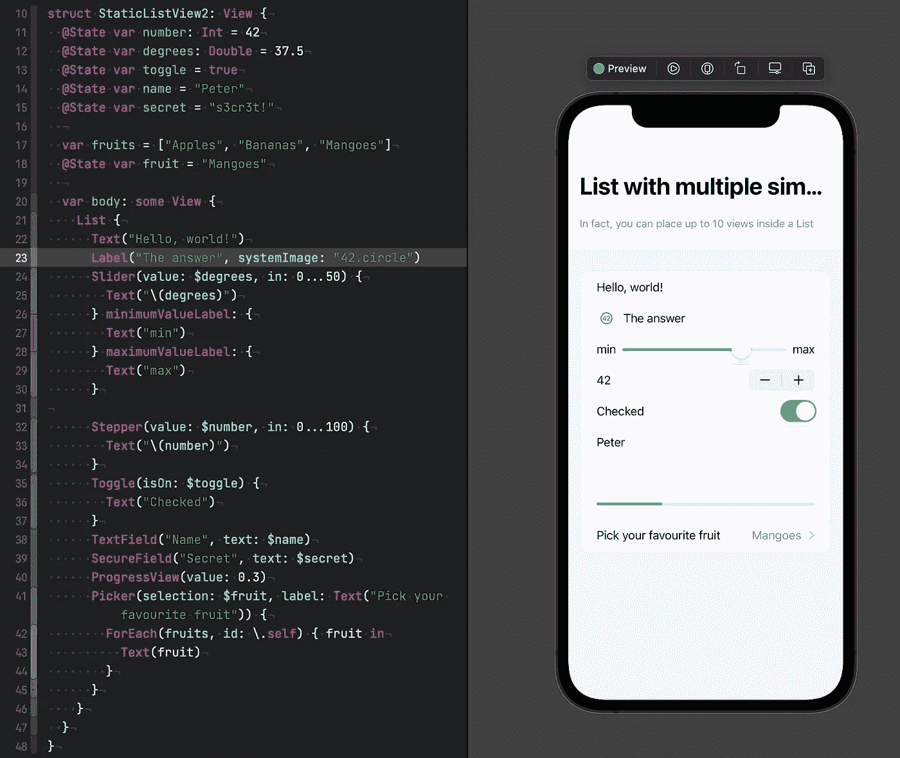
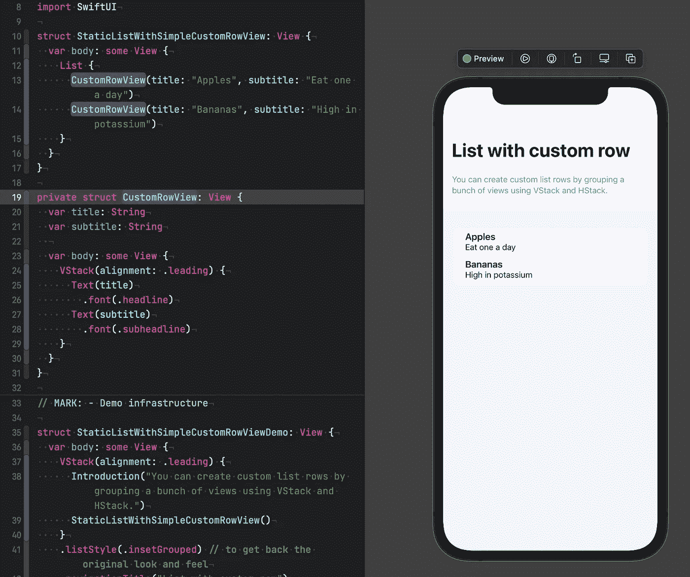
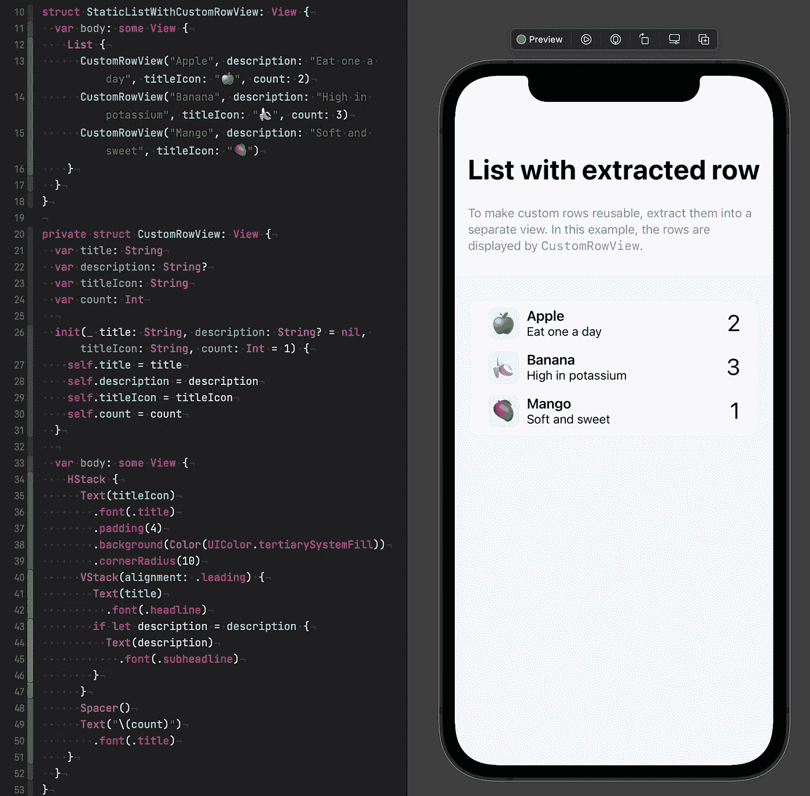

# 自定义 SwiftUI 列表中的视图

> 原文：<https://betterprogramming.pub/customizing-views-inside-swiftui-lists-7b2cacdd9fd0>

## 关于 SwiftUI 列表视图您需要知道的一切

照片由 [Jason Leung](https://unsplash.com/@ninjason?utm_source=medium&utm_medium=referral) 在 [Unsplash](https://unsplash.com?utm_source=medium&utm_medium=referral) 上拍摄

列表视图可能是 iOS 应用中最重要的 UI 结构之一，你很难找到一个不使用某种列表的应用。

SwiftUI 使得构建列表视图特别容易；创建一个简单的列表只需要三行代码！同时，SwiftUI 的`List`视图极其强大和通用，所以更详细地了解它是值得的。

在这个系列中，我将教您需要了解的关于`List`视图的一切，从简单的列表、样式化列表及其项目、在列表视图中显示数据集合、在列表和单个列表项目上实现操作，到构建嵌套的轮廓和实现跨 iOS、iPadOS、watchOS 和 macOS 工作的三列下钻导航 ui。

# 入门指南

构建列表最简单的方法可能是创建一个新的 SwiftUI 视图，并将 *Hello World* 文本包装在`List:`中

这将在列表视图中显示一个静态文本，如下所示:

简单的静态列表

要向列表中添加更多项目，我们只需添加另一行:

# 在列表行中使用其他 SwiftUI 视图

`List`视图的酷之处在于，您可以使用任何类型的 SwiftUI 视图作为列表行，而不仅仅是`Text`。标签、滑块、步进器、切换、文本字段、用于输入密码的安全字段、进度视图和选择器，应有尽有。

一些高级 SwiftUI 视图的列表

# 构建自定义列表行

由于 SwiftUI 基于堆栈的布局系统，您也可以轻松创建自定义行。在这个例子中，我们使用`VStack`在垂直堆栈中布局两个`Text`视图，复制许多 iOS 应用程序中广泛使用的典型标题和细节布局。

像这样添加自定义行既快速又简单，但是随着我们添加更多的行，代码会快速增长，这将使我们在需要进行更改时更难理解和更新。为了防止这种情况发生，我们可以将列表行的代码提取到一个单独的视图中，使其可重用。

带有自定义列表行的列表

要了解有关重构 SwiftUI 代码的更多信息，请查看此视频，其中我更详细地展示了重构 SwiftUI 视图的过程:

# 更复杂的列表行

SwiftUI 的布局系统既灵活又易于使用，这使得使用`HStack`、`VStack`、`ZStack`和其他 SwiftUI 视图的组合来创建甚至复杂的布局变得容易。以下是如何创建带有标题、副标题、前导图像和结尾数字的列表行:

注意我们是如何为`CustomRowView`使用自定义初始化器的，允许我们去掉`title`属性的参数名，并为一些属性定义默认值。因此，现在使用自定义行视图更加方便。

带有自定义初始化器的更复杂的列表行

# 结论

列表是 iOS 应用中非常受欢迎的 UI 元素，由于 SwiftUI 的声明式语法，快速构建丰富的列表 UI 比以往任何时候都更容易。

在本系列的下一部分中，我们将研究如何在列表中显示集合中的数据。

感谢阅读，敬请期待下一篇文章！

# 想联系作者？

欢迎随时在 [Twitter](https://twitter.com/peterfriese) 上与我联系，如果你有任何问题或意见，请随时发推文或 DM。

*原发布于*[*https://peterfriese . dev*](https://peterfriese.dev/swiftui-listview-part1/)*。*