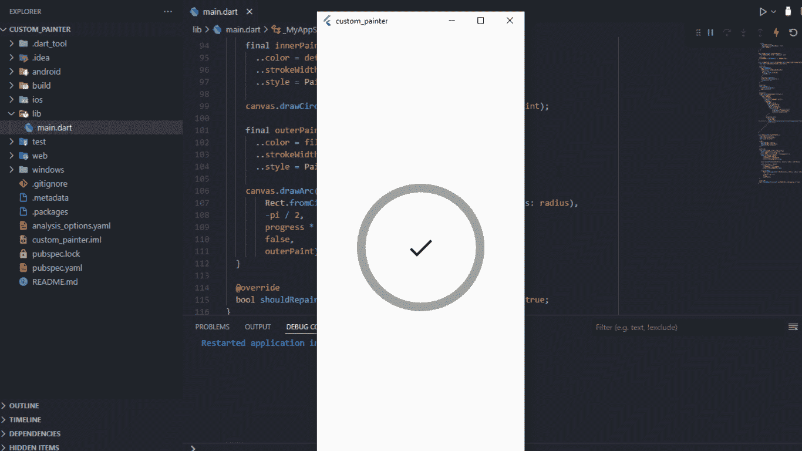
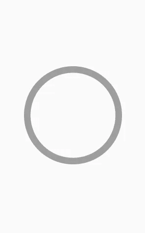
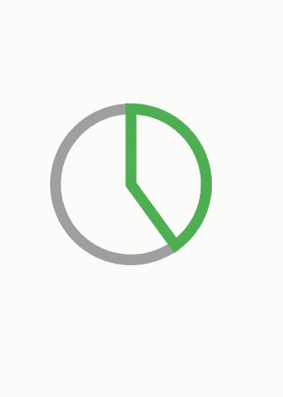
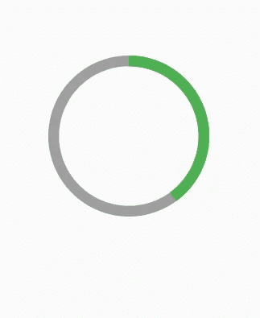
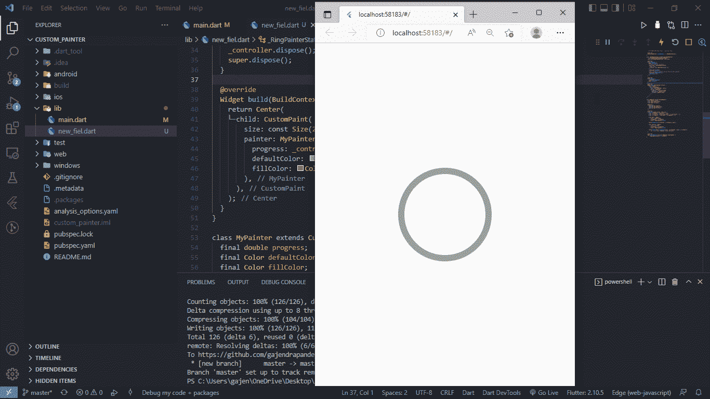
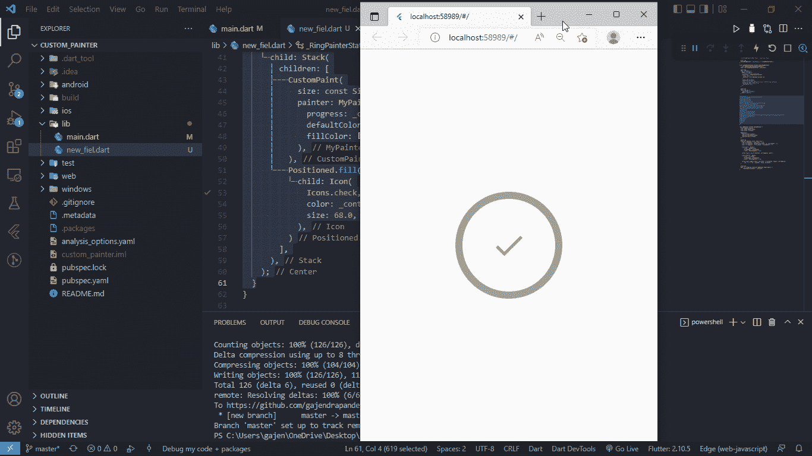

# 构建自定义 Paint Flutter 应用程序小部件

> 原文：<https://betterprogramming.pub/custompaint-in-flutter-ff2e1d6f8309>

## 想创建一个高度定制的用户界面和令人敬畏的动画吗？不用担心，Flutter CustomPaint 小工具已经覆盖了你

在这篇文章中，我们将讨论显式动画以及如何轻松使用`CustomPaint`小部件。

您可以从我的 [GitHub 库](https://github.com/gajendrapandeya/CustomPaint.git)查看代码示例。

> **Custom Paint :** 一个小部件，提供一个画布，在绘制阶段可以在上面进行绘制。

只需将`CustomPaint`小部件添加到您的小部件树中，并为其提供`**painter**` ，这是`CustomPainter`抽象类的子类。

由于`CustomPainter`是一个抽象类，它迫使我们实现两个重要的方法，即`paint()`和`shouldRepaint()`。`size` 指定绘制的小工具的大小。让我们把手弄脏:

`paint()`方法为我们提供了两个重要参数:

1.  Canvas 是我们在屏幕上绘制小部件的区域。它有各种方法来绘制自定义小部件。其中有:`canvas.drawLine()`、 `canvas.drawCircle()`、 `canvas.drawArc()`、 `canvas.drawOval()`等。
2.  `Size`:图纸应该有多大。默认情况下，它采用包装器小部件的大小，即包装我们的`CustomPaint`小部件的小部件。此外，我们可以在我们的`CustomPaint`小部件中提供尺寸参数。因为我们想画一个圆，所以我们为宽度和高度传递了相同的值。

每当需要重建`CustomPainter`时，就会调用`shouldRepaint()`方法。当我们实施我们的项目时，这一点会变得很清楚。

现在我们了解了`CustomPainter`类，让我们在画布上画些东西。我们的目标是画一个有一定笔画宽度的圆。

让我们看看我们是如何做到这一点的:

因为我们想要画一个圆，所以我们使用了预建的`canvas.drawCircle() the` 方法，该方法需要三个参数，即圆心、圆的半径和一个绘画对象。我们从`size`*参数计算出圆心和半径。`Paint()`类为我们提供了各种属性，如`paint`、`storkeWidth`、`style`的颜色，即是否应该描边或填充。当前的实施将导致以下结果:*

**

*我们的下一个目标是在同一个圆上画一条弧线，它将在笔画周围产生动画效果。为了实现这一点:*

*因为我们想要画一个圆弧，所以我们使用了期望五个参数的`canvas.drawArc()`方法，即 Rect `object`、弧度中的`startAngle`、`radian`中的`sweepAngle`、`useCenter`布尔和绘制对象。*

*同样，我们要围绕这个圆画圆弧，所以我们用`Rect.fromCircle()`这个方法作为第一个参数。第二个参数是我们应用到-pi/2 的开始角度，因为我们想从圆的顶部开始角度。*

*扫描角度指定了弧的结束位置，我们应用了总角度的 40%,即我们的弧将从-pi/2 到总 360 弧度的 40%绘制。*

*如果`useCenter` 布尔为真，则圆弧闭合回圆心，形成一个扇形圆。否则，圆弧不闭合，形成一个圆段。最后一个参数是我们已经熟悉的绘画对象。*

*`useCenter`设置为真的当前实施将导致以下结果:*

**

*但是我们不想要那个圆形扇区，所以将它设置为 false 会导致如下结果:*

**

*您可以调整`startAngle`、`endAngle`来查看各种效果。*

*现在我们几乎接近了我们想要实现的目标。唯一剩下的部分是动画的进展。为了做到这一点，我们必须使用显式动画，即我们必须创建`AnimationController`并将其值传递给`RingPainter`类:*

*我们现在做的各种事情是:*

1.  *将我们的`RingPainter` `StatelessWidget`转换为有状态小部件，以便在动画值改变时重建 UI。*
2.  *通过混合我们的`_RingPainterState`类和`SingleTickerProviderStateMixin`创建了`AnimationController`控制器，并在`initState()`方法中初始化了它。*
3.  *用`_controller.forward()`开始动画*
4.  *在控制器中添加了监听器，并调用了一个`setState((){})`，这样每当`_controller`的值改变时，我们的整个 UI 都会重建。*
5.  *现在我们的`MyPainter` 类需要三个必需的参数:圆的笔画和填充颜色的`progress`、`defaultColor`。这样做是为了传递来自该类外部的各种值，并使该组件可重用。请注意，`shouldRepaint()`方法已经更新，因此我们的`Circle`应该只在进度值与之前的值不同时绘制。*
6.  *最后将这三个参数传递给`MyPainter` 类，进度值是动画的当前值。*

*通过当前的实施，我们成功实现了这一目标:*

**

*哇，我们快到终点了！剩下唯一要做的就是在圆圈中间添加一个图标，并根据动画是否完成来改变它的颜色。*

*为了实现这一点，请像这样更新您的构建方法:*

*以下实现将导致这种情况:*

**

*所以现在成功地实现了我们的愿望。*

*我希望您已经了解了一些关于`CustomPaint`小部件的知识。现在你可以自己探索实现各种其他效果。*

*感谢阅读。*