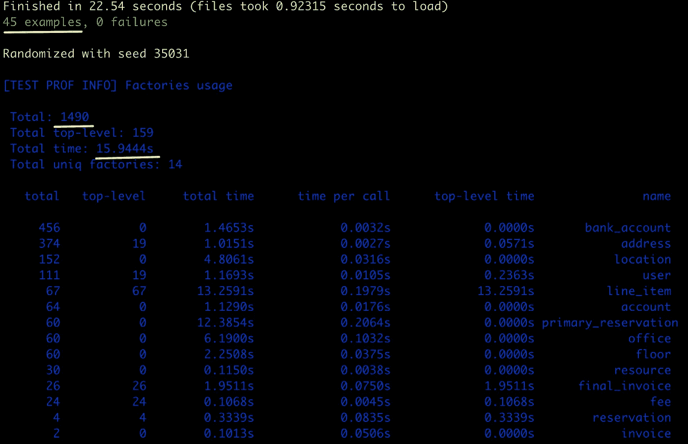
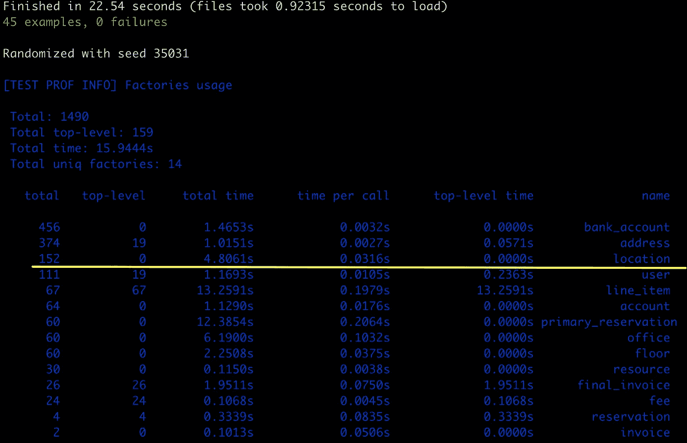
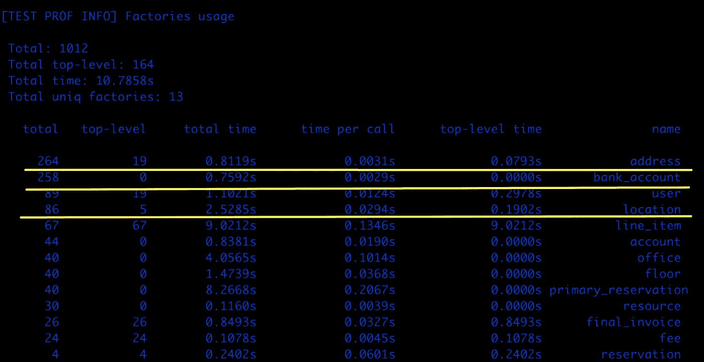
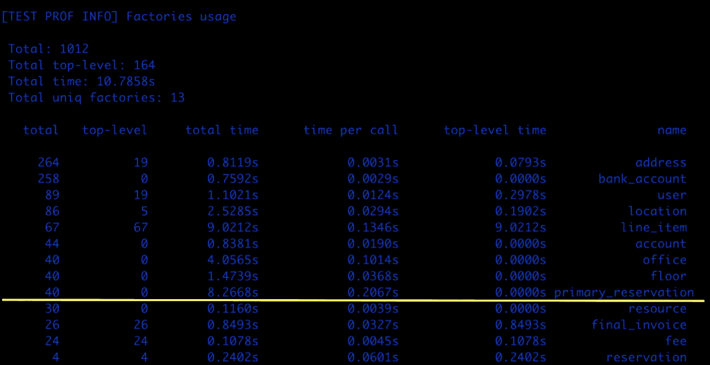
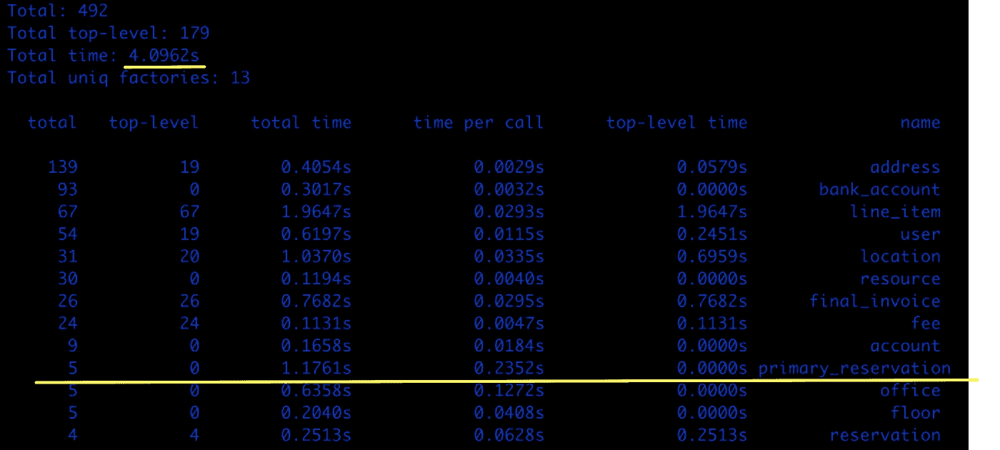

# 用 TestProf 削减您的 RSpec/Minitest 运行时

> 原文：<https://betterprogramming.pub/cut-your-rspec-minitest-runtime-with-testprof-d19e55783050>

## 我如何让我的测试运行速度加快 70%


卢卡斯·布拉塞克在 [Unsplash](https://unsplash.com/s/photos/time?utm_source=unsplash&utm_medium=referral&utm_content=creditCopyText) 上的照片

随着业务复杂性的增加，许多应用程序的测试套件运行速度呈指数级下降。这对开发人员的生产力和资源效率来说是痛苦的。

在本文中，我将向您展示我如何通过更改几行代码使我的测试运行速度提高了 70%。

# 为什么考试很重要

想象一下，我有一个测试套件来验证我的代码的所有输出和副作用。有了这种掩护，我可以自信地重构代码，直到我对它的质量感到满意**。**信心允许更快的代码编写、遗留代码重构和可持续的速度。这对软件开发至关重要。

未经测试的遗留代码是一个沼泽，会让开发团队停滞不前。最终，它会降低整个组织的速度，甚至让它们破产。因此，消除恐惧对高绩效团队和公司至关重要。

# 我爱 TDD

随着程序员的成熟，我越来越喜欢上 [TDD](https://www.codecademy.com/articles/tdd-red-green-refactor) 。这让我想起了[科学方法](https://en.wikipedia.org/wiki/Scientific_method)——成功的结果是在实验之前定义的。所以结果不会影响你的判断。

TDD 让你专注于重要的东西——输入和输出，而不是内部发生了什么。在开发过程中，我们经常通过将一个类分成几个类、颠倒逻辑或者使用不同的数据结构来多次改变它的实现。使用 TDD，您确信重构没有改变输出。这就是 TDD 如此强大的原因。

# 问题是——测试太慢了

所以我完成了我的测试套件——45 个漂亮、闪亮的 RSpec/Minitest 测试。但是，唉，它们太慢了——运行时间超过 25 秒。

当实践 TDD 时，您会多次运行您的测试(通过[红色、绿色、重构](https://www.codecademy.com/articles/tdd-red-green-refactor)循环)。25 秒是等待结果的一段相当长的时间。这让我的一天变得更加无聊。我能怎么做呢？

# 挖掘理解——为什么这么慢？

我的测试如此缓慢有两个主要原因:

1.  **活动记录:** Ruby on Rails 使得在您的类中混合 DB 访问变得太容易了——这反过来导致您编写单元/集成混合测试，这比单元测试慢得多。在这些测试中，您不仅要测试您的类，还要在过程中在数据库中创建对象。数据库访问比执行代码慢得多，这本身就大大降低了测试的速度。
2.  **工厂级联:**为了在测试中创建那些复杂的对象，许多 RoR 开发人员使用[工厂机器人](https://github.com/thoughtbot/factory_bot) gem。这是一个美妙的宝石，它通过利用`Factory`模式提高了生活质量并有助于创建简洁的测试。但潜在地，这也导致了一种叫做*工厂级联*的现象。工厂级联是指一个工厂使用其他工厂，而这些工厂又使用其他工厂。在级联测试中，您可以很容易地发现自己在一次测试中获得了+30 DB `insert`。(参见[这篇精彩的帖子](https://evilmartians.com/chronicles/testprof-2-factory-therapy-for-your-ruby-tests-rspec-minitest)了解更多关于这个话题的信息。)

因此，在测试过程中，我不仅在数据库中创建对象，还创建了许多对象——这很慢。

# 测试专家 Gem 来拯救我们了

有一种很酷的宝石叫做`[test-prof](https://test-prof.evilmartians.io/#/)`。它有一些工具可以帮助你分析和改进你的测试套件。由于我的代码中没有繁重的工作，我立即怀疑是工厂级联。

为了理解级联有多糟糕，我使用了 gem 提供的[工厂分析器](https://test-prof.evilmartians.io/#/factory_prof)。

工厂利润的结果:



哎哟！

对于 45 个测试，在数据库中创建了 1，490 个对象，这导致这 45 个测试在对象创建上花费了超过 15 秒的时间。听起来像是一大堆东西，对吧？绝对是！请继续阅读下面的内容，看看我是如何削减 70%的对象和运行时间的。

我注意到的第一件事是我正在创建 152 个位置，这需要 4 秒钟——但是没有一个是从我的测试套件中显式调用的(`top-level`是 0)。



为了停止疯狂地创建位置，我必须看看哪个工厂正在为我创建这些位置。

看来`invoice`工厂是罪魁祸首之一。因为我正在构建一个处理发票数据的类，所以您可以假设我经常调用发票工厂。

```
FactoryBot.define do
  factory :invoice do
    some_dependency { "foo" }
    ...
 **location**
```

啊哈！确实是头号嫌疑人。以防你不知道——你不必每次需要一个对象时都使用`FactoryBot`的`create`方法。只有在需要将对象持久保存在数据库中时，才应该使用它。可以用来生成对象的其他选项有:

*   `FactoryBot.build` —这不会在数据库中持久化对象，所以比`create`快得多，但会****持久化数据库中的对象关联。所以它会导致瀑布。哎哟。****
*   ****`FactoryBot.build_stubbed` —这个不会在数据库中持久化对象，也不会持久化关联。很好。但是有一个问题:它将填充`id`列和工厂中定义的所有字段。使用这种方法时，如果不显式地将关联传递给工厂，您将无法使用它们——例如`FactoryBot.build_stubbed(:location, address: address)`。****

****好的，让我们通过一个存根位置，无论我在哪里创建发票:****

```
**let(:invoice) { FactoryBot.build_stubbed(:final_invoice, **location: location**) }
let(:location) { FactoryBot.**build_stubbed(:location)** }**
```

****让我们看看使用`build_stubbed`后的结果:****

********

****哇哦。存根位置也大大减少了`address`和`bank_account`的数量。我们已经削减了 30%的测试运行时间。****

****让我们看看我们还能解决什么:****

********

****似乎是个不错的候选人。同样，我们看到一个没有被显式调用的工厂占用了大量运行时间——8 秒。让我们看看什么工厂可能是罪魁祸首:****

```
**FactoryBot.define do
  factory :line_item do
    some_dependency { "foo" } 
 **association :reservation, factory: :primary_reservation****
```

****啊哈！是`line_item`厂。行项目是发票中的行——因此它们在这个测试套件中经常使用。让我们找到不需要预订的地方，并将`nil`分配给它们:****

```
**let!(:line_item) { FactoryBot.create(:line_item, **reservation: nil**) }**
```

****并且确实需要预订的位置将获得存根预订:****

```
**let(:primary_reservation) { FactoryBot.build_stubbed(:primary_reservation, **location: location**) }**
```

****让我们看看结果:****

********

****嘭！又过了六秒钟。哇，创建对象的时间从 15 多秒缩短到了 4 秒，减少了 70%以上。****

****四秒钟的时间似乎足够在这一点上停下来了。让我们推动这个提交。****

# ****总结一下****

*   ****使用`FactoryBot.create`时要小心。它会导致瀑布，大大降低测试速度。****
*   ****尽可能使用`build_stubbed`，如果这样还不够好，尝试使用`build`。****
*   ****如果您必须使用`create`，使用`test-prof`了解级联有多糟糕，并尝试使用此信息进行优化。****

****感谢阅读！****

# ****资源****

*   ****[《红绿重构》](https://www.codecademy.com/articles/tdd-red-green-refactor)code academy****
*   ****[工厂 _ 机器人](https://github.com/thoughtbot/factory_bot)****
*   ****[《火星编年史》中的“TestProf II:你的红宝石测试的工厂疗法”](https://evilmartians.com/chronicles/testprof-2-factory-therapy-for-your-ruby-tests-rspec-minitest)****
*   ****[工厂利润](https://test-prof.evilmartians.io/#/factory_prof)****