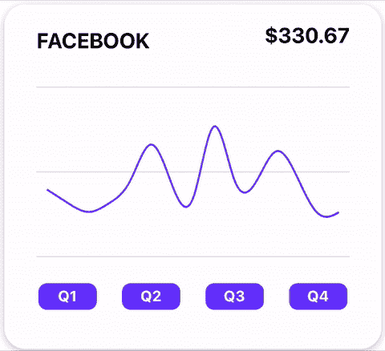
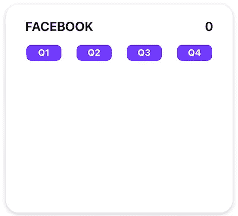
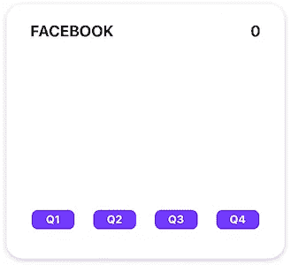
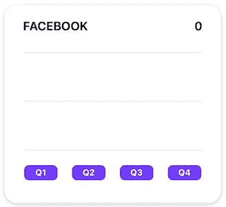
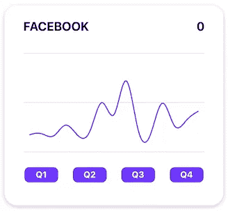
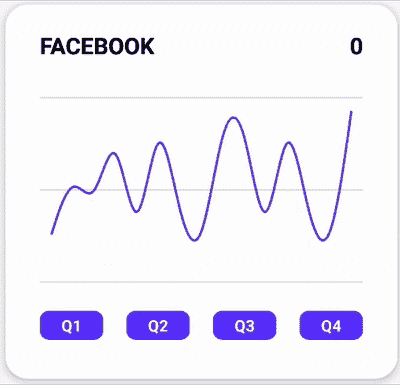
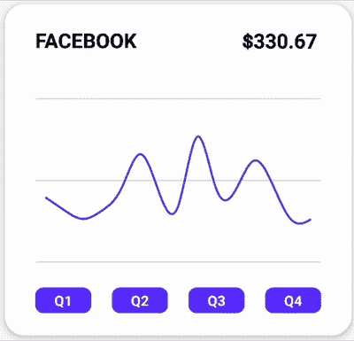

# D3 和 React-Native——线图的基本指南

> 原文：<https://betterprogramming.pub/d3-and-react-native-an-essential-guide-to-line-graphs-dc1ce392b440>

## 在 React Native 中制作漂亮的动画线形图的指南


照片由[艾萨克·史密斯](https://unsplash.com/@isaacmsmith?utm_source=unsplash&utm_medium=referral&utm_content=creditCopyText)在 [Unsplash](https://unsplash.com/s/photos/graph?utm_source=unsplash&utm_medium=referral&utm_content=creditCopyText) 拍摄

D3.js 是我们在 React-Native(甚至可能是所有移动开发)中用于创建图表和数据可视化的最好、最强大的工具📈。如果你有任何疑问，我推荐你去看看[**【D3】画廊**](https://www.d3-graph-gallery.com) **。**

图库中惊人的多样性展示了 D3 在可视化数据方面的多功能性。如果你想完全自由地决定你的数据可视化是什么样子，D3 是一个不错的选择。

我写这篇文章的灵感是因为 D3 折线图上没有太多的资源，更不用说 D3 和 React-Native 了。我假设这篇文章的读者已经熟悉 React-Native 中的 SVG 动画。

如果没有，你可以从我的上一篇文章中了解它们。我希望这篇文章可以作为 React-Native 开发人员的指南，帮助他们了解 D3，并开始制作漂亮的图表。

## 我们在建造什么？

和我的操作指南一样，我喜欢从展示我们正在构建的东西开始。我们将创建您在下面的 GIF 中看到的折线图，并在折线图之间添加动画。



我们在 iOS 上运行的最终结果

## **入门**

与我的其他教程不同，我将从样板文件开始。如果你想跟着做，你可以在这里克隆[启动项目。此时您应该在`main`分支中。](https://github.com/friyiajr/D3LineChartSample)

不需要设置任何东西，因为我已经为您安装了 ReAnimated 和 SVG 库。你所需要做的就是在你的终端中从项目的根目录运行`yarn install`，然后运行`cd ios && pod install`。如果你卡住了，想查看解决方案，查看`solution`分支。

请注意，样板文件并不包括所有的导入。在 VSCode 编辑器中使用`cmd + .`时，您需要导入库值。到目前为止，您的项目应该是一个带有一些按钮的空卡片，如下所示。



启动在 iOS 上运行的画布

## **熟悉数据**

让我们从熟悉我们的数据结构开始。每个点都有这些值:

```
export type DataPoint = {
  date: string;
  value: number;
};export const originalData: DataPoint[] = [
  {date: '2000-02-01T05:00:00.000Z', value: 250},
  {date: '2000-02-02T05:00:00.000Z', value: 300.35},
  {date: '2000-02-03T05:00:00.000Z', value: 150.84},
  ...
```

这个应用程序的所有数据都可以在`src`目录下的`Data.ts`文件中找到。请注意，日期是以 ISO-8601 字符串格式保存的。这是因为 ReAnimated for Android 不能很好地处理 JavaScript 日期对象。稍后将我们的日期传递给`ReAnimated`的唯一方式将是 ISO 日期字符串的形式。我们的值是代表实际金额的数字。

## 组织我们的数据

为了构建一个图表，我们需要组织我们的数据，以便 D3 可以处理它。最好的开始方式是创建一个方法，用我们在`App.tsx`文件中处理过的图表数据返回一个对象。

```
const makeGraph = (data: DataPoint[]) => {};
```

下一步我们将计算数据集中的最大值和最小值。这些值用于构成我们图表的 y 域。这很容易做到，我们只需将数据值输入到`Math.max`和`Math.min`方法中。

```
const max = Math.max(...data.map(val => val.value));
const min = Math.min(...data.map(val => val.value));
```

之后，创建 y 轴就像调用 D3 库中的`scaleLinear`一样简单。注意范围内`GRAPH_HEIGHT`的使用。这将确保我们所有的数据点都映射到屏幕上的 y 坐标，该坐标不大于图形的高度。

```
const y = scaleLinear().domain([0, max]).range([GRAPH_HEIGHT, 35]);
```

对于 x 轴，我们知道我们的数据总是 15 天，所以我们将分别在每月的第一天和第十五天设置起点和终点。注意范围内`GRAPH_WIDTH`的使用。像 y 轴一样，它将我们的值映射到屏幕上的 x 坐标，并确保它们不大于图形的宽度。

```
const x = scaleTime()
    .domain([new Date(2000, 1, 1), new Date(2000, 1, 15)])
    .range([10, GRAPH_WIDTH - 10]);
```

然后，我们通过使用 D3 的`line`函数创建折线图来结束。

```
const curvedLine = line<DataPoint>()
    .x(d => x(new Date(d.date)))
    .y(d => y(d.value))
    .curve(curveBasis)(data);
```

我们从函数中返回`max`、`min`和`curvedLine`值。他们很快就会被用来绘制我们的图表。

```
return {
    max,
    min,
    curve: curvedLine!,
 };
```

总之，我们的`makeGraph`函数应该是这样的:

## **绘制图形**

接下来我们要做的是绘制图表。让我们从将第一个数据集添加到`App.tsx`中的图形数据集数组开始。

```
const graphData: GraphData[] = [makeGraph(originalData)];
```

因为`graphData`已经被传递到了`LineChart`组件中，让我们跳回到`LineChart.tsx`文件中。从分解方法头中的所有组件值开始。

```
const LineChart: FC<LineChartProps> = ({
  height,
  width,
  data,
  bottomPadding,
  leftPadding,
}) => {
```

当我们之前调用`line`方法时，D3 接受一组域和范围值，并使用它们来构建一个 SVG 路径。我们的图表实际上只是一个显示在屏幕上的 SVG。为了托管我们的线图，我们将 SVG 画布添加到我们的`LineChart`组件中。

```
<Animated.View style={styles.chartContainer}>
  <Svg width={width} height={height} stroke="#6231ff"></Svg>
</Animated.View>
```

在这一点上，我们将看到我们的图表捕捉到其适当的高度。



在 iOS 上运行的已调整大小的画布

现在，我们将添加一些网格线，使图表更加突出。我们可以通过画几条 SVG 线来做到这一点。

注意这里使用的`x1`、`x2`、`y1`和`y2`值。x 或 y 的第一个值是线条起点的坐标。坐标的第二个值是您希望线条结束的位置。我们的结果将是这个空图表:



iOS 上带有图形线条的画布

最后，时刻到了，让我们把图表放到画布上。将以下代码添加到文件中我们之前绘制的线条下。

```
<Path d={data[0].curve} strokeWidth="2" />
```

结果将是如下所示的图形。



在 iOS 上运行的简单图形

到目前为止，您为`LineChart`组件编写的代码应该如下所示:

## 制作多个图形的动画

太令人兴奋了！我们不仅在屏幕上绘制了我们的图表，而且我们还能够添加好的测量指南。

本文的下一阶段将关注多折线图之间的切换以及这些转换的动画效果。这一部分之所以成为可能，是因为 React Native animations 的教父 William Candillon 创作的 TypeScript 库。

要开始我们的图表动画制作过程，请返回到`App.tsx`，将其他数据集添加到我们的图表数组中:

```
const graphData: GraphData[] = [
  makeGraph(originalData),
  makeGraph(animatedData),
  makeGraph(animatedData2),
  makeGraph(animatedData3),
];
```

您还需要在`makeGraph`的曲线属性上运行 redash `parse`，并相应地调整您的类型。

```
import {parse, Path as RePath} from 'react-native-redash';
...
export type GraphData = {
  ...
  curve: RePath;
};const makeGraph = (data: DataPoint[]) => {
  ...
  return {
    max,
    min,
    curve: parse(curvedLine!),
  };
};
```

导航回您的`LineChart.tsx`文件，并为您当前选择的图形创建一个`sharedValue`。这也是制作一个可以在图形之间转换的函数(无需动画)的好时机。总的来说，代码应该是这样的:

```
const selectedGraph = useSharedValue(data[0]);
const onQuarterTapped = (quarter: number) => {
  selectedGraph.value = data[quarter - 1];
};
const animatedProps = useAnimatedProps(() => {
  return {
    d: selectedGraph.value.curve,
  };
});
const q1Tapped = () => onQuarterTapped(1);
const q2Tapped = () => onQuarterTapped(2);
const q3Tapped = () => onQuarterTapped(3);
const q4Tapped = () => onQuarterTapped(4);
```

您也可以将这些函数添加到文件底部的按钮部分:

```
<ButtonSection
  q1Tapped={q1Tapped}
  q2Tapped={q2Tapped}
  q3Tapped={q3Tapped}
  q4Tapped={q4Tapped}
/>
```

到目前为止，您的代码将是这样的。

在这一点上，你将有一个图表，可以在图形之间跳转，如下图所示。



在 Android 上运行的预动画图表

显然，这看起来有点怪异，所以现在让我们添加动画。回到`LineChart.tsx`,我们为当前图添加一个状态，我们正在转换的图，以及我们转换的状态。

```
const selectedGraph = useSharedValue(data[0]);
const previousGraph = useSharedValue({...data[0]});
const isAnimationComplete = useSharedValue(true);
const transition = useSharedValue(1);
```

我们需要更新`animatedProps`来反映这些图表之间的转换。新代码如下所示:

```
const animatedProps = useAnimatedProps(() => {
  return {
    d: mixPath(
      transition.value,
      previousGraph.value.curve,
      selectedGraph.value.curve,
    ),
  };
});
```

注意函数`mixPath.`的使用这个`redash`函数用从 0 到 1 的动画值插入两条路径。让我们通过更新我们的`onQuarterTapped`函数来完成从一个状态到下一个状态的动画。

上面的代码做了很多事情，所以我在这里将它分解。首先，我们有一个 if 语句，如果已经有一个动画在进行中，它会阻止新的动画出现。

如果没有活动的动画，我们将选定的图形设置为我们点击的图形。

此时，我们使用`withTiming`将过渡值慢慢增加到 1，这允许`mixPath`将图表动画化。最后，当动画完成时，我们将`isAnimationComplete`设置为 true，这样用户可以自由地再次点击按钮并转换到另一个图表。

## 奖励:动画文本

最后，让我们将屏幕顶部的文本动画化，在这里我们可以看到金额。首先向`makeGraph`函数添加一个`mostRecent`属性。你可以这样做:

```
const makeGraph = (data: DataPoint[]) => {
  ...
  return {
    max,
    min,
    curve: parse(curvedLine!),
    mostRecent: data[data.length - 1].value,
  };
};
```

然后我们可以在`LineChart.tsx`中创建一个派生的值，这样这个字符串对 UI 线程是可见的。

```
const mostRecent = useDerivedValue(() => {
  return `$${selectedGraph.value.mostRecent}`;
});
```

最后，我们可以使用`react-native-redash`中的`ReText`在 UI 上显示值:

```
<View style={styles.titleContainer}>
  <Text style={styles.titleText}>FACEBOOK</Text>
  <ReText style={styles.priceText} text={mostRecent} />
</View>
```

我们完成的代码如下:

我们最终的结果是这张 GIF 中的图表



我们在 Android 上运行的最终结果

# 最后的想法

哇，这是一个艰难的时刻！D3 无疑有一个陡峭的学习曲线，有时会有点棘手。我希望通过这篇文章，你能够完成这个练习，并了解更多关于如何使用它。

我希望看到 React-Native 社区围绕这项技术团结起来，并更多地展示我们可以添加到应用程序中的有趣图表。下次再见，快乐编码。