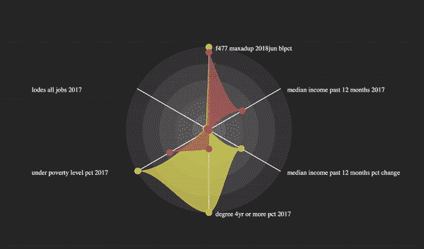
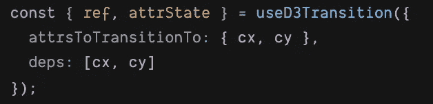
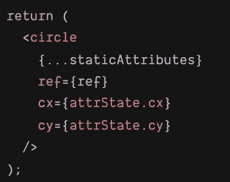

# 如何在 React 中创建 D3 动画

> 原文：<https://betterprogramming.pub/d3-animations-in-react-with-1-line-of-code-976396a45ede>

## 只用一行代码



仅仅用 D3.js 和普通的 Javascript 构建复杂的可视化动画会变得很快。挂钩 use-d3-transition 通过让您使用您所熟悉和喜爱的 React 模块性(就像上面的 GIF 中一样),使这项任务变得简单。)

**TLDR** :想要一个定制的 React 挂钩，让 React 中的 [D3.js](https://d3js.org/) 过渡/动画变得简单？[查看我的 npm 包](https://www.npmjs.com/package/use-d3-transition) `[use-d3-transition](https://www.npmjs.com/package/use-d3-transition).`

传递你要动画的属性，然后用 useD3Transition 返回给你的！完成了。

# 我们想要的:React + D3 转换

我们只是喜欢那些非常流畅的动画/过渡。

天哪，我们喜欢 React 的声明性和可组合性(尤其是在构建复杂的数据可视化时。)

那么，React 中可以有 D3 转场吗？

# 你可以…但是，目前来说，这有点痛苦

D3/数据可视化女神[幻灯片摘要](https://medium.com/u/4607b4069d83#/)、[视频](https://www.youtube.com/watch?v=zXBdNDnqV2Q))。

但是在我看来，如果你没有时间进行大规模重构(或者对 React 反模式没有兴趣)，现有的方法就太麻烦了。

(甚至[只反应的动画解决方案](https://reactjs.org/docs/animation.html#low-level-api-reacttransitiongroup)也需要重要的重构。)

有什么大不了的？为什么我们不能让它变得简单些？

# 为什么这么难:D3 和 React 想要独占 DOM 的控制权

当 Mike Bostock 在 2011 年发明 D3 的时候，web 开发人员基本上是外科医生，每次他们想要进行更新时，就直接把手伸进 DOM 的内脏。

D3 也不例外:它通过让您编写查找和变异 DOM 元素的代码来转换元素。

快进到今天。我们生活在一个声明式 web 开发的世界里。React、Svelt、Vue、Ember 和 Angular 都有一个共同的想法:你只需要告诉他们你想要渲染什么，他们就会负责 DOM 的更新。

哦，这些框架都期望独占 DOM 的控制权。不好意思，D3，他们不合租。

有没有可能让它们很好地一起玩，而不用大规模地重写我们的组件？

# 解决方案:在过渡期间给 D3 独占的 DOM 控制权

你可以通过在黑暗中对即将到来的更新做出反应来做到这一点。

## *实质技术方法*

1.  当一个动画元素的属性改变时，调用一个 React 钩子，它使用 D3 通过直接 DOM 操作将元素的属性转换为新值。比如圆半径`10px` 到半径`20px`。
2.  哦不——现在 D3 和 React 都在更新 DOM！但是我们已经有了一个计划:我们通过从钩子返回旧的属性值来欺骗 React 暂停它自己对那个组件的更新。反应来看，好像组件没变。(卑鄙！)
3.  当转换完成时，我们才让 React 看到最终值，并忠实地运行自己的更新。(嘘，不要告诉 React 我们已经平滑地动画到那个值了！)

复杂？这就是为什么我们把所有的逻辑塞进一个可重用的钩子:`useD3Transition`。

## 如何用 use-d3-transition 更新你的代码库

假设您有下面的 SVG `circle` React 组件，当您传入一个新的结束位置时，您希望平滑地更新其位置(`cx`和`cy`)。以下是在`use-d3-transition`之前发生的事情:


没有 D3 转换的反应…*嗅嗅*

制作动画，简单来说

1.  传递`useD3Transition`动态属性(`cx`和`cy`):



2.在 JSX 元素中使用钩子返回的 DOM 节点引用`ref`和反应停止值*、*、`attrState`:



瞧啊。平滑过渡(以及过渡过程中的优雅更新！).

尝试在代码沙箱中单击“切换圆形位置”:

[立即使用 npm 软件包](https://www.npmjs.com/package/use-d3-transition):

```
npm install use-d3-transition yarn add use-d3-transition
```

**特别感谢** : 这个钩子的灵感来源于 [Swizec Teller](https://medium.com/u/8e43dcd3c21f?source=post_page-----976396a45ede--------------------------------) 的博文，[声明性 D3 转场与 React 16.3](https://swizec.com/blog/declarative-d3-transitions-react/swizec/8323) 。

**技术提示:**一些非常精明的 React 开发人员可能会注意到，虽然这个钩子阻止了自己的重新渲染，但是在某些边缘情况下，父钩子的重新渲染可能会在过渡过程中强制重新渲染，比如在使用上下文时。虽然这是真的，但我还没听说有人遇到过这种情况。这也是实现简单性公认折衷。