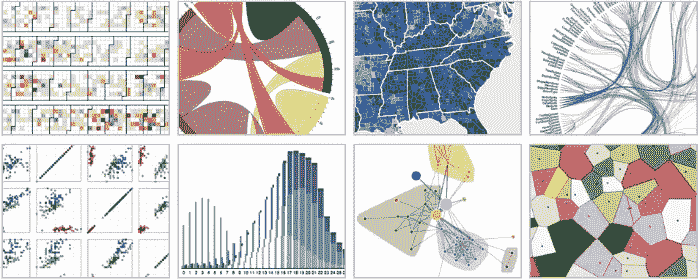
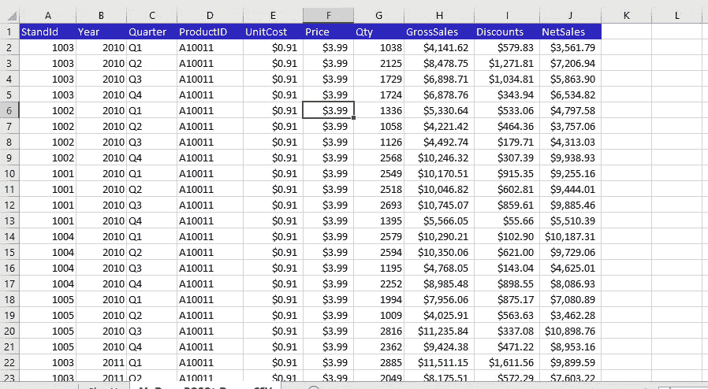
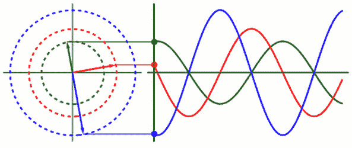
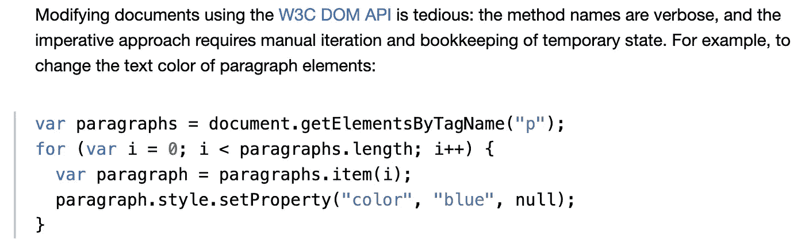
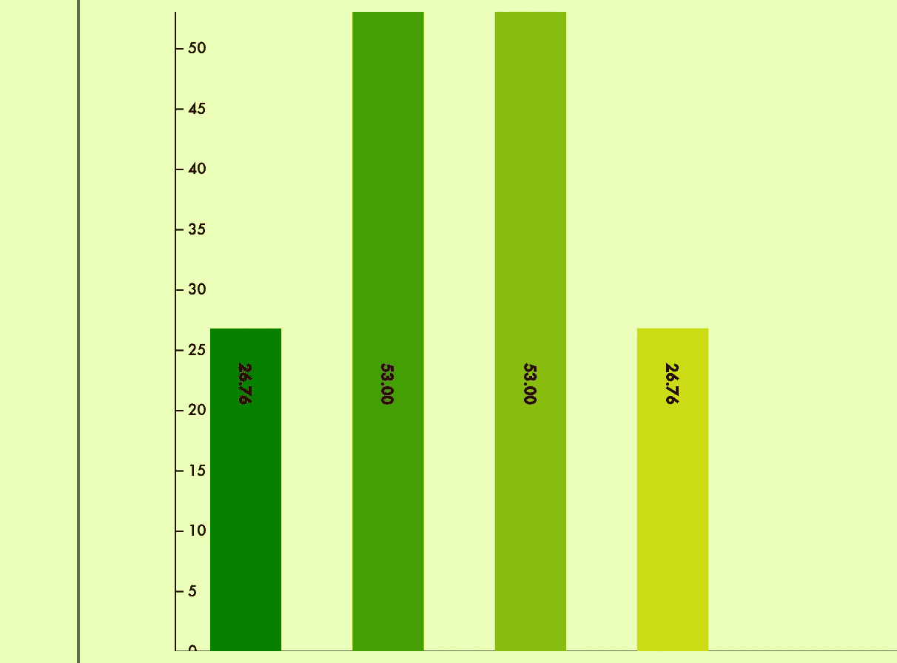

# D3:数据和其他简单方法的响应性和动态可视化

> 原文：<https://betterprogramming.pub/d3-responsive-and-dynamic-visualizations-for-data-and-other-easy-recipes-68e37b451822>

## 图表变得有趣…或者至少更简单



# 介绍

众所周知，很多人真的不喜欢数学。在我成长的过程中，这是事实，现在也是事实，我不相信它会永远是事实。作为一个在标准的 K-12 教育体系下长大的孩子，我多年来最强的科目之一一直是数学。记忆没有概念化重要，通过理解数字和关系，答案总是可以被构建而不是被重复。我喜欢它，我也很擅长它。与此同时，我明白并不是每个人都对数字有我这样的感觉。

我很同情——数字和数学可能很难。随着我的教育进入本科阶段，我遇到了主修计算机科学、数学和物理的人，他们做的问题让我想拔毛。数学可能很难，数字可能非常抽象，而且不是每个人都喜欢花几个小时盯着一张纸来梳理一些利基关系(我的意思是谁会，对不对？)

也就是说，随着我们进入一个由技术和计算主导的信息时代，处理和解释数据成为越来越必要的技能。计算机存储和操作数据的方式通常不利于人类的可读性。能够提取和解释这些数据是如此重要，以至于围绕这一主题出现了一个完整的数据科学领域。

这些和 D3 有什么关系？归结起来就是:数据是数字(或者至少它通常可以被分解成数字格式)，数字可以是粗略的…



但是照片…照片可以不那么恶心。在这个时代，数据和海量信息的解释对于每个领域的表现都变得越来越重要，可视化数据以方便*每个人*的解释是一个非常强大的工具集。有什么比用*图*更好的方式来直观地表现数据呢！



大多数图表都比这张简单。

制作精良的数据可视化使得每个人都可以访问和解释大型数据集。像 D3 这样的库为我们提供了强大的预制工具包，用于将数据处理成可视化的格式。说到这里，让我们进入 D3 的更多内容——它是什么，它为数据可视化提供了什么样的工具？

# D3 是什么？

D3 是一个 JavaScript 库，它提供了通过 Html、SVG 和 CSS 可视化表示数据的功能。换句话说，它是一个基于数据画图的方法库(虽然它能做的远不止是图片)。在您的代码中使用它就像在您运行的任何其他 JS 脚本标签旁边包含它一样简单。

```
<script src="https://d3js.org/d3.v5.js"></script>
```

[](https://d3js.org/) [## D3.js —数据驱动的文档

### D3 是一个用 HTML、SVG 和 CSS 可视化数据的 JavaScript 库。

d3js.org](https://d3js.org/) 

D3 提供了广泛的特性，包括将外部文件解析成 JSON。csv，。js 等)、从数组生成 HTML 表、将数据集(数组)绑定到 DOM 选择和动态呈现 DOM 元素。它还采用了“普通”DOM 遍历中涉及的许多过程，并将它们简化成干巴巴的压缩方法。当谈到 D3 的功能时，这些只是冰山一角，但是对于从这个库开始，我认为最重要的是最后三个:绑定数据、动态元素和简化的 DOM 遍历。

# 绑定数据

首先，D3 允许您将数据(数组)绑定到 DOM 元素选择，以便稍后进行动态呈现。这到底是什么意思？

首先，从 DOM 中选择一些元素。这就是 D3 的一些简化遍历派上用场的地方。D3 在他们的主页上提供了一个混乱遍历的例子，用代码将所有 p 标签颜色改为蓝色:



写起来并不有趣，所以 D3 为我们提供了一种方法来简化这个选择以及属性的改变。上面的功能与下面的功能相同:

```
d3.selectAll("p").style("color", "blue");
```

`selectAll`方法返回所提供节点下游的所有相关元素的选择。如果您提供了`d3.selectAll()`，您将获得文档上的所有内容。运行`namedDivVariable.selectAll()`选择相关 div 下游的所有内容。这使得 DOM 选择和属性更改更加简单——感谢 D3！现在我们有了快速检索元素“选择”的方法，我们可以将数据绑定到它们。我们来举个例子。

假设我们有三个不同元素数量的数组:三个，两个和一个。

```
let threeElement = [true, false, true]let twoElements= [true, false]let oneElement= [true]
```

在 DOM 上我们也有两个 circle SVGs。现在不要担心正确的 SVG 语法——假设它们是适当的元素。这些圈还有一个可能的属性:交叉；true-o，false-o。我们可以继续选择它们，并将它们存储在 circles 变量中。

```
circle1 = O, circle2 = Olet circles = d3.selectAll(“circle”)
```

现在我们可以将这个数组数据绑定到我们选择的元素上。这意味着我们的数据数组中的每个值都通过 D3 magic 连接到我们选择的每个元素。这些数据值稍后可以被功能性地访问，以动态地呈现我们的元素。但我们稍后会回到这个话题。我们绑定数据的方式是通过`.data()`方法。所以我们可以把两个值的数组绑定到两个圆上，就像这样:`circles.data(twoElements)`。现在，第一个圆连接到我们的第一个数据元素“true”，第二个圆绑定到第二个元素“false”。当数据值的数量与选择中的元素匹配时，这被称为**更新选择—** 。

```
**Update Selection:**circles.data(twoElements)**//Gives back all elements and matching data bound**circles.data(twoElements).attr(‘crossed’, function(d){return d})**Would result in something like //** circle1 = Ø, circle2 = O
```

在上面的代码中，你会注意到`.attr()`方法中的一些混乱，我在这里设置圆是否被交叉。现在不要担心那个。只要知道 crossed 被设置为已经连接到每个圆的数据元素的值。

当我们有一个匹配每个数据值的元素时，更新选择是很好的，但是如果选择中的数据值和元素的数量不匹配呢？D3 还支持另外两种类型的选择，这两种类型的选择包含了任一方向的溢出:`.enter()`和`*.exit()*` *。下面是它们的工作原理。*

使用`.enter()`选项，您会收到任何没有匹配元素的`DATA`值。这些不匹配的值可以用`.append()`来渲染与之对应的新元素。

```
**Enter Selection:**circles.data(threeElements).enter()**//Gives back all Data Values that don’t have a matching circle****//e.g. [true] will be unmatched**circles.data(threeElements).enter().append(‘circle’).attr(‘crossed’, function(d){return d})**Would result in something like //** circle1 = O, circle2 = O, circle3 = Ø
```

这里，我们看到一个三元素数组被绑定到我们的两个圆上。`Circle1`得到`true`，`circle2`得到`false`，我们最后的`true`是浮动的。当我们调用`.enter()`*时，那个浮动元素就是我们现在所选择的。对于这些浮动数据点中的每一个，我们可以`.append()`一个新的圆，并将其交叉属性设置为现在分配的数据点`true`。最后，我们没有改变任何原始元素，我们只是将浮动数据点作为新的圆圈输入。*

*这个概念一开始对我来说很难理解，但是一旦你理解了 enter 选项，你就可以使用 D3 最强大的工具之一。比方说，我选择了我知道不存在的东西。然后我有一个空的选择。我可以将任何数据数组绑定到它，然后使用`.enter()`生成尽可能多的数据元素，所有元素都对应于单个数据点。这是生成 D3 图表最有用的工具之一，也是一个需要掌握的强大工具。*

*最后，我们有了`.exit()`选择。它与`enter`选择相反。`.exit()`方法将返回所有没有匹配数据值的*元素*。*

```
***Exit Selection:**circles.data(oneElement).exit()**//Gives back all elements without Data to bind to****//e.g. [circle2] will be unmatched**circles.data(oneElement).exit().remove()**Would result in something like //** circle1= O*
```

*这里发生的事情是，数据的一个元素数组被绑定到我们选择的两个元素的圆上。第一个元素绑定到`true`，第二个没有绑定。然后，通过`.exit()`，我们可以访问任何没有绑定数据元素的元素(例如`circle2`)。在它上面调用`.remove()`会从我们的 DOM 中删除那个圆，只给我们留下一个不变的`circle1`。*

*这一次要消耗很多，但是这三个功能是 D3 的 **DOM 遍历**和**数据绑定**功能的核心。它们需要一些练习和调试，但是一旦你习惯了它们，它们会非常灵活。既然我们能够遍历 DOM 并将数据绑定到我们选择的元素，我们就到了 D3 的第二个关键部分:动态呈现。*

# *动态渲染*

*这个特性可能是 D3 的标志，也是你使用这个库的主要原因。D3 让我们能够基于数据数组有条件地生成和呈现 HTML 元素。我们可以访问绑定到 HTML 元素的数据值，并从数据中导出元素的属性值。*

*这意味着，如果我有一个数字数组，并选择所有矩形(不存在)，然后使用`.enter()`和`.append(“rect”)`为每个数据值创建一个矩形，我可以在功能上设置每个矩形的高度等于其对应的数据值。我也可以根据它在选择中的索引来设置它的位置。突然，我有了一个条形图。*

*这个:*

*变成了这样(当然没有标签和装扮):*

**

*来自我正在进行的个人项目:一个图形应用程序，它解析 CSV 并从选定的列/行生成图形，几乎完全用 JS 编写，Rails API 后端，实现了 D3。*

*让我们来分析一下这个渲染中发生了什么:*

1.  *我在画布下检索一个空的选择。*
2.  *我将我的四个数据值追加到空选择中。*
3.  *使用`enter`，我访问所有没有元素的浮动数据。*
4.  *对于每一个，我添加了一个矩形，并将其宽度设置为 10，其 y 位置设置为 100。*注意*:这不是 canvas 在 Y 定位方面的实际工作方式，只是为了便于解释。*
5.  *我设置了每个矩形的高度，其值就是这个矩形的数据值。*
6.  *类似地，我可以使用索引作为`i`中函数的第二个参数，并根据它的索引设置 x 位置。第一个元素在`x=0`，然后是`x=60`，然后是`x=120`，依此类推*

*这就是 D3 的无限可能性开始向我们敞开的地方。我们能够生成任何类型的元素来响应数据集合，并根据它们的绑定信息指定如何呈现它们。这种灵活性可以扩展到任何类型的可视化。最好的部分是 D3 有数百个帮助方法和函数来为我们解决图形生成的更困难的方面。*

*像`scaleLinear()`这样的特性允许我们线性地将数据集从一个跨页转换到另一个跨页。例如，从 0 到 500 的数组可以线性且精确地转换为从 0 到 100 的数组，以进行基于百分比的呈现。*

*像`transition()` 这样的方法允许我们轻松地为元素设置动画 CSS，作为元素渲染的一部分。下面的代码将在左上角呈现圆形，等待一秒钟，然后在两秒钟内将其移动到右下角。*

*使用标度，D3 的轴功能允许我们生成适当标度的轴，以附加到我们的图表中，便于解释。从上方使用相同的阵列和比例:*

*一旦你实践了它们，当写出代码时，这些方法中的每一个都能简洁、流畅和相对直观地工作。我们的数组的大小变得任意，一切都根据我们的数据有条件地适当呈现。这导致了精确、准确和清晰的数据可视化，就像我们的代码一样动态。再加上 D3 广泛的样式和轴功能，我们可以用更容易理解和吸引眼球的方式解释任意大的数据集。随着时间的推移，交易、支票余额和储蓄的大型表格可以转换为更具吸引力的折线图:*

**

*更多来自同一个个人项目的作品展示得更早，只是去掉了坐标轴。*

# *结论*

*D3 是一个相当丰富的库，虽然它在渲染、缩放和一些数学计算方面节省了大量工作，但在很大程度上仍然取决于用户理解如何处理和操纵数据以正确渲染图表。这可能很难做到，我第一次学习这个库的时候，用它调试了我的错误，分享了我的乐趣。然而，我会把学习它描述成有点像骑自行车。一旦你开始工作，代码非常直观，你将远远超过普通 JS 中的所有人。它目前是我进行数据可视化的首选 JS 库，也是我个人最喜欢尝试的工具之一。*

*快速浏览一下 [D3 示例库](https://github.com/d3/d3/wiki/Gallery)会让你更好地了解专家和团队能够用这个库构建什么。如果这还不能让你爱上图表，那就没什么可以了！*

*绘图和数据筛选并不总是令人愉快的，但在信息科学时代，它们总是有用的。另外，D3 是 JS 可视化最流行的库之一，所以有大量的资源和教程可以帮助你学习它的所有特性。*

*我个人推荐这个 d3Vienno 的 youtube 系列入手。这是一个很棒的系列，讲述了渲染和数据绑定的基础知识，虽然他使用的一些语法在新版本中有所改变，但绝大多数语法是一致的。对于一个初学代码的人来说，这是一个很好的系列。*

*对于已经阅读到这里的任何人，我希望我已经能够帮助你理解 D3 库的基础知识。更重要的是，我希望我已经启发了你们中的一些人自己使用这个库，并尝试大型数据集可视化。数学可能很难，数字很粗糙，但图片很漂亮。通过努力工作和耐心，令人不快的表格、数字和数据集合可以变成好看的东西。一些可读的，所有人都喜欢的东西。*