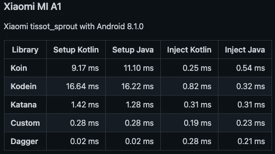

# 匕首/刀柄 vs. Koin for Jetpack 撰写应用程序

> 原文：<https://betterprogramming.pub/dagger-hilt-vs-koin-dependency-injection-for-jetpack-compose-apps-2e598f00aff>

## 匕首和锦鲤的优缺点


mate usz waca wek 在 [Unsplash](https://unsplash.com?utm_source=medium&utm_medium=referral) 上的照片

啊，又来了。匕首/刀柄和锦鲤的永恒斗争。我预计在评论中会有很多关于哪个更好的争论，但是不要担心，这篇文章只是向你展示它们之间的主要区别。它们都很棒，所以你必须自己选择要使用哪一个，但我希望通过向你展示它们对于 Jetpack Compose 应用程序的优缺点，让你的选择更容易一些！

出于本文的目的，我假设你已经知道什么是依赖注入，以及 Dagger/Hilt 和 Koin 之间的主要区别，例如:

*   代码生成与无代码生成
*   对构建时间的影响与对运行时间和注入时间的影响
*   而且显然 Hilt 是谷歌推荐维护的，而 Koin 不是。当然，谷歌并没有说 Koin 不好，并使用你认为更适合你的项目。

以下是 Manuel Vivo 对 Koin 的看法，例如:

> 谷歌推荐 Android 应用程序使用 Hilt，但这只是一个建议！用你觉得对你有好处的。

 [## 嗨！我认为 Koin 也是一个很棒的图书馆。使用你认为更适合你的项目。

### 这两个库各有利弊:

medium.com](https://medium.com/@manuelvicnt/hi-i-think-koin-is-a-great-library-as-well-use-what-you-think-fits-better-to-your-project-885b4992a5b2) 

如果这些听起来都不熟悉，那么你可能应该暂时停止阅读，在继续之前先弄清楚什么是依赖注入、匕首、剑柄和锦鲤。

# 我们走吧

好了，现在让我们比较匕首/刀柄和锦鲤。

为了更好地展示这些工具的优缺点，我将考虑两种使用 Jetpack Compose 编写 Android 应用程序的情况:

*   第一种情况——当你的应用程序是用纯 Jetpack Compose 编写的，也就是说，没有使用片段，所以你可能使用的是[导航组合库](https://developer.android.com/jetpack/compose/navigation)。
*   而第二种情况——当你使用 Fragments 和 ComposeView ( [互操作性](https://developer.android.com/jetpack/compose/interop/interop-apis))，这在我看来是最好的选择(至少目前是这样)，主要是因为糟糕的导航-合成 API 和缺乏类型安全性。这是一个相当大和有争议的话题，但嘿，这是我最喜欢的。一定要查看[我关于这个](https://patrykkosieradzki.medium.com/why-using-navigation-compose-in-your-jetpack-compose-app-is-a-bad-idea-2b16e8751d89)的文章。

# 在你的应用中使用 Hilt 的好处

那么 Hilt 有哪些好的方面呢？

## 喷气背包和支持

首先，Hilt 是 [Jetpack](https://developer.android.com/jetpack) 的一部分，目前，谷歌建议你在安卓应用中使用它。当然，这没什么大不了的，但我必须说，谷歌创造了它，这真的很好，正如你们中的一些人可能知道的那样，使用 Dagger 并不总是像我们希望的那样好和令人愉快——特别是对于刚刚开始学习 Android 中的依赖注入的程序员来说。

## 比匕首更容易实现

第二件事，就像我刚刚提到的，如果你以前用过匕首并且你喜欢它，你会喜欢用刀柄的！

*   像`[@AndroidEntryPoint](https://developer.android.com/training/dependency-injection/hilt-android)` 或`[@HiltViewModel](https://developer.android.com/training/dependency-injection/hilt-android)`这样的新注释使得管理 Android 类中的 DI 代码变得更加容易。
*   使用[为 Android 类](https://developer.android.com/training/dependency-injection/hilt-android#generated-components)生成的组件，如 SingletonComponent、ViewModelComponent 等，创建模块变得不那么复杂了。
*   还有更多！点击查看一切[。](https://developer.android.com/training/dependency-injection/hilt-android)

## 编译时错误

Dagger 和 Hilt 是编译时依赖注入框架。这意味着，如果我们不小心忘记提供一些依赖，或者我们搞砸了一些事情，构建将会失败，我们的应用程序将根本无法运行。

在这种情况下，Koin 会有不同的表现。如你所知，Koin 不生成任何代码，所以如果我们用 DI 搞砸了什么，这个项目无论如何都会构建，但是它会在开始时崩溃或者稍后在某个特定的屏幕上崩溃。

开发人员必须检查应用程序的这个特定部分的依赖关系是否工作良好，应用程序是否崩溃。匕首/刀柄在那种情况下使用要安全得多。

## 测试

下一件大事是测试。当然，编写单元，用户界面，E2E 等等。用匕首测试已经是可能的了，但是我们现在从剑柄上得到的要多得多！忘记复杂的匕首测试。现在您有了`HiltAndroidRule`来管理组件的状态，并更容易地将不同的依赖项注入到测试中。

```
@HiltAndroidTest
class SettingsActivityTest {

  @get:Rule
  var hiltRule = HiltAndroidRule(this)

  // UI tests here.
}
```

您可以轻松地动态替换和模仿依赖项，甚至是整个模块。此外，您可以在一个特殊的测试容器`[launchFragmentInHiltContainer](https://developer.android.com/training/dependency-injection/hilt-testing#launchfragment)`中启动您的片段(如果您正在使用它们的话)。

如果您没有使用片段或者您只想测试可组合的，那么您可以使用`[ComposeTestRule](https://developer.android.com/jetpack/compose/testing)`轻松地做到这一点，在这里您可以将您的视图模型和其他依赖项直接传递给可组合的函数(我的 Github 上的[示例)。也可以在 UI 测试中自动模拟每个 ViewModel，所以测试设置只有几行代码。](https://github.com/k0siara/AndroidMVIExample/blob/master/app/src/androidTest/java/com/patrykkosieradzki/androidmviexample/ui/AddEmployeeScreenTest.kt)

## 过程死亡

有了 Hilt，保护你的应用程序免受进程死亡也容易多了。您可以简单地通过[将](https://developer.android.com/training/dependency-injection/hilt-jetpack#viewmodels) `[**SavedStateHandle**](https://developer.android.com/topic/libraries/architecture/viewmodel-savedstate)`注入到`ViewModel`(这只是一个奇特的 StateHandle 映射)来存储和恢复在进程死亡时需要保存的数据。

# 使用刀柄的缺点

剑柄是否完美无瑕？让我们找出答案。

## 更慢的构建时间

正如你们大多数人可能知道的那样，Hilt 在构建期间会生成一些文件，这意味着应用程序越大，模块、组件和依赖项越多，构建时间就越长，速度就越慢。

## 有时候你必须写匕首代码

虽然使用 Hilt 比使用 Dagger 要容易得多，但有时你仍然需要在应用程序中使用 Dagger 代码。如果你想在你的应用程序中为每个功能创建单独的 android 模块，那么你必须用 Dagger 以一种老式的方式编写一些代码。

首先，您必须创建一个定制的`EntryPoint` 模块，将它组合到组件的构建器中，然后以编程方式将其注入托管该功能的活动或片段中。你可以在这里阅读更多相关信息[。](https://developer.android.com/training/dependency-injection/hilt-multi-module)

## 除了 ViewModel 之外，不能在 Composables 中注入任何东西(至少目前是这样)

对我来说，一个主要的缺陷是，如果你正在编写一个没有片段的只组合的应用程序，除了视图模型之外，你不能将依赖注入到可组合的组件中。

可能你们很多人现在都在想，为什么你们需要这样的东西呢？

首先，这肯定是功能的损失，因为在 Compose 之前，我们能够将依赖注入片段、活动等。现在片段被组合体“取代”,你会认为这个特性应该还在，对吗？

你能给我举些有用的例子吗？

当然可以。这里有几个例子:

*   将 UI 逻辑/工作委托给 Composables 中的其他类，这样您的代码更加可重用和简洁。
*   以不同的方式呈现 UI，基于从 AppConfig 等特定依赖项中获得的数据，或者放入 ViewModel 的逻辑中实际上没有意义的其他东西(因为没有逻辑)。示例:如果我当前处于调试模式，我想在 Composable 中显示附加文本。我在`AppConfig` singleton 中有`isDebug: Boolean` 的值。
*   另一个例子:假设你需要多个线圈图像加载器并且你想在你的一些组件中使用它们。您不能将它们直接注入到可组合参数中，所以您可能必须将它们从活动传递到`NavGraph` ，然后或者通过可组合参数传递或者使用`[CompositionLocalProvider](https://developer.android.com/jetpack/compose/compositionlocal)`。

*这个问题容易解决吗？是的。*

正如我之前告诉你的，我更喜欢使用片段组合，这是我仍然使用它们的另一个原因。你可以在片段中注入依赖关系，然后将它们传递给组件。

如果我想将依赖关系真正深入到可组合树中，该怎么办？

好吧，首先三思如果你真的需要通过它。如果答案仍然是肯定的，那么你可以沿着树向下传递变量，或者你可以考虑使用`[CompositionLocalProvider](https://developer.android.com/jetpack/compose/compositionlocal)`。这需要您编写额外的代码，但这仍然是一个选项。

# 这和 Koin 有什么关系？

先说优点。

## 比匕首和刀柄更容易使用

首先，Koin 的使用和学习肯定比匕首或剑柄简单得多。对于希望学习依赖注入的程序员新手来说，这是一个不错的选择。

## 您可以将依赖关系注入到组件中

与 Dagger 或 Hilt 不同，Koin 允许我们将依赖关系注入到组件中。

例如:

```
[@Composable](http://twitter.com/Composable)
fun SomeComposable(myService: MyService = get()) {
   // ...
}
```

这解决了我之前提到的问题，当我们不使用片段时，这真的很好。

## 更多信息错误日志

如果你以前使用过 Dagger 或 Hilt(尤其是 Dagger ),你可能会注意到它们在日志中没有给出太多关于错误发生的信息，你经常不得不猜测并找出真正的错误。

例如，在某些情况下，Hilt 会告诉你:

> *【剑柄】*

仅此而已。

当然，随着时间的推移，这些问题被修复，你现在会看到更多的信息，但仍然，Koin 赢得了这场战斗，并在错误发生时有更多的信息日志。

## 不生成代码

Koin 根本不会生成任何代码。这意味着你的构建时间会更快。

现在缺点是:

## 更多的 DI 代码，尤其是 get()、get()、get()… get()

正如我之前提到的，Koin 实现起来容易得多，但是它也有代价——更多的代码。每个单例、工厂、视图模型等。你想注入你必须先添加到你的模块。

例如:

```
val appModule = module {
   single { DogRepository(get()) } 

   factory { GetDogUseCase(get()) } viewModel {
      DogDetailsViewModel(get())
   }
}
```

因此，如果你的依赖关系中有很多参数，你的模块可能会像这样结束:

```
val appModule = module {
   single { 
      DogRepository(get(), get(), get(), get(), get())
   } 

   factory { 
      GetDogUseCase(
         repo = get()
         cacheRepo = get(),
         service = get(),
         somethingElse = get()
      ) 
   } viewModel {
      DogDetailsViewModel(
         imagine = get(),
         a = get(),
         lot = get(),
         of = get(),
         dependencies = get(),
         here = get()
      )
   }
}
```

这只是一个视图模型和一个报告/用例。想象一下它在更大的应用程序中会有多糟糕…

## 不使用片段时的 SavedStateHandle 问题

目前，如果你不使用片段并将视图模型直接注入到组件中，就不可能将`SavedStateHandle`注入到视图模型中。如果你试图这样做，你会得到一个错误。这个问题应该很快就会得到解决，但是如果您想在进程死亡的情况下保留屏幕状态，这是您必须考虑的问题。

## 对运行时性能的影响

正如我之前提到的，由于代码生成，匕首/剑柄对构建时间有很大的影响。另一方面，Koin 也影响时间，但不是构建，而是运行时。Koin 的运行时性能稍差，因为它在运行时解析依赖关系。



来源:[https://github . com/Sloy/Android-dependence-injection-performance](https://github.com/Sloy/android-dependency-injection-performance)

你可以在这里找到所有的结果:

[](https://github.com/Sloy/android-dependency-injection-performance#xiaomi-mi-a1) [## GitHub-Sloy/Android-dependency-injection-performance:[未维护]测量…的性能

### 这个项目旨在测量几个依赖注入框架(或服务定位器)在…

github.com](https://github.com/Sloy/android-dependency-injection-performance#xiaomi-mi-a1) 

# 摘要

那么你应该选择使用哪种 DI 呢？你得自己决定。我必须承认我不是匕首的超级粉丝(抱歉匕首爱好者)，但我仍然会建议学习它。

说到底，不是哪一个更好，而是哪一个能让你写出易于测试和维护的干净代码。我在之前的几个项目中使用了所有的剑(匕首，剑柄，锦鲤),我认为所有的剑(尤其是剑柄和锦鲤)都符合这个标准。

查看我的其他文章:

*   [为什么在你的 Jetpack 撰写应用程序中使用导航撰写不是一个好主意](https://patrykkosieradzki.medium.com/why-using-navigation-compose-in-your-jetpack-compose-app-is-a-bad-idea-2b16e8751d89)
*   [MVVM 和 MVI 架构中的 LiveData vs SharedFlow 和 StateFlow](https://proandroiddev.com/livedata-vs-sharedflow-and-stateflow-in-mvvm-and-mvi-architecture-57aad108816d)
*   [在 Android 上进行简单的用户界面和屏幕截图测试](https://proandroiddev.com/easy-ui-and-screenshot-testing-on-android-2b138f6d1eb8)

此外，如果你是一个波兰人，你可以听听我的“Android Talks”播客: