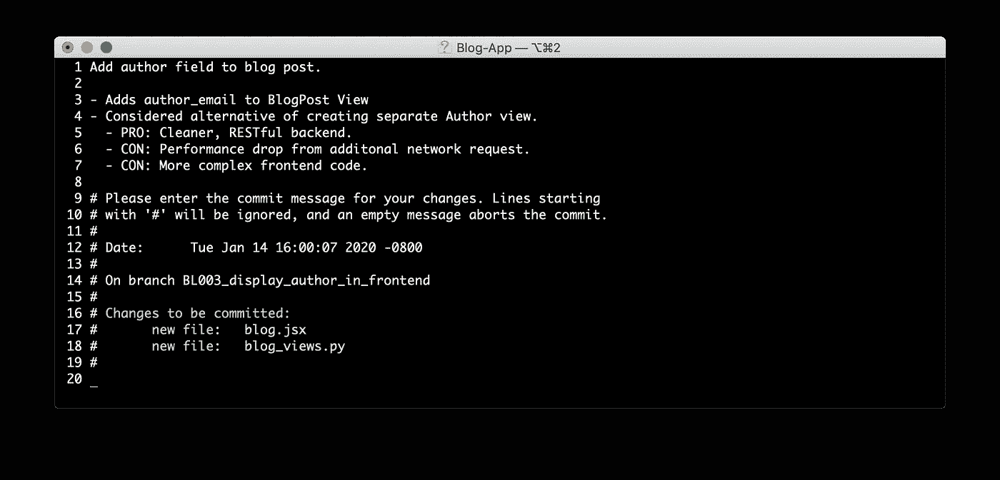
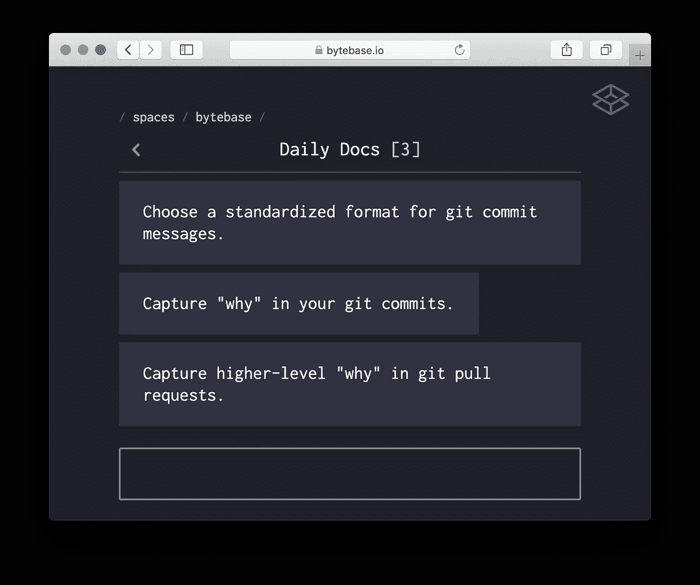
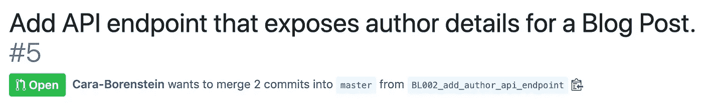
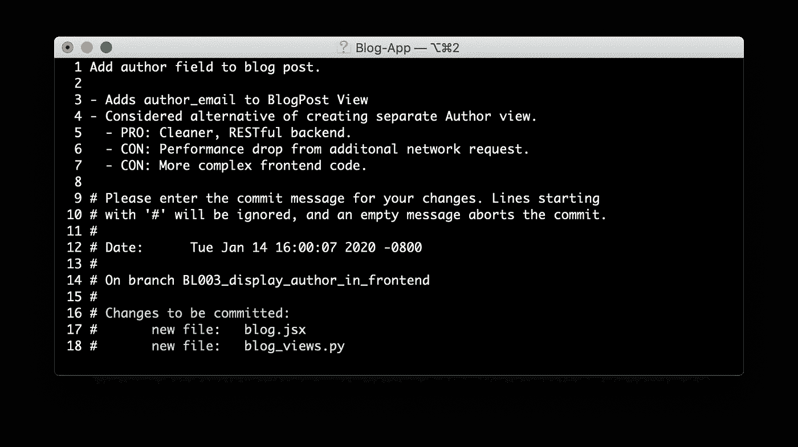
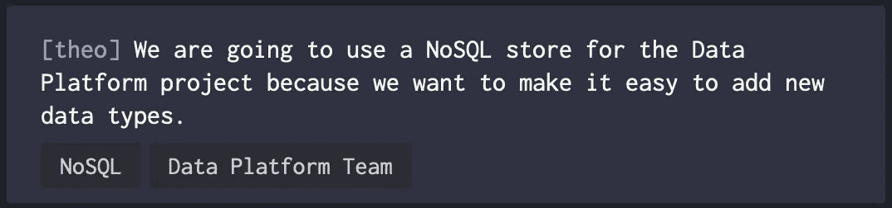
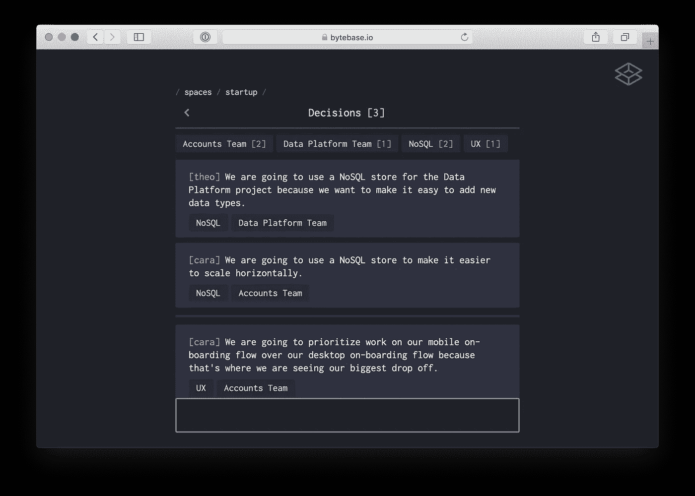
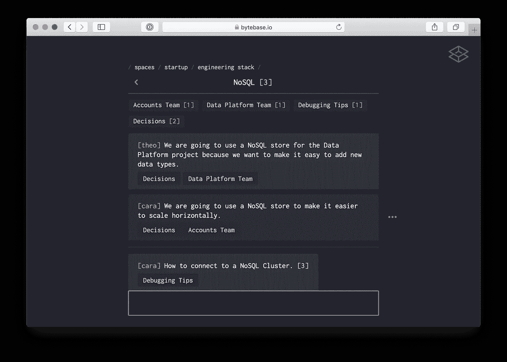

# 将您的 Git 历史转化为有价值的文档的日常习惯

> 原文：<https://betterprogramming.pub/daily-habits-to-turn-your-git-history-into-valuable-documentation-15113e1bf312>

## 你的文档不需要彻底检查——你的习惯需要

Git 提交消息中的“为什么”文档

作为工程师，我们每天都在编写和提交代码。我们引入的每一行代码只是软件系统的一小部分，很可能比我们提交的特定代码更持久。我们的目标不仅仅是今天发布代码，而是让团队为将来成功添加和维护软件系统做好准备。

让团队为未来做好准备意味着通过遵循[最佳实践](https://dev.to/collinstommy/your-code-should-tell-a-story-tips-for-writing-code-for-others-to-read-6gi)如描述性变量名和封装复杂性，使我们的代码易于理解。这也意味着通过记录引导我们构建的思维过程，使我们的软件系统易于理解。

在本系列的[第 1 部分](https://medium.com/better-programming/the-importance-of-why-docs-c8ffba0ea520)中，我们讨论了“为什么”文档如何减少停机、节省时间，并使我们的团队能够构建得更好。

在这篇文章中，我们将介绍如何使用 Git 和 [Bytebase](https://medium.com/better-programming/the-importance-of-why-docs-c8ffba0ea520) 将“为什么”文档作为常规构建程序的一部分。

每日 Git 练习，带着自信和同理心快速行动

# 选择 Git 提交消息的标准化格式

当团队在他们的 Git 提交消息中不遵循标准格式时，他们正在证明他们不关心他们的 Git 历史。

下面的 Git 历史只有正在进行的提交。它没有任何关于我们所做的改变或原因的描述。

你不希望你的历史看起来

工程师通常会放弃在提交消息中添加有价值的信息。当试图理解过去的发展时，这种损失将花费时间和挫折。

制定并遵守标准是向您的团队表明 Git 历史很有价值的第一步。

## 破窗理论

犯罪学中的破窗理论认为

> "如果建筑物的一扇窗户被打破而不修理，其余的窗户很快也会被打破。"—经由[大西洋](https://www.theatlantic.com/magazine/archive/1982/03/broken-windows/304465/)

让一扇窗户破掉，业主们就表示他们不关心这栋建筑。因此，该建筑很可能成为其他破坏行为和犯罪的受害者。

相反，如果业主迅速修好了破损的窗户，他们就表明他们确实关心这栋建筑——居民也应该如此。

## 修复 Git 提交消息中破碎的窗口。

我们通过要求消息总是遵循标准化的格式，将破窗理论应用于 Git 提交消息。这设定了 Git 历史应该被投资和关心的期望。

我们建议每封邮件以动词开始，用现在时，以句号结束。

遵循标准的 Git 提交消息

**提示**:用命令`git commit — amend` *更新最新的 Git 提交消息。*用`git rebase -i HEAD~n` *更新任何提交消息。*

—通过 [GitHub](https://help.github.com/en/github/committing-changes-to-your-project/changing-a-commit-message)

用于修改现有 Git 提交消息的接口。

# 在 Git 提交中捕捉“为什么”

你的代码告诉其他工程师你的代码是如何工作的。但是对于工程师来说，理解你的代码为什么这样工作也是很有价值的。Git commit 消息是在特定时刻记录特定约束的好地方，因为它与直接影响它的代码行一起提供。

将“为什么”附加到您的代码中，可以增强您的团队的信心和同理心。

## 信心

在本系列的第 1 部分中，我们探讨了知识不足如何导致盲目采用。女孩和鱼的寓言说明了没有抓住“为什么”的后果在这个寓言中，当最初的约束不再成立时，一个家庭盲目地将食谱代代相传，而不去适应。

通过捕获提交中的“为什么”,包括影响您工作的约束，您可以帮助未来的工程师做出更好的选择。“为什么”文档让未来的工程师深入了解您的构建过程。有了对软件系统的这种更强的理解，未来的工程师在构建时可以有更多的信心。

## 神入

在你的提交中抓住“为什么”,在你的团队中产生共鸣。

> “[好医生]创造一个环境，让人们在更改软件时感到有指导和安全，尤其是团队的新成员。”
> 
> —Birgitta b ckeler via[ThoughtWorks](https://www.thoughtworks.com/insights/blog/four-goals-agile-documentation-part-two)

通过捕捉进入你工作的非显而易见的思维过程，你创造了一个鼓励提问的环境，而不是孤立地埋头苦干。您为工程师在构建时应该拥有的上下文数量设定了一个期望值，这样当缺少信息时，他们就有权要求更多的信息。

## “为什么”提交消息

要为您的团队成员提供代码所需的上下文，请在编写提交消息时考虑以下问题:

> “编码时存在哪些限制？
> 
> 我还考虑了哪些方法？
> 
> 如果我在几个月/几年后读到这篇文章，我想知道什么？"
> 
> —Greggory Roth Meier via[ruby conf 2018](https://confreaks.tv/videos/rubyconf2018-documentation-tradeoffs-and-why-good-commits-matter)

# 在 Git 拉取请求中获取更高层次的“为什么”

Git 提交消息是捕捉与一小段代码直接相关的“为什么”的好地方。但是一个特性通常不仅仅是一个提交。

每个特性往往包括一组提交，组合成一个或多个来自分支的拉请求。特性实现有自己的一套假设和自己的“为什么”

我们喜欢在拉式请求描述中捕捉这个更高层次的“为什么”。

在 Bytebase，我们的公关描述包括:

*   什么变了
*   任何影响我们工作的限制
*   我们接受的相关权衡
*   在这一系列工作中，还有什么下一步要做的吗
*   您手动测试了什么
*   如果用户界面受到影响，屏幕截图
*   对评论者有任何问题吗

# 超越 Git 组织“为什么”

Git 提交消息和拉请求描述是在它描述的代码附近添加“为什么”的好方法。

有时我们需要在更高的层次上理解“为什么”。例如，我可能会有这样的问题— *为什么我们决定在这个项目中使用 NoSQL 而不是 SQL？*

在这种情况下,“为什么”最好是在项目级别捕获。这就是我们为之构建 Bytebase 的用例类型。

Bytebase 是一个协作笔记的网络应用，其中每个笔记都是一个短的*字节。*对于每个项目级别的“为什么”，您可以在 Bytebase 中创建一个字节:

一个字节，用于捕获使用 NoSQL 存储的“原因”

然后，您可以将每个字节添加到相关的集合中，比如“决策”，以便以后容易找到它们。

Bytebase 中捕获的决策和“为什么”

您可以查看与您最相关的不同字节子集。下面，我们来看看我们存储的与 NoSQL 相关的所有字节。

来自我们工作区的所有 NoSQL 背景

# 你不需要大修。

我们多次听到工程师说他们需要着手改革他们的文档。我们同意文档对于团队协作是必不可少的，但是我们发现解决方案比团队期望的要简单。正如在我们的个人生活中，最有效的改变是小习惯的改变，而不是彻底的改变——我们的文件也是如此。

通过养成在 Git 和 Bytebase 中定期记录“为什么”的小习惯，您的团队可以实现更好的持久合作。