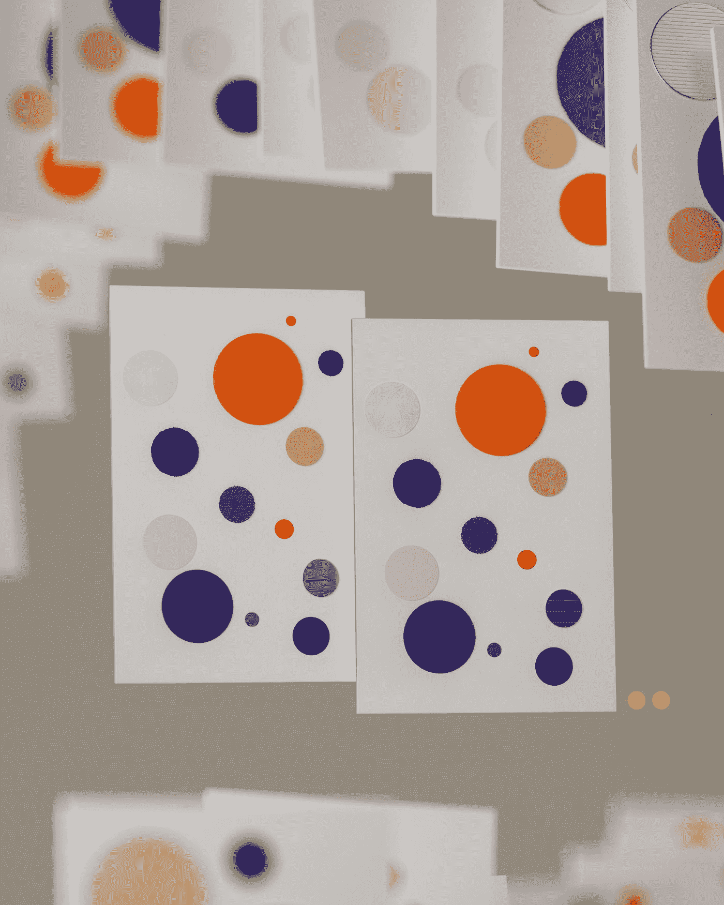
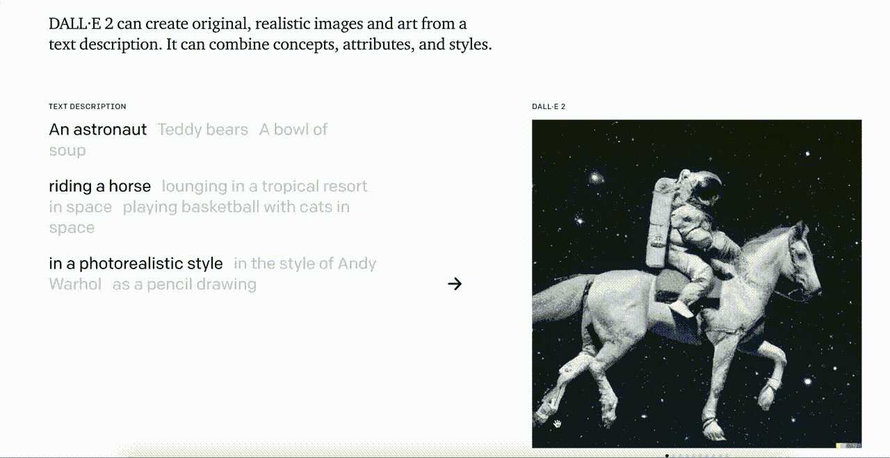
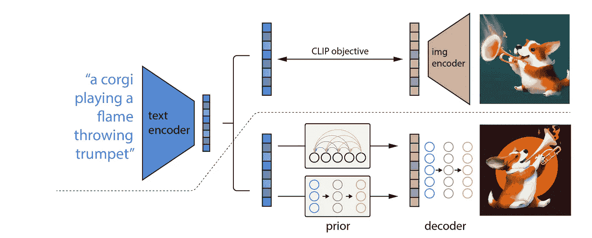
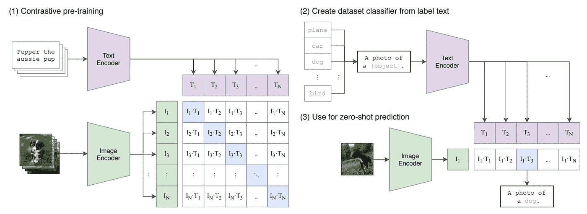
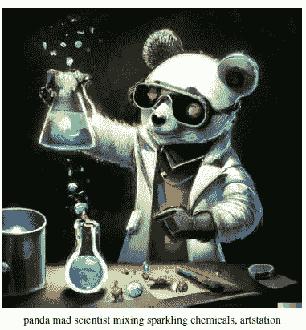
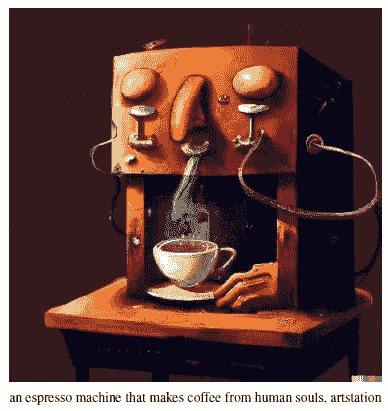
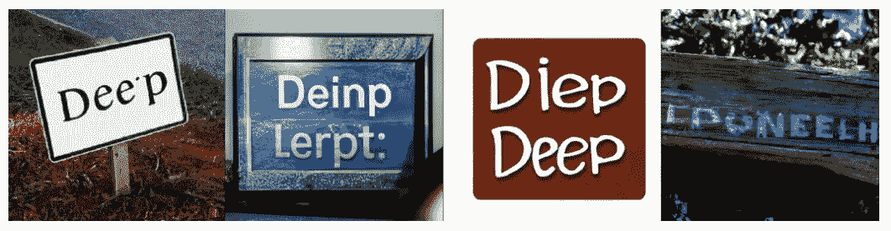
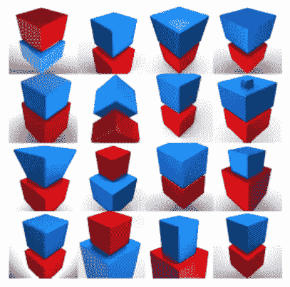

# DALL-E 2 的初步研究——它是如何在引擎盖下工作的

> 原文：<https://betterprogramming.pub/dall-e-2-and-why-everyone-is-talking-about-it-baae2e41655e>

## 知道为什么每个人都在谈论它吗

照片由 [DeepMind](https://unsplash.com/@deepmind?utm_source=medium&utm_medium=referral) 在 [Unsplash](https://unsplash.com?utm_source=medium&utm_medium=referral) 上拍摄

OpenAI 发布了他们期待已久的模型 DALL-E 2，它正在各地创造头条新闻。像[马克斯·布朗利](https://www.youtube.com/watch?v=yCBEumeXY4A)和 [Vox 工作室](https://www.youtube.com/watch?v=SVcsDDABEkM)这样的大型 YouTube 频道现在也在制作关于它的视频。因此，在这篇文章中，我们将探讨什么是 Dall -E2，它的特别之处，以及为什么每个人都在谈论它。

# **什么是 DALL-E 2？**

Dall-E 2 是 Open AI 的 Dall-E 模型的继任者。Dall-E 这个名字是瓦力(皮克斯的科幻电影)和萨瓦尔多·达利(西班牙艺术家，以其绘画中的超现实主义风格而闻名)的组合。该模型用于从给定的文本描述中生成真实感图像。

这个模型还没有对公众开放，但是开放人工智能团队已经在他们的[网站](https://openai.com/dall-e-2/#demos)上做了一个不错的演示。正如你所看到的，这些图像是艺术家/图形设计师需要几个小时甚至几天才能制作出来的，但 DALL-E2 在几分钟内就完成了，它制作的图像令人印象深刻。它会捕捉提示的所有重要特征，并尝试将它们融入图像中。

Dall-E 2 演示

受够了这些令人印象深刻的结果，让我们看看引擎盖下是什么，看看我们如何能够生成这些图像。幸运的是，开放 AI 团队还发布了 DALL-E2 背后的[论文](https://arxiv.org/pdf/2204.06125.pdf)，让我们独家了解了 DALL-E2 的训练过程。DALL-E2 包括两个模型剪辑和扩散模型。给定标题(在图 2 中虚线上方示出)和扩散模型(在虚线下方示出), CLIP 用于生成剪辑文本嵌入，该扩散模型首先使用扩散先验生成给定剪辑文本嵌入的图像嵌入。然后，使用扩散解码器对该图像嵌入进行解码，以生成最终图像。

图 2 DALL-E2 培训流程

这些术语听起来可能很复杂，但是它们背后的概念很容易理解。因此，为了了解更多，让我们更深入一些。

# **什么是剪辑？**

剪辑概述

2021 年 1 月，这个片段和最初的 DALL-E [论文](https://arxiv.org/abs/2103.00020)一起发布。CLIP 代表对比学习图像预训练。CLIP 背后的基本思想是将图像和文本作为输入，并尝试将它们连接起来。这是通过使用图像编码器(Resnet/ViT)生成图像嵌入和文本编码器(Transformer)生成文本嵌入来实现的。

> 基于这些嵌入，我们试图以对比的方式学习哪个图像嵌入对应于哪个文本嵌入。更简单地说，我们尝试最小化图像嵌入和文本嵌入的正确匹配的点积，并尝试最大化图像和文本嵌入的所有不正确组合的点积。

在运行推理之前，我们从概述的第 2 阶段中表示的数据集生成文本提示。这些文本提示是根据数据集的标签生成的简单提示。使用提示背后的想法是它们将包含比标签更多的信息。并且在推断期间，当给定图像时，编码器生成图像嵌入，并且模型试图预测数据集中哪个文本提示最接近该图像嵌入。

文本嵌入和图像嵌入的这种互连是 DALL-E2 能够基于文本描述来处理这种图像的原因之一。

## **什么是扩散模型？**

扩散模型是一种新的生成模型，在[图像合成和照片真实感任务](https://proceedings.neurips.cc/paper/2021/file/49ad23d1ec9fa4bd8d77d02681df5cfa-Paper.pdf)中优于 GANs。惊喜，惊喜他们也是来自 Open AI。

扩散模型如何工作

这些扩散模型通过在每个阶段向现有图像添加极小的噪声来工作。如果我们做这一步，无数次我们可以安全地假设，在这些步骤之后，我们将只剩下噪音。这些扩散模型的任务是通过反转这个噪声添加过程来提取图像。

DALL-E2 使用剪辑生成的文本嵌入，并在它之前添加一个，以将其转换为图像嵌入。这种嵌入然后被馈送到扩散解码器，以产生那些令人印象深刻的图像。

## **结果**

关于技术的讨论已经够多了，现在让我们来看一些图片:

哇，多么像熊猫疯狂科学家的形象啊。更值得称赞的是，DALL-E2 还可以理解反射，因为我们可以在眼镜上看到绿色。

这也是一个用人类灵魂制作咖啡的抽象概念的令人印象深刻的形象。DALL-E2 知道什么是咖啡机，咖啡应该从哪里出来，它也知道人类的灵魂应该是什么样子。这简直令人难以置信！！

这些结果基本上是 OpenAI 精心挑选的，以显示最佳的吸引人的结果。然而，这些结果将图像生成的边界从文本描述推向了极致。真的很好奇未来几年我们会在这个领域看到什么型号。

## 会有达尔-E3 吗？

DALL-E2 虽然令人印象深刻，但仍有许多缺点。

## **拼写错误**

作为一个在图像和文本上训练的数十亿参数模型，DALL-E2 在拼写上犯错误是非常有趣的。这些图像是由 DALL-E2 的用户生成的。下图显示了 DALL-E2 在给出提示“一个表示深度学习的标志”时生成的图像。

“一个写着深度学习的标志。”信用: [OpenAI](https://arxiv.org/abs/2204.06125)

## **关系**

基于 Open AI 向我们展示的精选结果，DALL-E2 被证明对对象之间的关系有很好的理解。然而，有时它只是混淆了简单的提示，如“蓝色立方体上的红色立方体”。

"蓝色立方体上的红色立方体."信用: [OpenAI](https://arxiv.org/abs/2204.06125)

我不想破坏 DALL-E2 的结果，它们产生的结果令人印象深刻。然而，他们的失败案例仍然很明显。这些缺点使得我们极有可能在不久的将来看到达尔-E3。

# **为什么每个人都在谈论它？**

DALL-E2 是镇上的话题，因为结果令人印象深刻，流行的媒体都在谈论它。然而，大家提出的问题是“DALL-E2 是艺术家/平面设计师的终结吗？”YouTubers 现在可以从 DALL-E2 制作他们的缩略图了，他们不需要图形设计师了。

虽然这些问题是有关的，但我认为这些是无效的。在艺术这样的抽象技能方面，机器永远不会像人一样好。艺术家经常为提出一个开始的想法而挣扎。DALL-E2 可以作为一个很好的起点，艺术家/平面设计师可以在以后修改它，使它变得更好。

# 结论

DALL-E2 的结果令人印象深刻，他们将通过文本生成图像的界限推到了极致。有了这些研究，我们应该始终关注这些研究在未来 2-3 年内会带来什么。很难想象最初的 AlexNet 论文仅仅在 10 年前出现，而现在在计算机视觉架构中广泛使用的 ResNet 仅仅在 6 年前出现。没有其他研究领域像深度学习领域发展得那么快，我对未来几年的最新发展水平感到非常兴奋。