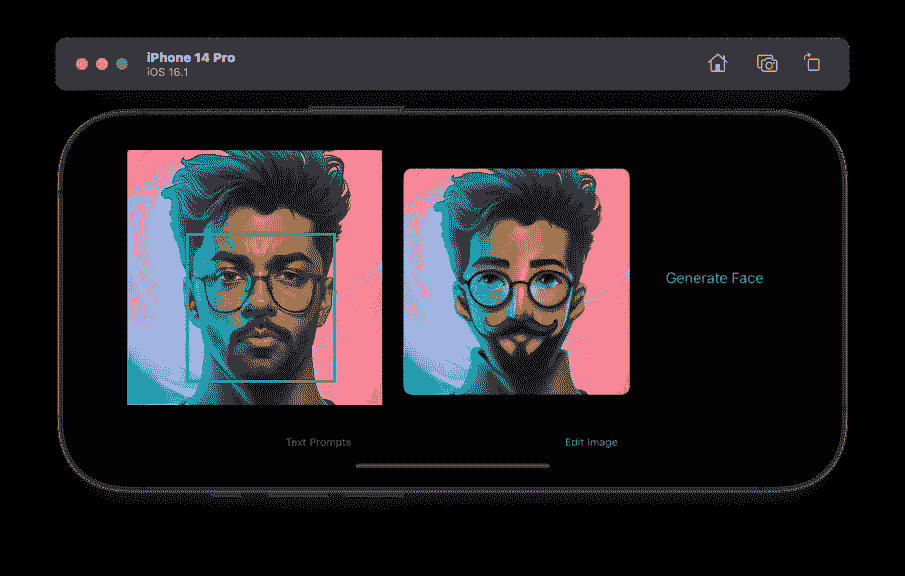
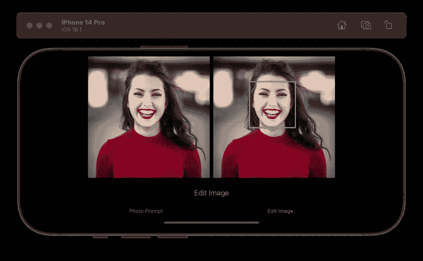
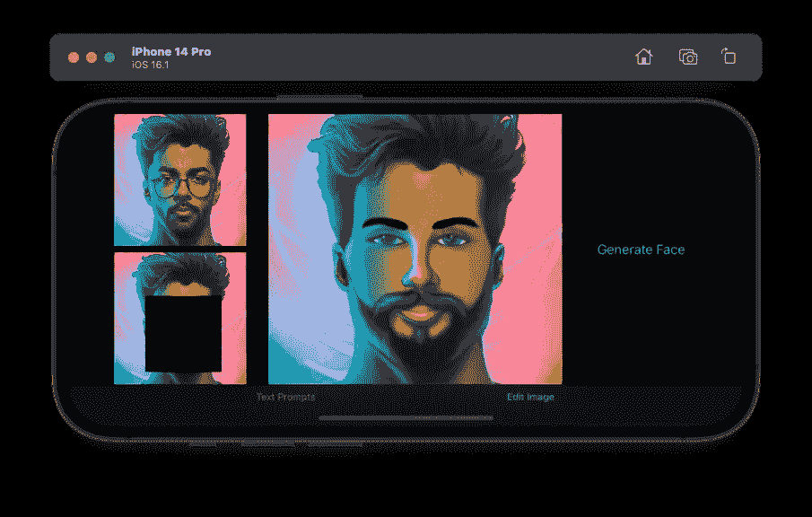
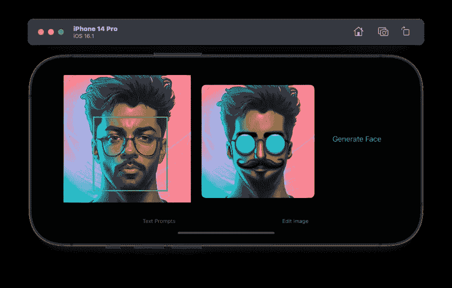
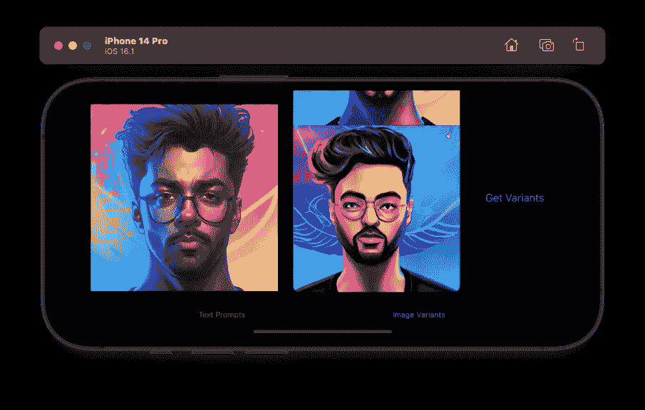

# 如何在 Swift 中使用 DALL-E API——Swift ui 中的图像生成

> 原文：<https://betterprogramming.pub/dall-e-api-in-swift-generate-faces-e39a2625a5a2>

## 构建一个 SwiftUI 应用程序，使用 OpenAI 的 API 编辑现有图像中的人脸。我们将使用视觉人脸检测请求来屏蔽人脸



我记得我试图找出如何快速将 DALL-E API 集成到我的 SwiftUI 项目中。OpenAI 没有为 Swift 提供文档，使用`URLSession`的多部分数据请求是一个痛点。

我决定接受这个挑战，使用基于`async/await`的 URLSession APIs 来上传图片。同时，我利用 SwiftUI 的`AsyncImage`下载图片。

但这还不是全部。我还想使用视觉框架的人脸检测请求，使用`CoreGraphics`裁剪出人脸矩形，并最终使用 OpenAI 的编辑图像 API 生成新的矩形，就像人脸交换应用程序一样。

尽管还不能投入生产，但通过优化和设计改进，这种概念验证的潜力是无限的。

# 入门指南

OpenAI 团队最近在公开测试版中推出了 DALL-E API。在撰写本文时，以下三个 API 端点是可用的:

*   `/generations` —从文本提示生成图像
*   `/edits` —根据文本提示，通过遮蔽区域来编辑原始图像
*   `/variations` —生成图像的变体

通过在参数`n`(默认为 1)中传递所需的数字，我们可以在单个 API 响应中生成 1-10 个图像。除此之外，它们的`size`可以设置为`256x256`、`512x512`或`1024x1024`(默认)。

要更深入地研究 API 并了解它们的 Python 和 Node.js 实现，请阅读 OpenAI 的参考指南[这里](https://beta.openai.com/docs/api-reference/images)。我们将使用 CURL 实现在 Swift 中构建我们的`URLRequest`。当你这么做的时候，一定要从他们的[控制台](https://beta.openai.com/account/api-keys)生成你的 OpenAI API 密匙。我们将需要它来使用 Swift 运行我们的应用程序。

# 我的过程

下面是构建基于 OpenAI 的 SwiftUI 应用程序的过程:

*   创建一个 SwiftUI TabView，其内容跨越两个选项卡来运行不同的 API，即`generation`和`edits`。
*   利用视觉框架的`VNDetectFaceRectanglesRequest`来检测人脸并将其裁剪掉，从而为`/edits`端点生成一个遮罩图像。
*   使用 Swift 的`URLSession`和 async/await 来运行我们的 API 请求。我们将准备一个`MultipartFormDataRequest`来通过多部分/表单数据请求上传图像数据。

让我们从为 URL 端点构建一个 Swift enum 开始。代码如下:

```
enum OpenAIEndpoint: String{

    private var baseURL: String { return "https://api.openai.com/v1/images/" }

    case generations
    case edits

    var url: URL {
            guard let url = URL(string: baseURL) else {
                preconditionFailure("The url is not valid")
            }
            return url.appendingPathComponent(self.rawValue)
    }
}
```

在下一节中，我们将遍历代码，通过文本提示生成图像。

# 在 Swift 中调用 OpenAI Generations API

让我们设置一个`ObservableObject`类来从 API 获取故事，并将它们传递给 SwiftUI 接口:

```
class OpenAIService: ObservableObject{

    let api_key_free = "<INSERT_API_KEY_HERE>"

    func generateImage(from prompt: String) async throws -> [Photo]{
        var request = URLRequest(url: OpenAIEndpoint.generations.url)
        request.setValue("Bearer \(api_key_free)", forHTTPHeaderField: "Authorization")
        request.setValue("application/json", forHTTPHeaderField: "Content-Type")
        request.httpMethod = "POST"

        let parameters: [String: Any] = [
            "prompt": prompt,
            "n": 1,
            "size": "256x256"
        ]

        let jsonData = try? JSONSerialization.data(withJSONObject: parameters)

        request.httpBody = jsonData

        let (data, response) = try await URLSession.shared.data(for: request)
        let dalleResponse = try? JSONDecoder().decode(DALLEResponse.self, from: data)

        return dalleResponse?.data ?? []

    }
}
```

上面的代码片段中发生了大量的事情，所以让我们来分解一下:

*   我们用`async throws`标记了`generateImage`函数，以便在 URLSession 中使用新的 async/await 语法(并跳过完成处理程序)。
*   我们的`URLRequest`由两个头字段和一个 JSON 主体组成。
*   我们获取数据，并使用`JSONDecoder()`将其解码为`DALLEResponse`结构。`DALLEResponse`的数据字段保存一个 URL 字符串数组。我们最终将这个数组作为`[Photo]`返回，以填充 SwiftUI 中一个或多个`AsyncImage`的列表。

这里看一下我们的`DALLEResponse`结构:

```
struct DALLEResponse: Decodable {
    let created: Int
    let data: [Photo]
}

struct Photo: Decodable {
    let url: String
}
```

最后，我们将构建我们的 SwiftUI 视图，它由一个`AsyncImage`、一个`TextField`和一个`Button`组成:

```
struct ContentView: View {

    @ObservedObject var fetcher = OpenAIService()
    @State var photos : [Photo] = []
    @State private var textPrompt: String = ""

    var body: some View {
        VStack {

            List {
               ForEach(photos, id: \.url) { photo in

                   AsyncImage(url: URL(string: photo.url)) { image in
                               image
                                   .resizable()
                                   .aspectRatio(contentMode: .fit)
                           } placeholder: {
                               Image(systemName: "photo.fill")
                           }.frame(maxWidth: .infinity, maxHeight: 500)
                       .listRowInsets(.init(.zero))
               }
            }

            TextField("Enter the prompt", text: $textPrompt)
                        .textFieldStyle(RoundedTextFieldStyle())
                        .padding()

            Button(action: runOpenAIGeneration, label: {Text("Generate Text From Prompt")})
        }
        .padding()
    }

    func runOpenAIGeneration(){
        Task{
            do{
                self.photos = try await fetcher.generateImage(from: textPrompt)
            }catch(let error){
                print(error)
            }
        }
    }
}
```

在上面的代码中，`runOpenAIGeneration`动作执行`URLSession`任务，并在`AsyncImage`中显示图像列表。

# 使用 OpenAI 编辑图像 API 和视觉框架生成人脸

编辑原始图像和创建输出的能力是更有趣的 API(我认为！).从交换面孔到生成不同的时尚服装，我们可以通过屏蔽图像中的区域并使用提示来描述新图像来做很多事情。

在这一节中，我们将使用`Vision`框架来运行一个人脸检测请求，在检测到的人脸上绘制边界框，擦除该区域以使用核心图形创建一个蒙版图像，并运行多部分请求来生成一个新图像。

让我们从设置我们的愿景请求开始。

## 设置视觉人脸检测器请求

下面是启动和执行一个`VNDetectFaceRectanglesRequest`的代码:

```
class VisionRequester: ObservableObject{

    @Published var maskedImage: UIImage?
    //1 - @Published
    var faceRect: VNFaceObservation?

    func maskFaceUsingVisionRequest(inputImage: UIImage){

        let request = VNDetectFaceRectanglesRequest()
        let handler = VNImageRequestHandler(cgImage: inputImage.cgImage!, options: [:])
        Task{
          do{
              try handler.perform([request])

              guard let results = request.results else {return}
              faceRect = results.first //2
              guard let faceRect else {return}

              //3 - convert bounding boxes to UIKit coordinate system and erase face.

          }catch{
              print(error)
          }
        }
    }
}
```

上述代码中发生了相当多的事情！为了确保`handler.perform`函数不会阻塞主线程，我将它包装在一个`Task`中。

我已经注释掉了`faceRect`上的`@Published`属性包装器。但是理想情况下，您可以使用它来观察 SwiftUI 视图中的变化，并绘制具有`overlay`和`Rectangle`形状的边界框(在将视觉坐标转换到 SwiftUI 系统之后)，如下所示:

```
.overlay{
     Rectangle()
     .stroke(Color.green,lineWidth: 3.0)
     .frame(width: rect.width, height: rect.height)
     .position(x: rect.midX, y: rect.midY)                                          
 }
```



这既快速又简单，虽然您需要一个`CGSizePreferenceKey`来监听图像大小变化(方向变化)并重新绘制边界框，但解决方案与问题无关。我们的问题陈述要求将屏蔽的图像上传到`/edits`端点。是的，可以使用反向`mask`修改器，裁剪出矩形，并将 SwiftUI 视图转换成 UIImage。然而，我们将坚持使用 ObservableObject 并生成一个屏蔽的`UIImage`，而不是在 SwiftUI 视图界面中执行繁重的任务

因此，我们有了输入图像，并从视觉请求中检索到了`VNFaceObservation`结果。在我们开始裁剪和创建蒙版图像之前，让我们将视觉坐标转换到 UIKit 系统。

由于视觉坐标是标准化的(这意味着左下角是原点)并且独立于屏幕分辨率，我们将使用以下代码转换和缩放该框:

```
func getBoundingBoxes(rect : VNFaceObservation, on imageSize: CGSize) -> CGRect {

        let transform = CGAffineTransform(scaleX: 1, y: -1).translatedBy(x: 0, y: -imageSize.height)
        let scale = CGAffineTransform.identity.scaledBy(x: imageSize.width, y: imageSize.height)

        let bounds = rect.boundingBox.applying(scale).applying(transform)

        return bounds

}
```

# 使用 CoreGraphics 从 UIImage 中擦除零件

下面是从图像中剪切出边界框并用透明区域替换它的代码:

```
func erase(region: CGRect, from image: UIImage) -> UIImage? {
        UIGraphicsBeginImageContext(image.size)
        image.draw(at: CGPoint.zero)
        let context = UIGraphicsGetCurrentContext()!
        let bez = UIBezierPath(rect: region)
        context.addPath(bez.cgPath)
        context.clip()
        context.clear(CGRect(x:0,y:0,width: image.size.width,height: image.size.height))
        let newImage = UIGraphicsGetImageFromCurrentImageContext()
        UIGraphicsEndImageContext()

        return newImage
}
```

`context.clip()`将绘图限制在所提供的`UIBezierPath`内的区域。因此，通过在下一行设置`context.clear`，我们要求 CoreGraphics 将边界框内的部分标记为透明。

我们更新后的`maskFaceUsingVisionRequest`函数如下所示:

```
func maskFaceUsingVisionRequest(inputImage: UIImage){

        let request = VNDetectFaceRectanglesRequest()
        let handler = VNImageRequestHandler(cgImage: inputImage.cgImage!, options: [:])

        Task{

            do{
                try handler.perform([request])

                guard let results = request.results else {return}
                faceRect = results.first
                guard let faceRect else {return}

                let box = getBoundingBoxes(rect: faceRect, on: inputImage.size)

                await MainActor.run{
                    self.maskedImage = erase(region: box, from: inputImage)
                }

            }catch{
                print(error)
            }
        }
}
```

由于`maskedImage`是一个`Published`属性，它需要从主线程更新。遵循最新的 Swift 5.5 并发实践，我们将其包装在`MainActor.run`中。由于`MainActor.run`是一个异步函数，我们将其标记为`await`。

一切就绪！我们已经成功生成了一个屏蔽图像。是时候运行我们的 DALL-E API 了！

# 使用 URLSession 将图像上传到 OpenAI DALL-E API

API 要求图像为方形，小于<4MB, with the masked image having an alpha channel.

Here’s the code to execute our network request using async/await:

```
func generateEditedImage(from image: UIImage, with mask: UIImage) async throws -> [Photo]  {

        guard let imageData = image.pngData() else{return []}
        guard let maskData = mask.pngData() else{return []}

        let formFields: [String: String] = [
            "prompt": "A woman wearing a red dress with an angry face",
            "size": "256x256"
        ]

        let multipart = MultipartFormDataRequest(url: OpenAIEndpoint.edits.url)
        multipart.addDataField(fieldName:  "image", fileName: "image.png", data: imageData, mimeType: "image/png")
        multipart.addDataField(fieldName:  "mask", fileName: "mask.png", data: maskData, mimeType: "image/png")

        for (key, value) in formFields {
            multipart.addTextField(named: key, value: value)
        }

        var request = multipart.asURLRequest()
        request.setValue("Bearer \(api_key_free)", forHTTPHeaderField: "Authorization")

        let (data, response) = try await URLSession.shared.data(for: request)

        let dalleResponse = try? JSONDecoder().decode(DALLEResponse.self, from: data)

        return dalleResponse?.data ?? []

}
```

**注**:相关字段`mask`和`image`只能上传 PNG 数据。

`[MultiPartFormDataRequest](https://github.com/anupamchugh/SwiftUIDallEAPI/blob/main/SwiftUIDallEAPI/MultipartFormDataRequest.swift)`结构用于准备一个包含`boundary`、`Content-Disposation`和其他有趣内容的多部分请求。查看 [Donny Wals 使用](https://www.donnywals.com/uploading-images-and-forms-to-a-server-using-urlsession/) `[URLSession](https://www.donnywals.com/uploading-images-and-forms-to-a-server-using-urlsession/)` [指南](https://www.donnywals.com/uploading-images-and-forms-to-a-server-using-urlsession/)将图像和表单上传到服务器，了解构建多部分表单数据请求的复杂性。

上传图像和表单数据的`URLRequest`准备就绪后，我们将通过以下方式从 SwiftUI 视图中调用`generateEditedImage`函数:

```
 struct EditImageView: View {

    @StateObject var visionProcessing  = VisionRequester()
    @StateObject var fetcher = OpenAIService()
    @State var inputImage : UIImage = UIImage(named: "sample")!

    var body: some View {

      //....

      if let outputImage = self.visionProcessing.maskedImage{
        Image(uiImage: outputImage)
            .resizable()
            .aspectRatio(contentMode:.fit)
            .onReceive(self.visionProcessing.$maskedImage,
                       perform: { updated in
                if let _ = updated?.size{
                    Task{
                        do{
                            self.photos = try await fetcher.generateEditedImage(from: inputImage, with: outputImage)
                        }catch(let error){
                            print(error)
                        }
                    }
                }
            })
      }

      //....

    }

}
```

运行项目时，您应该会看到生成的面:



提示:一个长胡子的家伙



一个留着胡子戴着蓝色眼镜的男孩

本教程到此结束。该项目在我的 [GitHub 资源库](https://github.com/anupamchugh/SwiftUIDallEAPI)中可用。尝试在一张集体照中反复遮罩多张脸。

或者，您可以测试我们的`variations`端点来生成输入图像的变体。相当不错的结果，没有传递一个屏蔽的图像或提示生成脸:



感谢阅读。