# 从 DALL-E 到 3D:如何将你的艺术作品转化为 3D 网格

> 原文：<https://betterprogramming.pub/dall-e-to-3d-how-to-turn-your-generative-art-into-3d-meshes-3ca086dc0b0c>

## 使用机器学习生成酷酷的 3D 网格

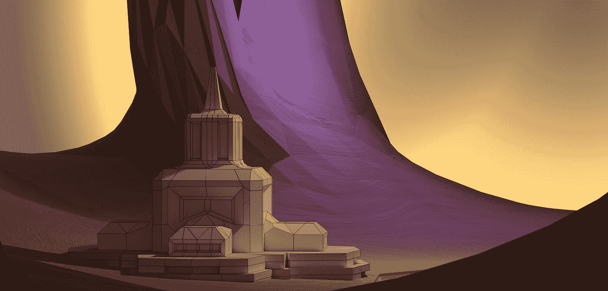

布莱希特·科尔贝尔在 [Unsplash](https://unsplash.com?utm_source=medium&utm_medium=referral) 上拍摄的照片

这些天，用深度学习模型生成图像的做法在 Twitter 上到处都是。无论是 DALL-E，Midjourney，Stable Diffusion 还是 Craiyon，生成艺术已经成为一种现象，甚至导致了上周在[今晚](https://www.youtube.com/watch?v=3YNku5FKWjw)的一个片段。

虽然这些模型只能生成 2D 图像，但有一种相对简单的方法可以将它们转化为 3D 模型。

在这个简短的教程中，我们将讨论如何利用机器学习(再次)从生成艺术的 2D 图像中生成酷的 3D 网格。然后可以从不同角度查看生成的网格，并将其用作游戏、3D 视频等的内容。如果你不知道如何编码，不要担心——这里不需要！

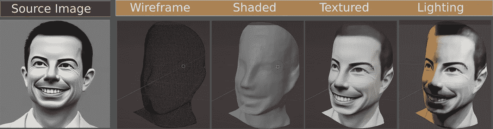

源图像是通过句子“皮特·布蒂吉格的再现”的文本到图像合成生成的在右边，我们看到了一个自动生成的 3D 网格，以及如何对它进行着色和纹理处理。

好了，让我们开始吧。

上面标有“源图像”的图像显示了使用提示“皮特·布蒂吉格的渲染”通过稳定扩散自动生成的图像

这个算法给了它一个艺术或卡通的旋转。你可以自己试试这个:[https://beta.dreamstudio.ai/](https://beta.dreamstudio.ai/)。

右边的图像显示了一个 3D 网格，它是使用现代机器学习技术从源图像自动生成的，我们稍后将对此进行解释。

一旦我们有了这个网格，我们可以使用任何 3D 建模软件来可视化它，对它应用阴影，也许还有一个漂亮的纹理。注意，我们可以重用原始的源图像作为纹理。

然而，我似乎错过了解释我们如何从源图像到网格。嗯，这里缺少的元素是一个叫做“[单目深度估计](https://www.google.com/url?sa=t&rct=j&q=&esrc=s&source=web&cd=&ved=2ahUKEwidnob3iPX5AhVALkQIHQwBA10QFnoECBoQAQ&url=https%3A%2F%2Farxiv.org%2Fabs%2F2003.06620&usg=AOvVaw093Ifxz-FagQAyruHhnvMj)”(MDE)的过程。

为了创建一个 3D 网格，我们需要能够给每个像素分配一个深度值，告诉我们它离摄像机有多远。

把它想象成图像中每个点离摄像机的距离。MDE 的算法就是这么做的。就我个人而言，我一直在使用 [DenseDepth](https://github.com/ialhashim/DenseDepth) 和英特尔 [MiDaS](https://github.com/isl-org/MiDaS) 的方法。下面我们看到一个图像中每个像素的估计深度的例子。我们称之为深度通道:

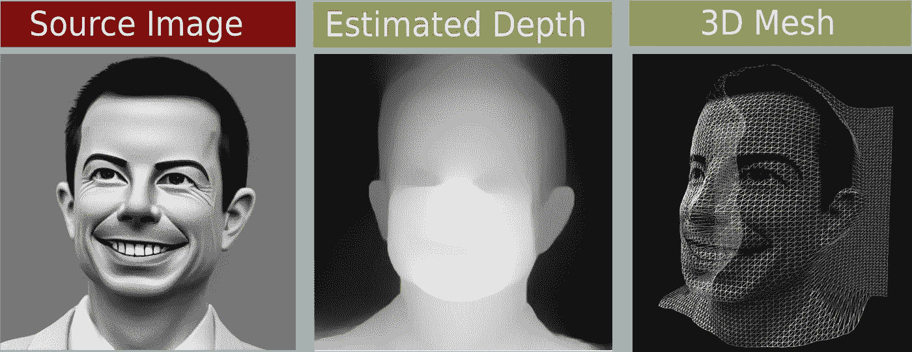

源图像通过深度估计算法来计算深度通道。使用深度信息，我们在 3D 空间中为每个像素分配唯一的坐标，即(x，y，z)值。

深度通道(中间)中每个像素的颜色告诉我们到相机的距离——白色像素离相机更近，黑色像素更远。上面的第三个图像是从源图像和深度通道(中间)中可用的信息生成的网格。粗略地说，我们取每个像素，根据深度值向后或向前推。结果是每个像素在 3D 空间中的位置。

好消息是:有一个可爱的小网站，只需点击一下，就可以帮助我们完成上述所有工作。只需打开 https://picto3d.com/的[并上传你想变成网格的图片。](https://picto3d.com/)

在我们的例子中，我们将拍摄一张生成的看起来像 Walt 叔叔的照片，并将其转换成网格。

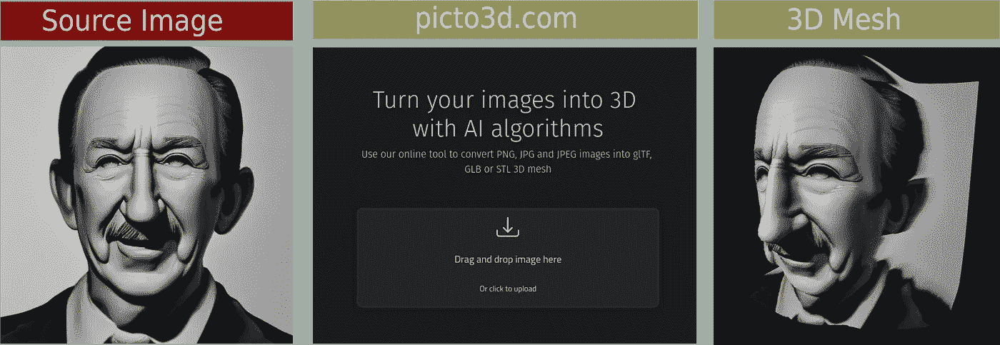

使用 picto3d.com 将源图像转换成网格

该网站允许您修改深度强度，换句话说，场景有多深。还有许多其他参数可以使用。最重要的是，该网站允许您以不同的文件格式存储生成的 3D 模型。我推荐使用。stl 自那以后被广泛使用。我们完了，对吗？

嗯，可惜不是！虽然在上面的图片中看不到，但是纹理和网格已经起到了很大的作用。然而，我们可以为此做些什么。为此，让我们在 3D 建模软件中清理它。下面我将使用 Blender，这是一个适用于 Windows、Mac 和 Linux 的免费软件工具。在这里下载:[https://www.blender.org/](https://www.blender.org/)

打开 Blender 并导入下载的*。stl 文件的结果如下所示。

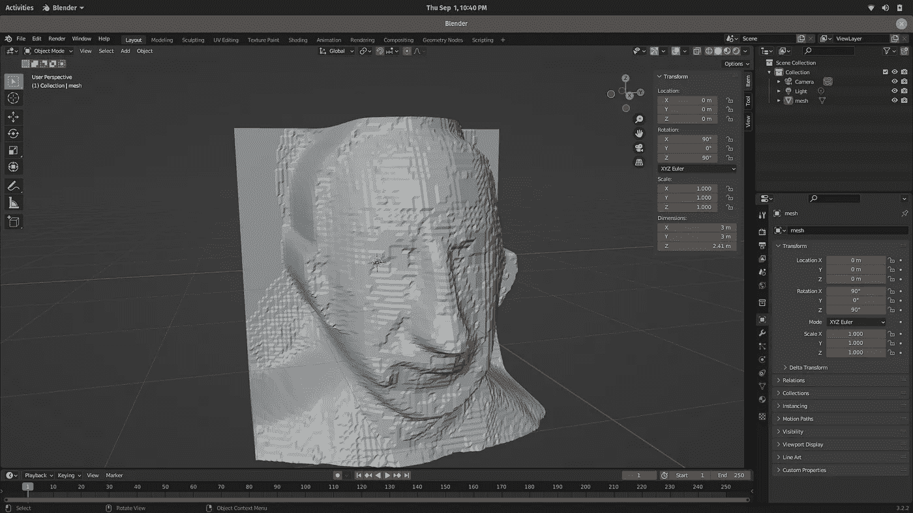

进口到搅拌机里的沃尔特叔叔的网。还是有点粗糙。

相当好，但还不够好。但是如果你点击这个对象，然后右击它，一个菜单就会展开。菜单中的第一个条目是一个名为 **shade smooth** 的命令，我们将在此应用。结果看起来已经好一点了:

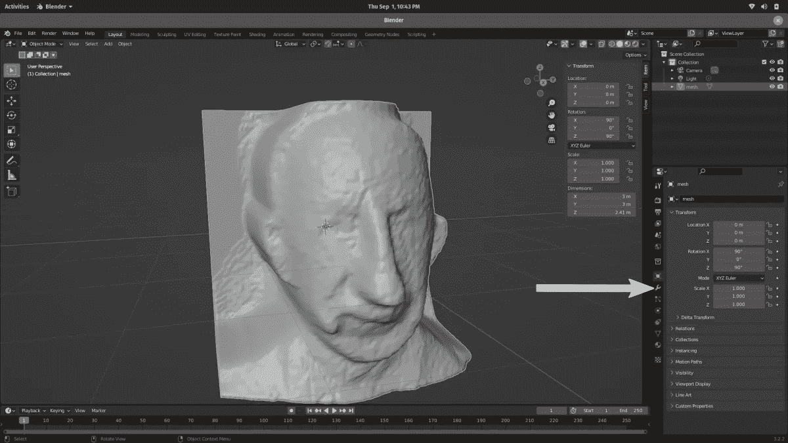

同样的网格从上面看，但是应用了“着色平滑”命令。

到目前为止，我们并没有真正改变模型的质量，我们只是将阴影从一种叫做平面阴影的东西改为 Gouraud 阴影(为所有的极客)。不过，是时候对这款车型的耐用性做点什么了。为此，我们将应用一个修改器。点击上图中用箭头突出显示的按钮，可以找到修改器菜单。只需点击按钮，然后“添加修改器”。

我们将使用**拉普拉斯平滑**修改器。选定后，让我们设置重复值为 2，λ因子为 4.6。重复值定义了平滑将被应用的次数，而λ值粗略地指定了所应用的平滑程度；更高的值意味着更平滑。结果看起来像这样:

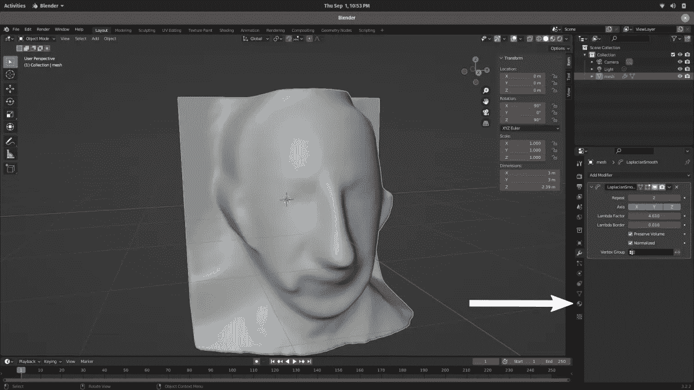

很漂亮，对吧？好，现在我们需要一些纹理。

为此，让我们转到材质属性菜单，上面的箭头突出显示了该菜单的按钮。

点击“新建”产生一个新的材料。在新的素材被创建之后，我们需要将`**Basecolor**`设置为 Walt 叔叔的原始源图像。下面的 gif 展示了如何做到这一点。

基本上，我们只需点击`Basecolor`旁边的黄色点，从一个文件中选择一个图像纹理。

通过选择原始源图像作为新材质的基色来设置纹理。

现在唯一要做的就是确保纹理在模型上的正确位置。

为此，我们可以去紫外编辑菜单。在 UV 编辑器的左侧，我们选择源图像。

在 UV 编辑器的右边，我们从视图中选择菜单项“**UV**->-**项目”。下面的 gif 形象地展示了这一点。**

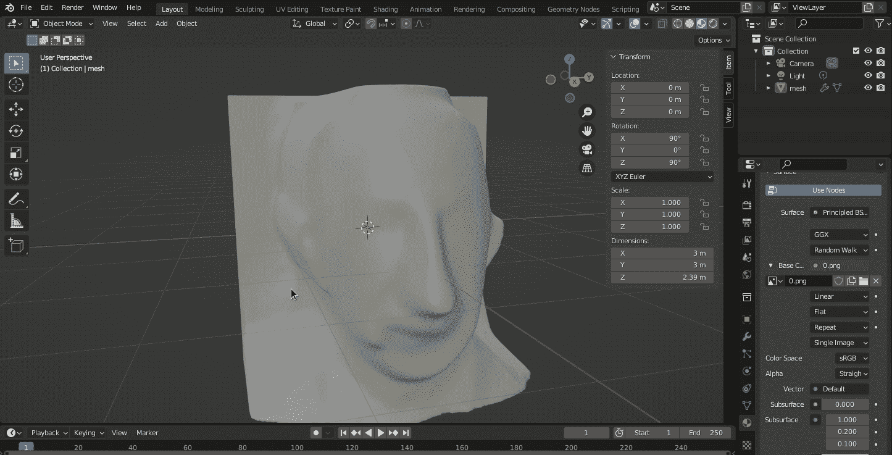

纹理顶部的橙色点是网格坐标。我们需要确保它们很好地重叠。

这可以通过按下键盘按钮“s”来进行缩放。

现在我们可以回到布局菜单，瞧，3D 模型。

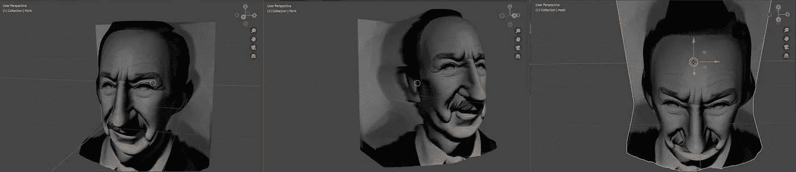

沃尔特叔叔最终的 3D 网格模型。

一旦模型在搅拌机和清理，当可以添加灯光，改变视角，添加其他物体等。

这可以产生一些令人印象深刻的结果。例如，参见下面的图片。

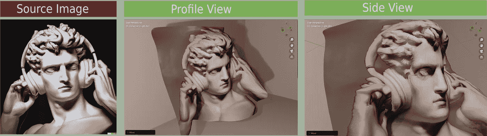

将大卫带入三维空间。OpenAI 的源图像版权。

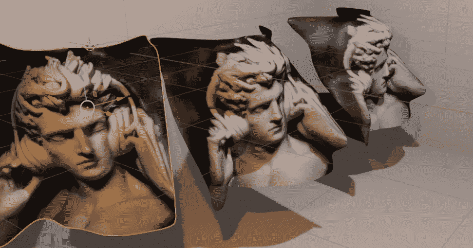

就这样，我希望你喜欢这个教程和它的见解。期待一些酷炫的模特！