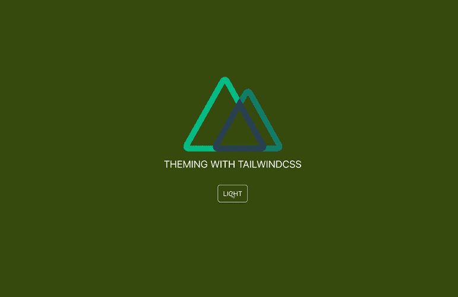
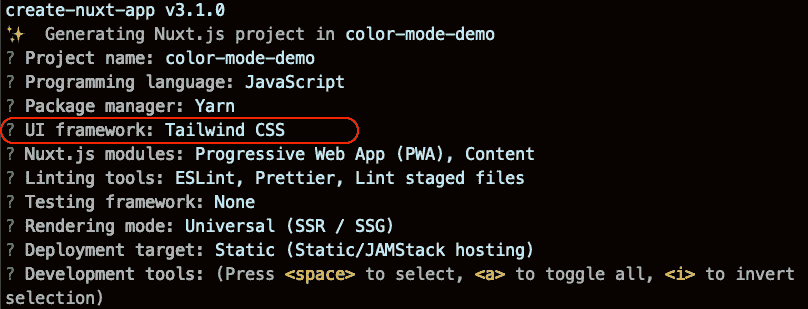
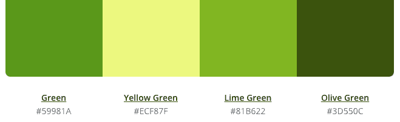
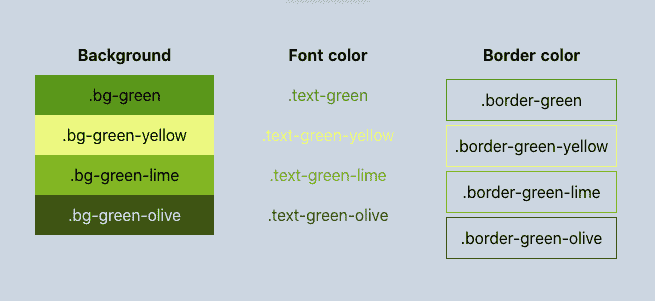
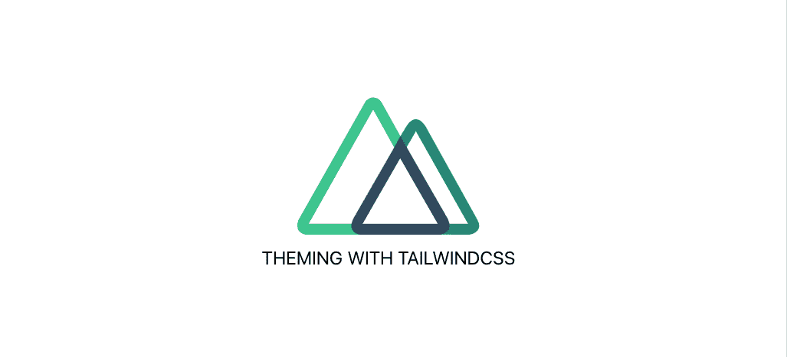
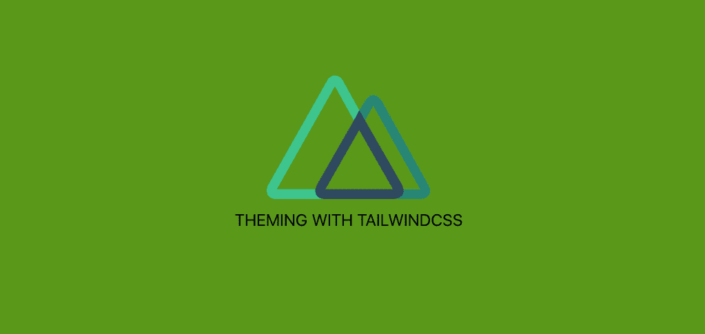
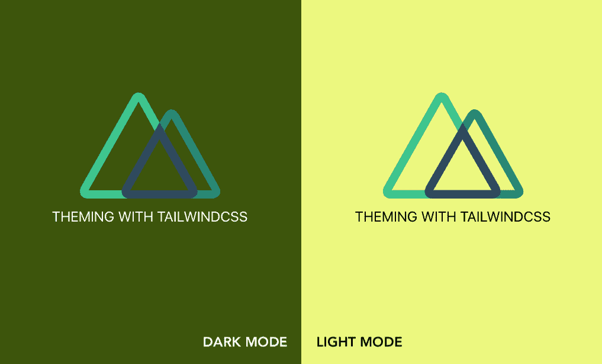
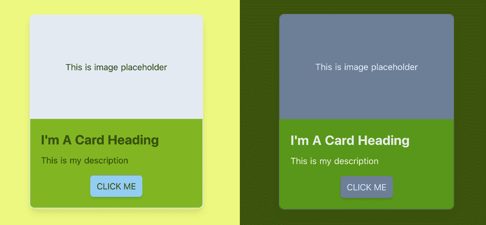
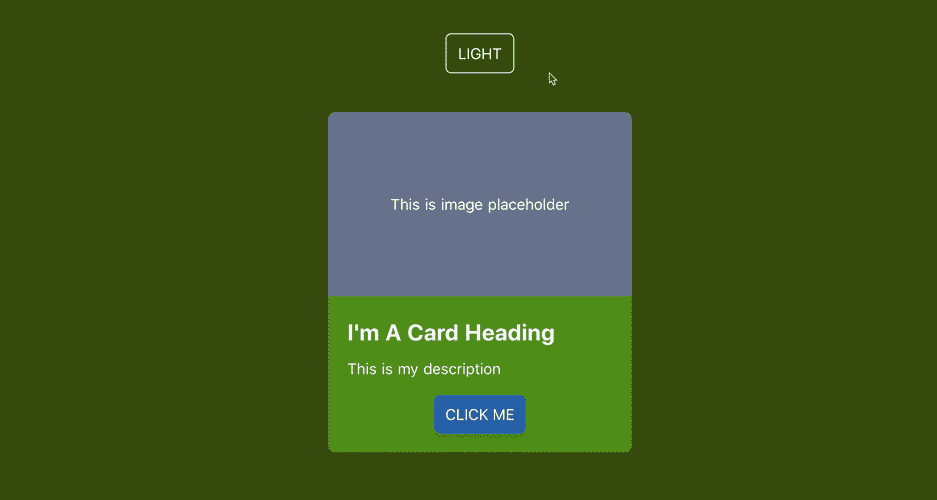

# 使用 Tailwind CSS 和 Nuxt.js 的深色和浅色主题

> 原文：<https://betterprogramming.pub/dark-and-light-themes-with-tailwind-css-and-nuxt-js-2ffd2178aad5>

## 对 Nuxt 应用进行主题化从未如此简单



图片来源:作者

由于花在设备上的时间对我们视力的影响，黑暗和光明模式支持已经成为最近的趋势。使用 [Tailwind CSS](https://tailwindcss.com/) 和适当的 [Nuxt.js](https://nuxtjs.org) (Nuxt)模块，我们可以轻松地启用该功能，并根据您的喜好定制每个模式的外观和感觉。

# TL；速度三角形定位法(dead reckoning)

简而言之，按照下面的简单步骤，使用 Tailwind CSS 和 Nuxt 颜色模式模块启用暗/亮模式:

*   使用`yarn create nuxt-app <project-name>`安装一个 Nuxt 项目，从配置选择中选择 Tailwind CSS 作为 UI 框架。如果存在 Nuxt 项目，运行`yarn add --dev @nuxtjs/tailwindcss`并将模块`@nuxtjs/tailwindcss`添加到`nuxt.config.js`中的`buildModules`列表中。
*   安装`tailwindcss-dark-mode`和`@nuxtjs/color-mode`。
*   在`tailwind.config.js`的`plugins`集合中声明使用`tailwindcss-dark-mode`作为插件。对`@nuxtjs/color-mode`做同样的操作，将`require('tailwindcss-dark-mode')()`添加到`nuxt.config.js`中`plugins`的集合中。
*   在`tailwind.config.js`的`variants`字段中，根据 CSS 实用程序声明黑暗模式变量的使用。
*   使用生成的类和语法`${dark-mode-variant}:${normal-generated-class-for-css-property}`开始为元素分配黑暗模式样式。

太短看不懂？我们慢慢来，好吗？

# Nuxt.js 是什么？

Nuxt . js——简称 Nuxt 是一个基于 Vue.js 的服务器端渲染(SSR)框架，它为开发者提供了:

*   灵活性—通过单一代码库，开发人员有三种构建选项来输出他们的应用程序，如通用(纯 SSR)、单页应用程序(SPA)和静态站点。
*   有组织的代码结构——Nuxt 应用程序模板带有内置路由器机制的逻辑文件夹结构。
*   性能优化——它具有每页自动代码分割功能，保持 JavaScript 捆绑包的大小相对较小，以实现更快的交付。

此外，Nuxt 被一个维护良好的生态系统——Nuxt 社区所包围，它提供了许多实用的模块、插件和支持来简化开发过程。

# 什么是顺风 CSS？

Tailwind CSS 是一个非常高效的实用优先的 CSS 框架。它为开发人员提供了一组针对不同 CSS 实用程序属性的现成类，例如用于样式的`margin`、`padding`和`font-size`。


例如，要制作上面的按钮，相应地应用可用的类就足够了:

```
<button
 class="py-2 px-3 bg-green-500 rounded shadow-md text-white uppercase"
>
Button
</button>
```

其中:

*   `py-`—用于`padding-top`和`padding-bottom`的样式前缀，类似于`px-`用于设置`padding-left`和`padding-right`属性
*   `bg-` —首选`background`，后跟调色板
*   `rounded`—设置`border-radius`的值
*   `shadow —` —`box-shadow`的前缀
*   `text-`—任何与文本相关的 CSS 属性的前缀(`font-size`和`color`)，如将`color`设置为白色的`text-white`

我们还可以组合不同的类来创建一个定制类，比如上面例子中使用的类中的`.btn`类。Tailwind CSS 的显著优势是它允许开发者为实用程序编写更少(更少重复)的 CSS 代码，从而保持整体设计与`@apply`的一致性。

```
.btn {
  @apply py-2 px-3 bg-green-500 rounded-md shadow-md text-white uppercase;
}
```

Tailwind CSS 将相关的样式生成到一个规则集中，用于`.btn`类选择器，如浏览器所示:


通过在后台使用 [PurgeCSS](https://purgecss.com/) ，Tailwind CSS 提供了移除应用程序中未使用的类的能力，从而优化了生产所需的 CSS 大小。

有了 Nuxt 和 Tailwind CSS 的想法？太好了。我们如何开始？

# 用 Tailwind CSS 建立一个 Nuxt 项目

初始化一个新的 Nuxt 项目最直接的方法是使用官方 Nuxt 团队制作的`create-nuxt-app`搭建工具。为了安装`create-nuxt-app`，我们使用以下命令:

```
npm i create-nuxt-app
```

注意:如果您安装的`create-nuxt-app`版本低于 3.1.0，请确保重新运行该命令并将其更新到最新版本。

一旦我们安装了`create-nuxt-app`，让我们使用以下方法之一创建一个空的 Nuxt 项目:

```
*#Using npm (v6.1 onwards)* npm init nuxt-app <your-project-name>*#Or using YARN* yarn create nuxt-app <your-project-name>*#Or using npx* npx create-nuxt-app <your-project-name>
```

然后为我们的应用程序选择相应的配置。

要添加 Tailwind CSS，我们只需从 UI 框架的选择列表中选择 Tailwind CSS，如下所示:



仅此而已。我们已经将 Tailwind CSS 添加到新创建的应用程序中，并准备好使用。

**注**:为了给现有的 Nuxt 项目添加 Tailwind CSS，我们安装了 Nuxt 模块`@nuxtjs/tailwindcss`:

```
yarn add --dev @nuxtjs/tailwindcss #OR
npm i --save-dev @nuxtjs/tailwindcss
```

然后将`@nuxtjs/tailwindcss`作为一个模块添加到`nuxt.config.js`文件中的`buildModules`(或`modules`，对于 Nuxt 版本< 2.9.0:

就这么简单。

现在让我们导航到我们的项目目录并开始主题化。

# 用顺风 CSS 主题化你的项目

wind CSS 的 Nuxt 模块会自动将两个文件添加到您的项目目录中:

*   `~/assets/css/tailwind.css`——包括所有基本的顺风风格，如`basics`、`components`和`utilities`在我们的应用中使用
*   `~/tailwind.config.js` —附加定制的配置文件，如下图所示:

让我们看一下这个文件中定义的属性:

*   `theme` —我们在这里设置所有项目的额外定制主题，包括调色板、字体系列、断点、边框、最小/最大尺寸等。
*   `variant` —我们为选定的核心实用程序插件定义一系列响应性和伪类变量，如`appearance`、`borderColor`、`outline`、`zIndex`等。
*   `plugins`—JavaScript 函数的集合，允许我们以编程方式注册其他样式
*   `purge` —可以是一个数组、一个对象或一个布尔值，指示我们希望如何移除(或不移除)未使用的样式。用于 Tailwind CSS 的 Nuxt 模块自动添加所需的代码，以便在生产过程中清除 CSS 代码，随后是一个文件列表，这些文件通过名称引用任何使用的 CSS 样式。

我们现在使用`tailwind.config.js`为我们的应用程序配置定制的外观。

# 在`tailwind.config.js`中配置您的自定义颜色主题

假设我们有下面的调色板，我们想在我们的应用程序中使用的主要主题:



要覆盖 Tailwind CSS 给出的默认主题，我们可以直接用`colors`字段修改`theme`对象。

然而，如果我们想保留默认主题，Tailwind CSS 为我们提供了通过使用`theme.extend`键添加额外主题的选项，该键接收主题化选项的对象作为值，与`theme`相同。

就个人而言，我推荐使用`extend`来享受主要自定义主题颜色和其他次要用途的默认颜色集的好处。

让我们将上面的调色板定义为`theme.extend`的`colors`字段下的属性，如下所示:

**提示**:您甚至可以将调色板分组到`colors`下的一个嵌套对象中，并将它们定义为修饰符，以保持代码的组织性:

这就是我们需要做的。现在我们的调色板已经可以使用了。

# 在 Nuxt 项目中使用 Tailwind CSS

所有添加的调色板都在生成的类下可用，语法如下:

```
${prefix-for-css-property}-${color-key}-${modifier}
```

前缀是相对代表 CSS 属性的变量。在这种情况下，Tailwind CSS 只为接受 color 作为其值的 CSS 属性生成新的类，如`background`、`color`、`border`等。从上面的调色板中新生成的类的一个例子是:



要将我们的`green`调色板应用于整个应用程序的背景色，添加`bg-green`作为默认布局的主`div`的一个类:

我们的主页将改变默认的背景颜色:



到选定的绿色:



简单吧？我们可以继续用这些自定义生成的类来构建我们的应用程序的自定义外观。

现在让我们继续我们的下一个主题:我们如何使用 Tailwind CSS 为暗/亮模式启用不同的颜色主题？

# 带`@nuxtjs/color-mode`模块的暗/亮模式

现在我们已经准备好绿色调色板，我们的下一个目标是将`green.olive`映射到黑暗模式作为主题，将`green.yellow`映射到光明模式，如下图所示:



为了实现我们的目标，我们需要设置两个额外的插件:

*   `@nuxtjs/color-mode` —一个 [Nuxt 插件](https://github.com/nuxt-community/color-mode-module)，用于在站点的暗/亮模式之间切换，并根据设备的系统外观自动检测正确的模式
*   `tailwindcss-dark-mode` —一个[的顺风 CSS 插件](https://github.com/ChanceArthur/tailwindcss-dark-mode)，用于注入和启用黑暗模式变体

# 添加颜色模式模块

我们首先通过运行以下命令之一来安装 Nuxt 模块`@nuxtjs/color-mode`:

```
yarn add --dev @nuxtjs/color-mode #Or
npm i --save-dev @nuxtjs/color-mode
```

然后，我们配置我们的应用程序，将其用作`nuxt.config.js`中`buildModules`的一个模块:

```
*/* ~/nuxt.config.js */*module.exports = {
 buildModules: [ '@nuxtjs/color-mode' ]
}
```

一旦安装完毕，颜色模式模块将为根元素`<html>`添加一个语法为`.${colorMode}-mode`的类。`colorMode`的值可以是`dark`、`light`、`system`。此外，它向应用程序中的所有 Nuxt 组件公开一个助手对象`$colorMode`，包含以下字段:

*   `preference` —用户实际偏好(选择)的颜色模式
*   `value` —只读，表示从设备的系统外观中检测到的颜色模式
*   `unknown` —只读，表示是否需要渲染占位符。

我们可以使用生成的类`dark-mode`和`light-mode`为整个应用程序设置基本颜色主题(背景和文本颜色)以响应暗/亮模式，如下所示:

既然我们的主题已经设置好了，我们需要一种方法在这两种模式之间切换。所以我们来做个纽扣吧！

# 为暗/亮模式制作一个切换按钮

为了在暗/亮模式之间切换，我们创建了一个按钮，其标签将在`Dark`和`Light`之间切换。将新文件`ColorMode.vue`作为 Vue 组件添加到`components`文件夹，并将以下代码添加到`<template>`部分:

```
*<!-- ~/components/ColorMode.vue -->* <button class="btn border border-white capitalize" @click="changeMode">
{{ btnLabel }}
</button>
```

`btnLabel`被设置为`computed`变量:

我们还定义了`changeMode`方法的逻辑，如果当前视图是`light`，它将把当前选择的`$colorMode`的颜色模式`preference`改变为`dark`，反之亦然。

结果将是:


现在，按钮如我们预期的那样工作了。

有一个问题:如果我们想在暗/亮模式的状态(悬停)下显式地改变元素的主题，该怎么办？或者给按钮分配不同的颜色？这将需要编写大量的 CSS 规则集来完成这些基于显式的任务，比如为新的选择器编写两组不同的 CSS 样式:`.dark-mode button:hover`、`light-mode button:hover`等等。因此，我们最终会有更多的沉重的 CSS 代码，无法覆盖 100%的用例，这违背了我们最初使用顺风 CSS 的想法。

那么，顺风 CSS 能为我们提供什么来应对这些挑战呢？让我们看看下一个插件:`tailwindcss-dark-mode`。

# 用顺风 CSS 类切换暗/亮模式

`tailwindcss-dark-mode`插件启用了黑暗模式的变体，这样 Tailwind CSS 就可以生成可供使用的类。要将插件添加到我们的应用程序，请运行以下命令之一:

```
yarn add --dev tailwindcss-dark-mode #OR
npm i --save-dev tailwindcss-dark-mode
```

然后我们将它设置为在`tailwind.config.js`中作为一个顺风 CSS 插件在`plugins`中使用。

```
*/* ~/tailwind.config.js */*module.exports = {
*//...* plugins: [require('tailwindcss-dark-mode')()]
}
```

这个插件将所有可用的黑暗模式变体注入到我们的应用程序中，例如

*   `dark-hover`(悬停时)，`dark-group-hover`(悬停在一组元素上)
*   `dark-focus`(当聚焦一个元素时)`dark-focus-within`(当聚焦它的任何一个子元素时)，
*   `dark-active`(当元件处于活动模式时)

但是，现在还不足以开始使用。我们需要用我们想要应用于它们的核心实用程序来声明这些变体。在此基础上，Tailwind CSS 将映射它们和相关的实用程序，从而相应地生成新的类。为此，我们在`tailwind.config.js`的`variants`字段中用期望的 CSS 实用程序定义所需的变量，如下所示:

Tailwind CSS 将根据以下语法为黑暗模式生成额外的类:

```
${dark-mode-variant}:${normal-generated-class-for-css-property}
```

两个例子是`dark:bg-green-yellow`将`green-yellow`颜色变量应用于`background-color`和`dark-hover:bg-green`当元素处于悬停状态时将`green`颜色应用于`background`。

最后，我们需要通过将我们的`.dark-mode`类选择器映射到`tailwind.config.js`中`theme`的`darkSelector`字段来通知 Tailwind CSS 我们的`.dark-mode`类选择器是黑暗模式的主选择器:

```
module.exports = {
 theme: {
  darkSelector: '.dark-mode',
 }
}
```

在后台，Tailwind CSS 将根据分配的选择器`.dark-mode`自动生成黑暗模式的 CSS 规则集。

在黑暗模式下将`button`的`border-color`设置为`white`颜色的例子如下:

客户端生成的 CSS 样式类似于:

```
.dark-mode .dark\:border-white {
 border-color: #fff;
}
```

这种方法确保了与其他顺风 CSS 选择器相比，黑暗模式选择器的明确使用。

这就够了。现在，我们可以按照上面提到的类语法，用`variants`中包含的黑暗模式变体来指示任何 CSS 实用程序的黑暗模式样式。

例如，假设我们要制作一张简单的卡片，遵循以下设计:



我们首先定义卡片模板:

基本样式在两种模式下保持一致:

让我们为灯光模式(作为我们的默认模式)添加一些必需的样式，例如:

*   `border-white`和`bg-green-lime`至包装卡`div.card`
*   `bg-gray-300`到图像占位符`div.placeholder`
*   `bg-blue-300`和`hover:bg-blue-500`为悬停状态，为卡的主按钮`button.card-btn`

以及黑暗模式的相应类别，从`dark:`开始:

*   `dark:border-gray-700`和`dark:bg-green`至`div.card`
*   `dark:bg-gray-600`至`div.placeholder`
*   `dark:bg-blue-700`和悬停状态`dark-hover:bg-blue-300`到`button.card-btn`

结果是:



我们可以用同样的方法来设计我们整个应用程序的风格，只需要做最少的主题化工作。要写的代码更少了，这不是很棒吗？

**重要提示:**类`dark-mode`是在运行时以编程方式分配的，在我们的代码中不会手动作为任何组件的类值出现。因此 PurgeCSS 将在绑定时删除所有生成的样式和与之相关的类，因为它错误地认为这是一个未使用的 CSS 选择器。为了防止这种特定的行为，我们需要将`dark-mode`添加到`whitelist`选择器列表中，因为我们希望将`purgeCSS`包含在`nuxt.config.js`中。

```
*/* ~/nuxt.config.js */*module.exports = {
 purgeCSS: {
  whitelist: ['dark-mode']
 }
}
```

到目前为止，一切顺利吗？

接下来，我们将看到如何以一种可重用和有组织的方式来构造我们的主题化配置。

# 用 CSS 变量组织

没错。到目前为止，我们的演示应用程序的扩展主题调色板组织如下:

就这样离开完全没问题。然而，这些十六进制颜色值是硬编码的，并且只在`tailwind.config.js`内知道。如果我们需要在单独的`<style>`部分访问这些颜色，不复制/粘贴值是不可能的。一个很好的例子是，如果我们想创建一个带有渐变的应用背景。重复硬编码的颜色值会使我们的代码变得复杂，并且使得将来对颜色进行适当的调整变得更加困难，尤其是当我们想要改变调色板的时候。

这就是 CSS 变量有用的原因。

我们在`~/assets/css/`目录中添加了一个名为`palettes.css`的新 CSS 文件，而不是手动将颜色值输入到`tailwind.config.js`，我们将调色板作为 CSS 变量声明到应用程序的`:root`元素中。

在`~/assets/css/tailwind.css`中导入该文件:

然后相应地用定义的 CSS 变量值替换`tailwind.config.js`中所有硬编码的颜色值:

我们将顺风 CSS 的配置从调色板中分离出来，这些 CSS 变量可以在整个应用程序中访问。当需要改变颜色时，我们只需要对这个`palettes.css`文件进行适当的修改，限制了出现错误的机会，并保持代码的可重用性。

# 演示

[演示代码](https://codesandbox.io/s/dark-theme-tailwind-nuxt-color-u13fi?fontsize=14&hidenavigation=1&theme=dark)可供试用。

你也可以查看[我的投资组合网站的回购](https://github.com/mayashavin/portfolio-new)以获得更多的顺风 CSS 和 Nuxt 用例。

# 摘要

我喜欢用 Nuxt 和 Tailwind CSS 开发我的作品集网站。编写和维护 CSS 代码从来都不是一件容易的事情，尤其是那些重复的实用样式(比如填充、边距等等)。)并跟踪要移除的未使用的 CSS 代码。但 Tailwind CSS 有助于巧妙地解决这两个问题。

暗/亮模式可能不是可访问性增强的书面要求，但它对用户来说是一个巨大的好处。现在光感越来越普遍，更多像苹果、谷歌这样的大公司默认提供暗/亮模式。因此，如果启用暗/亮模式给我们的用户带来舒适，并且很容易用顺风 CSS 和 Nuxt 颜色模式实现，为什么不应用它呢？

如果你以前不知道 Nuxt 或 Tailwind CSS，我建议你尝试一下，体验一下它们的魅力以及它们给你的 web 开发过程带来的力量。如果你用 Nuxt 和 Tailwind CSS 做了什么，请在评论中与我分享。