# 黑暗模式和 CSS 变量

> 原文：<https://betterprogramming.pub/dark-mode-and-css-variables-ed6dc250232c>

## 立即在您的应用中实施黑暗模式

迈克·彼得鲁奇在 [Unsplash](https://unsplash.com?utm_source=medium&utm_medium=referral) 上的照片

黑暗模式是我们许多人喜欢的东西，但迄今为止没有多少人有机会实现。由于我已经看到了我的顽固设置的公平份额，我想与你分享一些关键点，你应该在开始之前考虑或考虑，如果你已经在使用它。

我将使用我们的耳朵学习应用程序中的黑暗模式/光明模式作为一个例子，你可以在这里查看[的现场版本](https://learnbyear.io)。

# 深潜

让我们深入研究一下。

我们的网络应用程序只有*有*有一个黑暗模式，因为我们想给用户在他们与我们的产品互动时选择最适合他们的可能性，以及其他偏好。

当然，从一开始就实现或记住你需要有两个主题是有帮助的，但情况并非总是如此。我将与您分享的原则可以用于这两个方面——新的实现和重构。说到底都是重点。

**小备注:**我们选择了新形态作为我们的设计模式，这意味着我们的三种亮模式颜色和三种暗模式颜色已经确定。我说*建立*是因为神经变形的作用方式，但我不会在这里关注这部分，因为它是特定于神经变形的。不过，如果你感兴趣，你可以[详细了解一下](https://medium.com/@_danascript_/we-chose-neumorphism-for-our-app-and-here-is-how-we-did-it-80b0f4c9bc6e)。

正如我所说的，Neumorphism 建立了这两组颜色(下面的截图来自 Figma 的项目，我们用它作为设计模拟的首选软件):

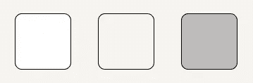

灯光模式基本设置

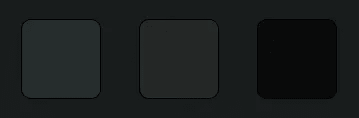

黑暗模式基本设置

虽然我们每个模式已经有三种颜色，但我们知道我们必须*至少*再有两种颜色——文本颜色和辅助颜色(从一开始)。我们设置这些颜色的方式类似于我们选择三种主要颜色的方式，结果如下:

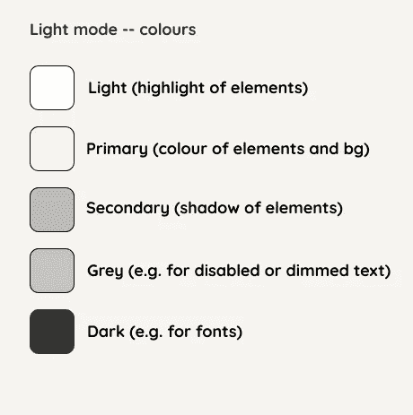

灯光模式

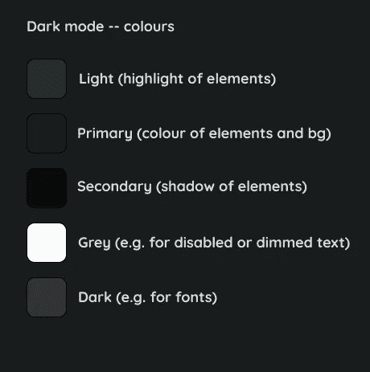

黑暗模式

我们首先添加三种核心颜色，然后添加辅助颜色——灰色——和字体颜色——深色。

我想在这里停一下:灰色*和黑色*的命名方式是有问题的。首先，我们可以看到，灰色在黑暗模式场景中并不是真正的灰色，如果我们想在黑暗的背景上使用它，黑暗可能需要更亮。

这是我看到主题实现者一次又一次犯的最大错误——以颜色命名颜色。

如果你再增加 10 个——包括更多的深色、灰色等等——会怎么样？这很可能最终导致混乱，不容易(或根本不容易)使用，并且忘记创建可调整或可扩展的代码。如果你想有一个灰度模式呢？还是红色？看到那会很快失控吗？

你需要根据颜色所代表的功能来命名它们。

让我告诉你我的意思:

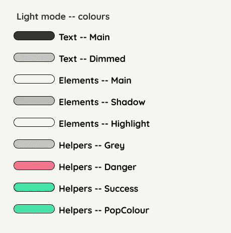

灯光模式

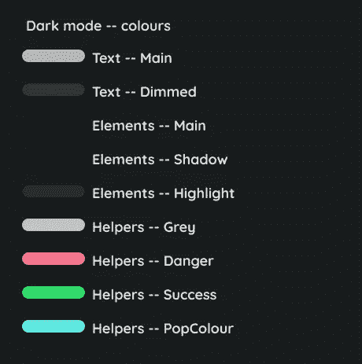

黑暗模式

上面，我们将颜色分为三个主要部分:

*   文本
*   元素
*   助手

我们能够通过概述我们的应用程序的设计草图来分解它，并查看页面的哪些元素需要有颜色以及它们彼此之间有什么不同。

## **元素**

主体、阴影和高光来自 Neumorphism 的模式，但被重新命名；如果你检查，最初他们是光，主要和次要的，一旦你开始使用它，这可能会令人困惑，因为神经变形使用这些颜色的阴影和高光效果。

## **正文**

主色将根据其背景而变化(较亮或较暗，反之亦然)。变暗为文本也可能表示禁用状态，并且可能较小/次要。

## **助手**

危险和成功是视觉反馈，让用户知道他们在学习应用程序时是对还是错。颜色不一定是红色或绿色(可以是粉色和蓝色或紫色和黄色)。

我们按照我们的主前端库(引导)命名惯例来命名它们。然后，由于我们的设计非常简约，我们希望包括一种流行的颜色，这种颜色可以根据主要元素的氛围而变化，所以我们将其命名为 PopColour。

# 实施

实现这种命名系统是如此，如此，如此比例如将*黑色*、*蓝色、*和*白色*作为名称要可扩展得多。如果你仍然不相信，请继续阅读，当你真正开始使用它时，我会告诉你它是怎样的。

一旦我们对命名进行了排序(这不一定是最终结果，但你已经掌握了它的窍门)，让我们设置一些原生 CSS 变量(你可以在官方文档[这里](https://developer.mozilla.org/en-US/docs/Web/CSS/var)中读到它们):

根据文档，我们将它们设置在根级别。这些是我们的默认值。现在，无论何时你想使用它们，你都可以简单地这样做:

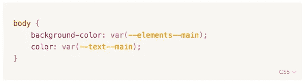

但是等等，这些只是光模式下的颜色，对吗？没错。以类似的方式，我们声明黑暗模式变量:

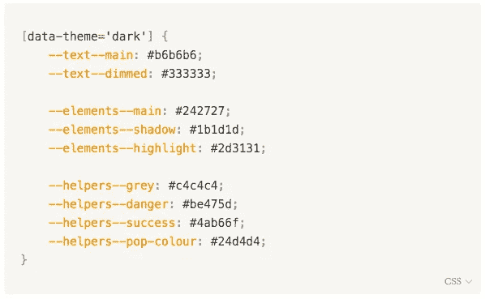

等等，这是什么`[data-theme='dark']`？

这是你改变主题的关键！当您的`html`标签具有属性`<html [data-theme='dark']>`时，它将应用这些变量的值(您也可以通过 JavaScript 来实现这一点——如果您想让我分享代码，请告诉我)。

尸体呢？

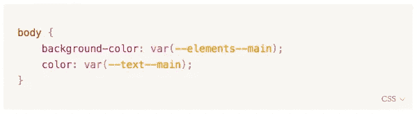

身体保持*完全*不变！因为我们以一种有意义的方式命名了变量，没有不必要的颜色值，所以您可以获得很大的自由！

# 艰难的道路

让我给你看看当你用非常困难的方式做的时候是什么样子。

我们的网站上有一个亮/暗模式切换的拨动开关，有时看起来像这样:

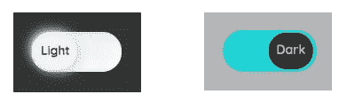

亮暗模式拨动开关

如果我们要保持*黑色、蓝色、*和*白色*的命名约定，我们会把这个作为我们的 CSS:

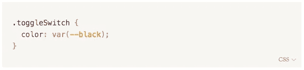

但这只适用于我们的灯光模式，对吗？所以你需要扩展它:

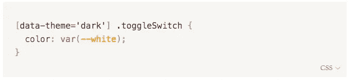

你需要在*上重复每一个改变的元素*！这有点失去了变量的意义，总的来说，这纯粹是疯狂。

你希望你的变量为你的主题服务，而不仅仅是像保险箱一样存储一些信息。

让我们进一步说，你想为新年或春天实现一个特殊的主题——或者两者都实现！

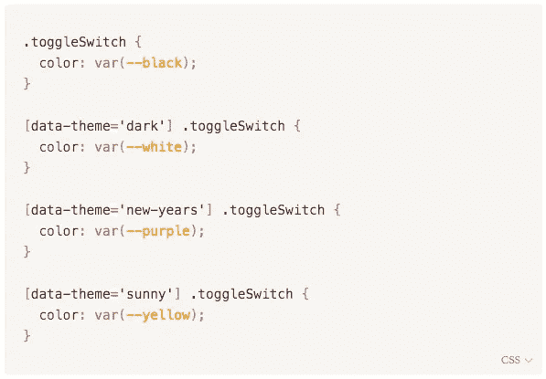

你需要涵盖每个元素，为每个主题改变每种颜色。Woah，那是很多的*每，*不是吗？

我很确定没有多少人愿意承担这项任务，而且它可能产生的错误实在是太多了。

相反，如果我们按照我建议的方式实现变量，我们将只有这行代码:

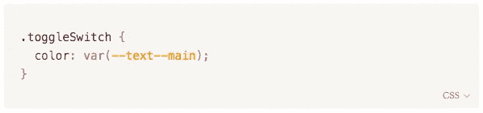

所有的颜色分配给它们各自的变量将发生在另一个地方(你的其他变量所在的地方)，一旦你改变属性，它将为你做工作。

这样，您可以将所有颜色保存在一个*位置，并且只需在一个*位置添加/更改它们。更清洁的状态和更安全的实施:

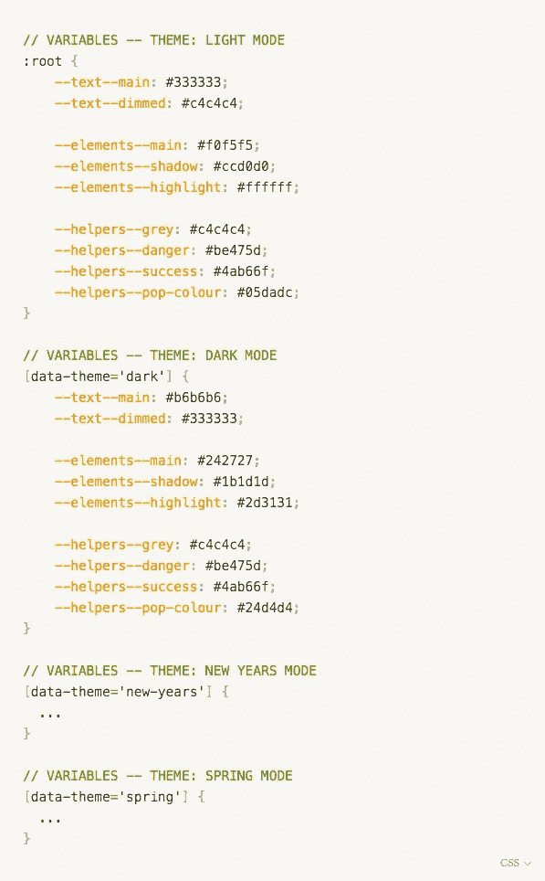

那不是更干净更有条理吗？

对于那些已经有现成设置的人，我建议先尝试用建议的命名约定将其分解成变量，然后在整个代码中应用它们。一旦你完成了这些，你就可以开始添加主题了。

# 结论

总之，不要给自己或同事制造无用的工作。这并不意味着现在每个项目都必须从变量开始——使用你自己的判断。

但是如果你开始使用主题，那么我强烈建议你坚持这个命名惯例，而不是仅仅为它们的名字命名颜色。(试着用所有这些黑色/灰色阴影的灰度网站。这一点也不好玩——我可以向你保证！)

感谢您的阅读！