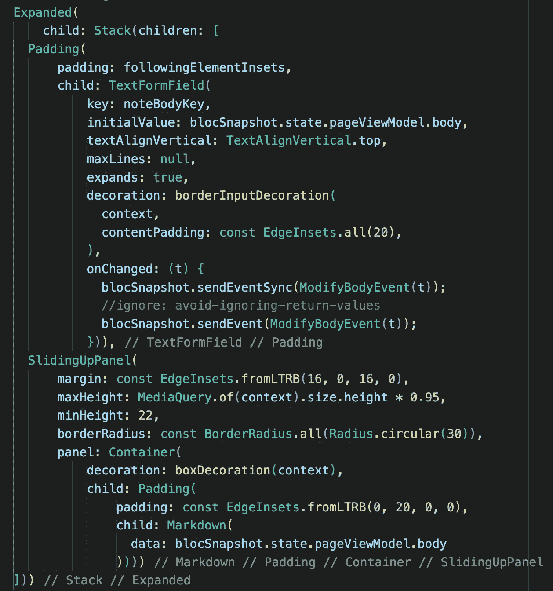
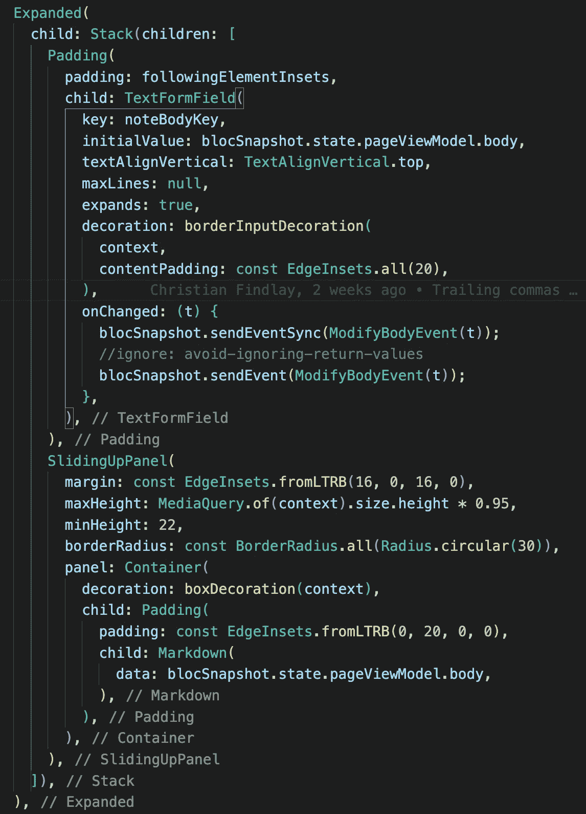
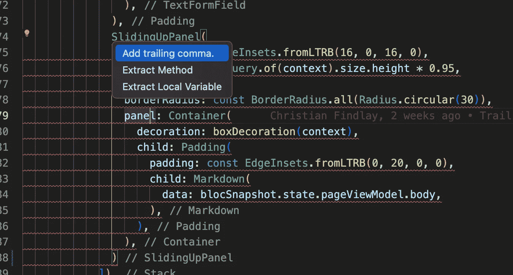

# 使用 Dart 的尾随逗号改进您的代码格式

> 原文：<https://betterprogramming.pub/dart-formatting-and-trailing-commas-c3a8e0fbaa1b>

## 看看 Dart 出色的格式化功能


尾部逗号可能听起来像是 Dart 语言的一个次要方面，但它们对代码的格式有重大影响。本文解释了确定性格式，结尾逗号如何影响它，为什么应该使用它们，以及如何添加 [dart_code_metrics](https://pub.dev/packages/dart_code_metrics) 包来加强它们以获得更好的格式。

# 确定性格式

代码格式化器或代码美化器是一个格式化你的代码的工具。Dart 有一个工具叫 [dart 格式](https://dart.dev/tools/dart-format)。格式化程序将原始代码(有时是配置)作为输入和输出格式化代码。

给定一些原始的语义相同的代码，*确定性的*格式化程序总是输出相同的文本。换句话说，如果您复制、粘贴一段代码，并在第二个副本中放置额外的空白，则应用确定性格式化程序将始终产生完全相同的文本。无论您如何用空格格式化原始代码，格式化程序总是会产生可预测的代码结果。

# 为什么确定性格式很重要？

这似乎是一个迂腐的观点，但是不同的格式是合并冲突最常见的原因之一。它还会产生许多不必要的 git 更改。

如果两个人的代码格式不同，不可避免地会导致提交中额外的空格差异。这经常会导致合并冲突，但是这是绝对可以避免的。

如果一个团队决定根据一组规则来格式化所有的代码，他们就排除了不同的格式化会导致合并冲突的可能性。确定性格式化减少了 git 差异，从而降低了合并冲突的风险。

确定性格式对于可读性也很重要。大多数语言都推荐一种格式样式。语言通常规定花括号是从当前行开始还是从下一行开始。这些诱因常常赋予语言以美学的味道。

这意味着人们习惯了格式化程序的风格，无格式的代码通常可读性较差。虽然一个好的格式化程序允许团队级别的一些自主配置，但格式化程序需要加强语言的美学味道，并阻止人们超越团队的决策。

最后，团队可能会在评审时结束代码风格的争论。您的团队可能想要调整语言的一些格式选项，但是至少，团队应该对格式做出一致的决定。

当代码评审发生时，你不希望有一场关于格式化代码的最佳方式的临时辩论。这种争论应该提前发生，构建过程应该执行这些规则。用颤振团队的话说，

> *虽然你的代码可能遵循任何偏好的风格——根据我们的经验——但开发团队可能会发现这样做更有成效:*
> 
> *——拥有单一、共享的风格，以及*
> 
> *-通过自动格式化强制使用这种样式。*
> 
> *另一种选择通常是在代码评审期间令人厌倦的格式辩论，在这种情况下，时间可能更好地花在代码行为上，而不是代码风格上*

[https://docs.flutter.dev/development/tools/formatting](https://docs.flutter.dev/development/tools/formatting)

# 省道格式

Dart 格式化程序主要是确定性的。它允许你做一些事情，这意味着它不是 100%确定的。

例如，它允许您在一段代码中添加一个换行符或不添加换行符。这可能是一件好事，这样您就可以将两段不同的代码分开。

但是，在大多数情况下，它会使您的代码看起来与其他人的代码一致，并保持 dart 的美感。

您可以对代码库中的所有代码运行 Dart 格式化程序。点击阅读省道格式器[。](https://dart.dev/tools/dart-format)

# 打开自动格式化

[Visual Studio Code](https://www.google.com/url?sa=t&rct=j&q=&esrc=s&source=web&cd=&cad=rja&uact=8&ved=2ahUKEwjuy6Wpyp_5AhX_SmwGHcLXCmoQFnoECA4QAQ&url=https%3A%2F%2Fcode.visualstudio.com%2F&usg=AOvVaw15O90sm1ios8AUpw56hCml) 和 [Android Studio](https://developer.android.com/studio) 都具有在保存时自动格式化当前文档的功能。您需要打开它，这样格式化就不是一个事后的想法或额外的任务。 [Flutter 代码格式化文档](https://docs.flutter.dev/development/tools/formatting)解释了如何在两种 ide 上打开它。在项目早期打开自动格式。

如果开始一个项目时没有强制设置格式，将会有许多不同的格式样式。这将导致合并冲突和混乱。如果您发现自己处于代码未格式化的情况，我的建议是硬着头皮，将 dart 格式应用于整个代码库，并开始清理。从长远来看，你会发现这样更好。

dart 格式化程序确实有一个怪癖，这就是关于结尾逗号的讨论的由来…

# 尾随逗号

尾随逗号充当代码格式化程序的指令。如果您添加尾随逗号，格式化程序将对您的代码进行不同的格式化。在这里阅读关于这个[的 Flutter 文档。](https://docs.flutter.dev/development/tools/formatting#using-trailing-commas)

这是一个没有尾随逗号的示例:



此示例结尾有逗号:



Flutter 团队建议您始终使用尾随逗号，区别是显而易见的。我发现结尾的逗号版本更容易阅读。但是，更重要的是，它垂直格式化参数等等，而不是将它们换行到指定的水平宽度。

看看这个非常简单的例子。第二段代码中只有两个额外的逗号。您可以将这些代码块复制并粘贴到您的 IDE 中，看看格式有多大的不同。尾部逗号用水平空格替换垂直空格。

# 用代码规则强制尾部逗号

[Dart Code Metrics](https://pub.dev/packages/dart_code_metrics) 包是为你的项目增加额外代码分析的优秀工具。您将它添加到您的`dev_depedencies`中，并在`analysis_options.yaml`中进行配置。

有一个规则叫做首选尾随逗号。你需要打开这个。点击阅读更多安装文档[。这是一个我经常使用的示例配置部分，但是你不必像我在这里做的那样打开所有的错误。](https://pub.dev/packages/dart_code_metrics/install)

如果您不添加结尾逗号，这会导致错误，但它也为您提供了自动添加它的快速解决方案。当有大量嵌套，并且不清楚代码中的问题在哪里时，这是非常方便的。



# 在错误的格式上中断构建

如果团队中的某个人在 pull 请求中提交代码，并且该代码包含格式错误的代码，则构建应该会失败。否则，未格式化的代码很容易被分割。我觉得奇怪的是，dart 分析器在遇到错误的格式时不会失败。对于 build 命令也是如此。但是，运行这个命令可能会使构建在遇到错误代码时失败。您可以将它添加到您的构建管道 YAML 中。

```
flutter format [LIB FOLDER] — set-exit-if-changed
```

本质上，这将运行格式化程序，并在发现需要格式化的内容时以失败代码退出。

# 总结

团队可以通过确定性格式化避免很多麻烦，dart 有一个优秀的格式化程序。如果代码没有格式化，您还可以自动格式化所有 dart 文档并中断管道构建。当所有这些事情一起工作时，你的团队将会有更少的关于格式的争论，经历更少的 git 差异，以及合并冲突。在代码中添加结尾逗号也将改善整体格式。试着在项目的早期设置这些，但是在项目中做这些改变永远不会太晚。

*原载于*[*https://www.christianfindlay.com*](https://www.christianfindlay.com/blog/dart-formatting-and-trailing-commas)*。*