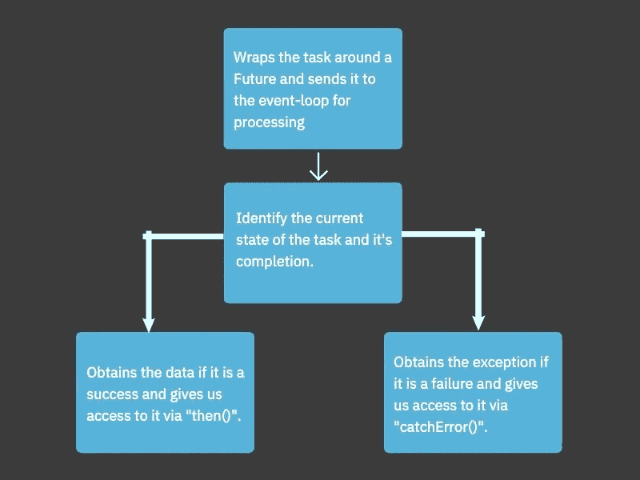

# Dart 未来:链接和并发

> 原文：<https://betterprogramming.pub/dart-futures-chaining-and-concurrency-86dc5a89dd2b>

## *链接期货并处理同步期货看涨期权*


按作者分类的标题图像

# 前言

在我之前的文章中，我解释了 Dart 中关于期货的基本概念。我已经讨论了它们是如何被设计来帮助我们在单线程环境中通过事件循环处理异步任务的。

我还讨论了我们可以使用的一些构造函数和方法，以及它们的具体用法，这使我们能够优雅地处理异步任务，比如 API 调用。

在本文中，我将讨论一些围绕`Future`类的高级概念。讨论将主要围绕以下主题:

*   将未来链接在一起，实现异步任务执行的多米诺骨牌效应。
*   并发执行多个`Future`任务并处理它们的结果。

# 在开始之前

对于那些直接阅读本文的人来说，他们的兴趣仅仅在于了解链和并发性，而不是在第一篇文章中浏览所有的基础知识，在我们开始之前，让我们回顾一下。

Future 提供了使我们访问事件循环和管理异步作业变得简单所需的 API。它允许我们做许多事情。

未来是这样运作的:



图 1:未来处理异步任务的过程

在本文中，我们将建立与上一篇文章相同的实验基础。

假设我们开发了一个应用程序，可以让我们更容易地在街对面的当地咖啡店里看到最新的咖啡。

我们的热咖啡数据将来自这里:`[https://api.sampleapis.com/coffee/hot](https://api.sampleapis.com/coffee/hot)`

这个 API 返回给我们一个热咖啡的数组，单个对象看起来像这样:

```
{
  "title":"Black",
  "description":"Black coffee is as simple as it gets with ground coffee beans steeped in hot water, served warm.",
  "ingredients":[
     "Coffee"
  ],
  "image":"https://upload.wikimedia.org/wikipedia/commons/thumb/4/45/A_small_cup_of_coffee.JPG/640px-A_small_cup_of_coffee.JPG",
  "id":1
}
```

我们可以执行的从这个 API 获取数据的最简单形式的`Future`如下所示:

```
void main() {
  Future<http.Response> coffeeData =
      http.get(Uri.parse('https://api.sampleapis.com/coffee/hot'));
}
```

现在我们已经为我们的思考过程建立了基础，让我们开始吧。

# 连锁期货

## 问题陈述

最近，我们的后端开发人员请求了一个咖啡列表，这是一个经过授权的请求。

授权请求要求请求头包含用户成功登录时获得的授权令牌。这意味着用户在查看咖啡列表之前必须登录到应用程序。

我们如何在发出成功的登录请求后请求 coffee list 端点？

## 解决办法

这就是使用`then()`将两个或更多期货链接在一起的能力派上用场的地方。我们可以确保在继续进行获取咖啡列表的调用之前，从登录调用中收到一个肯定的结果，除此之外，我们可以很容易地从前面的调用中获得值。

让我们创造一些方法，让我们的生活更轻松。

下面是获取 coffees 数据的方法:

```
Future<http.Response> fetchCoffeeData({required String coffeeTemp}) async {
  const baseURL = 'https://api.sampleapis.com/';
  final coffeeResponse =
      await http.get(Uri.parse(baseURL + '/coffee/' + coffeeTemp));

  if (coffeeResponse.statusCode == 200) {
    return coffeeResponse;
  } else {
    throw Exception('Failed to fetch coffees');
  }
} 
```

登录方法如下:

```
Future<http.Response> loginUser({
  required String username,
  required String password,
}) async {
  const baseURL = 'https://api.sampleapis.com/';
  Map<String, String> requestBody = {
    'username': username,
    'password': password
  };

  final loginResponse =
      await http.post(Uri.parse(baseURL + '/login/'), body: requestBody);

  if (loginResponse.statusCode == 200) {
    return loginResponse;
  } else {
    throw Exception('Failed to log you in.');
  }
}
```

通过查看下面的代码，您可以这样问自己:

## 去连锁？

```
List<Coffee> result = await loginUser(
        username: 'darsshan@sample.com', password: 'Mithrandir@123')
    .then((value) => 
        LoginResponse.fromJson(jsonDecode(loginResponse.body)))
    .then((value) =>
        fetchCoffeeData(coffeeTemp: 'hot', authToken: value.authToken))
    .then((value) => getCoffeeList(coffeeListResponse));
```

## 还是不要锁链？

```
http.Response loginResponse = await loginUser(
  username: 'darsshan@sample.com',
  password: 'Mithrandir@123',
);

final userData = LoginResponse.fromJson(jsonDecode(loginResponse.body));

http.Response coffeeListResponse = await fetchCoffeeData(
  coffeeTemp: 'hot',
  authToken: userData.authToken,
);

List<Coffee> coffeeList = getCoffeeList(coffeeListResponse);
```

从上面的代码实现中可以看出，当我们选择将期货链接在一起时，它给我们带来了一些生动的好处:

*   获得相同结果的代码行更少
*   更容易阅读代码以了解发生了什么，因为它是按相关事件的顺序排列的
*   清晰概述依赖关系，因为如果没有从前面的代码接收到正确的信息，后续的代码将无法执行`Future`

当将多个`Future`链接在一起时，需要注意的是前面的`Future`失败将导致所有后续的`Future`调用失败。

```
loginUser(username: 'darsshan@sample.com', password: 'Mithrandir@123')
    // Future 1: Success
    .then((value) => LoginResponse.fromJson(jsonDecode(loginResponse.body)))
    // Future 2: Let's make this fail.
    .then((value) => fetchCoffeeData(
        coffeeTemp: 'hot', authToken: 'expired token'))
    // Future 3: This will not be executed as the one before it failed.
    .then((value) => getCoffeeList(coffeeListResponse))
    // Future 4: This will not be executed as the one before it failed.
    .then((value) =>
        fetchCoffeeData(coffeeTemp: 'iced', authToken: value.authToken))
    // Future 5: This will not be executed as the one before it failed.
    .then((value) => getCoffeeList(coffeeListResponse))
    // This error traces back to Future 2.
    .catchError((error) => error);
```

# 未来的并发性

## 问题陈述

我们的产品管理团队提出了一项新要求。他们想提升咖啡应用的用户体验。他们想在我们的应用程序中创建一个“给我惊喜”部分，随机建议用户喝一杯咖啡。

咖啡列表必须至少包含一种温度的咖啡，要么是热咖啡，要么是冰咖啡。如果其中一个咖啡温度不可用，应该预先警告用户。

我们可以同时启动两个 API 调用并监控它的结果吗？

如果其中一个失败了，我们能知道哪一个失败了吗？

## 解决办法

这就是`Future`中并发性可以帮助我们的地方。`Future`中的`Future.wait()`方法接受一个`Future`列表，等待它们完成，并给我们每一个的结果。

让我们试着用`Future.wait()`来解决上面的问题。

```
Future<List<Coffee>> hotCoffee =
    await fetchCoffeeData(coffeeTemp: 'hot', authToken: userData.authToken)
        .then((value) => getCoffeeList(coffeeListResponse));

Future<List<Coffee>> icedCoffee =
    await fetchCoffeeData(coffeeTemp: 'iced', authToken: userData.authToken)
        .then((value) => getCoffeeList(coffeeListResponse));

List<List<Coffee>> coffeeLists =
    await Future.wait([hotCoffee, icedCoffee]).catchError(
  (error) => error,
);

List<Coffee> mergedCoffees = [...coffeeLists[0], ...coffeeLists[1]];
```

从上面的实现中可以看出，我们将两个`Future`、`hotCoffee`和`icedCoffee`放入`Future.wait()`。我们将在一个数组中得到结果。

数组中的结果被索引，对应于我们提供给`Future.wait()`的`Future`列表。这就是为什么我非常确定热咖啡的列表将在索引`0`处，而冰咖啡将在索引`1`处。

但这是如果成功的话。万一失败了呢？

## 在一个期货列表中，我们能知道哪个期货失败了吗？

由于`Future.wait()`本身返回另一个可以自己解决的`Future`，我们可以给它附加一个`catchError()`回调。这次回调将让我们知道哪个期货失败了，但有一个警告。

`Future.wait()`只会给我们抛出`Future`的错误，在一份期货清单中第一个失败。

## 故障场景解释:

如果我们有`Future A`、`Future B`和`Future C`，假设它们是这样的:`Future.wait(Future A, Future B, Future C)`。现在让我们假设`Future B`和`Future C`已经失效，而`Future B`先失效。

在这种情况下，`Future.wait()`只会通过`Future B`向我们抛出异常，并且会丢弃从`Future C`抛出的错误。

# 结论

通过上面的讨论和解释，我们现在可以很好地理解以下概念:

*   我们如何连锁期货
*   为什么我们需要考虑在某些情况下链接未来
*   我们如何追踪连锁期货的例外
*   连锁期货的警告是什么
*   我们如何使用`Future.wait()`同时触发多个期货
*   我们如何通过`Future.wait()`获得多个期货的数据
*   我们如何在`Future.wait()`中追踪异常
*   当我们使用`Future.wait()`时，异常处理的注意事项是什么

感谢阅读。