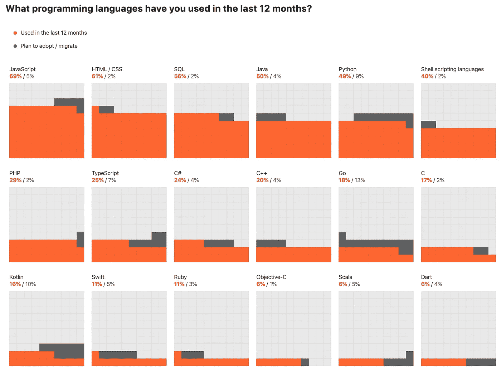

# 每个初学者都应该学习的飞镖方法

> 原文：<https://betterprogramming.pub/dart-methods-for-beginners-2ce4a9d8e686>

## Dart 中的实用程序方法可以帮助您减少编写代码所花费的时间


图像—无飞溅

Dart 是一种编程语言，由于 [Flutter](https://flutter.dev/) 的出现，它在最近一两年里受到了越来越多的关注。尽管这种语言是在 2013 年发布的，但谷歌决定在 Flutter 中使用 [Dart](https://dart.dev/) 已经成为这种语言的真正改变者。2019 年，Dart 首次参加了 Jetbrains 编程语言调查。



Dart 在 Jetbrains 调查中排名第 18

因此，如果你是开发者生态系统的新手，Dart 是我肯定会建议你和 JavaScript 一起学习的东西(从图片中不是已经很明显了吗？)肯定会随着 flutter 的成长获得更多人气。

因此，让我们深入研究一下 Dart 中一些最有用的方法，分为三个部分:**列表**、**字符串**和**日期时间**。

# 列表或数组

## 1.地图()

方法创建一个新的列表，其中包含对原始列表中的每个元素进行回调的结果。

```
var cars = [ 'mercedes’,‘bmw’,‘audi’,'tesla'];
var mapCars = cars**.map**((car) => ‘My car is  $car’).toList();
print(mapCars);
```

上述代码的输出将是:

```
[My car is mercedes, My car is bmw, My car is audi, My car is tesla]
```

## 2.排序()

`sort()`可用于根据提供的*排序*功能对元素进行排序。它也可以在没有函数的情况下工作。

```
cars.**sort**();
print(cars);***or using method cascades***print(cars..**sort**());
```

上面的代码片段将打印如下:

```
[audi, bmw, mercedes, tesla]
```

我们也可以定义自己的比较逻辑。假设我们需要通过比较每辆车的价格来排序，这将从函数`getPrice()`中获得。我们编写排序逻辑，如下所示，它将根据给定的价格对汽车列表进行排序:

```
cars.**sort**((a, b) => getPrice(a).compareTo(getPrice(b)));
```

## 3.包含()

这用于检查列表中是否存在给定的元素。`contains()` 返回一个布尔值。

```
print(cars.**contains**('bmw')); // output => true
print(cars.**contains**('toyota')); // output => false
```

## 4.减少()

这个方法也为数组的每个元素运行一个回调函数。但是 reduce 将每次回调的结果传递给下一次迭代。这个传递过来的值就是俗称的累加器(值是*通过每次迭代累计*)*。*

```
var **numbers** = [1, 3, 2, 5, 4];
var product = **numbers.reduce((curr, next) => curr * next)**;
print(product);
```

上面代码片段的输出将是`120` ***。***

这是从 1*3 + 3*2 + 6*5 + 30*4 得到的。

这里，每次迭代后的累加器将分别为 3、6、30 和 120*。*

# 线

## 5.startsWith()和 endsWith()

顾名思义，`startsWith()`方法可用于检查字符串*是否以给定的字符序列开始*，而`endsWith()`方法可用于检查字符串*是否以给定的字符序列结束*。如下所示，它区分大小写:

```
var name = ‘Medium is a great place to write articles’;print(name.**startsWith**(‘Medium’)); // **output =>** true
print(name.**startsWith**(‘medium’)); // **output =>** falseprint(name.**endsWith**(‘articles’)); // **output =>** true
print(name.**endsWith**(‘medium’)); // **output =>** false
```

## 6.左键盘()和右键盘()

如果字符串的长度小于指定的长度，此方法使用给定的字符或字符串向字符串添加填充:

```
var name = ‘I love Medium’;
print(name.**padLeft**(20, ‘xa’));// **output =>** xaxaxaxaxaxaxaI love Mediumprint(name.**padRight**(20, ‘x’));// **output =>** I love Mediumxxxxxxx
```

## 7.splitMapJoin()

基本上，这三个操作一起完成。根据 flutter.io 的说法:

> *拆分字符串，转换其各部分，并将其组合成一个新字符串。*

```
var newString = ‘I love medium I love medium’.**splitMapJoin**((new RegExp(r’medium’)),
 onMatch: (m) => ‘like ${m.group(0)}\n’,
 onNonMatch: (n) => ‘’);
 print(newString);
```

上面代码片段的输出将是:

```
like medium
like medium
```

# 日期

## 8.isAfter()和**是 isBefore()**

如果一个日期在另一个日期之后，则返回 true。

```
**var** independenceDay = **DateTime.utc**(2019, 07, 4);
var halloween2019 = **DateTime.utc**(2019, 10, 31);print(halloween2019.**isAfter**(independenceDay)); // **output** => true
print(halloween2019.**isBefore**(independenceDay)); // **ouput** => false
```

## 9.toLocal()

将`DateTime`值转换为当前时区。

```
var date = DateTime.utc(2019, 10, 15);print(DateTime.utc(2019, 10, 15)); 
// **output** => 2019–10–15 00:00:00.000Zprint(date.toLocal());
// **output** => 2019–10–15 05:30:00.000
```

## 10.工作日和月份

这些是属性而不是方法。`weekday`可用于检查给定日期的当天。它返回一个 1–7 的整数(星期一到星期五)。

```
varindependenceDay = DateTime.utc(2019, 07, 4);print(independenceDay.weekday); 
// **output** => 4print(independenceDay.weekday == DateTime.sunday);  
// **output** => false
```

`month` 可以用来查看给定日期的月份。它返回 1–12 之间的整数(1 月到 12 月)。

```
varindependenceDay = DateTime.utc(2019, 07, 4);print(independenceDay.month == 5); // **output** => 7print(independenceDay.month == DateTime.july);
// **output** => true
```

就是这样。如果您正在学习 dart 来处理 flutter 项目，请查看我关于使用 GitHub Actions **的 Flutter 应用程序的 [**CI/CD 的文章。**](https://medium.com/better-programming/ci-cd-for-flutter-apps-using-github-actions-b833f8f7aac)**

感谢您的阅读！