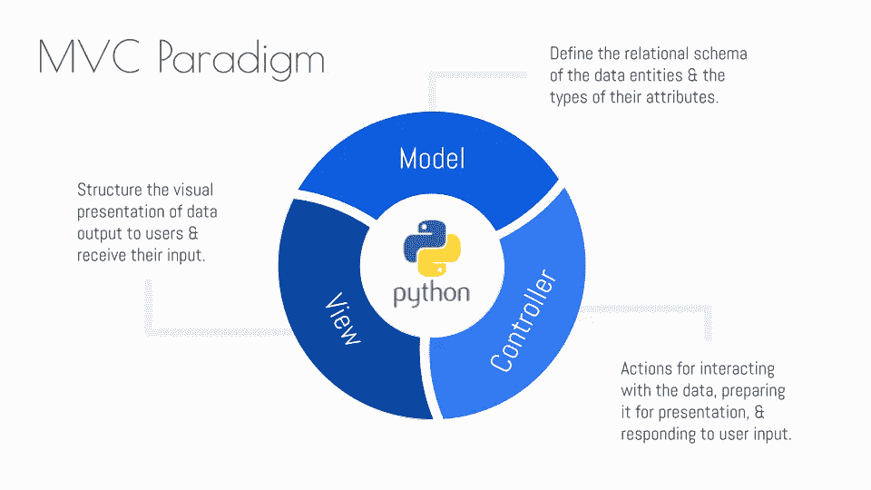
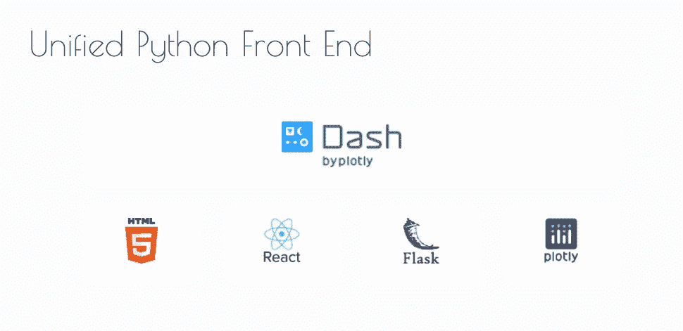
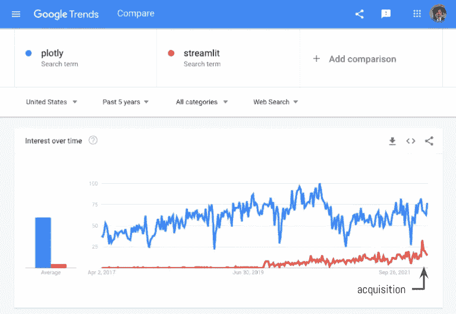
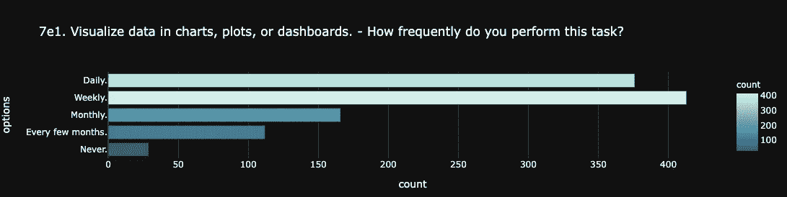
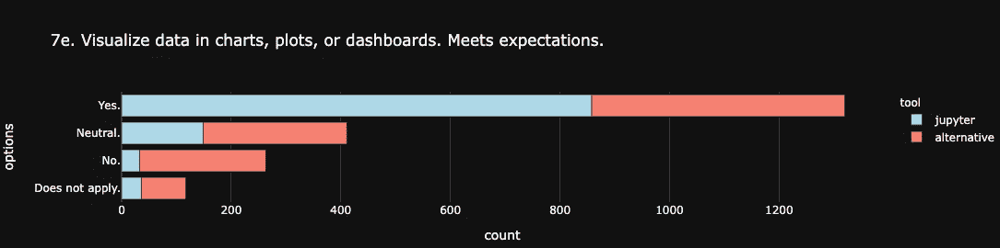
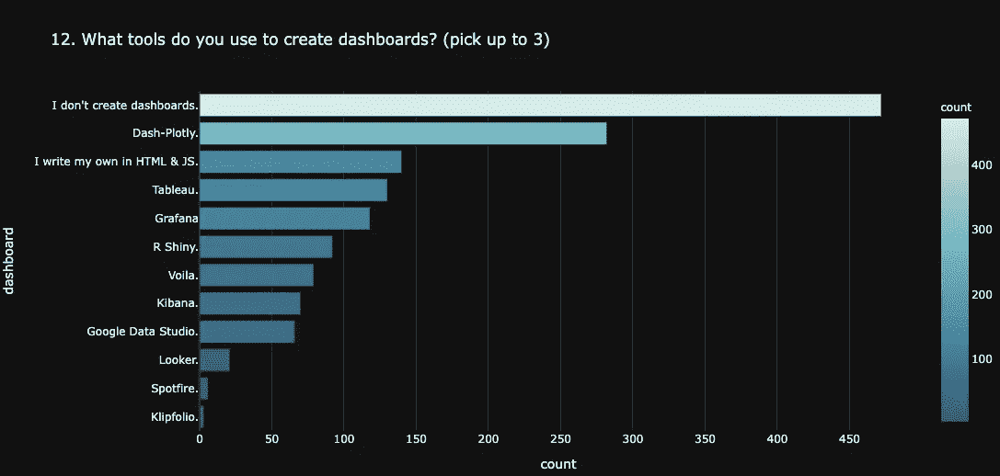
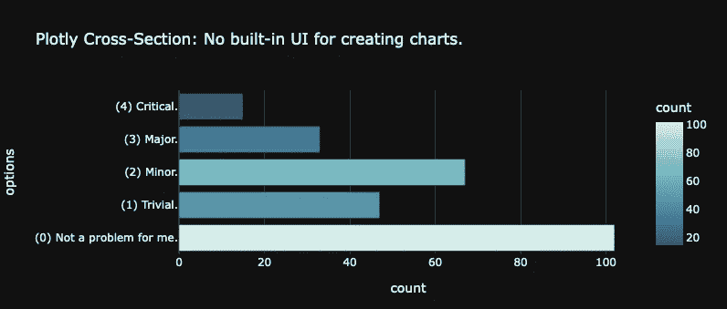
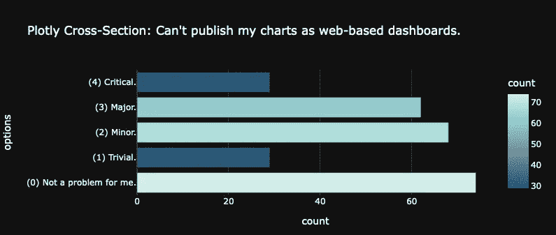

# 仪表板比仪表盘更深

> 原文：<https://betterprogramming.pub/dash-is-deeper-than-dashboards-5ab7414f121e>

## 使 Python 成为全栈语言的缺失环节


除了 AJAX 之外，我没有任何实时前端体验，Dash 让我能够轻松地开发这个应用程序

> 序言:为了做好准备，参考一下[的《反应式 Web 开发简史](https://aiqc.medium.com/brief-history-of-reactive-web-dev-5dde7270cdf7)，它是从这篇文章中抽象出来的。

# 💡Dash 为什么这么革命？

[*Dash 的*](https://github.com/plotly/dash) 反应式前端是使 Python 成为真正引人注目的全栈语言的缺失环节。它支持应用程序堆栈的每一层(例如前端和后端)使用同一编程语言的同一会话与*相同的数据进行交互，从而实现更快速、简单和直观的开发流程。*



模型-视图-控制器架构

Dash 通过以下方式革新了应用程序开发级别的[模型-视图-控制器(MVC)](https://en.wikipedia.org/wiki/Model%E2%80%93view%E2%80%93controller) 范式:

*   将*实时控制器*与视图紧密集成。
*   *消除对冗余数据序列化的需求&不同应用层/编程语言之间过于正式的 API*。一旦数据作为 Python 对象读入内存，像 Pandas DataFrames 这样的复杂对象就可以在堆栈中流畅地传递。
*   支持将全栈应用发布为简单的 Python 包。

简而言之，Dash 使任何 Python 开发者都能够成为全栈、 *10x* 发电站。

# 🔩Dash 是如何工作的？



Dash 抽象了 HTML/CSS、React、Flask 和 Plotly——将它们全部包装在一个统一且易于使用的 Python API 中。它做得如此之好，以至于你甚至意识不到 React 甚至在没有被告知的情况下参与其中。没有什么 web pack[JS 捆绑乱七八糟的东西要处理。](https://www.toptal.com/react/webpack-react-tutorial-pt-1)

*   `@app.callbacks`提供了一个 Pythonic API 来定义*控制器*方法。
*   `app.layout`提供了一个 Pythonic API，用于构建*视图*，这些视图与控制层挂钩。还有许多可插拔的[引导组件](https://dash-bootstrap-components.opensource.faculty.ai/docs/components/)。

```
from dash import html
import dash_bootstrap_components as dbc
from dash.dependencies import Output, Input*# Layout with a dropdown & placeholder paragraph.* app.**layout** = html.Div(
    dbc.Select(**id**='dropdown', options=['hi','bye']),
    html.P(**id**='target')
)*# Register inputs, outputs, and state (none in this case).* @app.**callback**(
    Output(component_id='target', component_property='children'),
    Input(component_id='dropdown', component_property='value'),
)
def **hello_world**(selection:str):
    return selection
```

1.  回调监视用 HTML IDs 标记的输入元素。
2.  回调函数运行。
3.  回调更新元素的输出。

真的就这么简单！

> *📚如果你想了解更多，我强烈推荐我的新朋友 Elias Dabbas 的书《带有 Plotly 和 Dash* *的* [*交互式仪表盘和数据应用》。他做了大量的工作，使得这个广泛的框架以渐进的方式变得可及。*](https://www.amazon.com/Interactive-Dashboards-Data-Apps-Plotly/dp/1800568916/ref=sr_1_1?crid=1A7GJRBABIEHF&keywords=Interactive+Dashboard+and+Data+Apps+with+Plotly+and+Dash&qid=1648922184&sprefix=interactive+dashboard+and+data+apps+with+plotly+and+dash%2Caps%2C83&sr=8-1)

# ⚖️短跑的利与弊


仪表板回调调试器

## 优点:

*   纯 Python——没有 JS 废话！除非你想包含自己的 JS `/assets`。
*   回调调试器*疯了*！这是如此鼓舞人心的信心，无论你连锁多少次回调，这东西都支持你。它实时监控你的应用程序，并在回调触发时发出信息脉冲。
*   [Jupyter](https://github.com/plotly/jupyter-dash) 和 [Django](https://github.com/GibbsConsulting/django-plotly-dash) 集成。
*   交叉过滤又名与图表互动。
*   为使用 Python/R/Julia 的团队提供多语言支持。
*   新:多页应用和参数化路线。

## 缺点(次要/有待改进的领域):

*   跟在球后面的是 [WASM](https://community.plotly.com/t/long-term-plan-for-how-dash-fits-in-with-webassembly/63696/4) 。
*   可悲的是，JupyterLab 集成无法使用。许多分析平台都服务于 JupyterLab，因此如果这种集成非常强大，那么 Dash 可能会成为 Jupyter 的应用/扩展框架选择。
*   对于一个被认为是关于“数据应用”的框架来说,`DataTable`组件令人失望既不好用也不时尚。我只是用了自举表。*【更新:参见新增* [*AG 网格*](https://dash.plotly.com/dash-ag-grid) *组件】*
*   我真的想要一种在初始化期间将参数传递到`app`中的方法，而不是仅仅依赖于`.py`文件中的全局变量。
*   感觉就像回调把所有的输入转换成字符串。不能使用 bool 和 int 类型。如果你不得不重新序列化你的数据，这就有点挫败了 zero JS。
*   我希望有一个选项可以使用`Interval` 来刷新整个应用程序，而不必费力地管理每次回调的`State`。
*   大多数文档都关注于从一个原始的`.py`文件启动 Dash 服务，但它实际上也可以作为一个子模块运行，例如`python -m aiqc.ui.app`

# 📬展望未来:分销机会



在 SaaS 世界，先发优势通常就是一切。这就是为什么 Streamlit 的成功如此令人惊讶。就在几周前，[雪花以 8 亿美元收购了 Streamlit】💸。它好像是一夜之间突然冒出来的。我无意冒犯他们，但这太突然了，我以为他们要么买了自己喜欢的东西，要么把第一轮融资全部投入到社交媒体活动中，为 GitHub 明星造势。](https://techcrunch.com/2022/03/02/snowflake-acquires-streamlit-for-800m-to-help-customers-build-data-based-apps/)

> 这是怎么发生的？请允许我转述我认为是彼得·泰尔在 [*零比一*](https://www.amazon.com/Zero-One-Notes-Startups-Future/dp/0804139296) *:* “你必须像创新你的产品一样创新你的分销策略。”

一方面，Streamlit 有一个[免费层，一个负担得起的团队层](https://streamlit.io/cloud#plans)，并且正在推动[社区开发的组件](https://streamlit.io/components)。另一方面，普罗特利的策略是什么？他们只[协商企业合同](https://plotly.com/get-pricing/)，你必须自己托管 Dash Enterprise，因为他们没有托管服务。Plotly 拥有庞大的用户群，但他们定价过高，无法从中获利。对我来说，一个有着如此受欢迎的开源根基的公司不采取宽漏斗平台的方法是荒谬的。他们没有发挥出自己的潜力。

[平台(即双边市场)导致指数增长](https://docs.google.com/presentation/d/1lgXsgFdzmIYii3y2MMxq9uHJFOHHZFULtMBUwgmEq6g/edit?usp=sharing)，因为:

*   平台允许你利用你不拥有的生产资产。社区实际上是为你制造产品和提供服务。而不是仅仅依靠内部销售/开发团队来履行企业咨询合同，这将导致*线性增长*。
*   平台促成了二次增长的网络效应。

# 🤔向前看:低代码是正确的举措吗？

## 💸大的低代码估值

随着像 [UiPath 这样的公司估值达到 350 亿美元](https://techcrunch.com/2021/02/01/robotic-process-automation-platform-uipath-raises-750m-at-35b-valuation/)和 [GrandView 预测低代码市场到 2027 年价值 870 亿美元](https://www.grandviewresearch.com/press-release/global-low-code-application-development-platform-market)——我理解 Plotly 专注于*低代码*的诱惑。很容易假设有人会在*“数据科学低代码应用”*领域大获全胜。如果你看看 Plotly 过去做了什么，那么这似乎是一个自然的进展:

*   Plotly 库→图表生成器用户界面
*   仪表板库→仪表板生成器用户界面。

从董事会的角度来看，这似乎是一个伟大的举动，但正如亚里士多德所说，“质疑一切。”

## 📊数据怎么说？

我有幸主持了 2021 年 JupyterLab 调查。我们对 1，100 多名数据科学家进行了广泛的调查，了解他们的使用案例和绘画要点。可视化是重点领域之一:



> ***【图表 7e 1】****说明数据科学家在频繁地创作图表。但是，* ***【图表 7e】****显示他们不需要帮助创建图表(看*“不”的数量*)。*

事实上，在调查*“没有用于创建图表的内置 UI”*痛点时，它是如此的不存在，以至于它在 33 个测试区域中排名**第 30 位**(倒数第 4)。你会把公司的未来押在 30 号最佳创意上吗？



> ***【图表 12】****显示 Plotly 是首选的主流仪表板工具。*
> 
> *现在，让我们看看那些表示他们使用 Dash-Plotly 创建仪表板的调查受访者的横截面。如果我们看看他们的可视化痛点，那么我们看到:* ***【图表左侧】*** *与…* ***【图表右侧】*** *相比，低代码 ui 明显不那么重要，只是简单地拥有一个放置*和*仪表板的地方；想想* [*RStudio 服务器的小蓝按钮*](https://docs.rstudio.com/connect/user/publishing/) *。*

这再一次指向了一种平台方法，社区可以共享 Dash 应用。这对 Plotly 来说很重要，因为 R 闪亮仪表板的创造者 RStudio 为了拥抱 Python，已经将自己重新定位为 Posit(见我的博客 [*RStudio 成功预测*](https://aiqc.medium.com/why-rstudio-err-posit-is-positioned-to-succeed-ffff79f42cb0) )。

## 🤷观点:Plotly 的高级 API 已经是低代码的了

也许数据科学家会不喜欢*构造和设计*他们自己的 HTML/CSS，所以低代码 Dash 会大受欢迎？或者人们将*从低代码模板开始*，然后过渡到编辑底层代码。我猜低代码可以敲出很多*简单用例*。

然而，刚刚构建了一个具有链式回调和基于间隔的刷新状态的 Dash 应用程序，低代码感觉很幼稚。况且 Dash 的真正价值在*回调*。即使使用低代码，难道你不需要自己编写回调函数吗？那么这有什么意义呢？仅仅是为了布局还是炒作？

我从来没有见过真正使用这些图表创建器 UI 的人，所以我们为什么要期望人们使用一个成熟的应用创建器 UI 呢？我确信 Plotly 在画布外观的 UI 上有一些[拖放功能](https://plotly.com/dash/dashboard-engine/)，在企业销售演示中看起来很流畅。然而，作为一名产品开发人员，当我想到`from dash import html`遇到低代码时，我不禁想起了 [Webflow](https://en.wikipedia.org/wiki/Webflow) 自 2013 年以来一直在进行的自动化网页创建的永恒追求。

其他疑惑:如果没有代码，那么 Dash 的低代码产品和其他低代码竞争对手有什么区别——对一个不会编码的人来说都一样吗？如果你不能使用高级 API，你实际上有能力在第一时间构建一个有价值的数据应用吗？与 MSFT Excel、Google Sheets、Tableau、PowerBI 中的数据透视表相比，低代码真的能给商业用户带来多少好处？

我并不是认为不可能实现一个低代码的 app builder。我只是觉得这是一个高强度/低价值的计划。

所以也许 Plotly 会因为追求低代码而获得很大的估值提升，但是我觉得产品本身就要积灰了。

当 Dash 拥有整个世界的具有代码能力的 Python+R+Julia 用户来利用时，它为什么还要追求低代码呢？细流不必如此。

在我看来，Plotly 需要**重新关注**他们的战略——将*转移到低端市场*,并进行一些*多租户平台化*,以便利用他们现有的用户群。