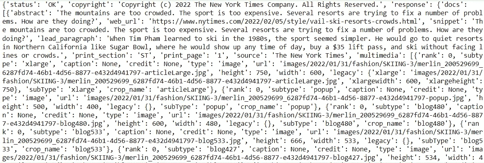
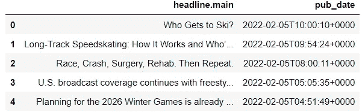
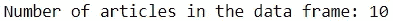
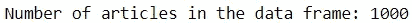

# 使用 API 收集数据——适用于初学者

> 原文：<https://betterprogramming.pub/data-collection-with-api-for-beginners-52b02e571944>

## 使用 Python 利用 API 获取数据的简单指南

道格拉斯·洛佩斯在 [Unsplash](https://unsplash.com?utm_source=medium&utm_medium=referral) 拍摄的照片

应用编程接口(API)已经成为我们已经习惯使用的许多产品和服务的核心组件。

它能够加强公司和客户之间的关系。对于公司来说，这是一种向客户推广自己业务的便捷方式，同时确保了后端系统的安全性。对于客户来说，API 提供了访问数据的方法，这些数据可以用来推动他们的研究或产品开发。

在这里，我将简要概述 API，并演示如何使用 Python 将这一资源用于您自己的数据收集。

# 数据收集的形式

在讨论 API 之前，让我们快速回顾一下获取数据时的选项。

## 1.收集您自己的数据

这一个似乎是显而易见的；如果你想要一些数据，为什么不自己收集呢？毕竟没有人比你自己更了解你的要求。所以，只要出去就可以开始收集，对吗？

不对。

在大多数情况下，收集自己的数据是一个荒谬的想法。获得所需数量和质量的信息需要相当多的时间、金钱、人力和资源。

这是一项不可行(如果不是不可能的话)的事业。

## 2.使用现成的数据集

当您可以使用其他人的预处理数据集时，为什么要经历收集和处理数据的麻烦呢？

现成的数据集可能很有吸引力，因为有人已经为你做了制作它们的所有艰苦工作。毫无疑问，你在 Kaggle.com 和 Data.gov 这样的网站上遇到过很多。

不幸的是，这种方法的便利性是以灵活性和控制为代价的。当您使用现成的数据集时，您会受到在上传之前对该数据集执行的预处理的限制。

一些可能对您有用的记录或特性可能被源丢弃了。

这些数据源当然有它们的优点，但是它们的局限性会给任何后续的分析或建模增加约束，并且会妨碍项目的成功。

## 3.网页抓取

网络搜集在某种程度上是介于收集你自己的数据和使用别人的数据之间的中间地带。

你可以访问其他人的网站，选择你想要收集的部分，从而获取他们的数据。

从理论上讲，这似乎是一笔不错的交易，但是网络抓取有它自己的注意事项。

首先，通过抓取从网站中提取数据可能具有挑战性。Selenium 等 Web 抓取工具需要对 HTML 和 XML 路径语言(XPath)有很强的掌握。此外，浏览网站和获取所需信息所需的脚本可能很长，可能需要大量时间来编写。

此外，网络抓取有时是不道德的，甚至是非法的。虽然一些网站对抓取没有疑虑，但其他网站可能就不那么宽容了。网站上传受版权保护的数据或设置条款规定抓取条件的情况并不少见。

没有足够的谨慎和关心的网络抓取可能会给你带来麻烦。

## API 的优势

API 提供了一种获取所需数据的方法，同时避免了上述数据收集方法的缺点。

它免去了您自己收集数据的麻烦，因为您可以直接从另一个实体获取数据。你可以自由地选择你想处理的原始数据。

你也不需要担心任何法律后果。在允许你访问他们的 API 之前，公司要求你拥有一个名为 **API 密钥**的标识符。您可以通过直接申请获得 API 密钥。API 密匙作为进入的屏障，确保只有经过公司批准的客户才能从 API 中获益。

最后，这个资源最好的部分是它可以用几行代码简化数据提取！

# API 的作用简单来说就是

那么，在您从外部来源收集数据的过程中，API 扮演了什么角色呢？要回答这个，首先要介绍一点术语。

当一个客户想要从一个外国服务器访问某些数据时，他们向那个服务器发出一个**请求**。

当服务器收到请求时，它生成一个**响应**，并将其发送回客户端。

API 在这种交换中扮演了中间人的角色。它负责将您的请求传递给服务器，然后将相应的响应传递回给您。

# 使用 API

不幸的是，处理 API 没有一种通用的方法。

不同来源的 API 在可访问性和实现方面有所不同。

大多数网站对请求都有自己独特的要求，并为其响应设置了独特的格式。它们在限制方面也不同。例如，一些 API 会限制一天中可以发出的请求数量。

因此，要理解一个特定的 API，你需要阅读他们的文档。

## 个案研究

尽管 API 使用起来很简单，但一开始可能很难理解。让我们演示一下如何使用它们来收集数据。

我们将使用来自纽约时报的 API，名为[文章搜索 API](https://developer.nytimes.com/docs/articlesearch-product/1/overview) 。这个 API 允许您通过查询来搜索文章。

他们的文档清楚地解释了如何为请求创建 URIs。您可以自定义 URI 来请求特定的文章。例如，您可以指定文章的发布日期并应用其他过滤器。

首先，我们在 Python 中创建一个函数，该函数在给定查询、排序顺序、页码和 API 键的情况下为 API 生成一个 URI。

注意:这里，变量 API_KEY 将 API 键存储为一个字符串。你可以通过[纽约时报开发者账号](https://developer.nytimes.com/)申请一个 API 密匙。

例如，假设我们希望获得与冬季奥运会相关的最后 1000 篇文章。我们可以通过使用函数获得请求的 URI。

用 Python 发出请求是一个简单的“请求”包任务。一旦发出请求并收到来自服务器的响应，就必须解析响应，它是 JSON 格式的(对于本例)。

所有这些都在下面的代码中执行。

有多简单？

现在，让我们来看看回应。

代码输出(由作者创建)

很罗嗦，对吧？这是你通常能从回应中期待的。

在我们的例子中，API 以嵌套 JSON 对象的形式返回数据。

为了提高可读性，我们可以将这些数据显示为数据框。这似乎很困难，因为嵌套的 JSON 对象很难解包。

幸运的是，Pandas 函数`json_normalize`允许我们轻松处理嵌套的 JSON 对象。

以下是前 5 篇文章的标题和发表日期:

代码输出(由作者创建)

API 文档中包含了响应中提供的所有信息的详细信息。

现在，让我们看看从回复中获得了多少文章:

代码输出(由作者创建)

正如您所看到的，数据框只有 10 条记录，没有达到我们希望收集的 1000 篇文章。这是怎么回事？

很简单，真的。《纽约时报》API 对每个请求保持 10 篇文章的限制。

获取 1000 篇文章很容易；我们简单地发出多个请求(每个请求中有不同的页码),直到我们收到所需数量的数据。

注意:第 26 行中的`time.sleep(6)`命令用于增加每个请求之间的时间间隔。添加这一行是因为纽约时报 API 对一分钟内可以发出的请求数量进行了限制。

现在，让我们看看新数据框中存储了多少文章。

代码输出(由作者创建)

瞧啊。我们已经获得了《纽约时报》发表的最近 1000 篇关于冬奥会的文章。

# 结论

照片由 [Unsplash](https://unsplash.com?utm_source=medium&utm_medium=referral) 上的 [Prateek Katyal](https://unsplash.com/@prateekkatyal?utm_source=medium&utm_medium=referral) 拍摄

总而言之，对于那些希望构建应用程序或进行数据驱动研究的人来说，API 是一个无价的资源。

虽然它们确实有一个学习曲线，但是一旦您习惯于阅读 API 文档、向服务器发出请求并将后续响应转换为可用格式，就很容易克服。

我祝你在数据科学的努力中好运！