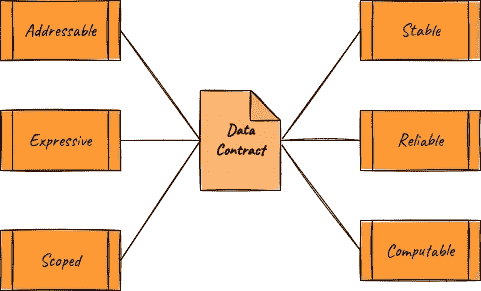
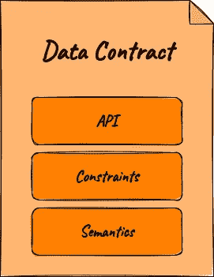
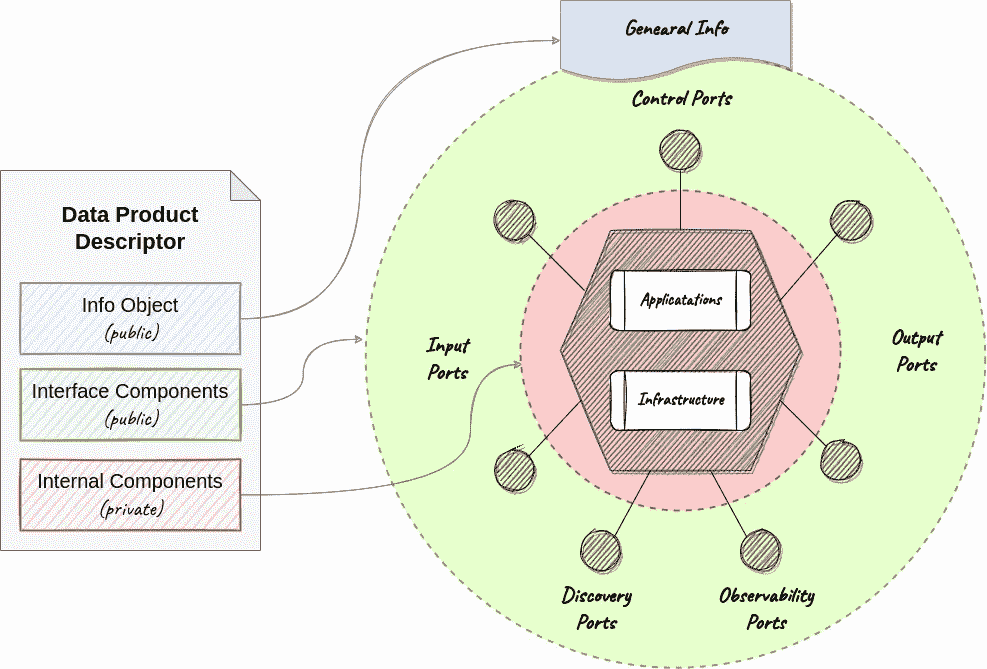
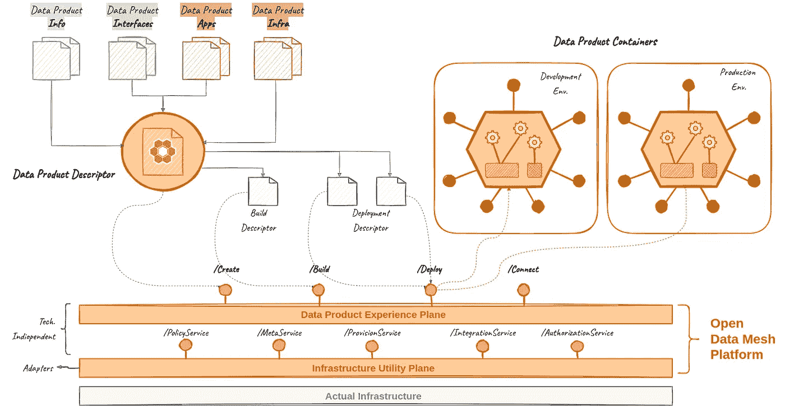
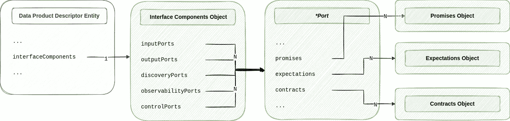
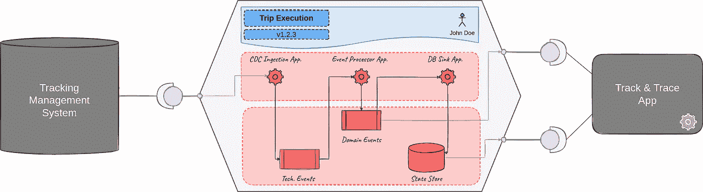
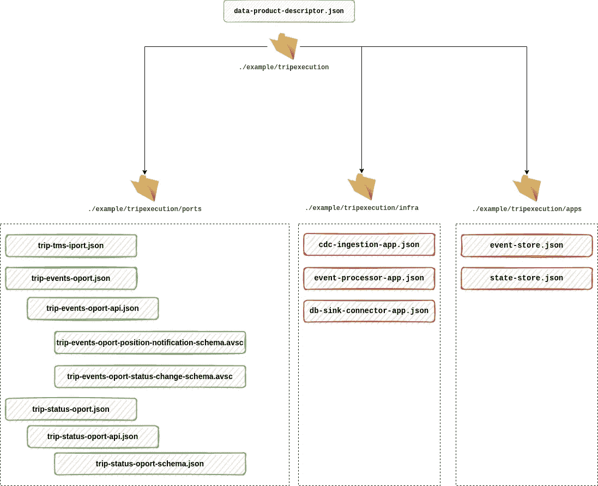

# 实践中的数据契约

> 原文：<https://betterprogramming.pub/data-contracts-in-practice-93e58d324f34>

## 它们是什么，它们为什么重要，以及如何定义它们


在 [Unsplash](https://unsplash.com?utm_source=medium&utm_medium=referral) 上 [Mari Helin](https://unsplash.com/@mari?utm_source=medium&utm_medium=referral) 拍摄的照片

在本文中，我将向您展示我在 [Quantyca](https://www.quantyca.it/) 的团队如何定义和使用数据契约。不要担心理解那是什么。在第一部分之后，有一个完整的例子。这个理论很好，但我更喜欢留给你一些实际的东西，我们可以讨论，也许可以用来一起向前迈进一步。

# 我们在谈论什么

数据契约首先是数据生产者和消费者之间的正式协议。在应用程序世界中，这些安排是服务提供者和其消费者之间的标准，但在数据世界中它们不是规范。

当然，专家数据团队用于模块化他们的集成管道，并通过正式协议定义模块之间的清晰接口，这是一个很好的工程实践。从工程的角度来看，同一个团队拥有的模块之间的协议通常是一个好主意，但是协议的真正价值在于不同团队拥有的模块之间。在数据世界中，这正是大多数时候缺少正式协议的地方。

这种协议的缺乏在数据世界中是显而易见的，尤其是在应用程序产生的数据和下游所有分析消费者之间。对于数据工程师来说，在没有所有者任何保证的情况下，从运营系统中提取数据是正常的。有时候，他们甚至会忘记这是不正常的。一个团队对另一个团队拥有的东西负责是不正常的，因为从长远来看这是不可持续的。

这是数据契约背后的关键点，它在数据社区中产生了如此多的兴趣。它们提醒我们一些我们已经知道但有时会忘记的事情:生产者必须对他们向消费者公开的数据负责，而不是相反。运营生产商是个例外。

# 为什么它们很重要

数据契约现在是一个热门话题，因为它们处于数据管理中以下三个关键趋势的交汇点:数据中心、数据网格和数据操作。

根据[以数据为中心的宣言](http://www.datacentricmanifesto.org/)，应用程序不应该是架构的中心，数据必须是。应用程序生成并使用数据，但它们不能将这些数据视为副产品。他们必须把它还给生态系统的其他部分，值得信赖，易于消费。应用程序必须对它们的数据负责，而不是下游的某个人。在这种情况下，合同是正式确定这种责任的自然方式。

Data Mesh 提倡一种模块化的数据架构，它由多个所有权分散的数据产品组成。这些通常被推送到拥有数据的业务领域。数据产品必须有明确的所有权，但这还不够。要成为一个真正的项目，数据还必须有一个向其消费者公开的清晰的接口，该接口正式指定了产品的范围、提供的服务以及如何访问它们。同样，这正是数据契约的意义所在。

DataOps 专注于数据管理相关操作的自动化和可再现性。帮助实现这两大支柱的解决方案在很大程度上依赖于元数据收集和激活。在这种情况下，数据契约是第一元数据源，由数据所有者主动提供，而不是由专门的团队在以后收集。

# 诀窍在哪里

当在不同团队拥有的生产者和消费者之间定义时，数据契约具有真正的影响。所以它们是一个社会技术问题。技术部分是最容易的。


作为社会技术问题的数据契约

为定义、存储和执行数据契约而设计的规范和工具仍然不成熟，但从技术角度来看，这不是火箭科学。我们已经有了所有的基本成分；把它们放在一起只是时间问题。很快，捆绑解决方案也将在市场上提供给那些更喜欢购买选项而不是制造选项的人。

从组织的角度来看，采用数据契约的挑战更加复杂。您必须调整运营模式，将数据所有权推向左边，并建立正确的激励机制，以确保每个人都参与进来。强有力的赞助是开始的必要条件，但这还不够。同样重要的是，在文化层面上工作，以获得所有相关团队的正确认同，而不仅仅是数据团队。处理人员和组织的变化是非常困难的。在开始之前，您必须意识到数据契约采用的这一棘手部分。

# 特征

与所有类型的服务协议一样，数据合同应该:

*   可寻址:数据协定必须有唯一的名称和版本号。
*   表达性:组成数据契约的所有协议必须以明确的方式明确定义。必须清楚地描述涉及各方尊重数据契约所需的所有有意义的上下文信息。必须是自我描述的。没有什么是可以假定的，也没有什么是不言自明的。
*   范围:组成数据契约的每个协议都必须有一个符合其目的的明确范围。应避免支持协议特定目的不需要的信息。
*   稳定:随着时间的推移，数据契约应该相当稳定。在不断变化的数据资产上投入时间来定义和协商合同是没有意义的。当然，数据契约可以改变，但是应该保证最低水平的稳定性，因为每一个改变都会影响下游消费者。数据契约的描述应该指定如何处理潜在的更改(例如，弃用策略)。
*   可靠:数据契约必须是所有参与方都可以预测实现的。同意一方或多方不可行的事情是没有意义的。当然，有时可能会发生数据契约不被遵守的情况，但这肯定是一个不受欢迎的例外，而不是常态。
*   可计算的:如果可能的话，数据契约应该是机器可读的，将契约定义为人类可读的文档是可以的。至少，这是一个明确定义团队间协议的起点。无论如何，这些协议都有责任，这意味着负责遵守协议的团队要付出额外的努力。从长远来看，设计和操作合同所需的自动化活动对他们的成功至关重要。自动化要求将契约定义为代码，以使它们在大多数时候可以被底层平台工具计算。



数据契约的关键特征

# 成分

数据契约通过共享协议规范了数据生产者和消费者之间的交互。这些协议可分为以下三大类:

*   API:这类协议描述了如何访问和使用公开的数据。一个好的 API 包含关于服务位置、支持的通信协议、认证方法、可用端点和交换数据的模式的信息。存在不同的标准和规范来描述不同类型的 API(例如， [OpenAPI](https://swagger.io/specification/) 用于 REST 服务， [AsyncAPI](https://www.asyncapi.com/docs/reference/specification/v2.5.0) 用于流服务，以及 [DatastoreAPI](https://dpds.opendatamesh.org/resources/standards/dsapi-spec/) 用于基于连接的数据服务)。
*   约束:这类协议描述了受支持的 SLO 和 SLA 以及通用协议，如条款和条件、折旧政策、计费政策、预期使用模式等。
*   语义:这类协议描述了公开数据的语义。在所有关于数据契约的讨论中，这一部分的重要性是公认的。无论如何，形式化语义的方法仍然很不明确。语义至少有三种主要方法:模式标记(例如，模式 A 中的字段 X 被标记为 PII)、模式到模式链接(例如，模式 A 中的字段 X 等于模式 B 中的字段 Y)、语义链接(例如，模式 A 中的表 T 与公司知识图的节点`N`相关联)。这些方法是互补的，可以一起使用。



数据契约关键组件

# 标准化

在采用数据契约时，根据您的特定需求预先定义它们的结构和内容非常重要。拥有关于如何描述数据契约的清晰的内部规范有助于减少团队的认知负荷，并促进与利用契约来自动化操作的工具(例如，契约执行工具、策略检查工具、数据目录等)的交互。).

我在 [Quantyca](https://www.quantyca.it/) 的团队最近开源了[规范](https://dpds.opendatamesh.org/)，我们在内部使用它来描述数据产品的所有组件:接口、应用程序和基础设施资源。



数据产品描述符文档结构

我们使用该规范为每个数据产品创建一个描述符文档，在整个生命周期中使用该文档来自动化从部署到退役的操作活动。



开放式数据网格平台

数据契约在规范中与接口相关的部分进行了描述。数据产品接口设置了一个共享的边界，数据产品和它的消费者通过这个边界交换信息。规范通过[接口组件](https://dpds.opendatamesh.org/resources/specifications/1.0.0-DRAFT/#interface-components-object)来描述，接口组件根据其在命名为端口的实体中的功能角色来分组。该规范支持以下五种类型的端口:

*   输入端口:输入端口描述了一组由数据产品公开的服务，用于收集其源数据，并使其可用于进一步的内部转换。输入端口可以以推送(即，异步订阅)或弹出模式(即，同步查询)从一个或多个上游源接收数据。每个数据产品可以有一个或多个输入端口。
*   输出端口:输出端口描述了一组由数据产品公开的服务，以一种可以理解和信任的方式共享生成的数据。每个数据产品可以有一个或多个输出端口。
*   发现端口:发现端口描述了由数据产品公开的一组服务，以提供关于其在整个架构中的静态角色的信息，如目的、结构、位置等。每个数据产品可能有一个或多个发现端口。
*   可观察性端口:可观察性端口描述了一组由数据产品公开的服务，以提供关于其在整个架构中的动态行为的信息，如日志、跟踪、审计跟踪、度量等。每个数据产品可以有一个或多个可观察端口。
*   控制端口:控制端口描述了一组由数据产品公开的服务，用于配置本地策略或执行高特权治理操作。每个数据产品可以有一个或多个控制端口。

数据契约与输出端口特别相关，输出端口将数据产品使用的所有服务接口组合在一起，以向外部消费者公开生成的数据。

# 服务协议

该规范根据服务协议描述了所有接口，而不管具体的端口类型。

数据契约只是一种特殊类型的服务协议，因为一方面，有不公开数据的服务，另一方面，有不是契约的协议。具体来说，该规范使用以下[承诺理论](https://www.amazon.com/Thinking-Promises-Designing-Systems-Cooperation/dp/1491917873)的概念来正式描述数据产品的接口组件(即数据产品的端口):

*   承诺:通过承诺，数据产品声明了端口的意图。承诺并不是结果的保证，但是数据产品会相应地表现出来以实现它的意图。随着时间的推移，数据产品越是信守承诺，它就越值得信赖。因此，一个数据产品越值得信赖，就会有越多的潜在消费者使用它。信任是基于验证一个数据产品过去在遵守承诺方面有多好。这种验证应该由底层平台自动完成，并在与所有潜在消费者共享的信任分数中进行综合。承诺的例子有服务的 API 描述、SLO、折旧政策等。
*   期望:通过期望，数据产品声明它希望端口如何被它的消费者使用。期望是承诺的反义词。它们是一种明确说明数据产品希望消费者就如何使用端口做出什么承诺的方式。期望的例子有预期用途、预期受众等。
*   契约:通过契约，数据产品声明了它自己和它的消费者必须遵守的承诺和期望。契约是数据产品及其消费者之间的一组明确义务。它用于对所有承诺和期望进行分组，如果不遵守这些承诺和期望，可能会产生罚款，如货币制裁或服务中断。合同的例子有条件条款、SLA、计费策略等。

下图显示了描述数据产品公共接口的描述符文档的一部分。



数据产品描述符文档的接口组件

# 给我看看代码

好吧，空谈不值钱。让我们看一个例子，我们如何使用规范来正式描述数据产品输出端口的接口。

作为一个示例数据产品，我们使用了在下图所示的规范的[快速入门部分](https://dpds.opendatamesh.org/quickstart/)中使用的产品:



行程执行数据产品

Trip Execution 数据产品是一个源对齐的数据产品，它从源操作系统中读取数据，并通过两个输出端口`tripStatus`和`tripEvents`向其消费者公开丰富的数据。从[主描述符文件](https://github.com/opendatamesh-initiative/odm-specification-dpdescriptor/blob/main/examples/tripexecution/data-product-descriptor.json)中提取的以下片段显示了描述这两个输出端口接口的块结构:

```
{
    "dataProductDescriptor": "1.0.0",
    "info": {
        "name": "tripExecution",
        "fullyQualifiedName": "urn:dpds:com.company-xyz:dataproducts:tripExecution:1",
        "version": "1.2.3",
        "domain": "Transport Management",
        "owner": {
            "id": "john.doe@company-xyz.com",
            "name": "John Doe"
        }
    },
    "interfaceComponents": {
        "inputPorts": [
            {
                "description": "Through this port trip data is ingested from TMS",
                "$ref": "https://github.com/opendatamesh-initiative/odm-specification-dpdescriptor/blob/main/examples/tripexecution/ports/tms-trip-iport.json"
            }
        ],
        "outputPorts": [
            {
                "description": "This port exposes the last known status of each trip operated in the last 12 months",
                "$ref": "https://github.com/opendatamesh-initiative/odm-specification-dpdescriptor/blob/main/examples/tripexecution/ports/trip-status-oport.json"
            },
            {
                "description": "This port expose all modifications in the status of each trip as events",
                "$ref": "https://github.com/opendatamesh-initiative/odm-specification-dpdescriptor/blob/main/examples/tripexecution/ports/trip-events-oport.json"
            }
        ]
    },
    "internalComponents": {...}
}
```

如您所见，两个端口接口都不是内联定义的，而是在一个外部引用文件中定义的，以简化描述符文件的可读性和可维护性。让我们看看这两个端口的实际定义。

这是公开与`Trip Entity`相关的事件的`tripEvents`端口的定义。

```
{
    "fullyQualifiedName": "urn:dpds:com.company-xyz:dataproducts:tripExecution:1:outputports:tripEvents",
    "name": "tripEvents",
    "displayName": "Trip Events",
    "description": "This port exposes a *stream of events* related to the `Trip` entity",
    "version": "1.2.0",
    "promises": {
        "platform": "westeurope.azure:confluent",
        "serviceType": "streaming-services",
        "api": {
            "specification": "asyncapi",
            "version": "2.5.0",
            "definition": {
                "mediaType": "text/json",
                "$href": "https://github.com/opendatamesh-initiative/odm-specification-dpdescriptor/blob/main/examples/tripexecution/ports/trip-events-oport-api.json"
            },
            "externalDocs": {
                "description": "The AsyncAPI v2.5.0 specification used to define the API of this port",
                "mediaType": "text/html",
                "$href": "https://www.asyncapi.com/docs/reference/specification/v2.5.0"
            }
        },
        "deprecationPolicy": {
            "description": "When a new major version become available the previous one is kept online for 3 months",
            "x-deprecation-period": "3M"
        },
        "slo": {
            "description": "The SLO are hight for all base service indicators because this service is business critical",
            "x-operationalSlo": {
                "availability": "0.99999",
                "responsetime": "1s"
            },
            "x-qualitySlo": {
                "freshness": "5m"
            }
        }
    },
    "expectatctions": {
        "audience": {
            "description": "This port is designed to help operations departments. It is not for customer care and finance departments",
            "x-includes": [
                "operations"
            ],
            "x-excludes": [
                "customer-care",
                "finance"
            ]
        }
    },
    "contracts": {
        "termsAndConditions": {
            "description": "A detailed description of the data product, that include also the target audience",
            "externalDocs": {
                "mediaType": "text/html",
                "$href": "https://wiki.example-xyz.com/corporate-mesh/dp/trip-execution.html#terms-and-conditions"
            }
        },
        "billingPolicy": {
            "description": "This port is billed by outbound throughput",
            "x-billingUnit": "MB",
            "x-pricePerUnit": 0.005,
            "x-billingPeriod": "month"
        },
        "sla": {
            "description": "The sla are hight for all base service indicators because this service is business critical",
            "x-operationalSla": {
                "availability": "0.999",
                "responsetime": "5s"
            },
            "x-qualitySla": {
                "freshness": "10m"
            }
        }
    }
}
```

它指向一个[外部文件](https://github.com/opendatamesh-initiative/odm-specification-dpdescriptor/blob/main/examples/tripexecution/ports/trip-events-oport-api.json)，该文件包含基于 [AsyncAPI 规范](https://www.asyncapi.com/docs/reference/specification/v2.5.0)的 API 定义。

这是`tripStatus`端口的定义，暴露了`Trip Entity`的更新状态。

```
{
    "fullyQualifiedName": "urn:dpds:com.company-xyz:dataproducts:tripExecution:1:outputports:tripStatus",
    "name": "tripStatus",
    "displayName": "Trip Status",
    "description": "The last known status of each trip operated in the last 12 months",
    "version": "1.2.0",
    "promises": {
        "platform": "westeurope.azure::postgres",
        "serviceType": "datastore-services",
        "api": {
            "specification": "datastoreapi",
            "version": "1.0.0",
            "definition": {
                "mediaType": "text/json",
                "$href": "https://github.com/opendatamesh-initiative/odm-specification-dpdescriptor/blob/main/examples/tripexecution/trip-status-oport-api.json"
            },
            "externalDocs": {
                "description": "The OpenAPI v3.1.0 specification used to define the API of this port",
                "mediaType": "text/html",
                "$href": "https://spec.openapis.org/oas/v3.1.0"
            }
        },
        "deprecationPolicy": {
            "description": "When a new major version become available the previous one is kept online for 3 months",
            "x-deprecation-period": "3M"
        },
        "slo": {
            "description": "The slo are hight for all base service indicators because this service is business critical",
            "x-operationalSlo": {
                "availability": "0.99999",
                "responsetime": "1s"
            },
            "x-qualitySlo": {
                "freshness": "5m"
            }
        }
    },
    "expectatctions": {
        "audience": {
            "description": "This port is designed to help operations departments. It is not for customer care and finance departments",
            "x-includes": [
                "operations"
            ],
            "x-excludes": [
                "customer-care",
                "finance"
            ]
        },
        "usage": {
            "description": "This port is designed to operational access not for analysis",
            "x-filterOn": [
                "id"
            ],
            "x-forbiddenOperations": [
                "group-by",
                "unfiltered-selections"
            ]
        }
    },
    "contracts": {
        "termsAndConditions": {
            "description": "A detailed description of the data product, that include also the target audience",
            "externalDocs": {
                "mediaType": "text/html",
                "$href": "https://wiki.example-xyz.com/corporate-mesh/dp/trip-execution.html#terms-and-conditions"
            }
        },
        "billingPolicy": {
            "description": "This port is billed by number of monthly queries",
            "x-billingUnit": "milion queries",
            "x-pricePerUnit": 0.01,
            "x-billingPeriod": "month",

        },
        "sla": {
            "description": "The sla are hight for all base service indicators because this service is business critical",
            "x-operationalSla": {
                "availability": "0.999",
                "responsetime": "5s"
            },
            "x-qualitySla": {
                "freshness": "10m"
            }
        }
    }
}
```

它指向一个包含基于 [DatastoreAPI 规范](https://github.com/opendatamesh-initiative/odm-specification-datastoreapi/blob/main/versions/1.0.0-DRAFT.md)的 API 定义的[外部文件](https://github.com/opendatamesh-initiative/odm-specification-dpdescriptor/blob/main/examples/tripexecution/ports/trip-status-oport-api.json)。

在这个 [GitHub 文件夹](https://github.com/opendatamesh-initiative/odm-specification-dpdescriptor/tree/main/examples/tripexecution)中可以找到完整的描述符文件及其所有外部依赖项。下图总结了该文件夹的结构。



# 还有更多

在本文中，我描述了我个人对数据契约的看法——它们是什么，为什么它们很重要，以及如何定义它们。在本系列的下一篇文章中，我将解释我们如何使用数据产品描述符文档在部署时和运行时执行契约。

欢迎任何反馈。不要害羞；).