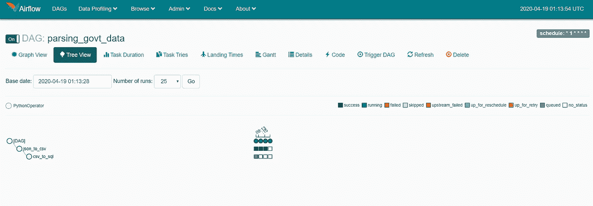
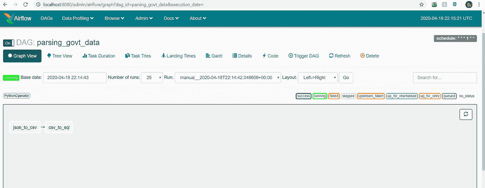

# 数据工程 101:自动化您的第一次数据提取

> 原文：<https://betterprogramming.pub/data-engineering-101-automating-your-first-data-extract-845c84f119cc>

## 从旧金山的 311 频道提取实时数据

由[丹尼斯·库默](https://unsplash.com/@dekubaum?utm_source=medium&utm_medium=referral)在 [Unsplash](https://unsplash.com?utm_source=medium&utm_medium=referral) 拍摄的照片。

在过去的几周里，我们讨论了[数据工程和自动化](https://medium.com/better-programming/data-engineering-101-writing-your-first-pipeline-f19436ba614c)领域的几个重要话题。

我们已经为理解数据工程师使用的[词汇和基本概念](https://medium.com/better-programming/data-engineering-101-from-batch-processing-to-streaming-54f8c0da66fb)打下了基础。现在是时候开始构建您的第一组批处理作业了。

为此，我们将使用 [Apache Airflow](https://airflow.apache.org/) 库来帮助自动化我们的工作。

此外，对于我们的实时数据源，我们将使用 [sfgov 311](https://data.sfgov.org/resource/vw6y-z8j6.json) 数据集。可以随时拉取这些信息，获取 311 报告的最新数据。这通常包括破坏公物、违规停车等。

对于这个管道，我们首先将数据提取到一个原始的 CSV 中，然后将它加载到一个 MySQL 数据库中。

在本文中，我们将概述这样做所需的代码，并指出我们采取各种步骤的一些原因。

# 创建 JSON 提取函数

在开始之前，您需要设置一个气流环境，以便能够遵循本文中讨论的每个步骤。如果你还没有这样做，我们发现这篇文章是我们个人最喜欢的文章之一。

当创建数据管道时，尤其是那些更加面向批处理的管道，将数据提取到原始数据层是有益的。这样做可以让您拥有原始数据的备份。

当数据中有错误时，拥有一个原始文件可以帮助您确定数据错误是在源中还是在整个过程中。

在我们的例子中，我们将从在线的 JSON 数据集中提取数据。我们可以使用一个名为`[read_json](https://pandas.pydata.org/pandas-docs/stable/reference/api/pandas.read_json.html)`的 pandas 函数来做到这一点。这可以读取文件或 URL。

我们将通过创建一个可以调用的函数来实现这一点，该函数将从 URL 或文件中提取基于 JSON 的数据。

我们还可以为文件名添加时间戳，以确保我们知道何时提取数据。这可以在以后尝试跟踪数据中的任何更改时使用，这些更改可能更像是快照而不是更新数据。

这可以通过使用`DateTime` 对象来完成，如下所示:

这个文件名将在我们下面创建的提取函数中使用:

这项任务仍然需要实施。然而，一旦我们设置了加载功能，我们将在最后向您展示。

# 用 Airflow 将数据加载到 MySQL

一旦有了提取，下一步就是将数据加载到数据仓库中的某种原始层。

这一步的关键是不要操纵你的数据。原因是，如果您的数据在数据源中有某种形式的数据问题，那么追溯起来就更容易了。

你可以通过在每一步进行数据质量检查来做到这一点。在原始检查中，您通常检查数据类型是否有意义。

例如，所有日期字段都是日期吗？所有的州都是有效的州吗？信不信由你，我们这里有问题。“我们”不是一个州的缩写。

这些是健全性检查，以确保您提取的数据是正确的。

理论上，您的应用程序应该仔细检查用户输入。然而，我们从不信任应用层。

除此之外，您可以使用下面的代码。您会注意到，我们首先使用 MySQL 建立了一个数据库连接，然后逐行加载 CSV:

如果您正在构建一个更健壮的系统，那么您可能会设置某种形式的数据库管理器类，它只接受您导入的连接字符串。

然而，因为我们只是为了演示而构建它，所以我们把所有代码都放在了一个函数中。

设置好所有这些功能后，您现在可以正式设置您的 DAG 了。正如我在之前的文章中提到的，DAG 就像一个流程图。它指导哪些任务先运行，哪些任务依赖于其他任务。

在我们的例子中，我们有一个任务提取数据，另一个任务将数据加载到 MySQL 表中。这两个基本任务将有助于启动您的管道，如下图所示。

# 设置气流管道

现在有了所有这些函数，我们就可以建立管道了。

在 Airflow 中设置实际管道需要设置一组默认参数。这允许您设置所有者、开始日期、管道重试的频率以及其他几个参数:

除了参数之外，您还需要实际设置您的特定操作符。在这个例子中，我们有两个函数:`jsonToCSV`和`csvToSql`。这些将用于`PythonOperator`。这允许你创建我们称之为任务的东西。

为了确保任务按照有意义的顺序运行，您需要定义依赖关系。

您可以使用位移运算符来定义依赖关系。对于那些不熟悉位移运算符的人来说，它看起来像是`>>`或`<<`。

在这种情况下，你可以把它定义为`opr_json_to_csv >> opr_csv_to_sql`。

这确保了`opr_json_to_csv`在`opr_csv_to_sql`之前运行。

说实话，这样加载会有重复的数据。

为了处理重复数据，您可以加载原始层，然后检查以确保您没有在后面的暂存层中加载重复数据。所以我们现在不用担心这个。

这样，你就基本上完成了你的第一个管道。

## 那么现在你把你的管道放在哪里？

为了运行这个管道，您需要将它保存在您已经设置的`airflow/dags`文件夹中。如果你还没有设置好，那么你应该使用我们最喜欢的[气流设置指南](https://www.statworx.com/de/blog/a-framework-to-automate-your-work-how-to-set-up-airflow/)。

一旦保存了此管道，并且只要您有气流在后台运行，您的 DAG 就会自动被气流拾取。

您可以通过访问您的 localhost:8080 来检查这一点，这是 Airflow 的仪表板默认运行的位置。

从那里，您的 DAG 应该会出现。

一旦它出现，您就可以开始查看您的 DAG，以确保所有不同的任务都已设置好。

它将看起来像下面的图像:

现在，您的管道已经准备就绪。

# 完成您的第一条数据管道

祝贺您构建并自动化您的第一条气流数据管道！现在，您可以使用这个框架，并在其他 ETL 和数据管道中使用它。

当然，这只是数据平台或数据仓库的第一层。从这里开始，您仍然需要创建一个生产层、一个度量层和某种数据可视化或数据科学层。

然后你就可以真正开始用你的数据产生影响了。

# 加入我们的时事通讯

在继续滚动之前，为什么不加入我们团队的时事通讯，了解数据科学、数据工程和技术的最新动态！[在这里了解更多](https://seattledataguy.substack.com/)。