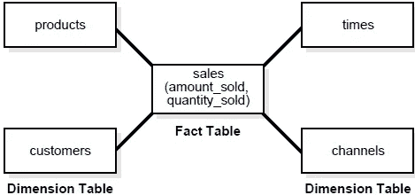
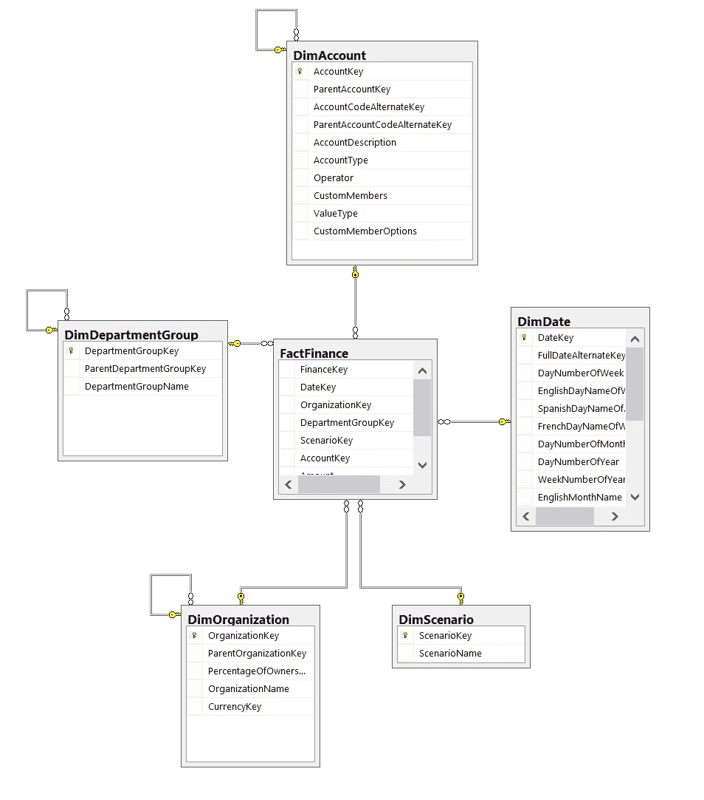

# 数据工程 101:从批处理到流

> 原文：<https://betterprogramming.pub/data-engineering-101-from-batch-processing-to-streaming-54f8c0da66fb>

## 数据是如何到达数据科学家和机器学习工程师手中的？

在 [Unsplash](https://unsplash.com/s/photos/engineer?utm_source=unsplash&utm_medium=referral&utm_content=creditCopyText) 上[科学高清](https://unsplash.com/@scienceinhd?utm_source=unsplash&utm_medium=referral&utm_content=creditCopyText)拍摄的照片

与软件工程不同，数据工程方面的大学课程并不多。也没有一大堆教导这种做法的新兵训练营。

这导致最佳实践经常在工作中学习，以及跨团队和公司使用的技术的聚宝盆。

那么，数据工程师的定义是什么？

尤其是随着这一角色逐渐脱离其在数据库管理和 BI 中的根基，它确实已经发生了变化，并且比以前有了更高的期望。数据工程师过去只需要了解基本的数据仓库、ETL 和数据可视化就可以了。

然而，近年来，对理解分布式计算、DevOps、数据操作和实现机器学习模型的需求挑战了这一概念。

事实上，在许多方面，许多高级 DEs 通常更擅长软件或 DS 工作。必须从头开始创建与 API、流数据服务等交互的系统和框架。

仅仅拼凑管道不再是基线。

但是所有需要的技能可能是压倒性的，特别是对于一个新的毕业生或传统的数据工程师。

你想进入数据工程领域，但是不知道从哪里开始。这就是这一系列帖子和视频的内容。

首先，这篇文章将向你介绍数据工程师的词汇以及我们所依赖的一些工具。所有这些都将导致开发数据仓库和数据管道。

那么，我们开始吧。

# **数据工程词汇**

[布雷特·乔丹](https://unsplash.com/@brett_jordan?utm_source=unsplash&utm_medium=referral&utm_content=creditCopyText)在 [Unsplash](https://unsplash.com/s/photos/words?utm_source=unsplash&utm_medium=referral&utm_content=creditCopyText) 上的照片

首先，让我们列出一些对 DEs 很重要的词汇。

我们将在这里概述一些基础知识，因为如果你刚刚走出学校，你经常会听到很多词汇，只是点点头，而没有完全理解这些可能是什么。

## 数据仓库

来源:[https://www . wisdom jobs . com/e-university/data-warehousing-tutorial-237/star-schemas-2620 . html](https://www.wisdomjobs.com/e-university/data-warehousing-tutorial-237/star-schemas-2620.html)

数据仓库是数据分析师和 BI 专业人员可以访问所有数据的中心位置。有很多关于数据仓库、数据集市、 [Kimball vs Inmon](https://www.zentut.com/data-warehouse/kimball-and-inmon-data-warehouse-architectures/) 以及所有这些意味着什么的争论。

归根结底，数据仓库通常是一组非规范化的数据，这些数据通常来自单个应用程序数据库或多个应用程序数据库，用于内部回答业务问题。

它不同于应用数据库，因为数据仓库是为处理分析性查询而设计的，而不是事务性查询。

此外，数据仓库通常还包含多个应用程序数据库。这是数据仓库能够提供的价值之一。将来自多个系统的数据整合在一起。

此外，在当今时代，许多数据系统，如 [BigQuery](https://cloud.google.com/bigquery) 、[红移](https://aws.amazon.com/redshift/)和[雪花](https://www.snowflake.com/)都是专门为管理数据仓库式查询而开发的。这意味着查询需要运行大量的分析、求和以及聚合，并且通常不以事务为中心。

但除此之外。它们是为了易于理解而设计的。一个好的数据仓库应该是分析师容易理解的，这样他们就可以把他们的数据可视化工具连接到它上面。

最终目标通常是创建某种自助分析系统。这意味着不应该有过于复杂的数据模型，应该有一套工程和业务团队都同意的定义良好的业务逻辑…理论上。

但是让我们继续讨论数据管道。

## 数据管道和 ETL

你经常会听到数据工程师使用数据管道这个术语。这通常也可以用术语 *ETL* 来代替。这两者之间有一些细微差别。但总的来说，两者引用了相似的概念。

ETL 指的是*提取、转换和加载*(有时它实际上可以是一个 ELT)，但是我们将避免把事情复杂化。

ETL 和数据管道是自动化的工作流，它们将数据从 A 点带到 B 点，并在此过程中转换数据，以提高数据的分析能力。

当您从应用程序数据库中提取数据时，通常会将其放入某种形式的 CSV 或 JSON 提取中。这些摘录可以来自抓取应用程序数据库表、从 API 提取数据、抓取日志等。

在提取阶段，数据通常仍然局限于当前时间的数据库快照或所有历史数据。同样，即使在这里也有许多细微差别会改变 ETL 的设计。例如，是否允许修改、删除、复制数据等等。

这样设置应用程序数据库有一个很好的理由，因为它有利于保持网站的快速响应，但限制了分析师可以获得的洞察力。

随着用户更新简档和编辑各种信息，状态可能会随着时间而改变。

因此，ETL 也将有助于以一种跟踪随时间变化的方式插入数据。通常，这种形式的跟踪变更管理被称为*缓慢变化的维度*。

一旦数据被转换，它将被加载到数据仓库中。

## 熟练的技艺

DAG 代表*有向无环图*。

ETL 只是 DAG 这个非常复杂的难题的一部分。在转换数据时，通常会有特定的步骤顺序。但是你怎么告诉你的系统呢？ETL 如何知道运行哪个部分以及何时运行？

这就是狗发挥作用的地方。

Dag 一直存在于数据工程世界中。很长一段时间以来，它们都是通过 CRON、一些定制的元数据库以及 Bash、Python 和 [PowerShell](https://docs.microsoft.com/en-us/powershell/scripting/overview) 脚本的组合来管理的。

这是非常混乱和耗时的。

今天，有许多现代工具和库可以帮助管理您的 ETL 管道。这些包括[气流](https://airflow.apache.org/)、[路易吉](https://github.com/spotify/luigi)、 [petl](https://petl.readthedocs.io/en/stable/) 和 [Dagster](http://dagster.io/) (对于初学者)。有几十个甚至几百个工具和库专注于这个主题。

个人认为，我们非常依赖气流，因为它拥有庞大的用户群。但是有很多很棒的库，随着您对数据领域越来越熟悉，您可能会使用其中的一些。

## 事实表

现在，ETL 将数据加载到哪些表中呢？为什么他们有这么奇怪的前缀？

当您开始在数据仓库中工作时，您会看到前缀“`fact_`”或“`f_`”附加到一个表中。

此前缀引用您将在此表中找到的数据类型。特别是，事实通常是实际的事务类型数据。这些可能是电子商务网站上的订单、健康索赔总额等。

一般来说，事实会有某种可聚合的值，比如购买的商品总数或总销售额，以及所谓的`dim_`表键，比如`store_id`、`product_type_id`等等。

事实通常可以被看作是一个中央表。

例如，在下图中，您会看到事实表位于所有内容的中心。同样，这是因为事实代表了你正在分析和报告的核心思想。这可能是交易、用户、电子邮件打开等。

来源:[https://www . SQL shack . com/SQL-server-business-intelligence-features-SQL-server-data-tools-business-intelligence/](https://www.sqlshack.com/sql-server-business-intelligence-features-sql-server-data-tools-business-intelligence/)

## 维度表

数据仓库中有许多不同类型的表。然而，事实表和维度表可能是最常见的。

维度表是更具描述性的数据。想一想当你在分析数据的时候，你经常想按店铺、地区、网站、办公室经理等进行分组。

所以，也许你想数一数你的公司拥有的每栋大楼里有多少员工。建筑物的描述性信息在维度表中，而关于连接到该建筑物的雇员的实际事实在事实表中。

同样，看上面的图片，维度表位于事实表的周围。

它将帮助你描述和组织你的事实数据。

# 接下来我们要谈什么？

这是我们希望的关于数据工程的几篇文章中的第一篇。我们希望继续这个系列，深入研究数据管道开发、度量、数据仓库设计等。

我们希望这对您有所帮助，我们将继续关注这些话题。如果您有任何问题，或者希望在本主题的特定部分获得帮助，请告诉我们。

谢了。