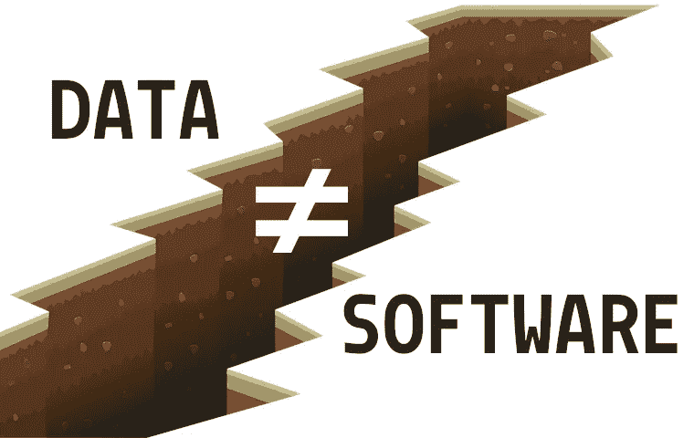

# 数据工程不是软件工程

> 原文：<https://betterprogramming.pub/data-engineering-is-not-software-engineering-af81eb8d3949>

## 假装数据和软件是一样的会对数据工程师的成功产生反作用

近年来，数据工程似乎正在与 DevOps 融合。两家公司都采用了云基础设施、集装箱化、CI/CD 和 GitOps 来为客户提供可靠的数字产品。工具子集的趋同导致许多人认为数据工程和软件工程之间没有明显的区别。因此，数据工程相当“粗糙”的事实仅仅是因为数据工程师在采用良好的软件开发实践方面落后了。

这种评估是错误的。数据工程和软件工程共享许多共同的工具和实践，但是它们在许多关键领域也有很大的不同。忽略这些差异，像管理软件产品团队一样管理数据工程团队是一个错误。把数据工程想象成一个西红柿:它是一种水果，但这并不意味着它应该被添加到水果沙拉中。这篇文章旨在强调数据工程中的一些独特挑战，以及为什么这需要一种定制的方法。

# 数据管道不是应用程序

软件工程倾向于构建应用程序。在这篇文章的上下文中，应用程序的定义非常广泛，可以是网站、桌面应用程序、API、单片大型机应用程序、游戏、微服务、库或介于两者之间的任何东西。这些产品的共同特点是:

*   通过提供新的交互方式为用户提供价值。可以玩游戏，可以浏览网站，可以在其他软件中使用 API。
*   具有许多基本独立的特征。一个网站可以增加它的页面数量，一个游戏可以增加级别或可玩角色的数量，一个 API 可以增加更多的端点。作为推论，一个应用程序永远不会真正完整。
*   处理它们创建的相对少量的状态。状态旨在支持应用程序。这种状态的管理通常被卸载到外部系统。目标是让软件的大部分成为无状态的。web 应用程序可以随时终止和重启；它的状态由运行在单独进程中的数据库管理。
*   与其他软件和服务松散耦合。好的软件应该在任何环境下独立运行，因此微服务和容器很受欢迎。

数据工程师关心建立数据管道。数据管道从产生数据的地方获取数据，对数据进行转换，然后从消费数据的地方将数据放到另一个地方。通常目标是按计划自动完成这些管道，以便数据集随着时间的推移用新数据更新。像应用程序一样，数据管道通常是软件的一部分。与应用程序相反，数据管道:

*   不提供任何直接价值。管道没有用户。只有管道产生的数据集对下游消费者有价值。如果数据通过某种精心设计的复制粘贴方案到达目的地，客户也会同样满意。
*   只有一个与客户相关的特性:生成所请求的数据集。因此，虽然由于上游系统用户要求的变化，管道需要持续维护，但有一个明确的完成点。
*   管理大量的状态。管道被设计成处理来自它不控制的其他软件的现有状态，并将其转换成它控制的状态。许多管道以增量方式构建数据集，每次运行都会添加更多数据。从这个意义上说，这些管道可以被看作是长时间运行的过程，不断地创建越来越多的状态。
*   具有不可避免的紧耦合。数据管道的目标正是绑定到数据源。管道只会像源头一样稳定可靠。

这些基本差异导致了数据工程面临的独特挑战，而业务、IT 管理甚至软件工程师对此往往知之甚少。让我们过一遍。

# 一条管道要么已经完工，要么毫无价值

如今，许多组织在某种敏捷风格下管理他们的软件团队。这些框架的核心理念是通过在短时间内构建和发布软件，最大化软件向客户交付价值的速度。这应该尽可能快地交付最小可行产品(MVP ),并确保快速的反馈循环，从而确保团队总是致力于具有最高优先级的特性。

这些想法不能映射到数据工程上。

数据管道不能在增加客户价值的小迭代中开发。在数据管道中没有对应的 MVP。它要么为客户生成所需的数据集，要么不生成。

因此，数据管道开发并不完全适合敏捷框架。一个复杂的数据管道对应一个用户故事，但是通常需要多个 sprints 来完成。非技术管理很少考虑这个微妙的问题，并且试图将数据工程师硬塞进 scrum 团队。结果是用户故事被任务取代，例如“构建 API 连接器”和“构建摄取逻辑”，这不可避免地把 scrum 板变成了一个微观管理的设备。

当管理层不了解他们所管理的事物的基本原理时，他们往往会做出糟糕且不可行的决策。一位经理对管道上的缓慢进展感到沮丧，他曾经要求我们团队中的一名数据工程师一列一列地迭代建立数据集，以便客户“至少有一些已经开始使用的数据”。拥有复杂管道实践经验的数据工程师和曾经收到过无用数据集的数据科学家会认识到这种情况的可笑之处。对于没有这方面背景的读者来说，这里有三个原因可以解释为什么这不可行:

## 1.部分数据集没有比例效用

如果一个数据集包含 10 列中的 9 列，那么它 90%有用吗？这取决于省略了哪一列。如果数据科学家的目标是基于数据建立预测模型，但缺少的列是他们想要预测的标签或值，那么数据集是 0%有用的。如果该列是一些与标签不相关的随机元数据，它可能 100%有用。最常见的情况是，一个列代表一个可能与标签相关也可能不相关的字段；找出是否相关正是数据科学家想要通过实验找到的。这就是为什么数据科学家想要一个尽可能完整的数据集来开始试验、探索并逐步优化他们的模型。为他们提供部分数据集可确保一旦有额外的字段可用，就需要重新进行试验和优化。

## 2.开发管道的时间与数据集大小无关

即使客户对半个数据集感到满意，制作这个数据集所需的时间也不会是完整数据集所需时间的一半。数据管道不是由各自生成一列的独立作业组成的。如果多个列来自同一个源，则它们可能是相关的，因此在最终数据集中包含一个或多个列的工作量是相同的。然而，将这些列与另一个表中的列合并的逻辑可能像一个简单的连接一样简单，或者可能需要一系列复杂的窗口函数。此外，在任何数据从另一端出来之前，可能需要在数据管道中编写大量样板文件，例如，访问 API 的客户端或处理非结构化数据的解析器。一旦这样做了，扩展逻辑来处理额外的字段可能就变得简单了。因此，最终数据集中的列数对于管道复杂性来说是一个糟糕的指标，就像使用代码行数来衡量生产率一样。

数据集大小也可以指行/记录的数量。设计良好的管道应该能够处理任意数量的记录，因此开发时间应该完全分离。然而，开发时间可能会有“跳跃”,这取决于特定的要求，例如:

*   数据集需要多久更新一次，即我们需要批处理还是流？
*   预期的数据量和速度是多少？
*   数据能装进内存吗？

这些考虑应该是先验已知的，并将影响管道的整个设计。

## 3.构建数据集的时间和经济成本与其大小相关

就行和列而言，数据集越大，构建和更新它所需的时间就越长。在大型数据库中编辑单个记录既简单又快速，但这对于分析数据集来说并不常见。修改分析数据集通常涉及添加/更改整列(这会更改所有记录)或更新数千或数百万行。有两种方法可以处理数据的变化，但都不便宜。

从开发人员的角度来看，更新数据集最简单的方法是通过更新和重新运行管道来覆盖所有内容。然而，就计算成本和刷新数据集的时间而言，这是最昂贵的。设计一个管道，使其正确地覆盖先前运行的状态(等幂)也不总是微不足道的，并且需要适当的预先规划。

或者，更新数据集的逻辑可以编码在一个单独的管道中，该管道将旧的数据集作为输入。就计算成本和速度而言，这可能更经济，但会导致额外的开发时间和精神开销。应用增量的管道不是等幂的，因此跟踪当前状态以及执行特定操作的时间非常重要。即使在第二种情况下，旧的管道也应该被更新，以便在新的更新中包含所需的更改。

无论如何，问题是切块的，数据集有一个固有的惯性。数据集越大，尝试进行更改需要更多的时间、精力和/或金钱。

## 结论:将部分管道部署到生产中是一种浪费

将部分完成的管道部署到生产中对客户来说是没有用的，浪费计算，并且使构建管道的工程师的生活变得复杂，因为他们必须处理旧的状态。将货物养殖开发和敏捷原则转移到数据管道开发，鼓励增量变更和频繁部署，这完全忽略了数据的惰性。

工程师希望“第一次就做好”，并最大限度地减少生产部署的次数。频繁部署的管道意味着要么客户不知道他们想要什么，要么数据源非常不稳定，管道需要不断修补。与无状态应用程序相反，在无状态应用程序中，更新很容易，只需杀死几个容器，然后制造新的容器，更新数据集与重新部署管道代码不同。将管道代码打包到一个容器中，并在 Kubernetes 上运行，并不能弥合这个差距。

# 管道开发中的反馈循环非常缓慢

为了快速创建新功能或修复软件中的错误，开发人员需要快速的反馈，告诉他们所写的是正确的，并使软件朝着正确的方向发展。

在软件开发中，这通常是使用一套单元测试来实现的，开发人员在本地运行这些单元测试来检查软件的每个组件是否(仍然)按预期工作。单元测试应该快速，不与任何外部系统交互，也不依赖于任何状态。他们应该独立地测试函数、方法和类。通过这种方式，软件开发人员可以在开发过程中快速获得反馈，并且当他们打开一个拉请求时，可以非常自信地认为他们的代码能够按预期工作。如果需要测试与其他系统的交互，CI 管道也可能运行较慢的集成测试。

这里有一个数据工程的秘密:数据管道很少经过单元测试(喘息！).数据管道通常通过简单的部署来测试——通常首先部署到开发环境中。这需要一个构建和部署步骤，在此之后，工程师必须监控管道一段时间，看看它是否按预期工作。如果管道不是等幂的，则重新部署可能首先需要手动干预来重置先前部署留下的状态。与运行单元测试相比，这个反馈周期非常慢。

那么为什么不直接写单元测试呢？

## 1.数据管道在无法进行单元测试的方面失败

可以进行单元测试的自包含逻辑通常受限于数据管道。大部分代码是*胶水和胶带*。因此，几乎所有的故障都发生在系统之间的接口故障或意外数据进入管道。

系统之间的接口不能用单元测试来测试，因为这些测试不能孤立地运行。外部系统可能会被嘲笑，但这只能证明管道与一个系统一起工作，该系统的行为就像数据工程师*认为的*外部系统工作一样。事实上，数据工程师很少知道所有相关的细节。让我们举一个真实世界的例子:为了防止 DDOS 攻击，一个公共 API 可能对在某个时间间隔内可以从同一个 IP 发送的请求数量有一个未公开的限制。对 API 的模仿可能无法解释这一点，但是它存在于真实系统中的事实可能会破坏生产中的管道。此外，外部系统很少是稳定的。事实上，数据管道通常是建立在*之上的，因为*人们希望将数据从不可靠的系统转移到更可靠的系统。模拟不会揭示真实系统是否以破坏管道的方式改变。

众所周知，数据制作者不善于始终如一地提交高质量的数据。数据管道必须总是对将要输入的数据做出一些假设。数据中意外的内容或结构会破坏管道，或者至少会产生不正确的结果。保护管道免受松散数据源影响的一个常见策略是在读取时验证模式。但是这并不能防止数据的错误内容和微妙的“数据错误”。例如，时间序列是否正确处理了日光节约时间？列中是否有不符合预期模式的字符串？代表真实世界测量值的数字列中的值有物理意义吗？这些都与可以用单元测试来测试的管道逻辑无关。

## 2.单元测试比管道逻辑更加复杂

测试管道中有限的自包含转换逻辑所需的单元测试比代码本身更复杂，因为它需要开发人员创建*代表性的*测试数据，以及预期的输出数据。这是大量的工作，并没有实质性地提高对管道正确运行的信心。此外，这将问题从“此功能是否按预期工作？”到“这个测试数据能充分代表我的真实数据吗？”。单元测试理想地覆盖了输入参数组合的一个好的子集。但是在转换数据集的函数中，例如以数据帧的形式，数据集自变量本身呈现了一个接近无限维的参数空间。

## 结论:开发一个管道是缓慢的

获得关于数据管道的可靠反馈的最佳方式是部署并运行它。这总是比在本地运行单元测试慢，这意味着需要更长的时间来获得反馈。结果是管道开发，尤其是在调试阶段，慢得令人恼火。

可以考虑比运行整个管道更快的集成测试。然而，这些通常不能在开发人员的机器上运行，因为它不能直接访问相关的源系统。因此，这些测试只能在与管道相同的环境中运行，这同样需要部署。这在很大程度上挫败了编写测试以获得快速反馈的目的。

“数据合同”现在风靡一时，用来对付不计后果的数据生产者。对进入管道的数据充满信心将会消除管道开发中的许多不确定性，并使它们不那么脆弱。然而，这些合同似乎很难执行，因为生产商没有遵守合同的动力。此外，一个组织会希望使用从外部来源获取的数据，比如公共 APIs 祝你在与这些外部团体谈判数据合同时好运。

# 管道开发不能并行化

我们已经确定，数据管道是一个单一的用户故事，由于反馈周期长，开发缓慢。但是，由于一个管道由多个任务组成，一些经理试图将它们分配给多个开发人员，以加速开发过程。不幸的是，这不起作用。处理管道中数据的任务是连续的。为了建立第二步，第一步的输出必须稳定。通过构建第二个步骤获得的见解反馈到第一个步骤的改进中。因此，管道作为一个整体必须被认为是开发人员迭代的一个特性。

一些经理反驳说，这仅仅意味着管道从一开始就没有充分规划。开始有数据，结束需要什么数据出来就很清楚了。那么，在中间需要建造什么难道不明显吗？矛盾的是，提出这一论点的管理者会激烈地捍卫敏捷的优点。

只要数据源没有被适当地特征化，规划整个管道就不起作用。在没有合同和文档的情况下，数据工程师不得不在黑暗中摸索，以便发现数据的特殊性。这个发现过程塑造了管道的架构。从某种意义上说，这是敏捷的；这不是商业利益相关者想要的工作方式。

# 结论和建议

数据管道是软件，但不是软件产品。他们是制造客户实际需要的汽车的工厂。它们是达到目的的一种手段，是从庞大的数据源中创建易于使用的数据集的自动化方法。它们是系统之间的管道胶带，而这些系统并不是为了相互交流而设计的。它们是针对数据“最后一英里”问题的丑陋、脆弱且昂贵的解决方案。他们的唯一目的是管理状态，这使得他们的开发缓慢、不可预测，并且经常成为数据分析项目的主要瓶颈。无论数据影响者通过使用另一种工具宣称什么，无论有多少抽象层堆叠在彼此之上，数据都与软件有着本质的不同。不认识到这些差异并在数据团队中实施敏捷过程，因为它在软件团队中有效，只会适得其反。

你能做些什么来使数据团队成功并富有成效？

*   认识到瀑布的精简形式(在软件工程中通常是坏的同义词)不可避免地会发生在数据管道项目中。在开始任何开发之前，需要与客户进行大量对话，以澄清对所需数据集的要求，并与数据生产者进行对话，以传递关于未记录的 API 的知识并连接到源系统。在客户和数据生产者都同意建议的解决方案之前，不要在构建上投入太多时间。认识到一旦管道投入生产，改变将是昂贵的。
*   给数据工程师一些时间来试验数据源。认识到所有关于数据集何时可用的时间估计都是错误的。
*   不要在多个开发者之间分割一个管道。相反，允许两个或多个开发人员在一个管道上同时协作。基于主干开发的成对/极限/分组编程确保了最大的生产力，因为它避免了 git 分支地狱、拉请求和代码审查。让四只眼睛随时检查代码有助于尽早发现问题。这在反馈循环缓慢的管道中尤其有价值。

*我是* [*维托*](https://www.vito.be) *的研究员、数据科学家和科学软件开发人员。之前我是* [*数据头脑*](https://www.dataminded.be) *的数据工程师。这些文章中表达的观点仅仅是我个人的，并不代表我现在或过去的雇主的观点。查看我的个人博客***，我偶尔会在这里写一些我感兴趣的事情。**