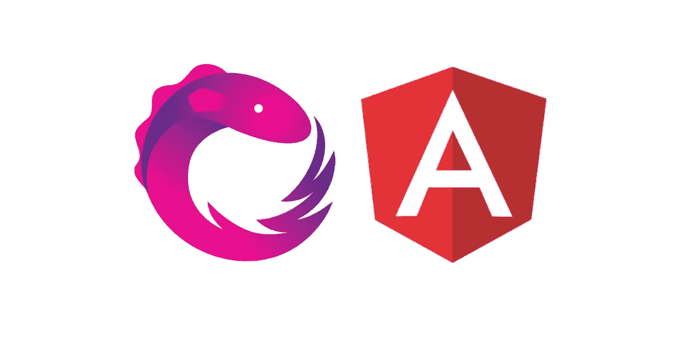
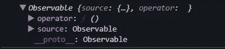

# 在角度分析中使用 rjs 声明模式的数据操作

> 原文：<https://betterprogramming.pub/data-manipulation-using-rxjs-declarative-pattern-in-angular-f6ea635886eb>

## [rjs](https://medium.com/@lorenzozar/list/rxjs-39bc4f4110ec)、[转角](https://medium.com/@lorenzozar/list/angular-5496c492a185)

## 在 Angular 中使用声明性 RxJS 模式处理数据



虽然命令式和声明式编程风格都可以在正确的上下文中增加价值，但是将一些代码的执行委托给编程语言可以优化时间。

通过在 Angular 中使用 rjs 声明性模式，当模板中需要数据时，我们可以委托执行一些代码来获取数据。

例如，我们来看看下面的[异步管道](https://www.vitainbeta.org/2022/05/03/angular-async-pipe/):

```
// app.component.html<div *ngIf="data$ | async as data">
  {{ data.title }}
</div>
```

通过使用`async`管道，我们不需要订阅或取消订阅可观察到的东西。Angular 会自动处理。

但是，一旦加载了模板，异步管道就会获取数据并按原样显示。

通常，我们需要在显示数据之前对其进行处理。为此，我们可以使用一些 rjs 运算符在数据到达模板之前对其进行操作。

# 声明性数据操作

想象一下这样一种情况:您从一个 HTTP 调用接收数据，并希望在组件中使用它之前对其进行操作。

例如，我们将使用 HttpClient 服务从服务器获取数据。*异步方法发送一个 HTTP 请求，并返回一个可观测量，当接收到响应时发出请求的数据*， [angular.io](https://angular.io/guide/http#requesting-data-from-a-server) 。

在我们的例子中，可观察的包含一个特定形状的物体，所以我们可以创建一个[界面](https://www.typescriptlang.org/docs/handbook/2/objects.html)如下:

```
interface ToDo { userId: number;
  id: number;
  title: string;
  completed: boolean;}
```

我们想在显示标题键之前改变它的值。

## 经典图案

遵循一个命令式模式，我们将使用 subscribe 方法来订阅可观察的，可能在`ngOnInit`中。

然后，我们将结果分配给一个变量，并最终在我们需要时操纵该变量。

例如，下面的代码将订阅的结果分配给`subscription`变量。

如果我们需要改变`subscription`变量的值，我们可能会创建一个采用`subscription`的方法，并在模板中使用之前改变标题。

## 声明性数据操作

在尝试声明性的同时，您可能想知道如何在不使用`subscribe`方法的情况下操作数据。

下面是初始的声明性代码:

第 10 行是起点。

我们定义一个名为`data$`的本地属性，并将服务中的可观察对象分配给该属性，使其在组件中可用。

如果您没有阅读 Angular 中的 [RxJS 声明模式，请注意此时我们的代码没有“执行”可观察对象！](/rxjs-declarative-pattern-in-angular-cafba3983d21)

换句话说，没有与从服务器获取数据相关的网络请求。这里什么都没有发生。`data$`是空的可观测。



在任何订阅或异步管道之前记录可观察对象

当我们订阅可观察对象或者在模板中使用异步管道时，`data$`的值将会改变。

如上所述，前一种选择与反应式方法相反，因此我们只能使用异步管道。然而，一旦 Angular 渲染了组件视图，异步管道就会触发`data$`并显示我们从可观察对象中获得的任何内容。

因此，我们需要在从服务获取数据之后，在异步管道“调用”数据之前，对数据进行操作。

为此，我们将使用 [RxJS 管道](https://rxjs.dev/api/index/function/pipe) API 和 [RxJS 映射操作符](https://www.vitainbeta.org/2022/03/29/hands-on-rxjs-operators-map-operator/)。

## **RxJS 管道**

我们可以如下使用管道:

```
data$ = this.todoService.todo$.pipe( operator1(),
  operator2(),
  operatorN());
```

简单来说:

1.  我们从服务中获得的可观察信息进入了`pipe().`
2.  它通过第一个操作符，并根据返回新的可观察值的函数进行操作。
3.  新的可观察值进入第二个操作符，根据提供的函数进行操作，依此类推，直到管道中的最后一个操作符。
4.  最后，一旦我们订阅了它，可观察值就存储在`data$`中。否则，我们只是声明了我们想要得到的东西，但是`data$`仍然是空的，直到我们在模板中使用异步管道。

## RxJS 映射运算符

按照上面的代码，我们将使用 RxJS map 操作符来操作可观察对象，然后再将它提供给异步管道。

简而言之，我们可以说[映射操作符](https://www.vitainbeta.org/2022/03/29/hands-on-rxjs-operators-map-operator/)通过我们提供的函数来转换每个发出的项目。

它订阅输入流，根据提供的函数转换接收到的项，并使用转换后的项创建输出流。

RxJS 映射操作符与 JavaScript `[map()](https://developer.mozilla.org/en-US/docs/Web/JavaScript/Reference/Global_Objects/Array/map)` [方法](https://developer.mozilla.org/en-US/docs/Web/JavaScript/Reference/Global_Objects/Array/map)非常相似，其用法如下:

```
data$ = this.todoService.todo$.pipe( map((x) => ({ 
    ...x, 
    title: x.title + 'and more' 
  })));
```

我们从服务接收的可观察对象进入管道，通过我们在 map operator 中提供的函数，然后退出管道。

在 map 操作符内部，我们声明了一个匿名函数`() => {}`，它接受一个参数`x`并返回一个对象。

由于使用了[扩展语法](https://developer.mozilla.org/en-US/docs/Web/JavaScript/Reference/Operators/Spread_syntax)，返回的对象拥有我们传入的对象的所有键值对，但是我们更改了标题的值，添加了字符串`'and more'`。

更准确地说，我们甚至可以声明参数`x`的类型，这样代码就变成了:

使用 RxJS tap 运算符进行数据操作

您可能希望在另一个文件中声明该接口，以使它在其他地方可用。在这种情况下，在同一个代码片段中更容易看到它。

# 关于声明性数据操作的考虑

然而，进行某些操作所需的代码量似乎会增加得相当快。

因此，使用声明性模式的好处可能会被“太多代码”的代价所抵消。

## 代码太多？

声明性代码以其高抽象级别而著称。

开发人员可以用压缩的方式表现复杂的模式。然而，程序越复杂，代码变得如此混乱以至于只能由最初编写它的开发人员阅读的风险就越高。

这可不好。

一般来说，如果在团队中工作，我们希望能够维护和构建应用程序，而不依赖于单个个人的知识。

此外，在业务环境中，可能需要花更多的时间在新员工或外部开发人员身上，以便他们完全理解代码结构。

总而言之，这甚至会增加你的成本。