# 使用 Azure 函数进行数据迁移(ikcomponeer 博客第 11 部分)

> 原文：<https://betterprogramming.pub/data-migration-using-azure-functions-40de2acafa98>

## 为复杂流程创建简单函数

Gabriel Barletta 在 [Unsplash](https://unsplash.com/search/photos/compose?utm_source=unsplash&utm_medium=referral&utm_content=creditCopyText) 上拍摄的照片

下面的文章将向您展示如何创建简单函数来生成复杂流的过程。在这篇详尽的文章中，你将会看到这是如何发生的。

在之前的一篇文章中，我设计了一个转换器，将一些关系数据转换成事件数据。我现在将使用翻译器将一个音乐作曲从儿童作曲工具 [ikcomponeer.nl](http://ikcomponeer.nl) (Flash 和 mySQL/PHP)迁移到新的作曲工具环境(HTML、JavaScript 和 [Azure](http://azure.microsoft.com/en-au/) )。

让我们看看需要采取哪些步骤。我们如何控制从源环境到目标环境的迁移顺序？如果一个组合在源环境中被修改了呢？我们必须确保它被再次迁移，从而在目标环境中覆盖之前的迁移。

让我们从我们正在迁移的遗留数据库的表上的“migrated”标志开始。

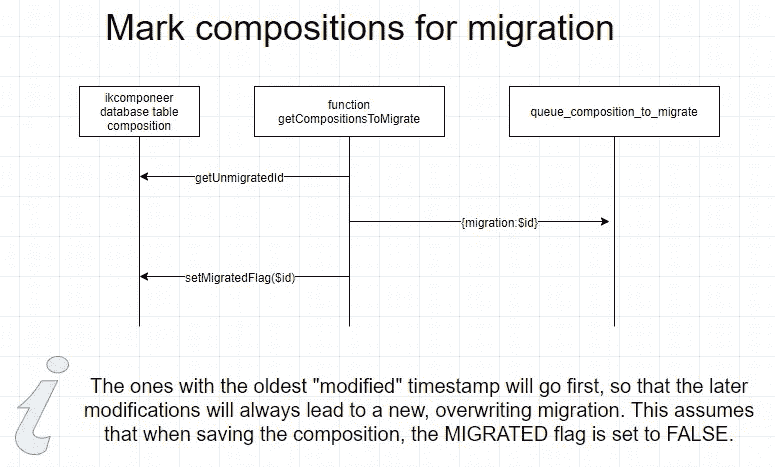

我从一个手动触发的功能开始。稍后，我们可以让它被计时器触发。这将使我们能够控制组合迁移的速度。在开发过程中，我们手动触发该功能，然后，当一切正常时，使用计时器。

这是函数本身。您可以看到一个名为`compositionToMigrate`的 out 参数和一个字符串输入。输入不重要；它只是一些通过点击手动`run`按钮生成的字符串。

然后，该函数执行以下操作:

1.  从旧的 mySQL/PHP 环境中检索最近未迁移的组合`id`。
2.  将`id`分配给输出队列。
3.  再次调用旧环境以确认`id`可以被标记为已迁移

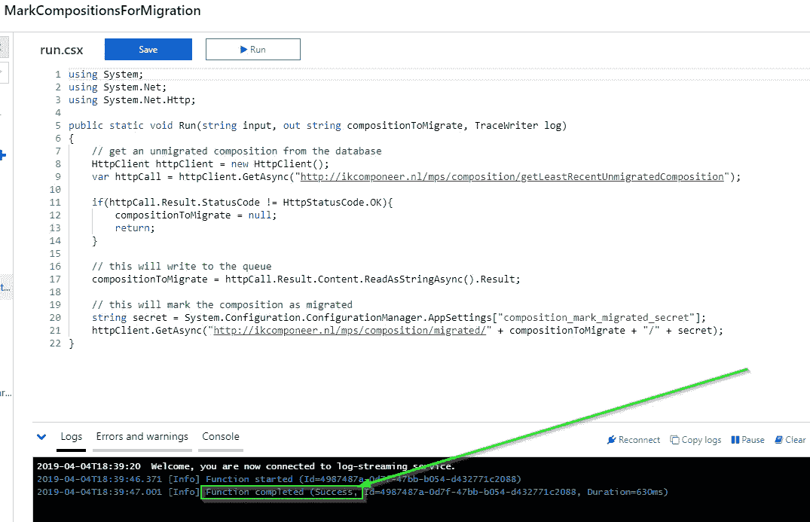

我们可以通过检查队列来查看结果。

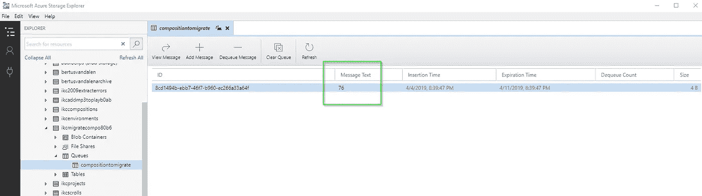

而且，当然也应该导致作文在数据库中被标为`migrated`。

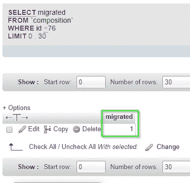

# 将数据从源系统中取出并存储在 Azure 数据中心

我们将创建一个由队列中出现的新组合 id 触发的函数。它将加载作曲的所有数据**——包括它所依赖的所有数据——如设置、使用的音乐集合等。然后，该函数将这些数据存储在 blob 存储中。**

**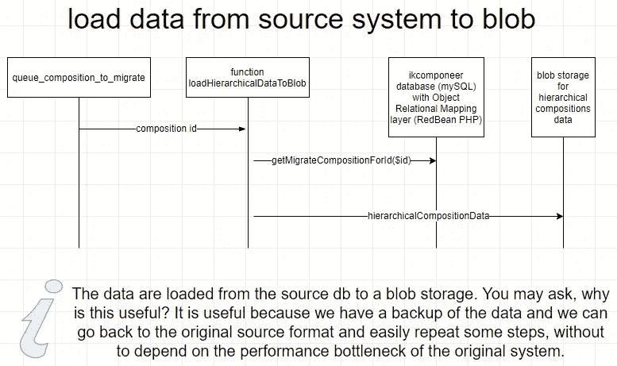**

**所以，函数来了，很简单！**

**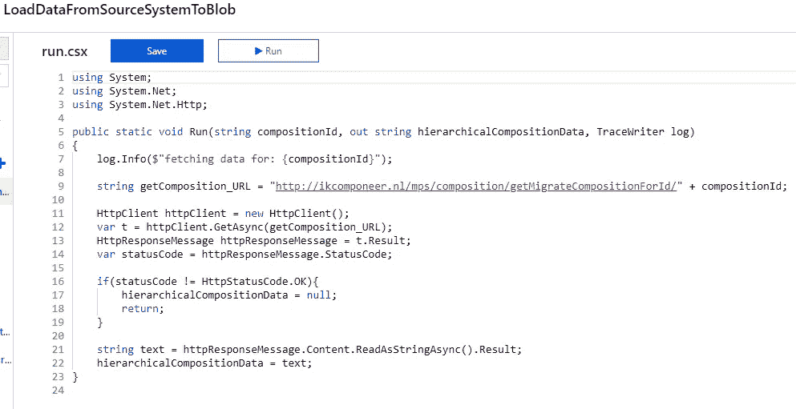**

**我可以通过手动获取第一个触发函数的 ID 来尝试一下…它在容器中显示有一些数据。**

**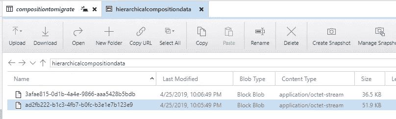**

**厉害！看起来所有的数据都被捕获了！我可以从存储容器中下载一个 blob 来看看:**

**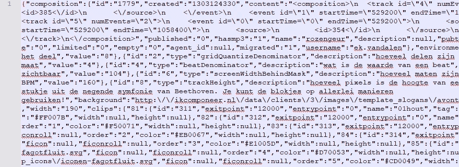**

# **译者及其事件分组**

**现在我们已经将数据安全地保存在 blob 存储中，我们可以将它作为转换成事件驱动形式的出发点。**

**事件存储在四个不同的 Azure 存储表中，旨在提供我们需要的分布和可用性。这四个表基于数据的四种实际应用或用法。因此，它们以一种特殊的方式相关联。**

**该设计是由数据视图驱动的，它被用在不同的级别和角色上。构图本身永远是主要的切入点。**

# **四张 Azure 储物桌**

1.  **音乐创作数据。**
2.  **项目配置数据(当涉及到应用程序和周围 web/网络环境的配置时，许多组合共享相同类型的配置)。**
3.  **音乐环境数据(许多作品共享同一组源 MP3 文件和其他音乐参数，如速度)。**
4.  **滚动数据(处理该作品时可用的其他作品的列表，以便用户可以输入多种音乐和体验)。**

**以下章节将详细解释不同种类的数据。**

# **音乐环境数据**

**这些数据是由音乐制作人提供的，音乐制作人制作了一组音频剪辑，供孩子们用来作曲。可以进行不同的乐器乐句(声部)组合，如木乐、打击乐、铜管乐，也可以是非传统的或创造性的组合。**

**使用以下事件，同一组剪辑可以用作源素材来创建这些剪辑的多个组织。这种类型的事件用`IMusicEnvironmentEvent`接口标记。**

**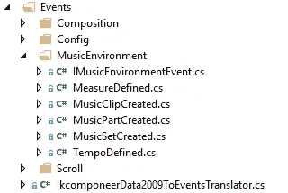**

# **项目配置数据**

**项目配置不处理音乐数据本身。它处理用户可以使用音乐数据的应用程序的配置。**

****比如:****

*   **你可以用多种方式展示它们。**
*   **您可以允许与数据进行一些不同的交互，例如以某种方式保存结果。**
*   **你可以添加一些按钮来做这个或那个。例如，收听帮助、提示或技巧的录音。**
*   **添加一个按钮，一次清除整个构图。**
*   **添加一个按钮来随机创建一个组合。**

**诸如此类。应用程序可以做的和可以配置的任何事情都属于这个组。**

**如前一章所述，环境数据通常由作曲家或音乐制作人创建。**

**项目配置数据通常由项目制作者和应用顾问创建，他们可以帮助实现特定的安装、配置或使用形式。它们还可以通过技术接口帮助组合工具以不同的方式与嵌入站点进行交互。**

**这样的`Config`事件有很多种(多到无法在图片上放得下)，但这里有一个印象。**

**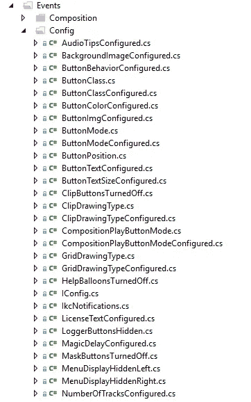**

# **滚动事件**

**虽然配置意味着配置音乐集的不同用途，但是滚动是具体的开始项目的列表——包含音乐环境、配置数据和作曲数据的作曲。**

**该列表被命名为*滚动*，因为当你在一个网站上时(例如一所学校的作曲空间，或者一个管弦乐队的教育网站)，你可以滚动该列表以点击一个开始作曲。**

**滚动事件是最简单的。它们只是作品的名字和 id。**

**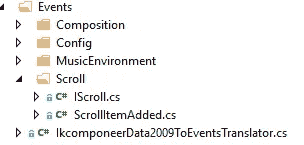**

# **合成事件**

**作曲事件是由终端用户创作的实际作曲音乐。**

**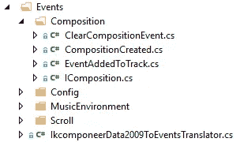**

# **其他可预见的事件**

**以上列表并不完整。创建它只是为了迁移数据和构建您可以开始使用应用程序的环境。**

**我们还想存储其他可预见的事件。例如，当用户在轨道上移动事件，或按下按钮来听音乐，或触发其他 UI 行为(如听声音帮助线索)时。**

**当然，这样的事件是值得存储的——为了改进和分析，或者为了允许多个用户同时从不同的计算机上对同一合成进行同步协作。**

# **翻译功能**

**translator 函数会将上述事件列表存储在一个 blob 中。通过将这些数据存储在 blob 中，我们可以创建另一个函数来实现其他功能(在另一个函数中)，这将处理 Azure 表存储的细节。**

**后者可以在非迁移情况下重用，例如在迁移后存储事件。**

**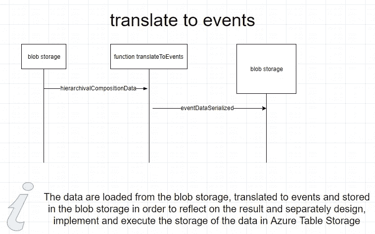**

# **包括翻译**

**翻译器本身就是一个项目，有单元测试什么的。它由一个构建环境和测试组成，这些测试自动将一个库推送到 [NuGet](https://www.nuget.org/) 包管理平台。**

**这是我的源代码:**

** [## bvd/ikc-反序列化 2009 合成

### 这个项目有助于反序列化 2009 LAMP 堆栈中的 ikcomponeer 组合。…

github.com](https://github.com/bvd/ikc-deserialize2009composition) 

以及由此产生的 NuGet 包:

 [## jsonpositionfromikc 2009 1 . 0 . 0-CI-2019 06 12-131247

### 描述

www.nuget.org](https://www.nuget.org/packages/JsonCompositionFromIkc2009) 

要在函数中使用翻译器，我们必须包含这个 NuGet 包。首先，我们基于现成的模板“blob trigger”创建一个空函数。

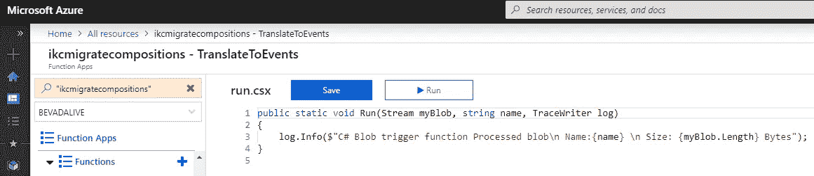

然后，我们转到特殊工具并选择 Kudu 环境

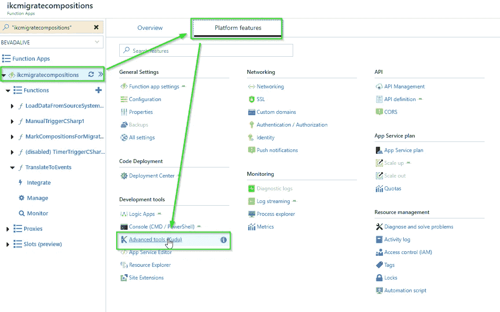

我们编辑`project.json`文件，以便引用我们需要导入的包；我们自己的 NuGet 包中的包。

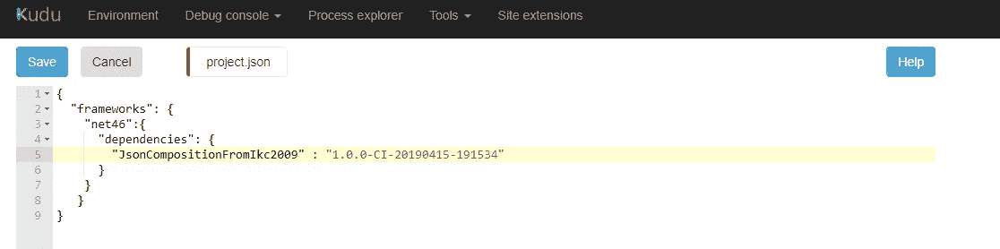

在保存和编辑一些函数代码后，函数环境将导入包，我们可以成功地编译从包中调用功能的代码。

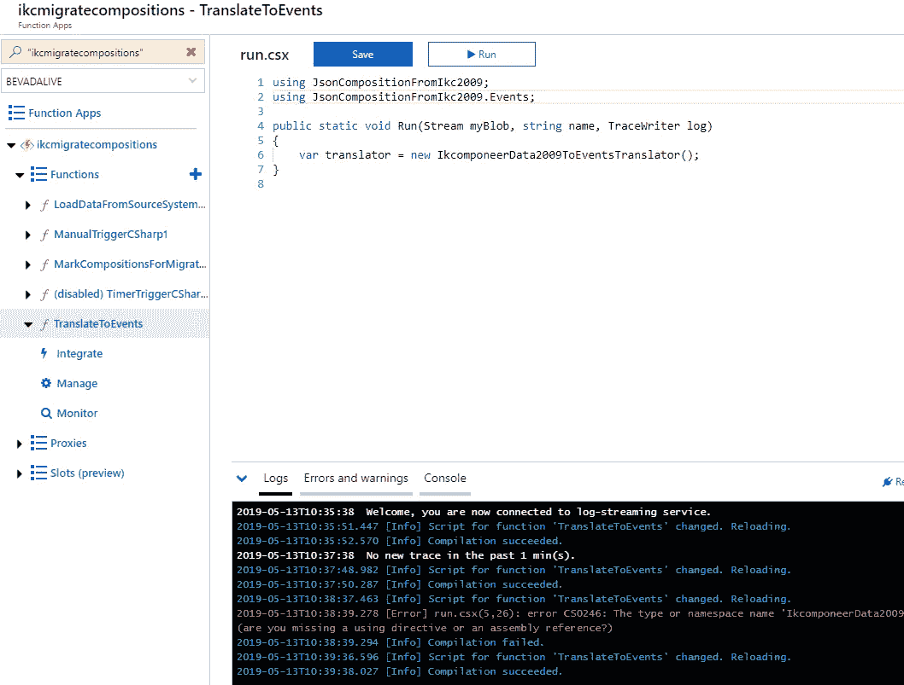

最后，我们从测试 NuGet 包的测试项目中取出一些代码。这些代码可以反序列化和翻译源数据，这样我们就有了一个翻译器，其中包含对事件的翻译，然后我们需要存储这些翻译。

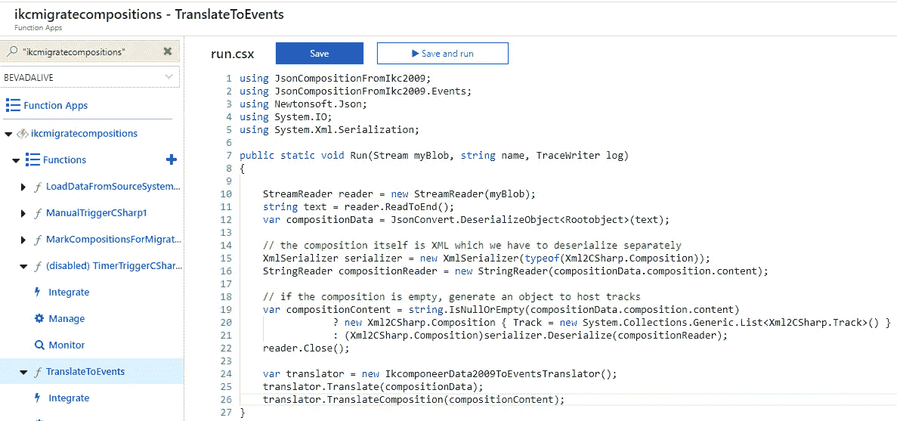

让我们配置/绑定另一个 blob 存储容器来存储事件。

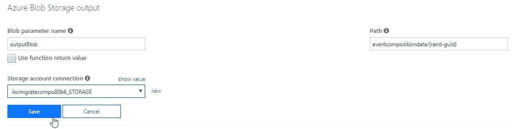

在翻译器的库中，您可以看到它有一个如下所示的`ToString()`实现:

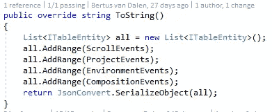

当序列化时，所有对象都有一个类名作为标准字段，这样反序列化也成为可能。例如:

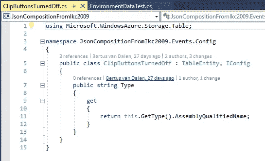

存储到 blob 现在变得很容易；我们只需将绑定作为函数参数(out 参数)添加，并为其分配一个字符串。框架将确保它存储在 blob 中。

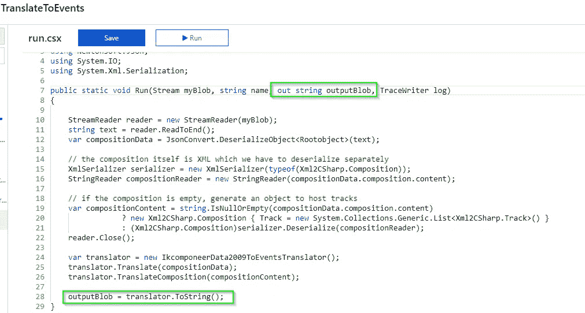

让我们看看当我们手动运行链中的第一个函数时会发生什么。我们可以在 Monitor 部分看到，结果我们的新函数也运行了。

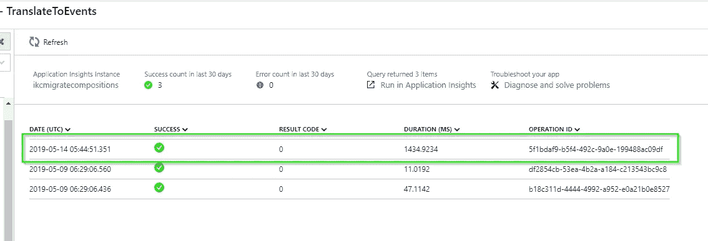

在我们的存储位置有一个新的 blob 条目。

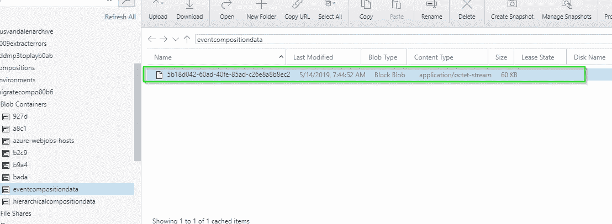

它应该以事件的形式包含我们的数据。让我们看看它是什么样子，并思考如何将它们存储在表存储中。

非常好！类名被正确地存储在`Type`字段中，所以从 blob 存储中反序列化事件应该不会太难。

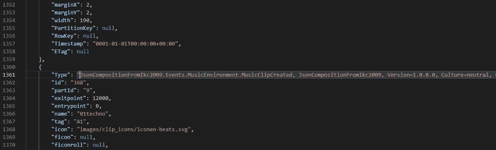

# 领域驱动的对象关系映射

数据由本文前面提到的四组数据组成。这清楚地反映在事件数据的序列化中。

1.  首先是滚动项(由内容版主创建和更改)。
2.  其次，您有配置项(由技术人员创建和更改，如合成工具开发人员)。
3.  第三，有音乐环境参数，例如由顾问与源音乐素材的制作者一起创建的用于作曲的音乐剪辑的可用性。
4.  最后但并非最不重要的是，有最终用户的合成事件，您可以在上图中看到一个例子。

为了使存储更加高效、可伸缩和可维护，我们现在将了解如何将数据存储在非结构化的表格存储中。为此，我们必须设计表存储容器名称、分区键和行键。

在我们的翻译器中，我们已经实现了一个字段，它将为滚动数据、配置数据、环境数据和组合数据提供一个唯一的标识符。这些标识符存储在合成创建的事件中。

在迁移中，我们可以假设，当我们之前已经存储了一个具有该标识符的项目时，我们将不必再做一次，因为它已经在那里了。

这是标识符在合成创建的事件中的样子:

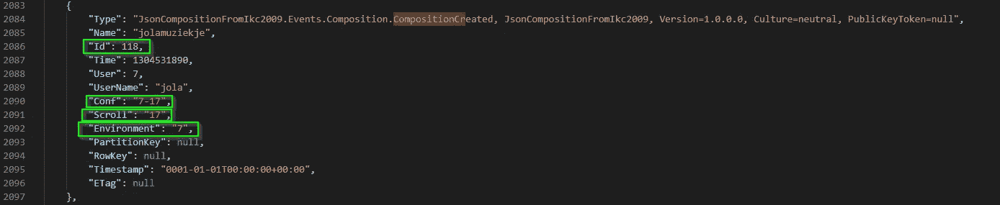

因此，我们的新函数需要来自 blob 的带有序列化事件数据的输入绑定。对于输出绑定，我们需要滚动、环境和配置数据，但是我们必须检查这些项目是否存在。

仅对于合成本身，我们将总是存储我们的合成事件行—可能覆盖较早的版本—这没有问题，因为较早创建的顺序将确保新的环境由上游实体的较新版本更新到下游。

通常，在存储事件时，通常不会更新整个实体，因为导致新版本的编辑事件只需添加到早期版本的尾部，从而保留整个历史。只有在迁移期间并行情况的上下文中，我们才会清除整个早期版本，并用人工翻译的较新版本来替换它。

这是必要的，因为旧版本的前端也不保存事件数据。然而，在未来新的(JavaScript 而非 Flash)版本的前端中，所有的编辑操作只会导致新的事件被附加到同一个流中。

# 存储帐户的差异

在我的 Azure 订阅中，我创建了多个存储帐户，因为我通常期望不同的发行版。卷轴将用于一个国家或地区，在嵌入网站的背景下。

此外，滚动通常会有一个很短的缓存期，因为滚动的业务是向用户提供一些条目，用户可以用这些条目开始创作。

环境数据(可用剪辑)通常在多个合成的上下文中重用，并且可以在区域之间重用。配置数据支持环境在滚动上下文中的典型使用，因此它们也是本地的，但是可以比滚动数据更多地被缓存，因为它们通常一旦发布就不再改变。

然后是组合数据，这些数据通常在本地使用，但会发生变化，应该能够实现实时协作。由于所有这些不同的特征，我真的不知道缩放将如何发展。

至少我创建了四个不同的存储帐户:

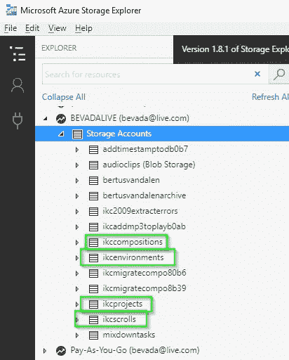

# 函数 StoreEventsInTables 的设计

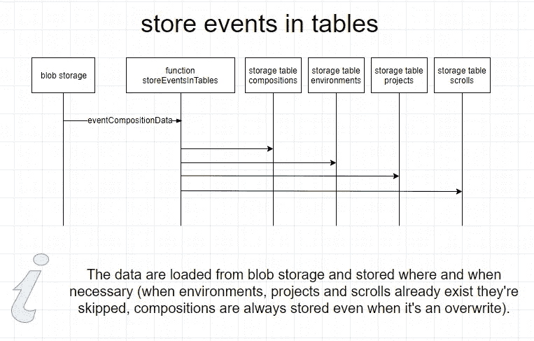

函数本身的创建——c#中的 blob 触发函数。

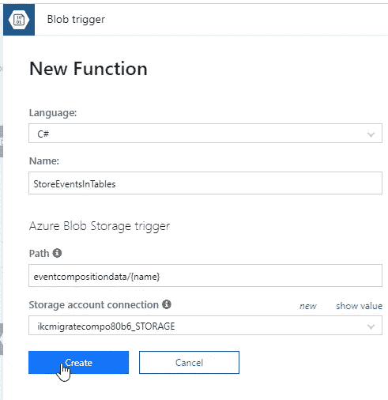

因为这个函数将有四个不同的输出绑定，所以在函数 JSON 文件中定义它们变得更容易，而不是在用户界面中手动单击。为此，使用右边的文件资源管理器，然后在 JSON 函数中编辑绑定。

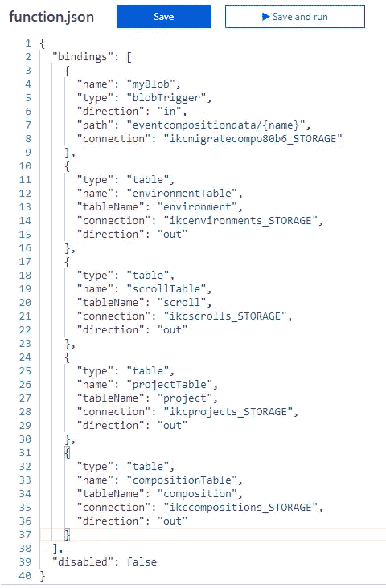

在这之后，当我们返回 C#文件`run.csx`时，编译器开始抱怨没有以我们的绑定命名的参数。只有当我们定义了那些论点，它才会快乐。

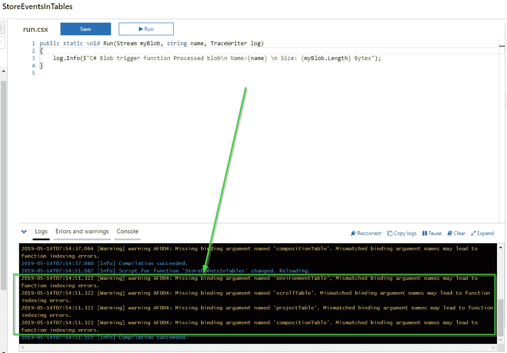

在这种情况下，我选择了 [CloudTable](https://docs.microsoft.com/en-us/java/api/com.microsoft.azure.storage.table._cloud_table) 类型，这使我能够对存储表做任何我想做的事情。绑定可以是导致相同类型存储的不同类型。在[这个微软页面](https://docs.microsoft.com/en-us/azure/azure-functions/functions-bindings-storage-table#packages---functions-1x)上有很棒的文档。

# 使用泛型代码反序列化为类型

这部分出乎意料的难。当您知道反序列化对象中的这些类的名称，并且不想为每个单独的类编写几行代码时，如何从 JSON 反序列化成某种包含不同类的列表呢？

经过一番绞尽脑汁和谷歌搜索，我找到了一种反序列化为特定类型的方法，但不是以一种非常通用的方式。我必须明确地告诉编译器它将会是什么:

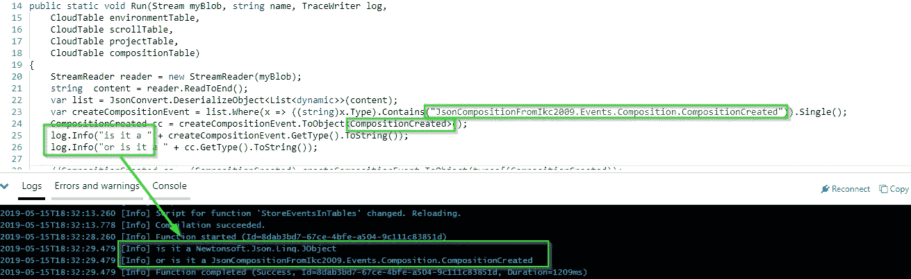

我花了更多的时间将对象实例化为合适的类型，但最终我成功了。

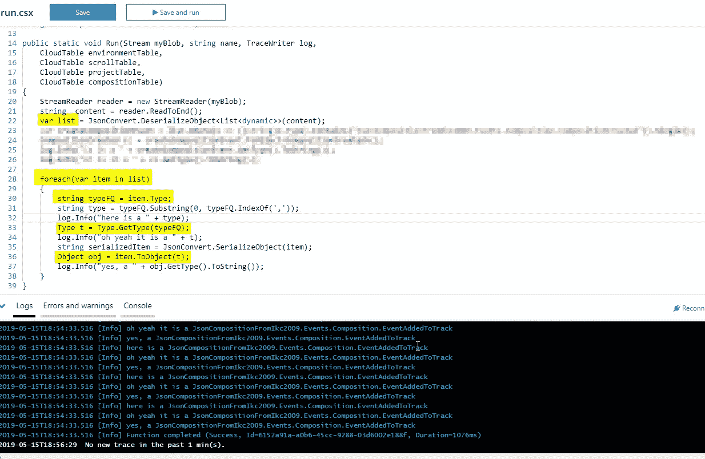

我使用标记接口来决定哪个事件应该存储在哪个表中。所以我应该能够区分它们——这很有效！

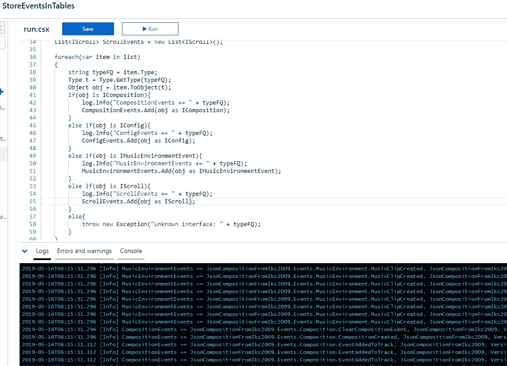

# 事件的行键和分区键的组合

如前所述，我使用组合创建的事件来存储不同“业务会话”的事件流的标识符。

这些可以用作分区键。然后可以使用一个递增的数字作为行键。

通过使用一个递增的数字，我们可以加载一系列的事件。例如，为了同步一个会话，我们可以将最新的已知事件传递给我们的 API，然后 API 可以选择所有最近的事件。

当我们创建所有事件时，我们继承了`TableEntity`，这样一个行和分区键将自动可用。

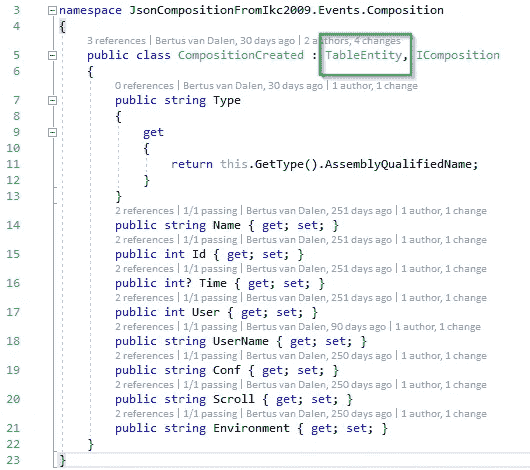

这种代码会给我们一些存储密钥:

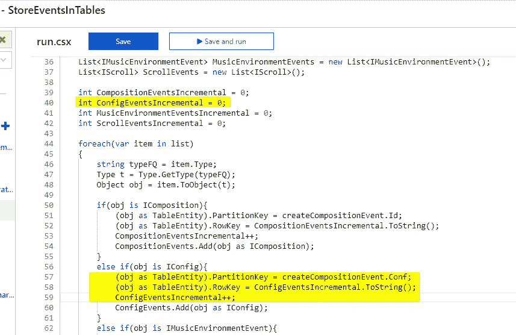

在我们将分区和行键分配给表实体之后，我们总是将所有的合成事件存储在数据库中。

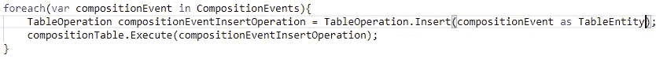

为了进行测试，我们将把同一文件的另一个副本从文件资源管理器放入存储资源管理器，以触发该函数。

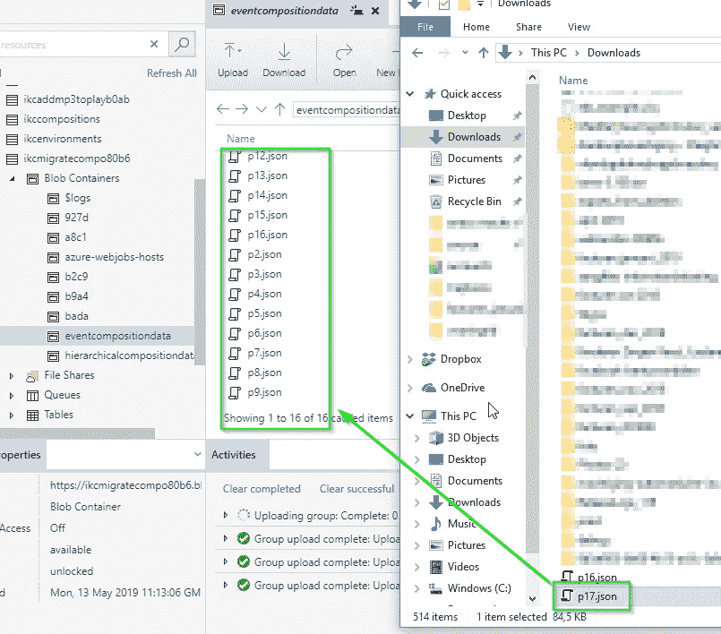

现在，因为我在火车上，日志流服务没有向我显示任何内容！幸运的是，我们有监控页面，可以看到运行是成功的。

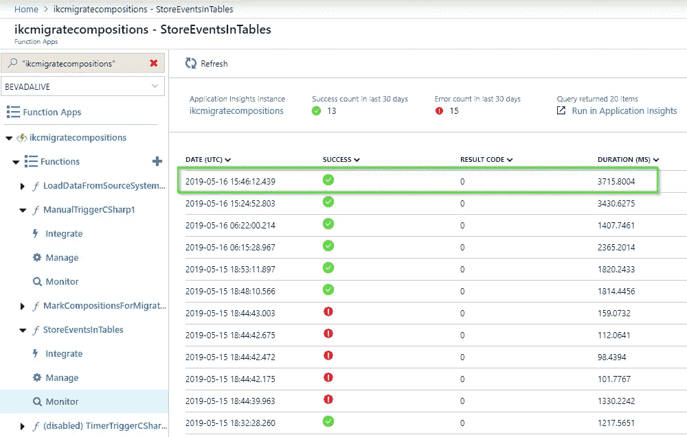

当我单击那一行时，我仍然可以看到调用细节。看起来很不错！

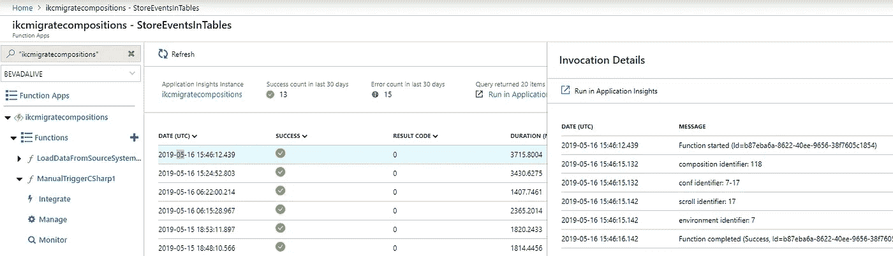

但是最好的还在后面…我们的数据在表中存储！

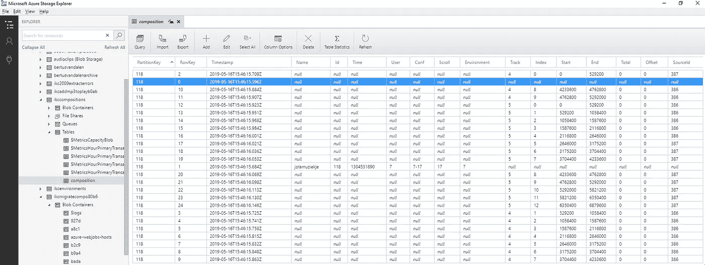

当你研究上图的时候，你会发现有很多空字段。然而，这些只是 Azure Storage Explorer 的结果，它使用表格视图来显示行。

实际上，表中的“空字段”没有空间损失——每一行都有自己的结构，并且每一行都是唯一的。在存储资源管理器中可能会变得难以阅读，但这并不重要。

一旦我们习惯了展示的方式，我们会发现桌子上有三种类型。数字 0 是`ClearComposition`事件。它没有字段。它是一种标记，告诉应用程序卸载现有的内存或存储。

第二个(你可以看到它有下一个`RowKey`)显然是一个`CompositionCreated`事件。它有组合的名称和它所依赖的其他实体的所有标识符。第三个，以及所有其他的，是音乐剪辑被添加到作品中的事件。

但是有一个问题，类型没有被存储！

# 删除以前的记录

因为我在类型上犯了一个编程错误(我需要纠正这个错误)，所以我必须删除具有特定分区键的所有复合数据行。此外，当用户保存一个新版本的组合，并在这个新版本中迁移，它将不得不覆盖旧版本。所以，现在有必要删除所有带有分区键的行。

我创建了下面的代码，它将删除特定组合中的所有行。

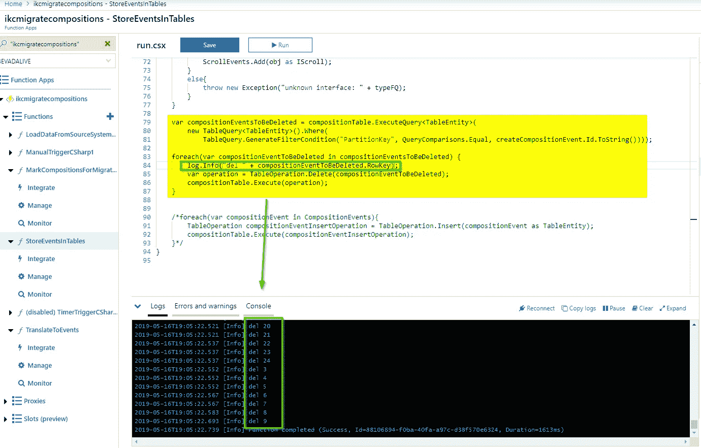

它是否从表存储中删除了我的实际行？

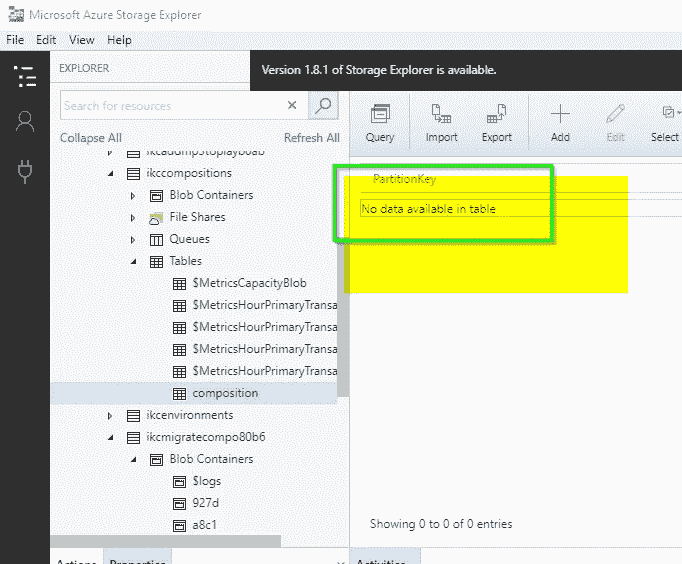

是啊！

# 更正类型字段

我做过的实现，但只是序列化。为了使它也作为一个表实体工作，旧版本不能工作。这是旧版本。

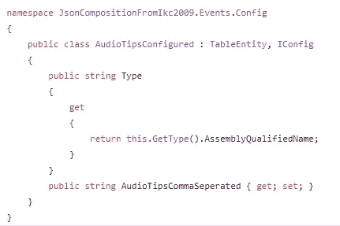

当然，该字段需要有一个普通的 getter 和 setter。为了自动填充字段，我使用了构造函数。感觉有点怪怪的，希望以后不会给我出问题。

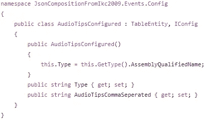

有了这个版本，当我运行我的函数时，它在表存储中给我类型:

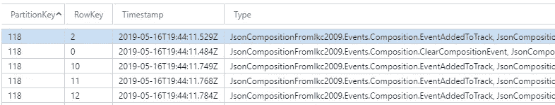

# 不存在时插入，否则不执行任何操作

对于合成，我们使用的策略是:*存在时总是覆盖*。相比之下，为了节省 Azure 点数，我们将对配置、环境和滚动数据使用另一种策略:*当存在时，不做任何事情*。

# 简化存储

当我再次删除数据时，导致我的四个存储表被填满。我可以看到所有的东西都在储物桌上。但是，没有我期望枚举类型的字段。

我看了 flatten API 和`DynamicTableEntity`类。但是，我已经对 JSON 序列化相当满意了，我不想通过使用更多的方法来增加更多的漏洞。我不打算在表存储的上下文中实际使用这些字段，所以我还不如将它们序列化，让一切变得简单得多。

存储域和应用程序域之间的分离变得更加清晰。然而，这意味着我必须从我所有的类中移除`TableEntity`类型的继承。

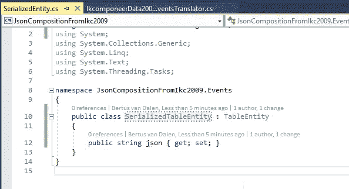

`SerializedEntity`是我将用于*所有*我存储的数据的那个。

# 最终结果的预演

代码的最终结果变得更加简单。我只是创建了四个相同类型的列表。唯一的区别是它们的分区键，并且，由于前面解释的原因，它们的存储帐户因分布/可伸缩性/优化原因而不同。

从日志来看，这部分功能似乎运行得很好:

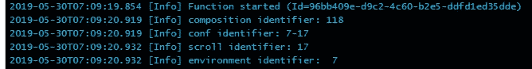

代码的下一部分处理确定类型，并查看事件应该存储在哪里:

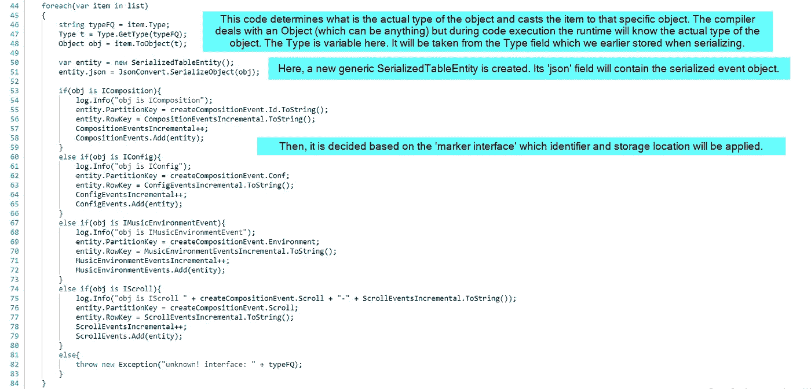

正如我们在日志中看到的，这似乎也是可行的。

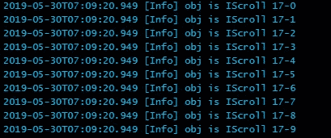

下一段代码将确保当同一组合的旧版本已经被迁移时，组合首先被删除。

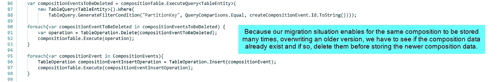

我们可以在存储表的时间戳中看到，合成确实被覆盖了。

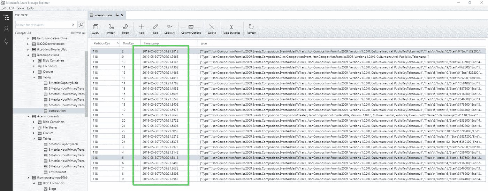

其他三个聚合在迁移过程中永远不会改变。因此，我们只需要存储它们一次。因为读取一条记录比覆盖全部记录要便宜得多。通过编写这样的代码，我们将节省数以亿计的写操作。

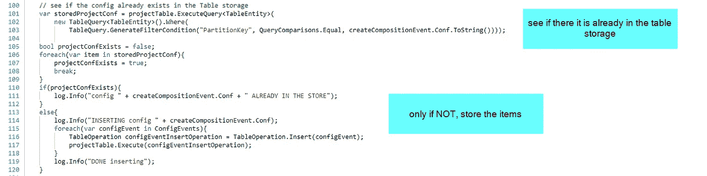

我们可以在日志中看到这是可行的。

此外，我们可以在时间戳上看到，它比成分更老。

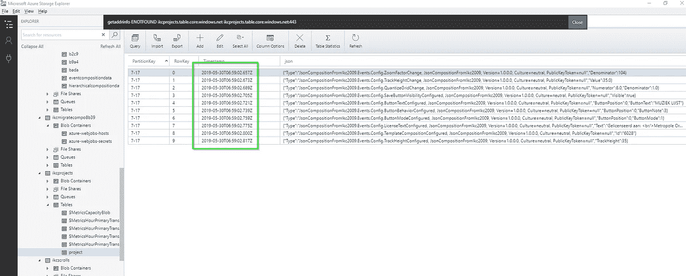

现在一切似乎都工作了，我们可以再次检查整个流程。

# 回归测试整个流程

当我们在几个下游函数中对 NuGet 库做了一些更改时，我们可以问，“我们是否也需要在上游函数中实现这些更改？”

当我们查看这些变化的性质时，它是有帮助的，并且可以预测我们是否必须将上游功能更新到包的更新版本。

所以，我们再次重温第一个函数。

# 重新访问标记组合形成迁移

这个函数似乎没有对库做任何事情——它只是从 PHP API 获取一个数字 id，将其放入一个队列，并使用`setMigratedFlag`函数确认，同样只使用 id。

我们可以查看函数的`project.json`文件来完全确定。

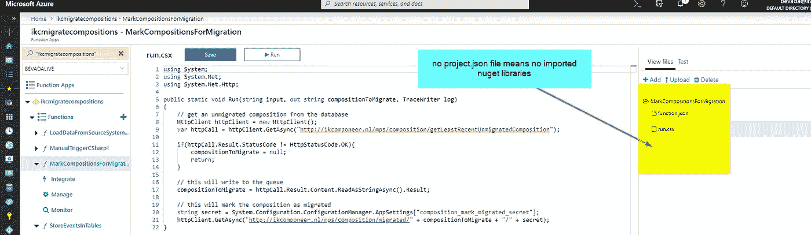

# 重新访问 LoadDataFromSourceSystemToBlob

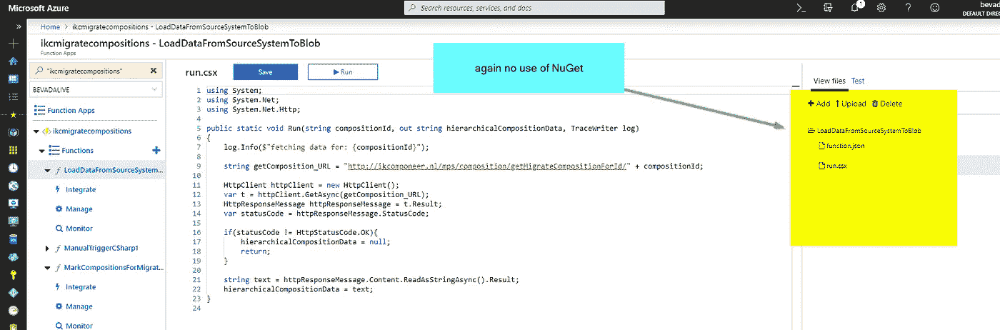

这个函数简单地从 PHP 后端加载大量 JSON 序列化数据，并通过 Blob 输出绑定(`hierarchicalCompositionData`)将它们安全地存储在 Azure 数据中心。所以，再次，没有使用我们的 NuGet 包。

# 重温 TranslateToEvents

这个函数使用实际的翻译器来加载来自 PHP 后端的复合数据，并将这些数据翻译成在。NET NuGet 包。

我们的软件包使用的是旧版本。当前版本是安装包 1 . 0 . 0-CI-2019 05 29–063832

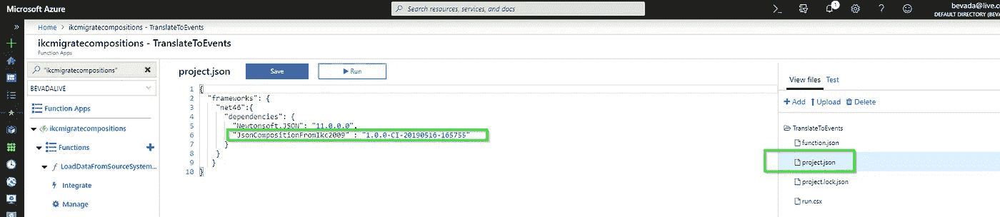

这是软件包的使用方法:

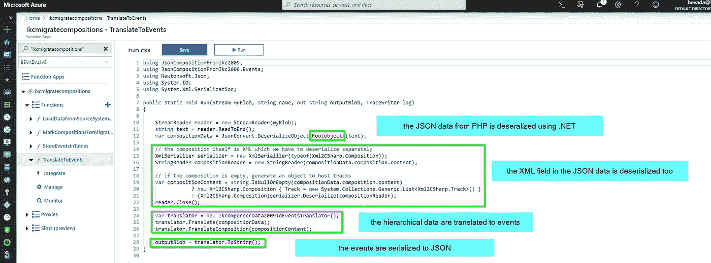

让我们来看一下自从这个 NuGet 包版本以来所做的代码更改。

事实上，在这个日期，我们可以找到一个构建，推动 NuGet 与这个版本。

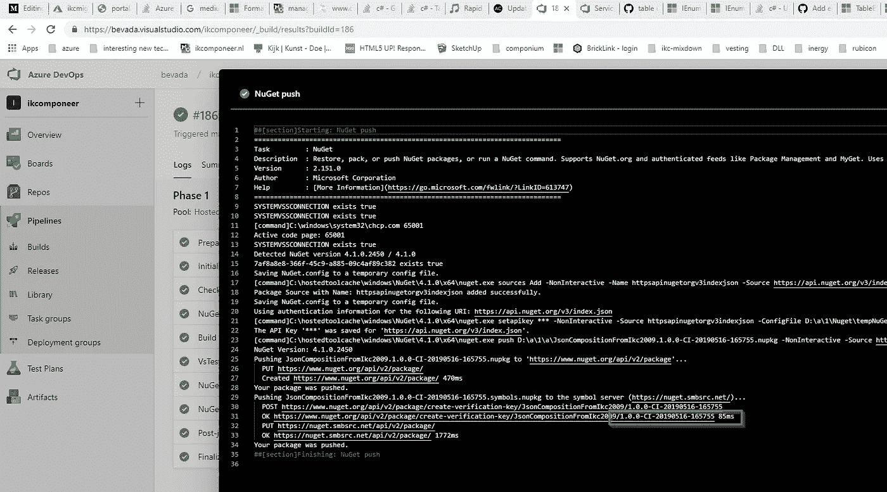

构建的标题立即显示了我应该在 GitHub 上寻找哪个提交。

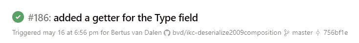

我现在可以检查所有的更改，以预测是否更改版本更好。

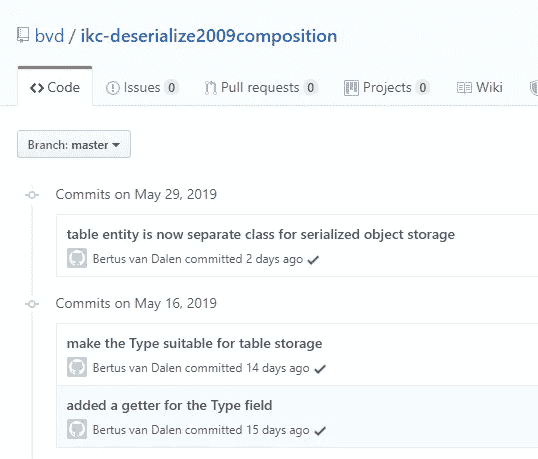

在这种情况下，我决定更新函数，这是您通常想要做的。

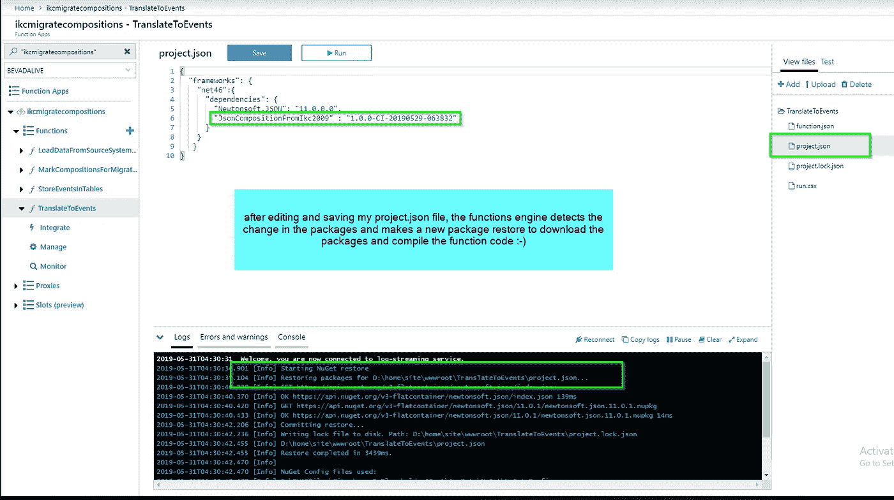

# 重新测试整个流程

由于我们已经更新了我们的包，现在让我们重新测试整个流程。它从第一个功能的手动触发开始，之后应该会导致连续触发四个功能。

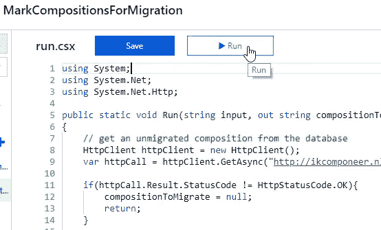

导致日志中出现成功消息。

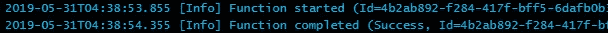

让我们看看这一次，其他函数是否也成功运行了。

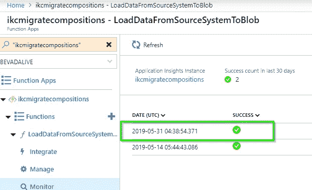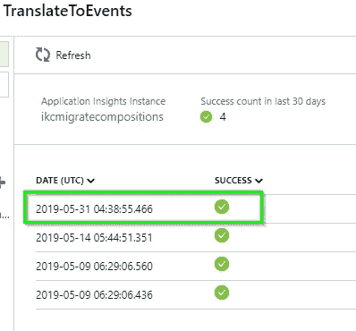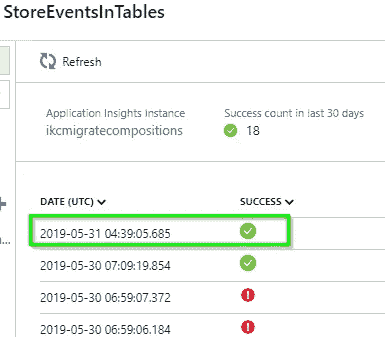

所以…看起来不错！结果呢？

# 在源系统数据库中测试结果

当我运行查询“everything migrated please”时，我看到最近迁移的组合是`avonturrrrrrrrren1ctest`，所以这应该是在我刚刚测试功能时提取、加载和转换并存储到 Azure Table 存储中的组合。

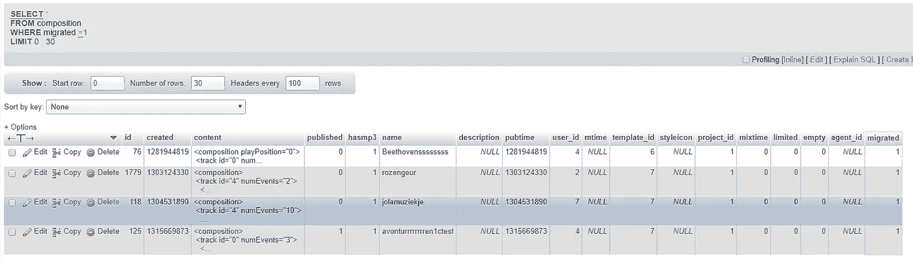

# 检查 Blob 存储

我可以看到在存储容器中有一个 blob，用于存储层次化/未转换的源数据。

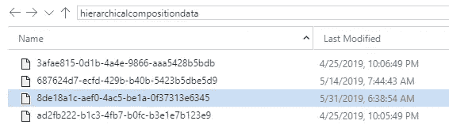

当下载 blob 时，我看到它确实是预期的组成。

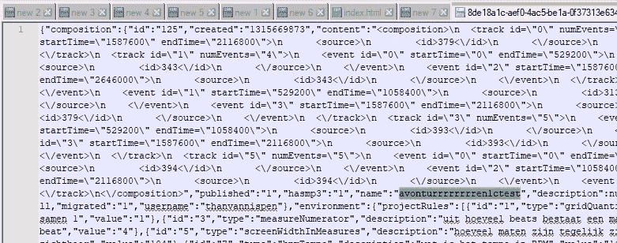

此外，在转换后的序列化数据的位置有一个新的 blob。

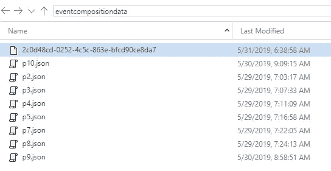

当下载这个 blob 时，我对里面的数据有了很好的印象。

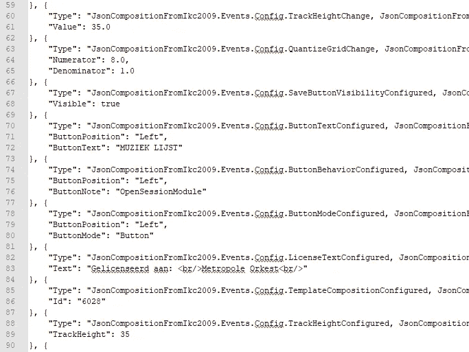

最重要的对象是“composition created”事件，在这里我们将找到其他聚合的分区键。

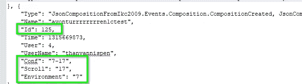

# 检查存储表

环境、项目/配置和滚动表没有更新，因为这些实体已经存储。然而，组合本身被更新了。

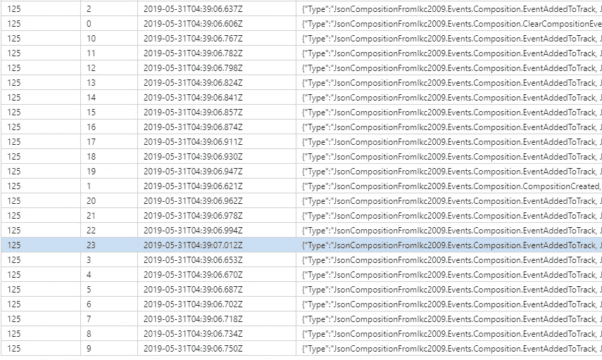

# 用定时器触发器代替手动触发器

为了迁移所有的组合，我们将使用一个计时器。我们应该让计时器走多快？我们希望旧的 PHP 数据库不会因为我们的请求而过载，但另一方面，我们希望在两个月内迁移所有的组件。两个月有多少秒？五百一十八万四千秒。数据库里有多少作文？104,000.

所以，我们这个问题的答案是 5184000/104559。

一个组合必须每 49 秒迁移一次，这样我们才能在两个月内准备好。让我们把它四舍五入到一分钟，这将需要两个月零十天。

那么，我们如何才能将手动触发改为定时触发呢？

首先，让我们删除手动触发器。

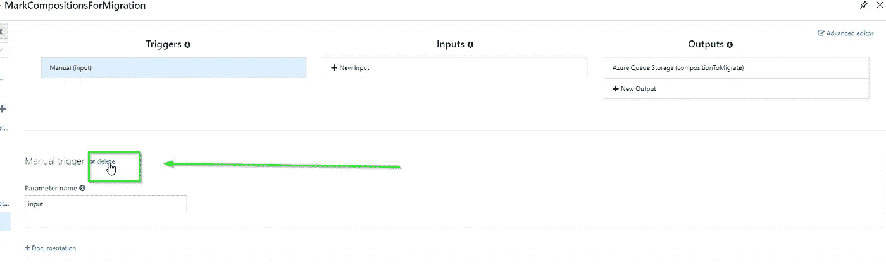

在删除手动触发器后，用户界面为我们提供了添加新触发器的选项。默认计划将每分钟触发一次。

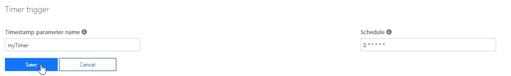

我可以在日志中看到有一个错误，告诉我应该将`myTimer`参数添加到函数配置文件中。

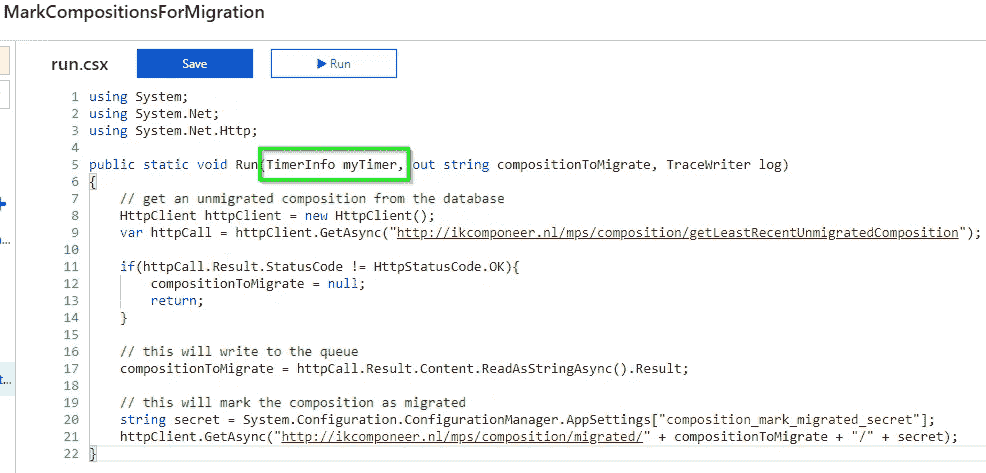

现在我可以看到函数每分钟都在运行。

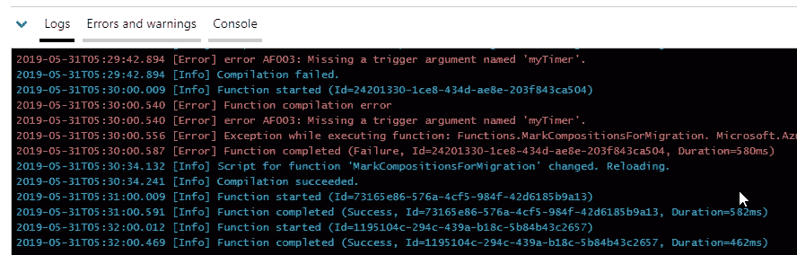

它应该会导致每分钟都添加一些斑点！

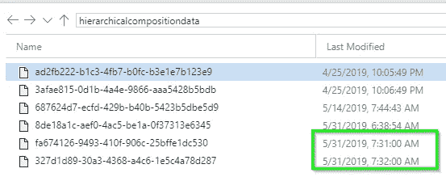

我们会在储物桌上看到一些东西吗？

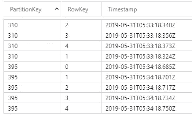

是的…成功了！

# 监视

TK 我每天都想看看这是怎么回事。我希望我提供的东西是现成的…

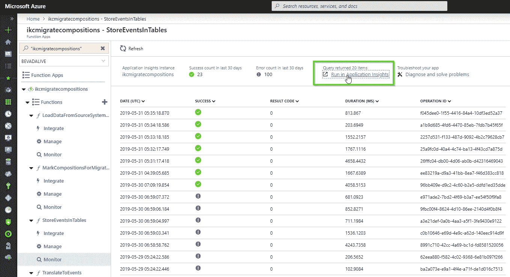

# 应用洞察

我在 Application Insights 的分析页面中看到一些查询。我不必对此进行配置；显然它是从盒子里出来的。

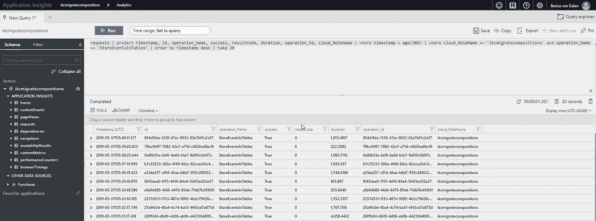

我不知道这到底是什么语言，但我设法轻松地包含了所有的函数，如下所示:

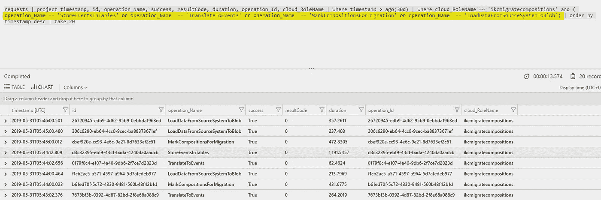

现在，我设法只得到**联合国**成功的。

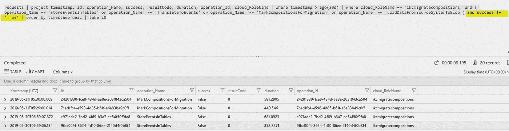

等了几天后，我再次查看我的查询，发现了一些错误。

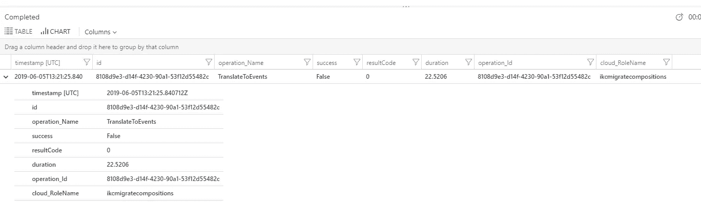

嗯，很不错，但是我看不到太多的伐木。幸运的是，在应用洞察中还有其他好东西。

在下图中，我选择了一个时间范围，在该时间范围内，我预计“请求失败”下钻会出现一些错误。右下角有一个蓝色按钮，可以让我进一步深入查看。

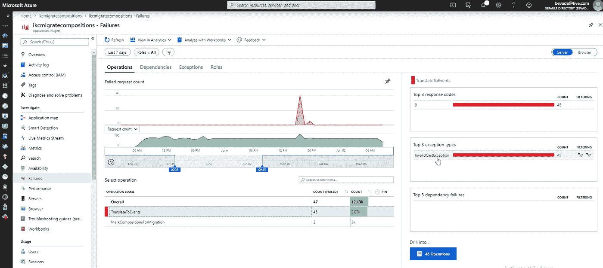

通过这个接口，我找到了这个调用的数据。我用`view all telemetry around this time`按钮查看更多，我稍微调整了遥测的时间窗口。

然后我发现，很明显，关于导致错误的 blobs 的数据被移到了一个有害队列中！

我可以很容易地在存储资源管理器中找到这个队列。这些消息中包含了我需要的所有数据，以便查看 blob 存储中无法处理的数据，并使用它来解决问题。

但是没那么容易。我必须手动打开所有排队的消息，并手动搜索和下载所有 blob 文件。因此，我将编写另一个函数，以便将失败的数据复制到一个特殊的 blob 容器中。这个容器将被命名为`failing-data`。

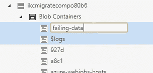

我创建了一个函数来处理这些数据，并给它一个存储队列触发器，但是我故意在绑定中出错，因为我不希望在我的处理函数按预期工作之前我的消息出队。

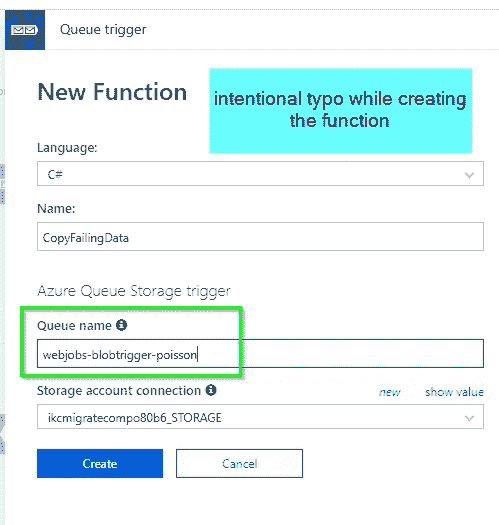

要从消息中反序列化所需的属性，您必须创建一个类，并将绑定分类为这个自定义类。

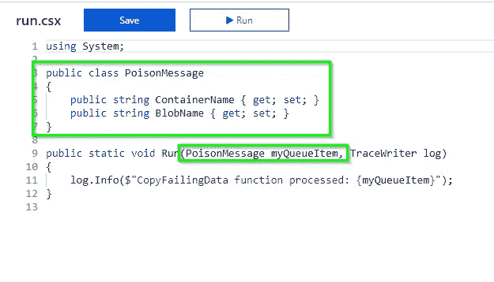

现在，我想根据病毒 blob 的容器名称，写入不同的 blob 位置。我不能为此使用标准绑定，但我必须使用命令式绑定，这样它才能动态工作。

首先，我在函数中注入一个粘合剂。然后，我可以使用这种绑定风格向带有动态路径的 blob 中写入内容。路径的第一段是 blob 的容器。其他部分是路径中的其他目录，最后是文件名。

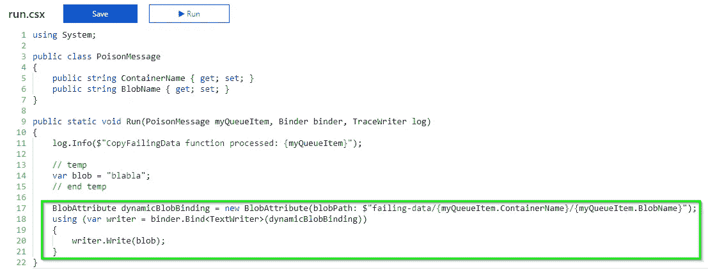

现在，我们如何使用`PoisonMessage` `ContainerName`和`BlobName`从适当的容器中动态读取？

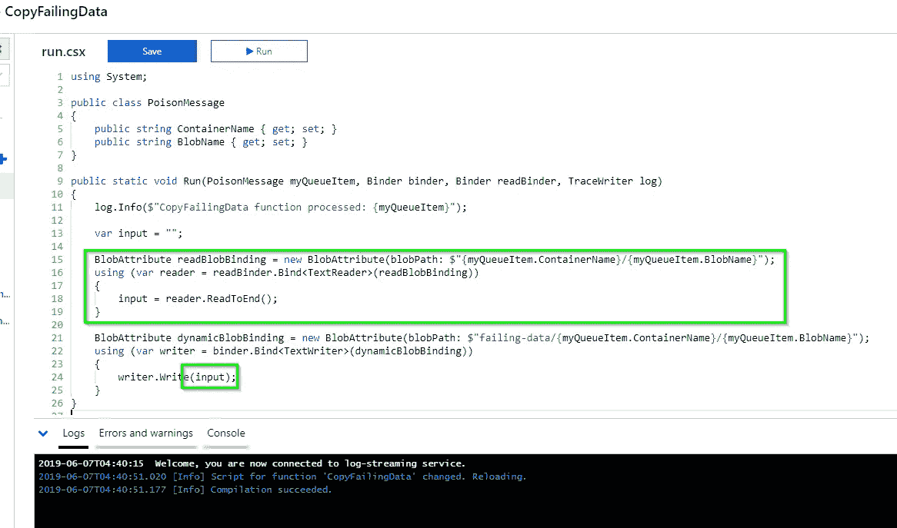

让我们纠正故意输入错误，从队列中读取消息，看看是否会导致数据被复制到失败数据 blob 中。

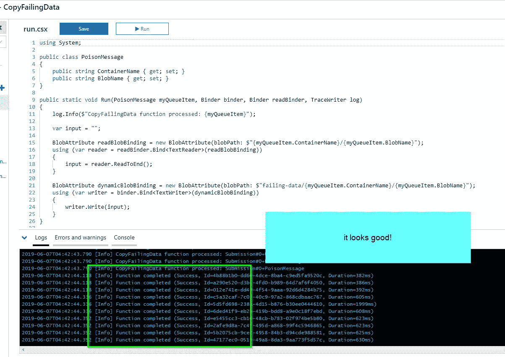

队列现在应该是空的，它是:

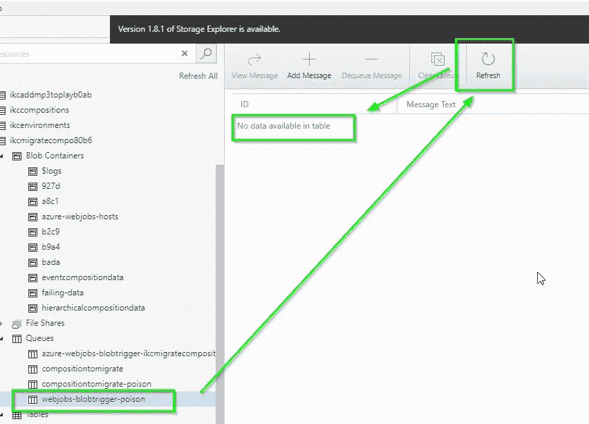

最重要的是，我们应该在新创建的容器中找到失败的斑点:

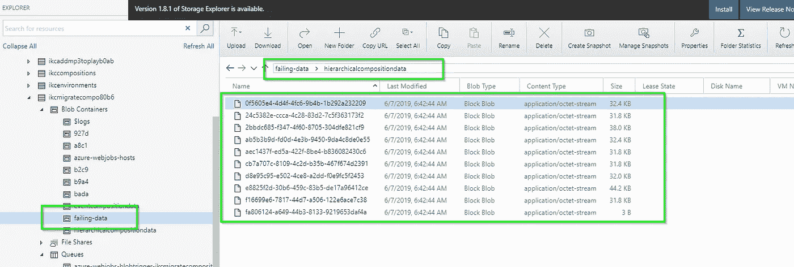

现在是时候一次轻松下载所有这些 blobs，看看哪里出错了。然而，乍一看，我真的看不出这些数据有什么问题。

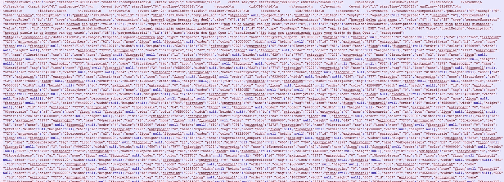

让我们再次查看应用洞察，搜索异常本身。

检查故障时，我们首先看到的是数字增加了。有 10 个 blob 有失败的数据，总共有 50 个异常，因为每个 blob 重试四次，每个失败的 blob 总共执行五次。

我们还看到两种类型的异常——无效强制转换和空引用异常。

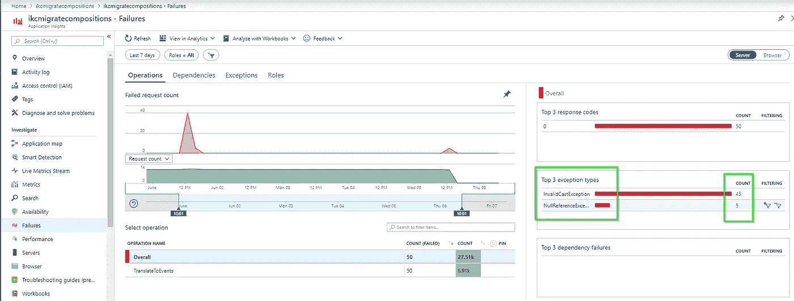

让我们点击无效的强制转换异常，看看它告诉我们什么。

经过一些点击，我得到了实际的错误，这是非常详细的！

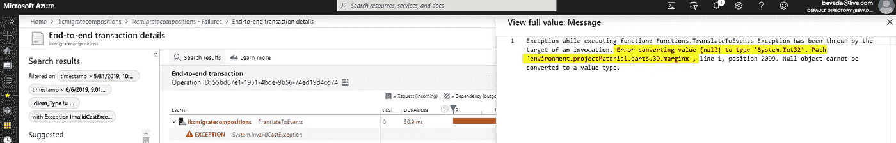

而且，是真的。在我的记事本++ JSON 数据中，我现在可以发现情况就是这样。

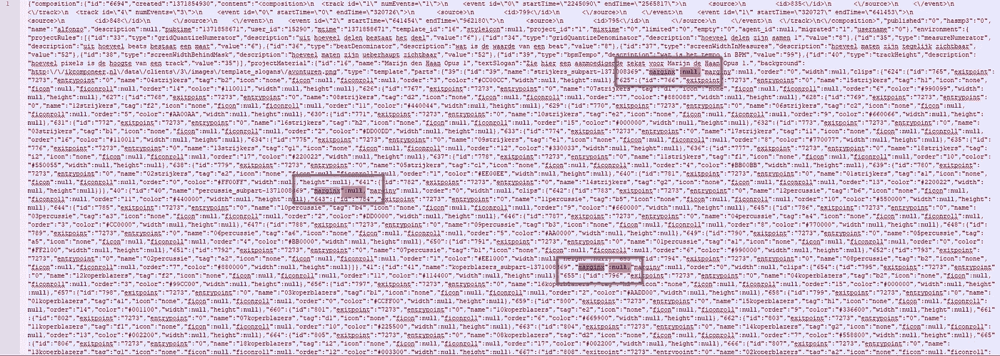

也许这些作品没有被很好地配置，因为它们从来没有真正投入生产，但它们是一个学生项目，一个实验。

这个实验产生了九个毒文件，还有九个无效的强制转换异常，这不是巧合。我不打算修改任何东西，并把这些数据视为不会被迁移的垃圾数据。

然后，出现了一个空引用异常。让我们看看还没有分析的数据文件。为什么会出现空引用异常似乎很清楚，因为它是一个空文件。因为它只发生过一次，它可能只是一些奇怪的事件，所以我不打算进一步调查它。

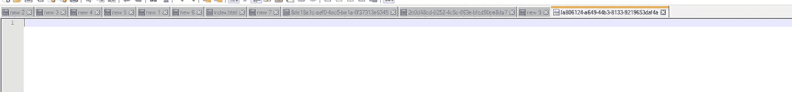

# **结论**

我希望你玩得开心，并且在实践中学习了如何使用 Azure 函数。我将重新启动迁移，并解决一些类似的问题，直到所有数据都迁移完毕。

请在下面留下您的反馈。**