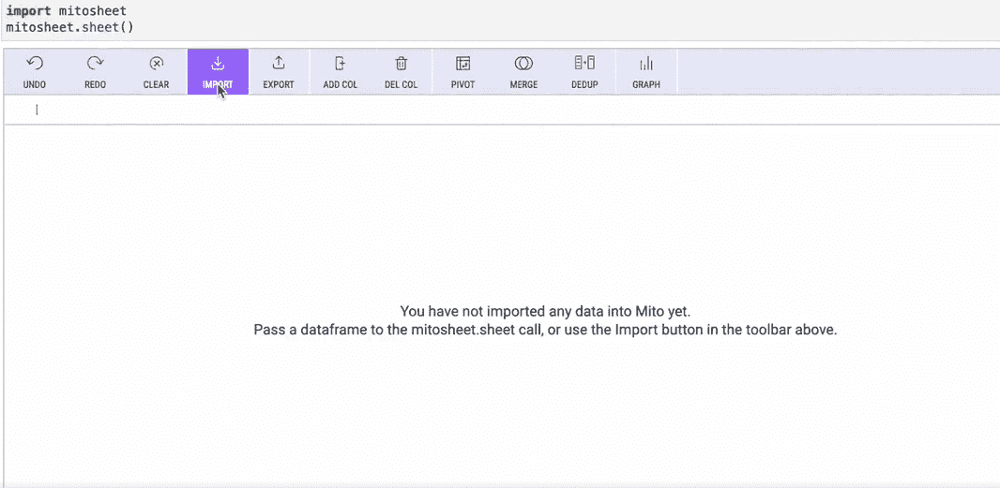
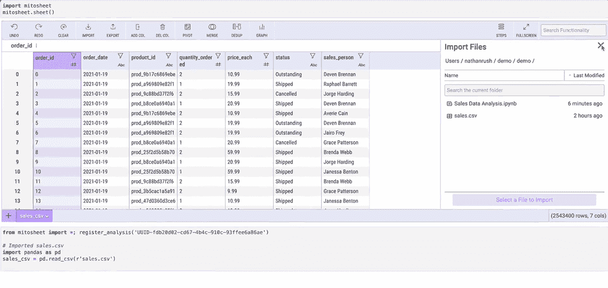
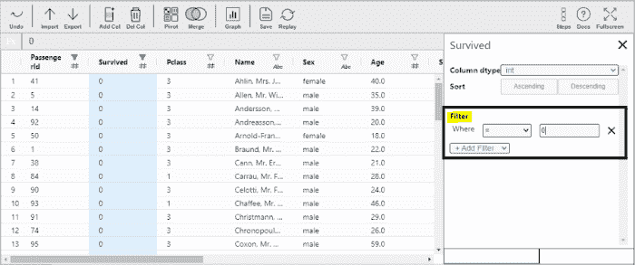
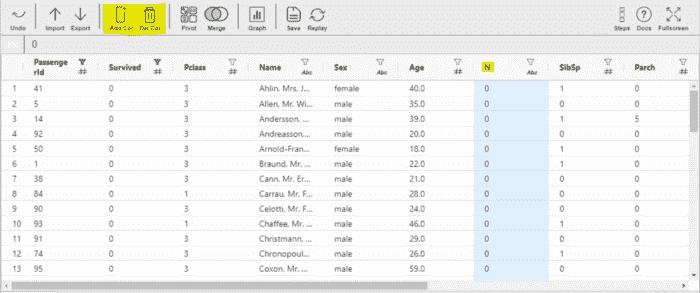
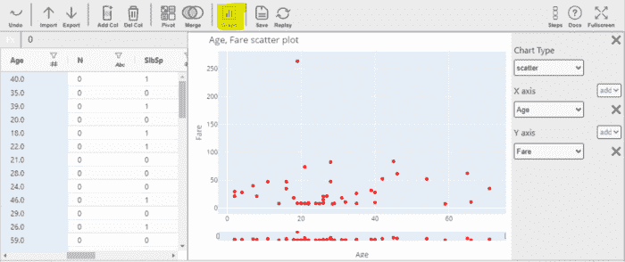

# 使用 Python Mitosheets 的数据操作

> 原文：<https://betterprogramming.pub/data-operations-using-python-mitosheets-6ac62e219c28>

## 如何使用 Python 库进行数据处理


卢卡斯·布拉塞克在 [Unsplash](https://unsplash.com?utm_source=medium&utm_medium=referral) 上的照片

在创建机器学习模型之前，探索数据是一项基本任务。它帮助我们探索任何隐藏的数据模式，可以通过创建不同的数据可视化进行分析。它帮助我们解开不同数据列之间的关系，并类似地识别数据属性及其关联。一旦我们知道了这一切，我们就可以[通过预处理数据](https://educationecosystem.com/dev_zero/RrYjq-python-data-analytics-and-visualization)来操纵数据，为建模做准备。

预处理包括清理数据、替换或删除垃圾值、转换不同列的数据类型等。这是有帮助的，因为我们可以为任何建模准备好数据，并且它还将有助于实现更高的准确性和性能。

Mitosheets 是一种电子表格，可以轻松进行数据分析、预处理和可视化。我们不需要编写多行代码，只需一行代码就可以执行探索性的数据分析和操作。它是一个 GUI 界面，在 Jupyter 实验室中工作，可以很容易地安装。

本文将探索 Mitosheet，这是一个用于 EDA、[数据预处理](https://www.youtube.com/watch?v=afAdMqxe7IE)、数据过滤和可视化的开源 python 库。

## **安装库**

您需要从使用 pip 安装来安装 MitoSheet 开始。Mitosheet 在 Jupyter Lab 上运行，所以你也需要安装它。使用此命令；

```
!pip install mitoinstaller!python -m mitoinstaller install
```

之后，您需要在命令提示符下运行下面给出的命令来启动 Jupyter lab。

```
start jupyter lab
```

## **运行 MitoSheet**

接下来，启动米托电子表格，您将在其中导入我们想要轻松浏览和操作的数据集。



在上图中，你可以看到美图电子表格的主页。在这里，您可以轻松地导入想要处理的数据集。

# **加载数据集**

通过单击 import 按钮，您可以选择我们想要处理的数据集。选择数据后，电子表格将加载它，如下图所示。

加载数据集后，让我们使用米托工作表的 GUI 对数据执行一些操作。



# **米托上的数据操作**

## ***1。改变数据类型***

我们将从更改列的数据类型开始。如果我们按照常规方式，我们需要为此编写代码，但在美图工作表中，我们只需单击一下即可完成。我们只需要单击列名，这将为我们提供更改数据类型和列名的选项。

## ***2。*过滤数据**

同样，我们可以在同一个窗口中根据特定条件过滤数据，以更改数据类型。



## ***3。添加/删除列***

在这里，我们将尝试从数据集中添加和删除一个列。



## ***4。数据可视化***

现在我们将创建一些数据可视化。



另请参见本视频中给出的示例；

## ***5。保存数据***

在所有的操纵和预处理之后，我们可以保存数据，并将其用于机器学习和深度学习建模。

# **收尾思路**

除了这些功能，您还可以探索其他功能，如 Pivot，它可以创建[数据透视表](https://www.youtube.com/watch?v=Bb7dicRCRIQ)，Merge 可用于合并数据集，等等。

继续使用不同的数据集，创建不同的可视化，执行数据预处理等。使用 MitoSheets。