# 数据持久性—云工具包

> 原文：<https://betterprogramming.pub/data-persistence-cloudkit-b12e575bd85c>

## 使用 CloudKit 将数据保存到 iCloud 并在其他设备上检索

# 介绍

我的上一篇文章是关于使用`NSUbiquitousKeyValueStore`将键值对保存到 iCloud。好了，现在是时候爆发大枪了！今天，我们将使用 CloudKit 从 iCloud 创建、检索、更新和删除(C.R.U.D .)数据。

我很想就如何使用 CloudKit 所提供的一切(比如 C.R.U.D)、订阅、通知以及其他类似的东西，撰写一个由多个部分组成的系列文章，所以我从最简单的(在我看来)开始，那就是 C.R.U.D。

使用 CloudKit，即使不考虑`NSUbiquitousKeyValueStore`，也比仅仅保存一个键-值对要紧张一些。

因此，让我们为我想在这篇文章中涉及的内容列出一个小小的路线图:

*   界面
*   CloudKit 仪表板
*   保存记录
*   检索记录
*   更新记录
*   删除记录
*   一般注意事项
*   演示

# 什么是 CloudKit，它有什么用？

至少在我看来，CloudKit 是一个数据持久层，可以真正让你的应用程序脱颖而出。它可以给用户一种联系如此紧密的感觉，以至于他们会为了方便而继续使用你的应用。当用户能够在他们的 iPhone 上开始一些事情，然后在他们的 iPad 或 Mac 上继续时，这是一种很棒的感觉。

最重要的是，它为用户提供了保存更复杂数据的能力，而不仅仅是键-值对，这在开发人员想要制作更复杂的应用程序时非常方便。

开始使用 CloudKit 可能有点棘手，但我会一直陪着你。如果你觉得我描述的方式难以理解，那么我建议你去看看 CloudKit 上的[苹果开发者文档。](https://developer.apple.com/documentation/cloudkit)

# 要求

*   Xcode 10
*   Swift 4(及更高版本)
*   [苹果开发者账户(99 美元/年)](https://developer.apple.com/programs/enroll/)

我假设读者是 CloudKit 的新手，因为一开始我很难理解它。然而，一旦你和它一起工作足够长的时间，并开始把事情拼凑在一起，那么它就会开始点击。

# 入门指南

和往常一样，首先要做的是创建一个新的 Xcode 项目。我们将为本教程选择一个`Single View App`(完成的项目可以在本文末尾找到)。

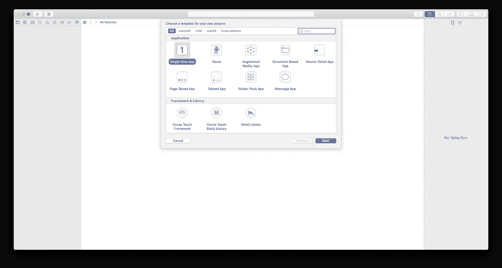

为此项目选择单视图应用程序

接下来，随便你怎么命名它，对于这个项目，我将命名为`CloudKitDemo`。

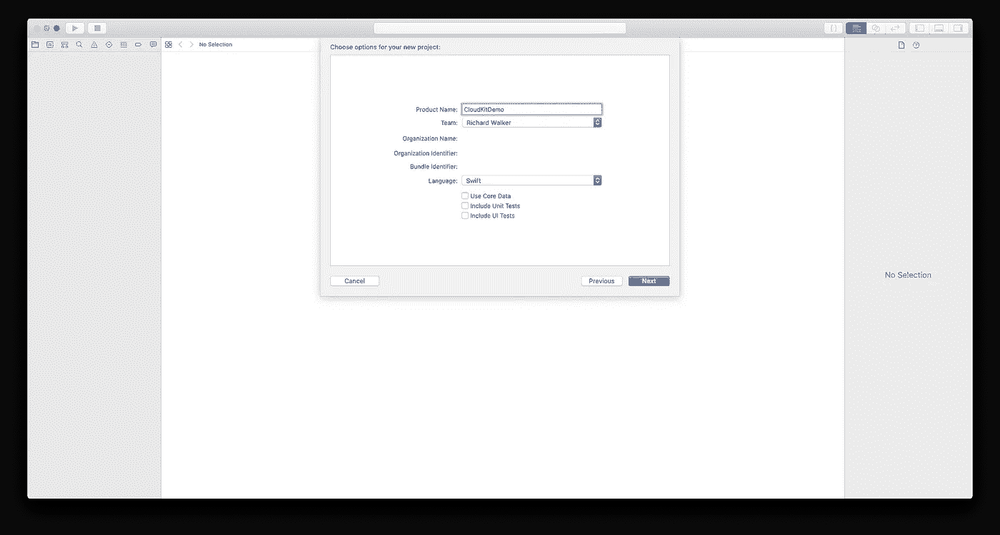

将此命名为 CloudKitDemo

单击“下一步”,并将其保存在您容易记住的地方。现在，让我们在您的应用中设置一些简单的功能，以便我们可以在其中获得 CloudKit 功能。

点击`Navigator`顶部的应用名称，然后选择顶部的`Capabilities`选项卡。之后，在功能列表中找到 iCloud 选项，打开开关。确保`CloudKit`和`Use default container`被选中。一旦这三件事都完成了，你的应用就可以使用 CloudKit 了！

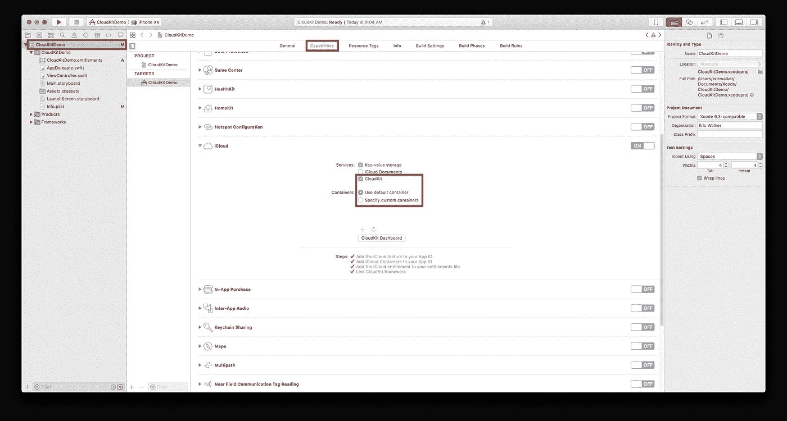

将 CloudKit 添加到您应用的功能中

我们需要做的最后一件事，也是我喜欢做的保持条理的事情，是制作一个`Variables.swift`文件，这样我们就可以在一个地方拥有我们需要的所有变量。

为此，按下`Command-N`，选择`Swift File`，将其命名为`Variables`，您就可以开始了！

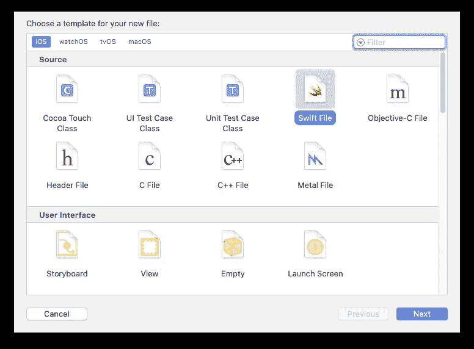

变量. swift

这是我最终的`Variables.swift`文件的样子:

*   二号线。导入 CloudKit 将允许我将它的一些框架用于我们稍后将定义的变量
*   四号线。这是一个`Strings`数组，当我们检索所有记录时，所有的标题将作为多个字符串进入这个变量
*   第五行。这是一个`CKRecord IDs`的数组，对于你保存的每一条记录，iCloud 都会给它分配一个 ID。当检索记录时，我们将把所有的 id 放入这个数组

# 界面

和我所有的文章一样，我希望 UI 尽可能简单，这样你就可以看到和理解代码和界面之间的关系。通过使它尽可能简单，它让您明白您可以将我们在这里编写的代码连接到任何类型的 IBOutlet、IBAction 甚至计时器，这将在创建应用程序时帮助您，给您比您在阅读普通教程时可能想到的更多的自由。

在我已经设置好的 UI 中，我添加了一个`text field and 4 buttons`。每个按钮都有自己的`C.R.U.D.`动作

接下来，我们需要将接口连接到代码。为此，通过按住`Command-Alt-Enter`进入助理编辑器，按住 control 键单击文本字段，将其拖至`ViewController.swift`，然后释放。你做了一个`IBOutlet` ——随便你怎么命名，对按钮做同样的操作。

然后`control-click`按钮并拖动到`ViewController.swift`，当光标在`ViewDidLoad`方法下时释放。我的结局是这样的:

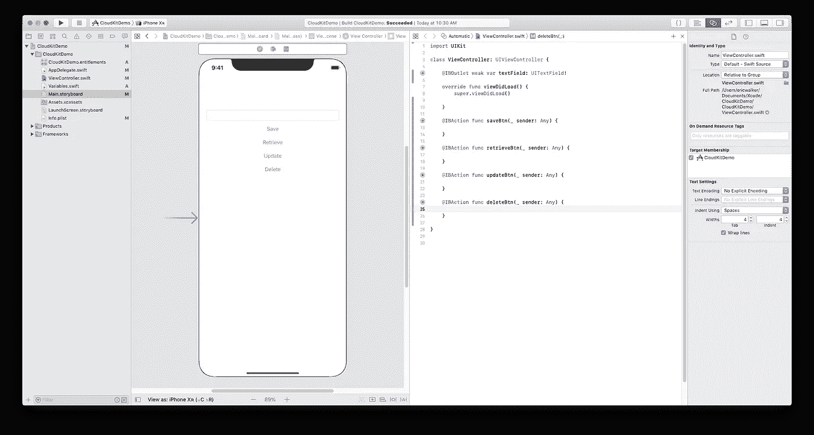

CloudKitDemo 应用程序的基本用户界面

如果你在制作 IBActions 或 IBOutlets 时需要更多帮助，请查看 YouTube 视频以获取更多信息。

# CloudKit 仪表板

为了让您将数据存储到 iCloud，必须先设置一些内容。我将向您展示的一些内容是在您保存记录时自动设置的，但我更愿意事先在`iCloud Dashboard`中设置好一切，这样我们就知道一切正常。

你要做的第一件事是去你的`iCloud Dashboard`所在的[开发者仪表板](https://icloud.developer.apple.com/dashboard/)。在左侧，你会看到一个标识符列表，是你在 iCloud 的 Xcode 中点击了`On`开关的所有应用。找到你创建的应用程序并点击它。

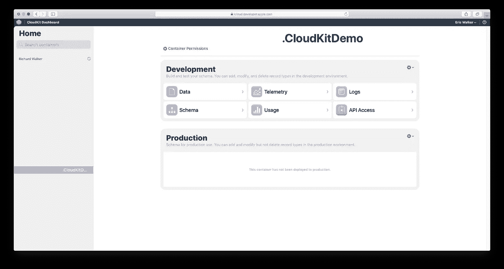

访问您的 iCloud 仪表板

接下来，我们将设置一些东西来帮助您检索数据。要检索您保存到 iCloud 的数据，您需要`query`或`fetch`数据。为了实现这两个目标，我们必须在仪表盘的`Schema`部分设置一些东西。现在只需点击`New Type`,然后输入你想保存的任何类型的“东西”。

一开始这部分对我来说有点难以理解。我开始认为它是你的应用程序的一种分类。我不认为这是解释它的最佳方式，所以这里有一个例子:假设你正在制作一个笔记应用程序，这个自定义类型的一个好名字是`“Note”`。或者你在做一个记账 app，就取名`“Score”`。

这将在某种程度上作为您将保存在应用程序中的数据的`“container”`。回到笔记应用程序的例子，在自定义类型`“Note”`中，您将为每个笔记保存一个标题和内容。因此，你将保存在应用程序中的每个笔记的标题和内容都将保存在自定义类型`“Note”`下。

在 iCloud Dashboard 中点按“新建类型”

输入姓名后，点击`Add Field`并输入不带引号的`“title”`。将`Field Type`变成`String`。

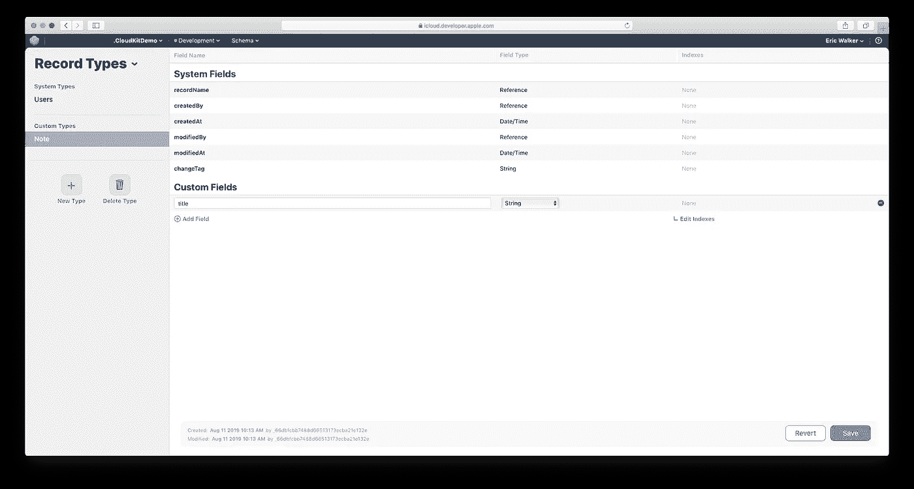

以字符串形式添加字段标题

现在在你刚刚创建的标题的`Custom Field`下面有一个蓝色的`Edit Indexes`按钮。单击该按钮，它会将您带到如下所示的屏幕:

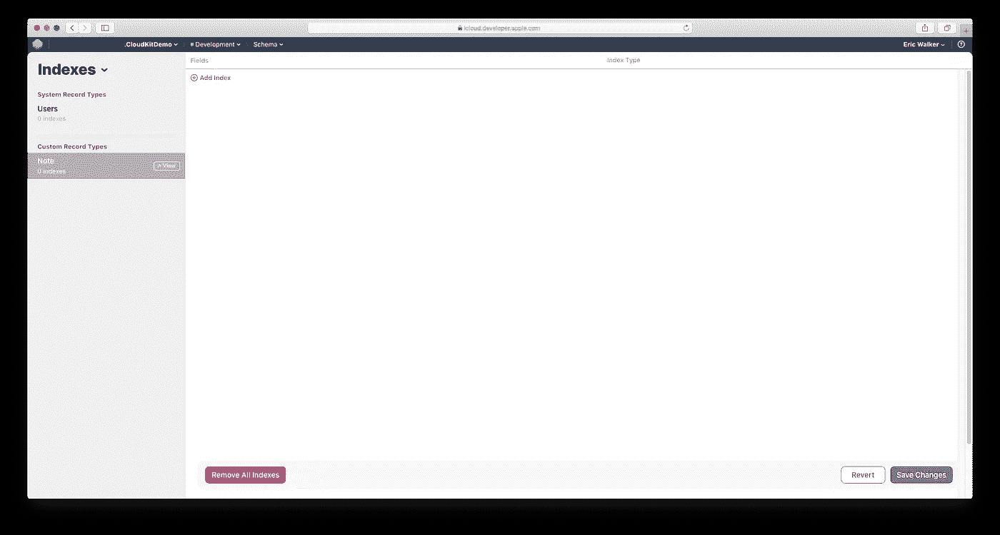

iCloud 仪表板中的“索引”页面

点击屏幕顶部的`Add Index`，它会给你一个有两个下拉列表的行，一个用于`Field Name`，一个用于`Index Type`。我更喜欢通过最近修改的记录来检索记录，所以我将其设置为如下所示:

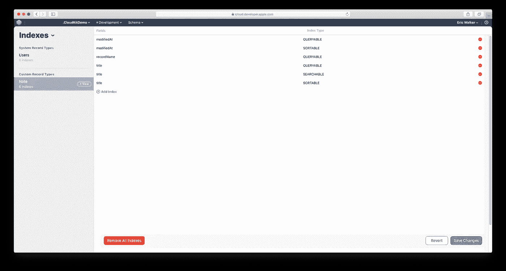

最后看一下应该如何设置索引

你要确保至少有`modifiedAt be QUERYABLE and SEARCHABLE`，至少有`recordName be QUERYABLE`。点击左下角的`Save Changes`，您将返回到该屏幕:

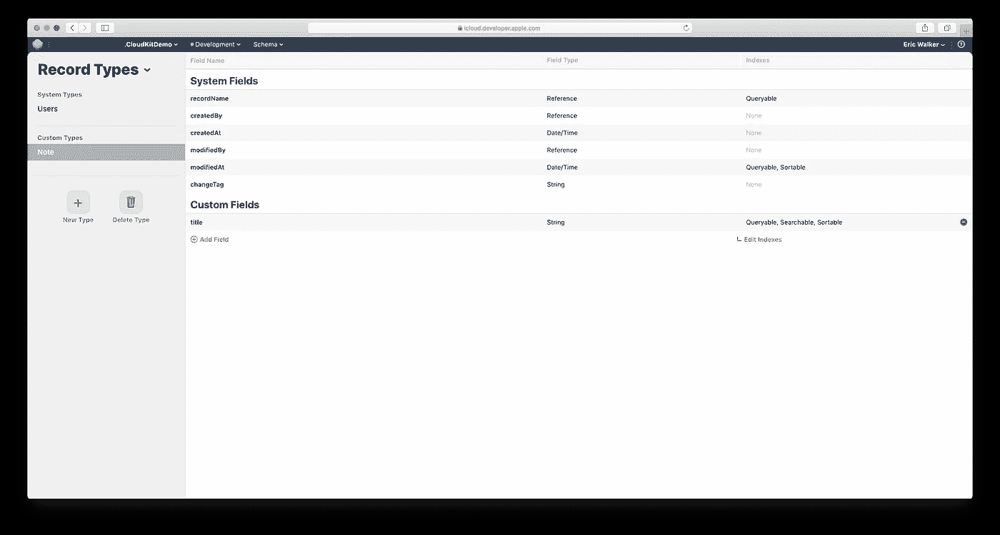

完成后 iCloud 仪表板的外观

# 代码

现在，所有无聊的设置都已完成，是时候开始教程中激动人心的部分了！

这里是`ViewController.swift`的全部代码。这比我的任何其他教程都要长，所以我宁愿一行一行地讲述将要执行的每个动作，而不是一行一行地讲述。首先是`saveBtn`，然后是`retrieveBtn`，然后是`updateBtn`，最后是`deleteBtn`。

然而，首先:

*   二号线。`import CloudKit`借助 CloudKit，我们可以做所有需要做的事情
*   第八行。`let privateDatabase = CKContainer.default().privateCloudDatabase`允许我们稍后在 IBActions 中缩短代码。我使用私人数据库，而不是公共或共享的，因为对于这个项目，我们不需要与任何人共享任何数据。

也请不要被长码吓倒！当它被打破的时候，理解和遵循就容易多了，相信我！

## 保存记录

保存记录实际上是整个过程的开始，不先保存记录，就不能检索、更新或删除任何东西。以下是`saveBtn`的代码:

*   第三行。这是将变量`title`设置为界面中`textField`的值
*   第五行。这是类型`“Note”`的记录。如果您从上面输入了不同的`Custom Type`,请在引号内输入一个字符串，而不是注释。
*   第七行。这有点像保存在`UserDefaults`中，你为我们上面创建的变量`record`的一个关键点设置一个值。在我们进入`“title”`的`iCloud Dashboard`中，那是`setValue`方法中`forKey:`之后的关键。
*   第九行。现在我们所做的就是使用我们在`ViewController.swift`开头设置的`privateDatabase`变量，并使用一个`.save method`。当它询问保存什么记录时，只需使用我们在上面创建的`record`变量。
*   第 11–17 行。这只是最小限度的错误处理，如果一切顺利，我们应该会看到`“Record Saved”`。

这就是本教程的储蓄部分，不算太坏，对不对？接下来，我们将着重于检索我们之前保存的记录。

## 检索记录

有几种方法可以从 iCloud 取回记录。一种方法是获取一条记录，这只从您传递给它的记录 ID 中返回一条记录。另一种方法是查询所有记录。查询所有记录将使用您指定的排序方法检索所有记录。

我们将查询记录，并按照它们被修改的顺序返回它们，这就是我们之前设置 iCloud 仪表板的方式。

*   第三行。这将告诉我们的查询，我们希望返回给我们的记录以某种方式排序，我们将在几行中告诉它我们希望它以什么方式排序
*   第五行。这是将进行记录检索的`query`，我们将它传递给我们之前设置的`predicate`
*   第六行。在这里，我们设置我们希望如何对`query`进行排序，我输入了`modificationDate`,因为这是我们在 iCloud 仪表盘中设置它的方式
*   第八行。这是我们创建的一个`operation`，所以当我们传入`query` 变量时，无论操作何时运行，它都知道要执行一个查询
*   第 10–11 行。这只是清除变量，我们这样做是因为如果我们没有这样做，并且我们在一个应用程序会话中运行了几次查询，那么记录实际上会在变量中重复，所以我们只需清除它们，这样我们就不会有这个问题
*   第 13 行。这是我们实际从 iCloud 获取记录的地方，这里重要的是只将每个记录追加到一个数组中，而不更新这里的任何 UI
*   第 15–16 行。这里我们只是将正确的 CloudKit 类型附加到它们各自的数组变量上
*   第 20–29 行。这是你更新 UI 的地方，但是一定要在`DispatchQueue.main.async`中完成，这样你就不会在 UI 准备好被更新之前更新 UI。这部分有点令人困惑，但是只要知道在`queryCompletionBlock`和`DispatchQueue.main.async`方法中更新 UI，你就可以了。
*   第 31 行。这只是将操作添加到要发生的事情中，如果没有它，查询将不会运行，所以请确保将您的`operation`变量传递给该方法。

检索数据可能是 CloudKit 中最难理解的事情。正如本教程中的任何内容一样，如果你有不明白的地方，请不要犹豫，联系我或者在下面留言。

继续更新记录！

## 更新记录

如上所述，我们将使用 fetch 来更新记录。这是因为我们可以获取给定记录 ID 的记录。理想情况下，我们应该将所有的数据显示在一个 UITableView 中，这样我们就可以获得您想要编辑的项目的索引，并从特定索引处的`recordIDs`变量中获得记录 ID 元素(我将制作另一个教程来介绍这一点，但我们现在不担心它)。

*   第三行。在这里，我正在硬设置一个字符串，我们将使用我们设置的这个`newTitle`变量来更新我们的记录之一`“title”`
*   第五行。我从保存它们的数组中得到一个`record ID`。我只是得到了数组中的第一个，因为这只是一个演示项目，如果你愿意，你可以自定义你的。还有一个旁注，你必须`save and retrieve your records before calling update`，这样就有你**可以实际**更新的记录
*   第七行。这就是我们想要更新的记录的地方，我们传入想要更新的记录的变量，这个方法返回一个变量，让我们能够编辑这个变量，但是这个变量在后面。
*   第九行。这只是基本的错误处理，没有什么疯狂的
*   11 号线。这是我们将记录的`title`键设置为`newTitle`变量的地方，就像我们最初保存记录时一样
*   第 13–23 行。这和我们之前写的`saveBtn`代码完全一样，传入你想要保存的`record`并做一些基本的错误处理…因为它有些重要。
*   第 29 行。这是我们开始记录时剩下的错误处理

更新记录可能很难理解，但是如果你把它想成两个不同的部分，一部分通过它的`recordID`获取记录，另一部分通过与`saveBtn`相同的方式`saving`获取记录，那么它应该更容易理解。

## 删除记录

删除记录就像保存记录一样简单。让我们来看看:

*   第三行。就像更新变量时，我们需要通过它的`recordID`来访问记录。
*   第 5–15 行。然后在为我们想要删除的记录获得一个`recordID`之后，我们就……删除它！在`privateDatabase`上调用 delete 并做一些基本的错误处理…真的没什么难的！

## 一般注意事项

这就是所有的代码！这真的没有那么糟糕。遗憾的是，这篇文章仍然包含大量信息。

我的意见是一次一篇地看这篇文章。从顶部开始，一路向下。将此加入书签，稍后再回来看。不要被这里给出的信息量吓倒。

CloudKit 不是你想在精神上打败你的东西，因为一旦你浏览了这么多不同的教程，它会变得非常混乱。希望这是你需要的唯一一个(至少就 C.R.U.D .而言)。

当使用真实的应用程序时，请确保每次启动应用程序时都进行检查，以确保应用程序的用户登录到 CloudKit。如果他们没有，要么让他们登录，要么提供第二个数据持久层，以确保他们的数据不会丢失。

## 演示

你现在要做的就是运行将应用程序部署到 iPhone 模拟器的方案(如果是第一次将应用程序运行到模拟器，可能需要几分钟)。

在文本字段中键入消息，然后单击保存按钮。

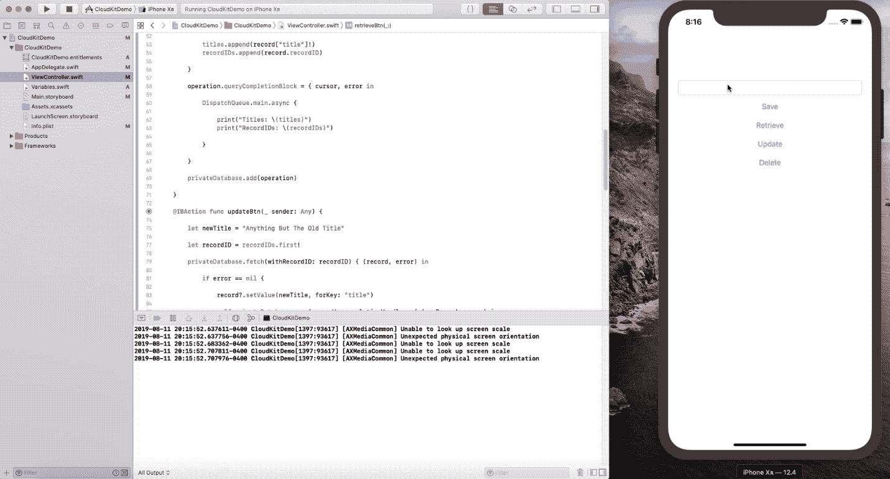

CloudKitDemoApp 的演示

1.  在`textField`中键入一个`“title”`并点击`Save` —您应该会在输出屏幕中看到`Record Saved`
2.  点击`Retrieve`,你应该会看到`titles`数组输出和我们保存的`record`数组输出，以及`recordIDs`数组输出和我们保存的`record`的 ID
3.  单击`Update`，它将获取我们一条记录的`ID`，并用我们编码到`update`函数中的新标题更新它。再次点击`Retrieve`，您应该会在输出屏幕中看到新标题
4.  单击`Delete`,它将访问我们拥有的一条记录的`ID`,并将其删除
5.  再次点击`Retrieve`，你应该会在输出屏幕上看到两个空括号，如下所示:[]

# 结论

我说“这就是 CloudKit — C.R.U.D ”,但它还有很多内容。

不过，在你的应用中使用 iCloud 无疑有助于留住用户，并确保每个用户都能在使用你的应用时尽可能地保持联系。如果你能浏览所有的厚信息，在你的应用中包含 CloudKit 绝对是值得花时间投资的。

我将继续努力，尝试制作涵盖 Swift 生态系统中较难主题的简单教程。

如果任何人对我的教程有任何问题或者有任何疑问，请不要犹豫，在这里给我发消息或者留下回复，我会尽快回复。

感谢大家的阅读！

# 项目文件

这是本教程的 GitHub 项目的链接。

 [## ewalk40/CloudKitDemo

### 用 iCloud 学习 C.R.U.D .的 CloudKit 演示应用。

github.com](https://github.com/ewalk40/CloudKitDemo)