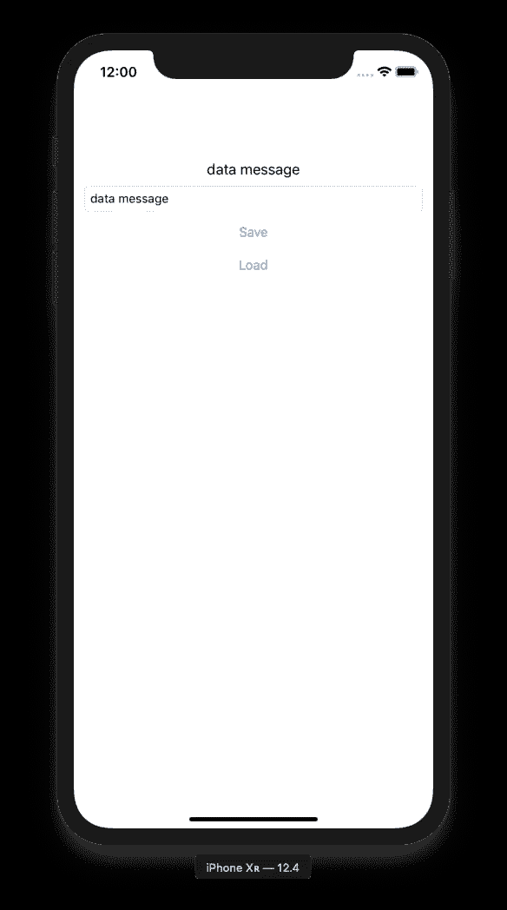
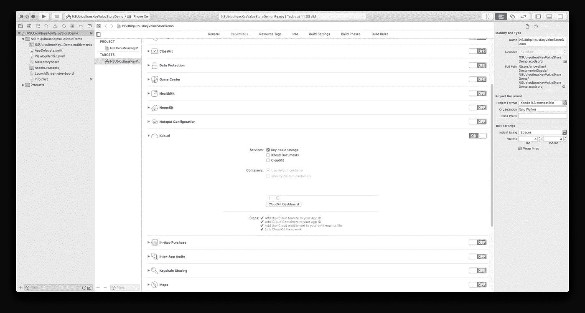
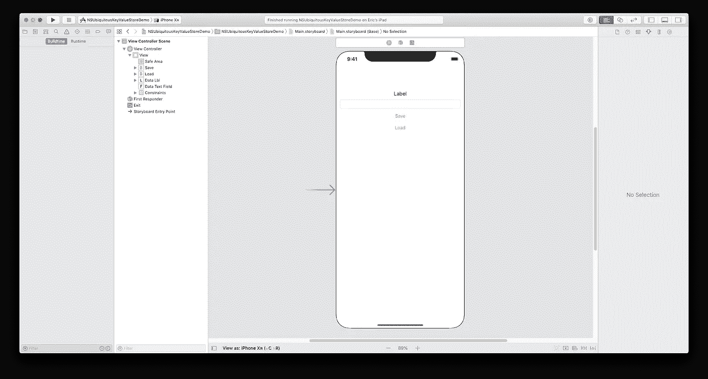
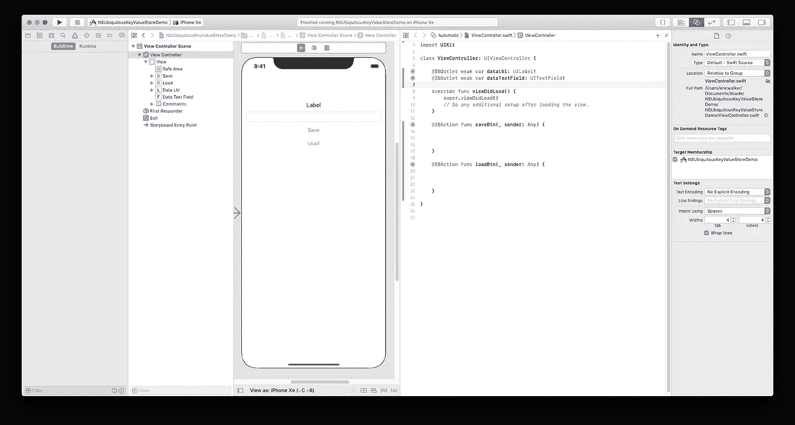

# 数据持久性— NSUbiquitousKeyValueStore

> 原文：<https://betterprogramming.pub/data-persistence-nsubiquitouskeyvaluestore-9cf4f97cd50c>

## iCloud 键值存储类似于 UserDefaults，但在您的其他设备上也是如此

从 iCloud 存储和载入键值对

我的上一篇文章是关于利用`UserDefaults`来持久化数据，即使你的应用程序已经从后台消失了。这是在应用程序会话之间保存数据的一个很好的方式。

虽然在本地保存数据(只在一个设备上)很好，但如今苹果生态系统中的人们通常有不止一个他们日常使用的设备。

如果你的应用和单个设备上的数据可以同步到其他设备上，这样你就不用再使用同一个设备了，这不是很好吗？

最简单的解决方案是所谓的`NSUbiquitousKeyValueStore`。

# 什么是 NSUbiquitousKeyValueStore，它有什么用？

`NSUbiquitousKeyValueStore`是 iOS 中另一个与`UserDefaults`惊人相似的持久层。

使用`NSUbiquitousKeyValueStore`有一个巨大的优势，那就是它有 [iCloud](https://www.apple.com/au/icloud/) 做后盾！

使用它和使用`UserDefaults`是一样的，除了你必须调用一个方法来同步所有的键值对，然后`NSUbiquitousKeyValueStore`会自动将它们同步到 iCloud。

我通常不喜欢关注我使用的框架的限制，但我在日常生活中是一个数字迷，所以这里有一些关于使用[NSUbiquitousKeyValueStore](https://developer.apple.com/documentation/foundation/nsubiquitouskeyvaluestore)的限制的数字:

*   组合的键值存储为 1 MB。
*   单个键值对的大小不能超过 1 MB。
*   您不能保存超过 1024 个键值对。
*   使用 UTF-8 编码，单个密钥不能大于 64 字节。

如图所示，这有一些限制。

然而，当你在一个应用程序中使用它时，例如，一个具有非常具体的设置列表的应用程序，这将确保每次用户安装你的应用程序时，即使在不同的设备上，他们的设置也将始终存在。

以这种方式使用它几乎肯定意味着你永远不会达到这些极限。

# 要求

*   Xcode[10](https://developer.apple.com/xcode/)
*   Swift 4(及更高版本)

我假设您已经安装并设置了 Xcode，并且准备好开始了。

这个教程并不是超级难，但是你必须在你的应用程序中设置`Capabilities`，这与平常不同，但是我会带你完成它。

# 入门指南

重要的事情先来。您必须创建应用程序项目。进入 Xcode 并创建一个新的`Single View App`。

在 Xcode 中创建单视图应用程序。

接下来，选择目标应用程序并进入`Capabilities`。

向下滚动到`iCloud`选项卡，将开关转到`on`。

之后，确保勾选`Key-Value Store`复选框。

在此之后，您就可以开始在您的应用程序中使用 iCloud 了。

在 Xcode 设置中打开 iCloud 功能。

# 界面

接下来，我们将进入`Main.storyboard`，开始布局我们的 UI。

正如在我的上一篇文章 [*数据持久性—用户默认值*](https://medium.com/better-programming/data-persistence-userdefaults-b8503f93ff14) 中，我将建立一个与那个完全相同的 UI:两个按钮、一个标签和一个文本字段。

你可以根据自己的需要进行设置，但这是我完成后的样子:

NSUbiquitousKeyValueStore 应用程序的基本用户界面。

既然我们已经设置了 UI，我们需要确保将接口连接到代码。

为此，按住`CMD+Alt+Enter`进入助理编辑器。`CTRL+click`UI 元素和控件从`Main.storyboard`拖到`ViewController.swift`。

你最终应该得到两个`IBOutlets`和两个`IBActions`。

两个 IBOutlets 和两个 IBActions。

如果你在制作`IBActions`或`IBOutlets`时需要更多帮助，请查看[这段 YouTube 视频](https://www.youtube.com/watch?v=z-ZaRC8L6uE&t=163s)了解更多信息。

# 代码

在上一节中，我们从技术上向我们的项目添加了代码，但这只是基础，并且与我编写的每个教程都相关，所以现在是真正的代码:

*   第 8 行:这是一个变量集，所以我们可以访问框架`NSUbiquitousKeyValueStore`。
*   第 17 行:这是我们在运行应用程序时，将变量设置为您在应用程序内的文本字段中键入的任何内容。
*   第 19 行:与`UserDefaults`一样，您有一个键和值。关键是使用`NSUbiquitousKeyValueStore`时如何访问该值。这是我们将键`“data”`设置为我们在前一行中设置的值数据。
*   第 20 行:这是**魔术线**，你绝对不想不小心漏掉它。这将编译保存到`keyValStore`的所有键-值对，并将它们同步到 iCloud，以便同一台设备或另一台装有您的应用程序的设备检索这些值。**警告**:即使在运行应用程序时运行了这一行，通常也需要几秒钟才能将其写入 iCloud 服务器。
*   第 26 行:这是如何从`NSUbiquitousKeyValueStore`加载一个值。您只需创建一个变量，并将其设置为键读取的值。
*   第 28 行:这是我们用从上一行的变量集中获得的数据更新 UI 中的标签。

再说一遍，差不多就是这样。

`NSUbiquitousKeyValueStore`几乎和`UserDefaults`一样简单，除了增加了额外的`synchronize`行。然而，通过这一行代码，您也可以将 iCloud 功能添加到您的应用程序中！

# 运行应用程序

你现在要做的就是运行将应用程序部署到 iPhone 模拟器或你的设备上的方案。

需要记住的一点是，它确实使用了 iCloud，所以无论你是在模拟器上还是在设备上运行应用程序，都要确保你在运行时登录了 iCloud。

应用程序启动后，你所要做的就是在文本字段中键入一条消息，然后单击保存。等待几秒钟，点击 load，你输入的信息就会出现在标签中。

现在，如果你不相信我说的 iCloud 的全部功能，请在另一台设备上加载应用程序，用同一个 iCloud 帐户登录。

无需在文本字段中输入任何内容并点击 save，只需点击 load，同样的字符串就会出现在标签中！

将字符串数据存储和载入 iCloud

# 其他注释

每当你使用`iCloud`时，特别是如果它是你在应用程序中保存和加载数据的唯一形式，在你的代码中添加一些部分来检查 iCloud 帐户是否登录，并尽可能地处理错误。

你不希望用户在 App Store 留下差评，仅仅是因为你的应用每次打开都会崩溃，仅仅是因为他们没有登录 iCloud 帐户。

# 结论

使用`NSUbiquitousKeyValueStore`与使用`UserDefaults`非常相似，如果它也可以自动备份到 iCloud，因此可以在所有 iCloud 连接的设备上使用。

数据持久性系列的下一篇文章是大文章…使用 [CloudKit](https://developer.apple.com/documentation/cloudkit) 保存记录和从 iCloud 检索数据，而不仅仅是键值对。

我真的希望在我的下一篇文章中重点讨论 CRUD。

CRUD 是首字母缩写词，代表:

*   创造
*   特里夫
*   ****更新****
*   **删除**

**我希望我坚持我想通过写作完成的目标，这是为了在一个易于理解、一步一步的指南中列出一些更难的 Swift 主题，每个人都可以跟随和理解。**

**当我们深入到真正的 CloudKit 功能时，请继续关注我的下一篇文章。**

# **项目文件**

**这是本教程的 GitHub 项目文件的链接。**

 **[## ewalk 40/NSUbiquitousKeyValueStoreDemo

### 在 GitHub 上创建一个帐户，为 ewalk 40/nsubiquitouskeyvaluestordemo 开发做出贡献。

github.com](https://github.com/ewalk40/NSUbiquitousKeyValueStoreDemo)**