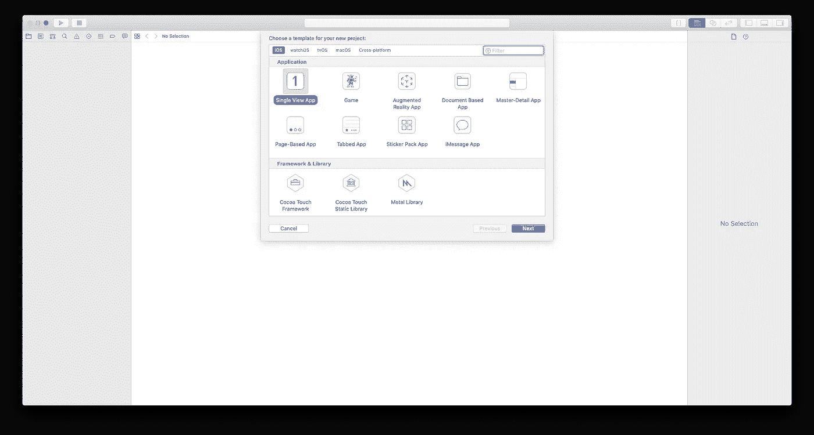
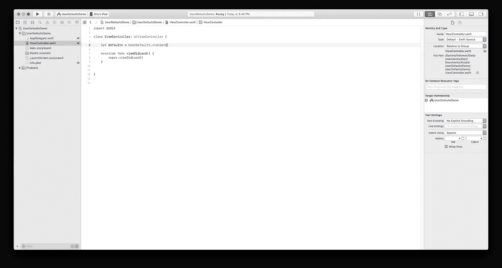
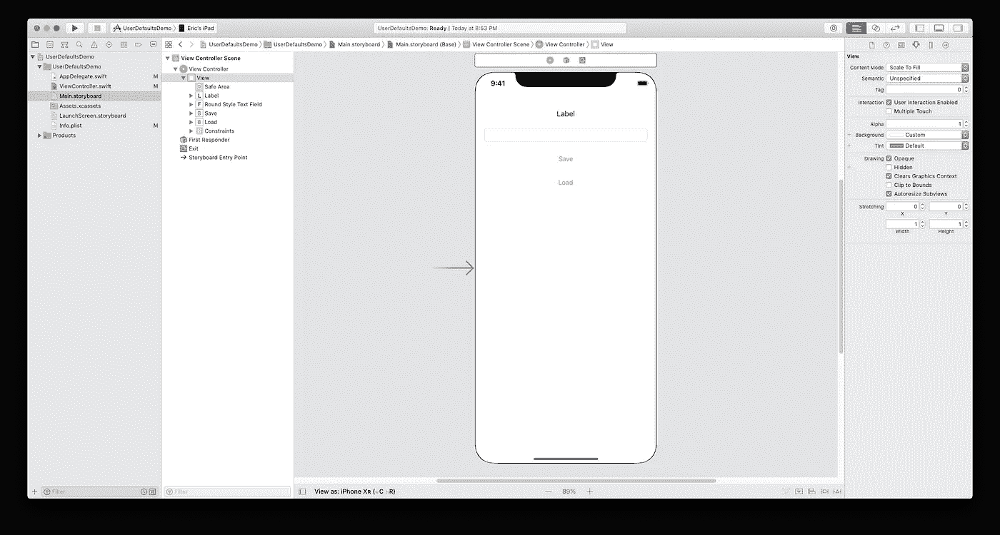
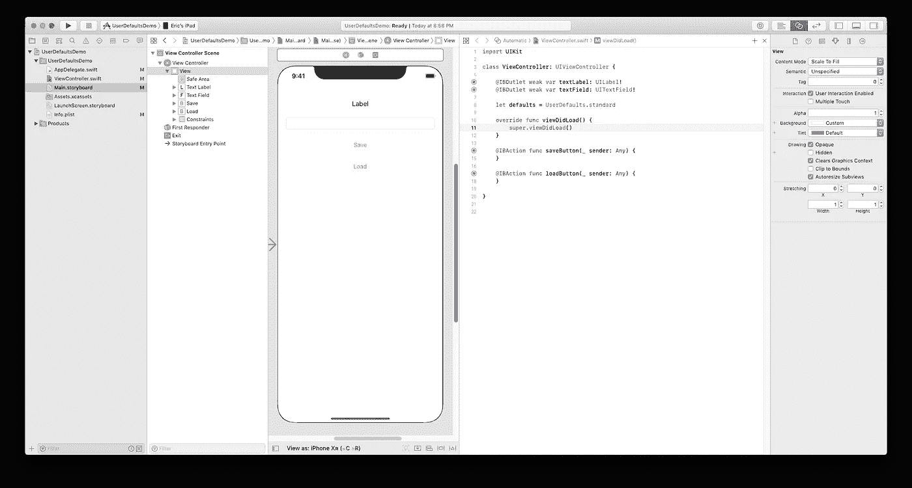
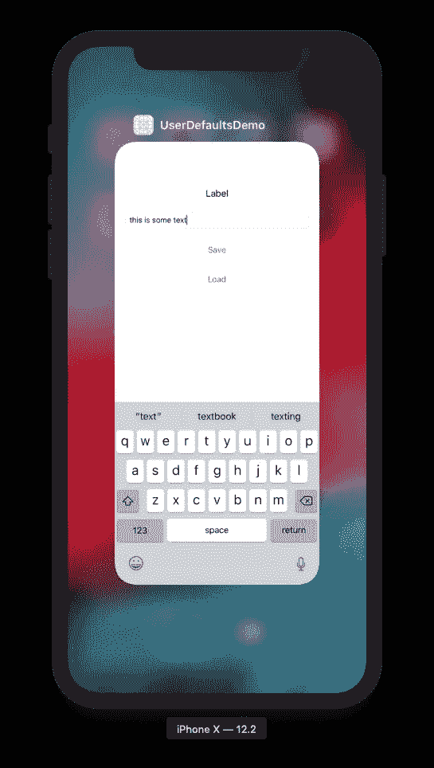
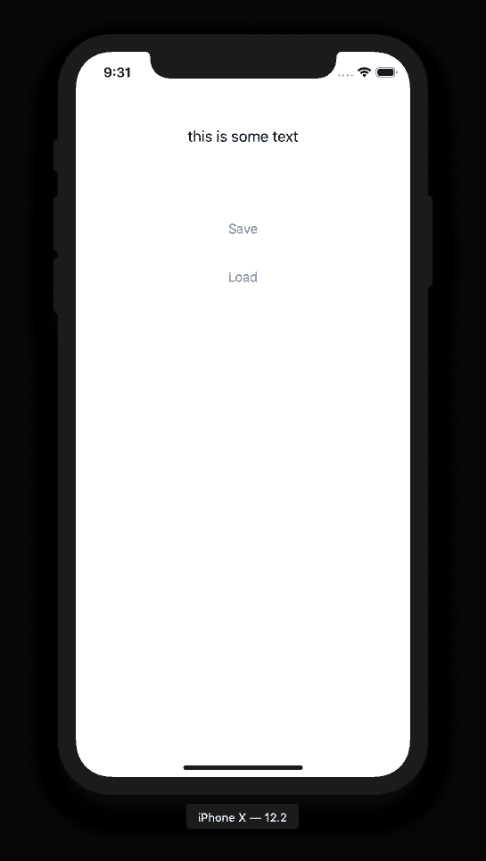

# 数据持久性—用户默认值

> 原文：<https://betterprogramming.pub/data-persistence-userdefaults-b8503f93ff14>

UserDefaults 是将数据从一个应用程序会话保存到另一个应用程序会话的最简单方法

使用用户默认值保存和加载变量

# 介绍

当我刚开始制作 iOS 应用时，我遇到了困难。我无法将数据从应用程序会话保存到应用程序会话。

我的第一个应用程序是一个闲置的点击器——当你使用它时，它会有一些升级和任务。一切都很顺利，应用程序运行正常，没有太多问题。除了一个:每次我重启应用程序，我的变量从来没有保存。我非常困惑。我正常地设置变量——设置变量等于一个值。我不知道我做错了什么。

显然，*在你的应用程序终止后，它会丢失给变量*的值。

我需要我的应用程序有某种持久性。我走的第一条大道是`UserDefaults`。

# 什么是用户默认值？它有什么用处？

UserDefaults 是 iOS 中的一个持久层，主要用于保存少量数据——例如，当用户返回到你的应用程序时保存的用户设置。因为它用于较小量的数据，所以它对于那些正在寻找一种简单的方法在应用程序中一次保存几个变量的初学者来说是很好的。

我开始写作是为了能够对编程中更高级的主题给出最基本的解释，所以我不会在这里深入细节。如果你想了解更多关于用户默认值的信息，请访问[苹果开发者文档](https://developer.apple.com/documentation/foundation/userdefaults)网页。

# 要求

*   Xcode 10
*   Swift 4(及更高版本)

我假设您已经安装并设置了 [Xcode](https://developer.apple.com/xcode/?source=post_page---------------------------) ,并且准备好开始了——这是一个比仅仅展示如何在 Xcode 中打印变量稍微高级一点的教程。

# 入门指南

首先要打开 Xcode 并选择`Single View App`选项。

选择单视图应用程序

接下来，我们将直奔`ViewController.swift`。在`class ViewController: UIViewController {`的正下方，我们首先创建一个名为`defaults`的变量，这将是代码中调用的主要变量。您可以看到下面的实现:

让默认值= UserDefaults.standard

现在我们已经完成了第一部分，为了让这个应用更加真实，我将在`Main.Storyboard`中添加一些 UI。

# 界面

我现在要做的是创建一个界面，让应用程序变得更加有用和实用，这样读者就可以从中获得更多。我将只向故事板添加四个 UI 元素:一个标签、一个文本字段和两个按钮。你可以把它们放在任何你喜欢的地方——你可以在下面看到我的配置。

接口被添加到 Main。故事板

接下来，我们需要将接口与代码连接起来。为此，按住`Command-Alt-Enter`进入助理编辑器，按住 control 键单击标签，将其拖至`ViewController.swift` 并释放。您已经创建了一个`IBOutlet` ——您可以随意命名，对文本字段也是如此。

然后按住 control 键并拖动到`ViewController.swift`，当光标在`ViewDidLoad`方法下时释放。我的结局是这样的:

从用户界面到代码的连接

如果你在制作 IBActions 或 IBOutlets 时需要更多帮助，请查看 YouTube 视频以获取更多信息。

# 代码

我知道从技术上讲，我们已经在项目中添加了代码，但这只是热身。现在，我们将添加剩余的代码来实际保存和加载您的数据:

*   第八行。这是我们首先添加的，我们只是将`UserDefaults.standard`保存到变量`defaults`中。
*   第 16 行。这是我们刚刚得到的文本`textField`并将其设置为变量`text`。
*   第 18 行。这就是你保存变量到`UserDefaults`的方法。您调用`defaults`并将一个变量设置为一个键，在本例中我称之为 text。我总是发现最简单的方法是将键命名为你设置的变量，因为这样更容易跟踪你的键。
*   第 24 行。在这个操作中，您获得了关键文本的值，并将其设置为名为 text 的变量，这样更容易理解。我想指出的是，如果你将一个 int 保存到`UserDefaults`，你可以通过 defaults.int(forKey: " `exampleIntKeyName`)来检索它。
*   第 26 行。这里，我们通过从 UserDefaults 检索值并将其设置为`textLabel.text`来获取上面创建的变量`text`。

实际上代码部分也是如此！开始玩`UserDefaults`很容易。现在我们准备在模拟器或设备上测试它！在这个例子中，我将使用一个模拟器。

# 运行应用程序

你现在要做的就是运行将应用程序部署到 iPhone 模拟器的方案(如果是第一次将应用程序运行到模拟器，可能需要几分钟)。

剩下的就是在文本字段中键入一条消息，然后单击 save。然后通过按 Command-Shift-H 进入模拟器的主屏幕，并从屏幕底部向上滑动(或双击 home 键)进入多任务处理。现在只需滑动你的应用程序，基本上杀死应用程序。

向文本字段添加消息，然后点击保存

进入多任务模式，然后向上滑动即可关闭应用程序

再次打开应用程序，点击加载，你在文本字段中输入的信息应该会出现在标签的位置。

您键入的邮件将替换标签中的单词 Label

# 结论

这就是你所要做的，保存一些变量，以便在你再次启动你的应用程序时能够重用它们。

这是我想发表的一系列故事中的第一个，这些故事涉及在你的应用程序被杀死后保存数据。

# 项目文件

这是本教程的 GitHub 项目的链接。

 [## ewalk40/UserDefaultsDemo

### UserDefaults 演示应用。在 GitHub 上创建一个帐户，为 ewalk40/UserDefaultsDemo 开发做贡献。

github.com](https://github.com/ewalk40/UserDefaultsDemo)