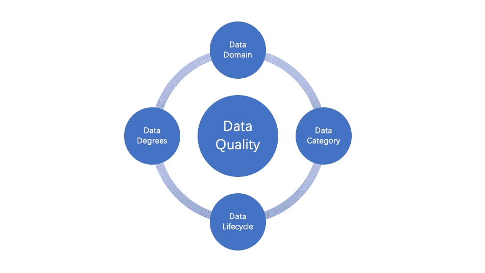
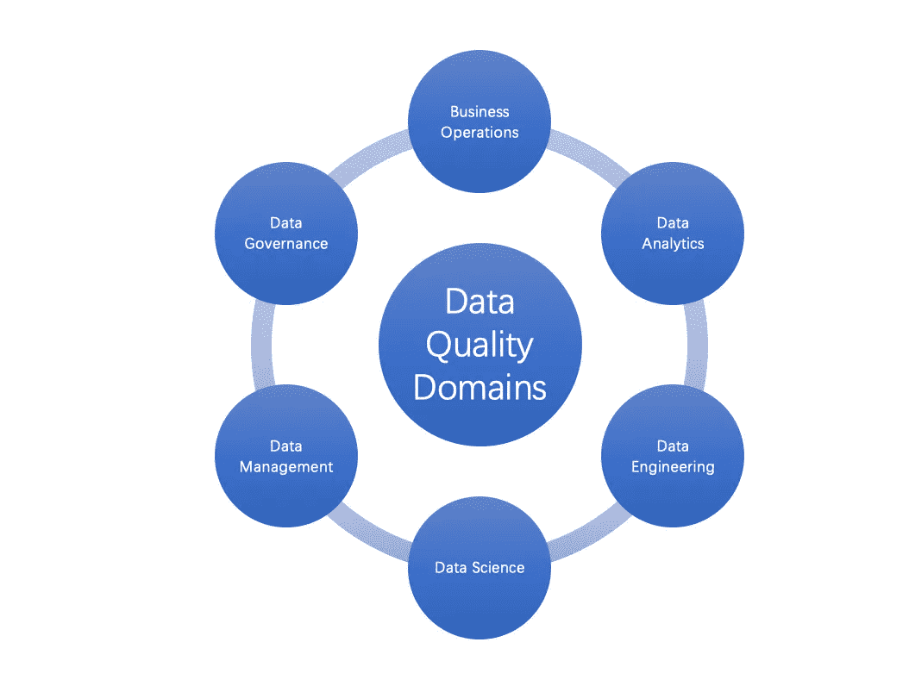

# 质量驱动的数据宣言

> 原文：<https://betterprogramming.pub/data-quality-e1a8311ce1a2>

## 每个数据工程师和数据科学家都应该知道

伊万·迪亚兹在 [Unsplash](https://unsplash.com?utm_source=medium&utm_medium=referral) 上的照片

数据就像海水，巨大而重要。

*数据很重要吗？*当然。如今，每个公司和企业都是数据驱动的。

*数据重要还是有价值？*是或不是。我们知道，对于机器学习和计算机科学来说，“垃圾进，垃圾出”。没有质量的数据可能对企业毫无用处，但处理和管理起来成本高昂。

现在，“数据至关重要”变成了“数据质量至关重要”

就像你熟悉的测试驱动开发( [TDD](https://en.wikipedia.org/wiki/Test-driven_development) )一样，你会说质量驱动数据(QDD)是不可或缺的。测试驱动开发是现代软件开发、DevOps 和 CI/CD 自动化的核心。同样，质量驱动的数据是数据开发和数据创新的灵魂。

*为什么？怎么会？什么？*

为什么定义数据质量似乎臭名昭著。那如何定义数据质量呢？什么是数据质量？以及如何整体保证质量驱动的数据？

[数据质量](https://en.wikipedia.org/wiki/Data_quality)有很多定义，但最明确的是高数据质量和一个适用于所有数据的定义。它可能不等于高质量，尽管它是数据的主要目标。可能不一样，虽然现在没人能忽视。因此，在继续之前，我将提供以下声明:

> 数据质量是数据在数据生命周期中的一种状态，可以用度来定义。

我们可以通过阐述数据域、类别、生命周期和质量等级来定义数据质量。

如何定义数据质量(作者)

# 数据域

我们哪里需要数据质量？如果你在任何地方的回答都是最好的，你可能已经学到了关于数据的难忘的一课，或者从未认真使用过数据。

数据质量是特定于领域的，而不是通用的或在任何地方都相同的。它是敏感的，在六个领域变得有意义:业务运营、数据分析、数据治理、数据管理、数据工程和数据科学。

数据质量领域(作者)

## 业务操作

对数据的业务操作主要有两类: [OLTP](https://en.wikipedia.org/wiki/Online_transaction_processing) 和 [OLAP](https://en.wikipedia.org/wiki/Online_analytical_processing) 。OLTP 的数据通常存储在关系数据库或 NoSQL 中，但是 OLAP 的数据通常存储在数据仓库、数据湖或数据仓库中。请参见[现代数据库和数据的未来](https://towardsdatascience.com/newsql-lakehouse-htap-and-the-future-of-data-69d427c533e0)了解更多信息。由于不同的业务需求和技术，对数据质量的期望有很大的不同。区别可能在于业务和运营的视角和深度。

## 数据分析

数据分析包括商业智能、预测分析等。它使数据能够做出商业决策。数据的准确性、完整性、一致性和及时性对于做出正确的决策至关重要。这些是数据质量的核心。

## 数据工程

数据工程是为数据从创建到处理的过程建立数据系统的领域和原则。它是[现代数据堆栈](/the-future-of-the-modern-data-stack-7e49e3067e42)的基础。数据质量应该是数据工程的一部分。对数据质量的努力应该超越准确性、完整性、一致性和及时性。它认识到数据可观察性、可发现性和可管理性的重要性。

## 数据科学

[数据科学](https://en.wikipedia.org/wiki/Data_science)是一个跨学科领域，用于从典型的大型数据集中提取知识，并应用这些数据中的知识和见解来解决各种应用领域中的问题。它是机器学习的核心。数据质量是数据科学的基础。数据谱系、语义和统计已经成为数据科学中数据质量的一等公民。

## 数据管理

数据管理是将数据作为有价值的资源进行管理的学科。数据质量是数据管理的一个领域，主要关注数据的使用。它旨在控制数据质量，就像管理数据一样。另一方面，从用户的角度来看，数据管理的属性和功能会影响数据质量。

## 数据治理

[数据治理](https://cloud.google.com/learn/what-is-data-governance)是在数据的生命周期中将数据作为资产进行管理的原则。这是一种确保数据安全、私密、准确、可用的机制。数据质量是数据治理的一部分。但是对于组织和非技术人员来说，它将数据质量提升到了技术之上(例如，数据工程和数据科学)。它可以平衡数据质量和合规性(包括安全性和隐私)之间的优先级。为了隐私和安全，它可能不得不牺牲数据质量。它可能要求商业语言的准确性和一致性，而不是技术语言。

将数据作为资产进行管理可以扩展到数据资产的一般概念。这个领域包括作为数字资产的数据共享、交易和交换。例如，用 NFT 创建的数据是一种可以在元宇宙中使用的数字资产。这里的数据质量着眼于唯一性、同一性和完整性。

# 数据类别

定义数据质量取决于业务和应用需求。根据经验，这更多的是业务驱动，而不是技术。这意味着质量与业务需求有关。否则，数据质量会变得苍白。

在不同的数据类别中，如零售、制造、物流、医疗等，数据质量应有不同的预期和定义。由于每个类别的独特性，它可以根据数据分类和合规性进一步细化。

例如，DeepMind 的 [AlphaFold](https://www.deepmind.com/blog/alphafold-reveals-the-structure-of-the-protein-universe) 是一个具有巨大数据的蛋白质结构的突破性里程碑。亚马逊零售还拥有海量的运营和分析数据。但是在及时性、完整性、可治理性等方面，两者的数据质量的范围和期望是不同的。

# 数据生命周期

数据质量期望在数据生命周期中是否一直不变？

任何数据从创建到收集、使用和处置都有一个生命周期。在生命周期中，质量驱动的数据越早越好。然而，需求和数据质量覆盖应该在不同的生命周期阶段有所不同。在大多数情况下，数据质量在使用阶段变得至关重要或有意义。这并不意味着我们不应该关心来自数据成核的数据质量，或者我们不应该在整个生命周期中保持同样的高质量。

但是我们要明白数据质量的目的。在工程设计中有必要牢记这一点，并遵守合规性。

例如，在零售网站上使用数据时，亚秒级的及时性对于做出可扩展性决策或提供友好的用户体验至关重要。但是可能没有必要在以后对相同的数据进行归档时使用相同的标准。

# 数据质量等级

数据质量可以用度来定义。我喜欢用度来表达，而不是度量或维度，因为它需要是[定性的](https://en.wikipedia.org/wiki/Qualitative_data)或[定量的](https://en.wikipedia.org/wiki/Quantitative_data)。它可以是每度可测量的，度可计算的，度可分析的，度间相关的，度可累积的。有两个数据质量等级:基本质量等级和高级质量等级。

## 质量基础度

数据质量的基本程度是至关重要的。有四个基本的质量等级:准确性、完整性、一致性和及时性。

1.  **准确性**:定义准确的数据，包括数据内容(或值)、精度和元数据，尽管我们经常忘记精度和元数据。
2.  **一致性**:跨引用、管道、世系、系统和组织的相同定义的数据。
3.  **完整性**:没有缺失的记录或值。但对于深度学习中的一些大规模稀疏数据可能就不同了。
4.  **及时性**:最新的数据和服务的及时反馈。对于大数据和机器学习来说，它变得越来越重要。

## 质量高级学位

数据质量高级学位也是必不可少的，但最近出现或更适合一些特定领域。有九个高级质量等级:唯一性、有效性、相关性、有效性、可观察性、可发现性、可治理性、语义和完整性。随着时间的推移，它可以根据数据域和类别进行扩展。

1.  **相关性**:满足业务需求的相关数据。
2.  **有效性**:考虑数据量、多样性和速度的数据处理和机器学习的数据有效性。
3.  **语义**:数据集、列、行甚至记录的语义信息。这种程度可以扩展数据起源、血统和关系的语义。
4.  **唯一性**:数据唯一性是指一个数据集内或跨数据集的所有记录的重复和重叠最小化的程度。
5.  **有效性**:数据有效性是数据值符合业务规则的程度。它不同于准确性或完整性。
6.  **可观察性**:与可见性、监控和调试相关的数据可观察性的能力。内置的数据统计和指标应该是其中的一部分。越来越多的现代数据云解决方案首先支持这一点。例如，[三角洲湖](https://delta.io)计算一些统计数据，并在保存期间将它们附加到数据中，就像阿帕奇[拼花](https://parquet.apache.org)一样。
7.  **可发现性**:与易于集成、共享和使用相关的数据可发现能力。
8.  **可治理性**:强调数据合规的数据治理的成熟度。
9.  **完整性**:数据完整性[的程度](https://en.wikipedia.org/wiki/Data_integrity)。该术语似乎与基本的准确性和一致性重叠，但它强调了数据生命周期防止数据损坏。

# TL；速度三角形定位法(dead reckoning)

质量驱动数据(QDD)是一种数据获取、使用和处理原则。有了这一点，我们可以在一定程度上定义数据质量，提高决策和 ML 质量，并提前预防意外问题。数据质量在数据域和数据类别的上下文中很重要。有两组质量等级来全面定义数据质量。

因此，数据质量是复杂的，但也是可执行的。关于数据生命周期和类别，逐步定义是合理的。它可以通过与数据治理或其他数据领域的集成，由质量驱动的数据实践或质量基础架构有效地实施和改进。

*问题、想法、点子？伸手到领英上* [***鲁晖胡***](https://www.linkedin.com/in/luhui)**！**

* [## HTAP 莱克豪斯的 NewSQL 和数据的未来

### 现代数据库和数据的未来

towardsdatascience.com](https://towardsdatascience.com/newsql-lakehouse-htap-and-the-future-of-data-69d427c533e0)  [## 什么是以数据为中心的 AI 工程？

### 重塑 MLOps 加速 AI 民主化

towardsdatascience.com](https://towardsdatascience.com/what-is-data-centric-ai-engineering-d29b3468062e)*