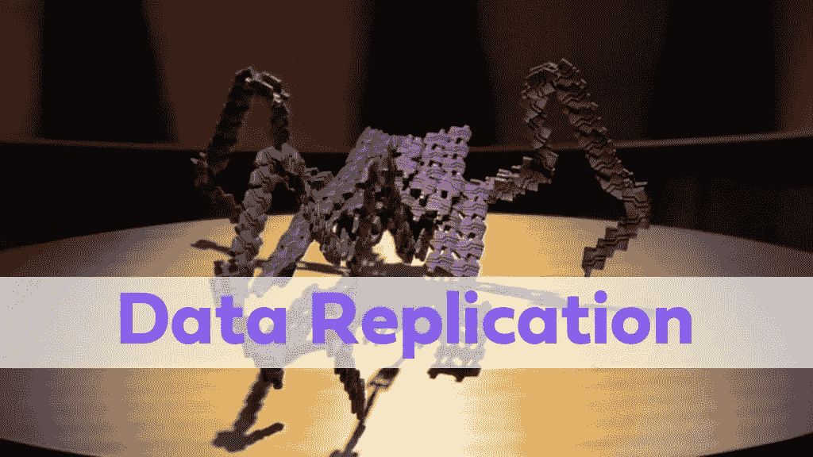
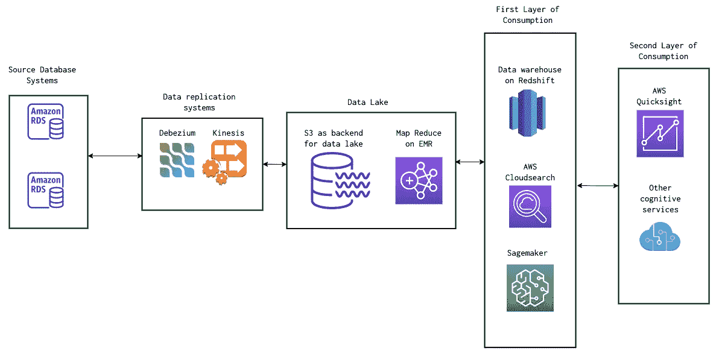
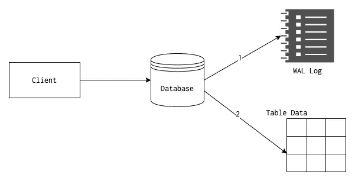
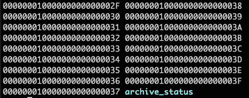
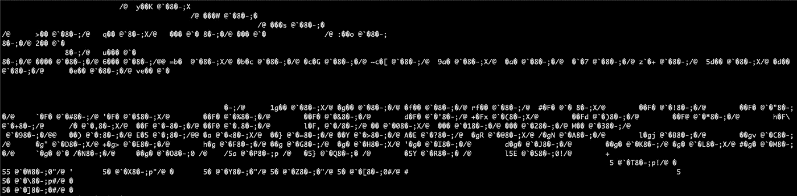

# 使用提交日志的 DBMS 数据复制

> 原文：<https://betterprogramming.pub/data-replication-for-dbms-using-the-commit-log-b665ce48330e>

## 完整的数据复制解决方案



照片来自 [GateWorld](https://www.gateworld.net/wiki/File:Replicators.jpg) 。由作者编辑。

在本文中，我们将看到开发人员如何通过跨多个系统复制数据来打破他们的团队和业务的信息孤岛。

首先，我们将回顾为什么开发人员要为云复制数据和考虑事项。第二，[我们将准备与复制者](https://stargate.fandom.com/wiki/Replicator)的战争。然后，我们将研究 Postgres 和 MySQL 的架构，以及它们的提交日志如何使我们能够制作数据的精确副本。最后，我们将 Debezium 连接到 Postgres，以获得一个完整的数据复制解决方案。

# 数据复制简介

数据复制是针对各种业务用例在不同数据库系统之间移动数据的过程。在典型的 SaaS(软件即服务)应用程序中，数据存储在 MySQL、PostgreSQL、Oracle 等运营数据库中。还有其他的数据库系统，比如为特定用例构建的数据仓库和搜索系统。在这些系统之间移动数据被称为数据复制。

*注意:相同数据库系统之间的数据复制是为了可用性，不要与本文中讨论的数据复制混淆。*

# 为什么我们需要复制？

信息孤岛是企业从数据中发掘价值和保护资产的最大障碍之一。

*   运营效率低下是这些孤岛带来的第一个问题。信息被锁定在一个特定的业务部门，或者只有少数人可以访问，进一步开发和扩展应用程序变得非常困难。
*   接下来是技术限制，底层的单个数据库/应用程序无法扩展并满足分析、搜索甚至人工智能的业务需求。
*   有了备份和多个数据库系统，发生严重故障时的灾难恢复就容易多了。

# 数据平台—云与内部部署

根据底层架构的不同，实现民主化的数据访问可能会非常具有挑战性。云计算在过去几十年中发展如此之快，以至于一些管理自己数据中心的大公司都已经转移到了云上。数据管道、数据湖、数据仓库和完全托管的数据系统等云原生架构很常见。没有一家公司愿意把钱花在基本系统的维护上，而是花在核心业务的建设上。通过托管自己的基础架构(内部)来节省几美元不再有利可图。

也就是说，云带来了一系列不同的挑战，例如:

*   安全性
*   供应商锁定
*   云支持和开销

不管底层架构是什么(例如，是云还是内部部署)，人们都可以选择抽象设计，这样就可以轻松地进行移植，甚至是混合设计。



在本文中，我们将专门关注第一部分(即复制)。这一层是实现更多业务层的关键。

# 数据复制是如何工作的？

在深入研究解决方案之前，我们需要了解复制如何与标准操作数据库(关系数据库)一起工作。

## Postgres 数据库日志架构

关系数据库系统维护一种称为提交日志的东西(在 PostgreSQL 中，它被称为预写日志或 WAL 日志)。每当发生数据库事务提交时，都会写入这些提交日志。不管我们使用什么数据库，几乎所有的数据库日志都具有以下属性:

*   数据库日志是磁盘上的物理文件。
*   对数据库日志的写入是连续有序的。
*   WAL 日志是只附加的日志。对现有数据的任何编辑都会作为新条目显示在日志中。
*   日志条目总是在实际数据写入磁盘之前出现。
*   除非日志文件提交完成，否则不会提交事务，无论事务处理了多少条记录。
*   在任何时间点，PostgreSQL 都会维护一个称为重做点的东西。数据库重启时，记录从 WAL 日志中的该点开始回放。



## 什么是数据库一致性保证？

关系数据库系统的日志体系结构是我们今天拥有的最古老和最久经考验的工程思想之一。许多较新的系统从中汲取了他们的想法和灵感。为什么会有这样的日志系统存在？

*   内存/RAM 易失。数据库通常被视为事实的来源，每当系统重启时，数据库都需要依赖一个可靠的机制，以便在启动时进行恢复。表格格式不太适合这种情况。它更加面向服务查询。
*   依赖于主数据库的副本数据库也依赖于 WAL 日志来与主数据库同步。
*   它还支持在线备份和时间点恢复。
*   由于日志是按顺序写入磁盘的，并且提供了重做保证，所以表记录可以在很久以后以更有组织的/批处理的方式刷新到磁盘。它们不需要在每次表更改/事务时立即写入磁盘。这也有助于缓存。

这些性质有助于我们建立一个坚实的基础，在此基础上建立进一步的系统。

## PostgreSQL WAL/Binlog 文件

MySQL 的架构与 PostgreSQL 非常相似，但 PostgreSQL 的 WAL 日志同时结合了 InnoDB 的事务日志和二进制日志。因为 MySQL 实现了多个存储引擎，所以使用被分离到不同的日志中。存储引擎部分不在本文的讨论范围之内，因此我将坚持使用 PostgreSQL 示例。

WAL 文件实际上是一个二进制文件，位于 PostgreSQL 安装的`pg_wal`目录中。典型的目录结构如下所示:



当我们尝试查看内容时，它会是如下所示的内容:



PostgreSQL 提供了一个名为`[pg_waldump](https://www.postgresql.org/docs/current/pgwaldump.html)`的工具来读取这些文件。我们可以使用`pg_waldump /path/to/wal/file`，它会将整个文件解码成人类可读的文本。下文摘录了该案文:

```
rmgr: Btree       len (rec/tot):     80/    80, tx:        564, lsn: 0/2F106698, prev 0/2F1065E8, desc: INSERT_LEAF off 41, blkref #0: rel 1663/16385/2658 blk 16
rmgr: Btree       len (rec/tot):     64/    64, tx:        564, lsn: 0/2F1066E8, prev 0/2F106698, desc: INSERT_LEAF off 292, blkref #0: rel 1663/16385/2659 blk 10
rmgr: Heap        len (rec/tot):    175/   175, tx:        564, lsn: 0/2F106728, prev 0/2F1066E8, desc: INSERT off 43 flags 0x00, blkref #0: rel 1663/16385/1249 blk 56
rmgr: Btree       len (rec/tot):     72/    72, tx:        564, lsn: 0/2F1067D8, prev 0/2F106728, desc: INSERT_LEAF off 41, blkref #0: rel 1663/16385/2658 blk 16
rmgr: Btree       len (rec/tot):     64/    64, tx:        564, lsn: 0/2F106820, prev 0/2F1067D8, desc: INSERT_LEAF off 293, blkref #0: rel 1663/16385/2659 blk 10
rmgr: Heap        len (rec/tot):    175/   175, tx:        564, lsn: 0/2F106860, prev 0/2F106820, desc: INSERT off 44 flags 0x00, blkref #0: rel 1663/16385/1249 blk 56
rmgr: Btree       len (rec/tot):     72/    72, tx:        564, lsn: 0/2F106910, prev 0/2F106860, desc: INSERT_LEAF off 47, blkref #0: rel 1663/16385/2658 blk 16
rmgr: Btree       len (rec/tot):     64/    64, tx:        564, lsn: 0/2F106958, prev 0/2F106910, desc: INSERT_LEAF off 294, blkref #0: rel 1663/16385/2659 blk 10
rmgr: Heap        len (rec/tot):    175/   175, tx:        564, lsn: 0/2F106998, prev 0/2F106958, desc: INSERT off 45 flags 0x00, blkref #0: rel 1663/16385/1249 blk 56
rmgr: Btree       len (rec/tot):     80/    80, tx:        564, lsn: 0/2F106A48, prev 0/2F106998, desc: INSERT_LEAF off 42, blkref #0: rel 1663/16385/2658 blk 16
```

# 数据库复制技术

到目前为止，我们一直以抽象的方式看待事物。我们从为什么公司需要释放其数据库的全部潜力开始，这导致了数据复制和数据平台。为了理解复制是如何工作的，本文的后续部分将重点关注一个特定的数据库平台:PostgreSQL。对于其他数据库系统来说，大多数概念也是类似的，因此这可以用作参考，以形成围绕数据库复制本身的心理框架。

我们看到了 WAL 如何使数据库在系统关闭时保持数据完整性和一致性，甚至从数据损坏中回滚。像许多其他系统一样，PostgreSQL 也是从底层发展起来的，因此，我们需要了解复制在同一个数据库的两个节点中是如何工作的，以及我们如何将它扩展到其他数据系统。不管我们下面讨论的是什么复制机制，它都依赖于 WAL 进行复制。

## 物理复制

物理复制在 PostgreSQL 中已经存在很长时间了。它用于通过物理复制或逐字节复制来复制整个数据库。对主数据库所做的任何更改也会无任何更改地反映在副本数据库中。副本可以选择成为热备用节点(即主数据库出现故障，副本作为主数据库接管)。

有几种类型的物理复制，如日志传送、流复制等。，但它们大体上可以分为两类:

*   同步复制
*   异步复制

这种类型的复制有几个限制(监听数据库也应该在相同的主版本中，不能复制部分内容，等等)。由于这些原因，物理复制通常用于在两个 PostgreSQL 数据库系统之间同步数据—主要是为了高可用性。

## 逻辑解码

在版本 10 之前(如下所示)，其他选项允许开发人员/工程师在没有逻辑复制的情况下复制到其他下游系统。顾名思义，逻辑解码将 WAL 内容解码成人类可读的格式，并将其复制给不同的消费者。这种方法有利也有弊。尽管如此，由于这一步骤需要在主机数据库系统中安装插件/安装程序，因此通常很难维护——尤其是在云环境中。

## 逻辑复制

从 PostgreSQL 版本 10 开始，[逻辑复制](https://www.postgresql.org/docs/current/logical-replication.html)可用于从 PostgreSQL 数据库复制数据。正如文档中提到的，逻辑复制基于发布-订阅模型。一个或多个订阅者可以选择收听发布的数据，并且只发布和订阅特定的数据库/表。

很明显，逻辑复制的目标更多地是复制到其他数据系统，比如消息传递系统、数据湖和数据仓库。从多个数据库监听也容易得多。

我们将选择一个名为 [Debezium](https://debezium.io/documentation/reference/1.5/postgres-plugins.html) 的开源工具来构建我们的复制管道。

# 基于 Debezium 的开源数据复制架构

在本节中，我们将看到一个演示，演示如何使用 Debezium 在 PostgreSQL 源数据库中进行变更数据捕获(CDC)。我们将使用 Docker 来快速设置数据库，并使用 Debezium 连接器来监听更改。

我们写了一个关于使用 Docker 设置 Debezium 和 Postgres 的详细教程。下面描述了最重要的部分，但请参见上面的文章了解所有细节！

# 为 PostgreSQL 设置 Debezium 连接器

在我们激活 Debezium 之前，我们需要通过做一些配置更改来准备 Postgres。Debezium 利用了我们上面描述的 WAL。Postgres 使用该日志来确保数据完整性并管理行版本和事务。Postgres 的 WAL 有几种模式可以配置，为了让 Debezium 工作，WAL 级别必须设置为`replica`。现在让我们改变这一点:

```
psql> alter system set wal_level to 'replica';
```

您可能需要重新启动 Postgres 容器，以使此更改生效。

有一个 Postgres 插件不包括在我们使用的图像中，我们将需要它:`wal2json`。Debezium 可以和`wal2json`或者`protobuf`一起工作。对于本教程，我们将使用`wal2json`。顾名思义，它将 Postgres 的预写日志转换为 JSON 格式。

随着 Docker 应用程序的运行，让我们使用 aptitude 手动安装`wal2json`。要进入 Postgres 容器的外壳，首先找到容器 ID，然后运行以下命令打开 bash:

```
$ docker ps

CONTAINER ID   IMAGE               
c429f6d35017   debezium/connect    
7d908378d1cf   debezium/kafka      
cc3b1f05e552   debezium/zookeeper  
4a10f43aad19   postgres:latest     

$ docker exec -ti 4a10f43aad19 bash
```

现在我们在容器内部，让我们安装`wal2json`:

```
$ apt-get update && apt-get install postgresql-13-wal2json
```

# 激活 Debezium

我们准备好激活 Debezium 了！

我们可以通过向 Debezium 发出 HTTP 请求来与它通信。我们需要发出一个 POST 请求，其数据是 JSON 格式的配置。这个 JSON 定义了我们试图创建的连接器的参数。我们将配置 JSON 放到一个文件中，然后使用`curl`将其发送到 Debezium。

此时，您有几个配置选项。如果您只想让 Debezium 对某些表进行流式处理(或者避开某些表)，那么您可以在这里使用白名单或黑名单。

现在我们可以将这个配置发送到 Debezium:

```
$ curl -i -X POST \
         -H "Accept:application/json" \
         -H "Content-Type:application/json" \
         127.0.0.1:8083/connectors/ \
         --data "@debezium.json"
```

响应将是新启动的连接器的 JSON 表示:

Arctype 团队已经在另一篇文章中介绍了安装、设置和演示。

# 数据质量、一致性和其他挑战

重要的是要明白，一旦我们使用 Debezium 并监听日志，我们就离开了具有 ACID 保证的关系数据库领域，进入了分布式系统的世界。当我们选择 Kafka 作为消息传递系统时，它遵循的[语义](https://kafka.apache.org/documentation/#semantics)决定了我们如何将数据复制/分发到更下游的系统。

*   如果我们正在进行这些更改，并将它们直接保存在一个搜索索引(如弹性搜索)中，那么“至少一次——消息永远不会丢失，但可能会重新发送”可能更合适。
*   如果数据正在被传递给机器学习算法，那么选择“最多一次——消息可能会丢失，但永远不会重新传递。”
*   如果我们向数据仓库交付数据，那么就选择“恰好一次——每条消息只交付一次”

第三种消息传递机制在分布式系统中难以解决。Kafka 是大规模解决这一问题的系统之一，但每个系统在吞吐量、规模和准确性方面都有自己的缺点。一个人必须做出明智的选择来权衡什么是必要的。

# 结论

随着业务的扩展，在道德上利用数据的需求不再是奢侈品，而是必需品。数据平台变得越来越普遍，甚至在中型企业中也是如此。它们支持:

*   有效性
*   管理
*   安全性
*   商业策略

现在是释放数据价值的最佳时机。

# 参考

*   [日志:关于实时数据的统一抽象，每个软件工程师都应该知道的事情](https://engineering.linkedin.com/distributed-systems/log-what-every-software-engineer-should-know-about-real-time-datas-unifying)
*   [使用 PostgreSQL + Kafka + Debezium 传输数据流](https://dev.to/arctype/streaming-data-with-postgresql-kafka-debezium-part-1-4e39)