# 数据科学和 kot Lin——用 Krangl 介绍数据框架

> 原文：<https://betterprogramming.pub/data-science-kotlin-introducing-dataframes-with-krangl-c9cdd97e449c>

## 使用 Kotlin 语言和 ***Krangl*** 库创建、导入和导出数据帧的实践介绍

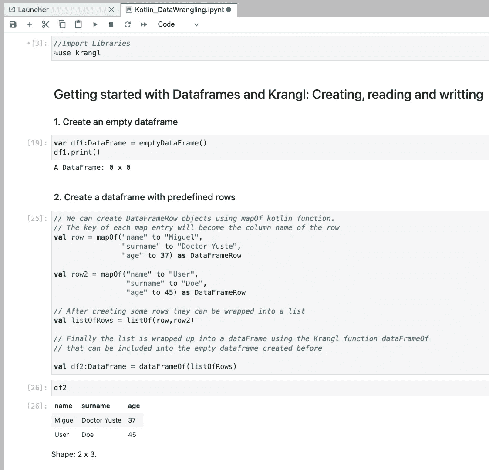

运行在 Jupyter 实验室上的 Kotlin 和 Krangl 代码(图片由作者提供)

Python 通常是数据科学项目的参考语言，尤其是机器学习。但是，这并不意味着在开始自己的项目时，您应该强制使用 Python。您团队的专业知识和背景，以及其他一些环境限制，应该会影响您选择的技术堆栈。

基于这一点， [Kotlin](https://kotlinlang.org/) 对于那些基于 JVM 的环境来说是一个有吸引力的选择，在这些环境中，数据科学活动将被实现。从构建数据管道到生产机器学习模型， [Kotlin](https://kotlinlang.org/) 覆盖了大部分需求，这要归功于一个伟大的生态系统，它为数据帧操作、数据可视化、深度学习或自然语言处理等提供了解决方案。

在本文中，我们将介绍如何使用 [Krangl](https://github.com/holgerbrandl/krangl) 处理数据框架，这是一个用于数据辩论的 Kotlin 库。

# 环境

本分步指南是根据以下要求编写的:

*   操作系统:MacOS 蒙特雷 12.5.1
*   Docker 社区:v.20.10.2 for Mac ( [如何安装 docker](https://docs.docker.com/docker-for-mac/install/) )
*   采用 Kotlin 内核的 Jupyter 笔记本:([如何安装](https://migueldoctor.medium.com/how-to-create-a-docker-image-with-jupyter-notebook-kotlin-2e8bbf212f81))

# 目标

本教程旨在介绍使用 [Kotlin](https://kotlinlang.org/) 语言和 [Krangl](https://github.com/holgerbrandl/krangl) 库进行表格数据操作。也就是说，这篇文章关注于使用 dataframes 创建、导入和导出数据，这是当前数据分析方法背后的核心概念。

让我们简单介绍一下我们将要探索的概念和技术:

**数据帧:**数据帧被定义为具有潜在不同类型的列的二维标记数据结构。这些结构的每一行对应于实例的度量或值，而每一列是包含特定变量数据的向量。这意味着 dataframe 的行不需要包含，但可以包含相同类型的值:它们可以是数字、字符、逻辑等。

[Krangl](https://github.com/holgerbrandl/krangl) 是一个用于数据传输的开源 otlin 库。Krangl 深受其他语言库的启发，如 [pandas](https://pandas.pydata.org/) (Python)和 [dplyr](https://dplyr.tidyverse.org/) (R)。Krangl 是用 Kotlin 编写的，这使得它可以与 Java 完全互操作，并且它依赖于使用函数式实现的数据操作语法。通过这种方式，以 dataframes 的形式操作表格数据变得非常容易。Krangl 提供了方便的方法，允许数据科学家过滤、转换、聚合和重塑他们的数据，以准备好为任何机器学习模型提供数据。

# 将 Krangl 库导入 Jupyter

要在 Jupyter 笔记本上使用 Krangl，我们通常会开始将库添加到项目中。在下面的脚本中，我们提供了两个选项来指示 Jupyter 将 Krangl 依赖项添加到当前的笔记本中。

*   Magic command (%use):只有 Kotlin 内核内置库有效。支持的内置库和版本的完整列表可以在这里找到:[https://github.com/Kotlin/kotlin-jupyter](https://github.com/Kotlin/kotlin-jupyter)。
*   动态依赖项导入注释:这种技术允许导入任何库，只要提供了存储库和组工件版本 id。

```
//1) Import krangl library using magic command (%use). 
%use krangl

//2) Import a specific version (0.18.4) of the krangl library
@file:Repository("https://repo1.maven.org/maven2")
@file:DependsOn("com.github.holgerbrandl:krangl:0.18.4")
```

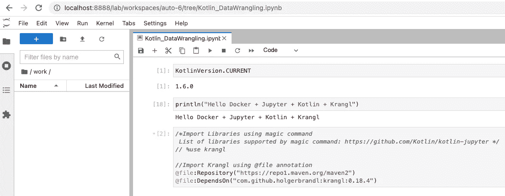

将克朗格语添加到 Jupyter 笔记本中(图片由作者提供)

正确配置好 Krangl 之后，我们就可以开始处理数据了。本文的其余部分将着重于创建数据框，这是大多数数据科学项目中的主要数据结构。

# 用 Krangl 创建数据框

Krangl 允许我们通过使用函数`emptyDataFrame`轻松创建一个空的数据帧。

## 1.使用***empty data frame***函数创建一个空数据帧

```
var df1:DataFrame = emptyDataFrame()
```

## 2.使用 ***dataFrameOf*** 函数创建一个带有预定义行的数据帧

创建空的数据帧不是很有用。因此，Krangl 提供了通过[反射](https://kotlinlang.org/docs/reflection.html)将任何可迭代对象转换成 dataframe 对象的便利方法。以下脚本说明了如何将地图用作 dataframe 行，并与`dataFrameOf` 函数结合使用，以创建具有预定义内容的 dataframe 对象。

```
// We can create DataFrameRow objects using mapOf kotlin function. 
// The key of each map entry will become the column name of the row
val row = mapOf("name" to "Miguel", 
                "surname" to "Doctor Yuste",
                "age" to 37) as DataFrameRow

val row2 = mapOf("name" to "User", 
                 "surname" to "Doe",
                 "age" to 45) as DataFrameRow

// After creating some rows they can be wrapped into a list
val listOfRows = listOf(row,row2)

// Finally the list is wrapped up into a dataFrame using the Krangl function dataFrameOf 
// that can be included into the empty dataframe created before

val df2:DataFrame = dataFrameOf(listOfRows)
```

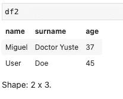

上面的脚本产生的输出(图片由作者提供)

## 3.使用**绑定行**向空数据帧添加行

Krangl API 提供了`bindRows`函数。该方法旨在组合数据帧，以便可以用于向现有数据帧添加新行。如果出现不匹配的列，这些列将在返回的数据帧上用 NA 填充。下面看看`bindRows`是怎么工作的。

```
var df3:DataFrame = emptyDataFrame()

// We can create DataFrameRow objects using mapOf kotlin function. 
// The key of each map entry will become the column name of the row
val row = mapOf("name" to "Miguel", 
                "surname" to "Doctor Yuste",
                "age" to 37) as DataFrameRow

val row2 = mapOf("name" to "User", 
                 "surname" to "Doe",
                 "age" to 45) as DataFrameRow

// After creating some rows they can be wrapped into a list
val listOfRows = listOf(row,row2)

// Finally the list is wrapped up into a dataFrame using the Krangl function dataFrameOf 
// that can be included into the empty dataframe created before
df3.bindRows(dataFrameOf(listOfRows))
```

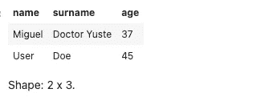

Jupyter 上的输出(图片由作者提供)

> Krangl 中的 dataframe 是不可变的，这意味着任何操作都会返回一个新的 data frame 实例。

## 4.向数据帧添加行(使用自定义扩展函数)

`bindRows`功能的使用不能像熊猫等其他图书馆的功能一样直观。因此，我们可能想要定义自己的扩展函数`addMapsAsRows`来简化追加行的操作。

```
fun DataFrame.addMapsAsRows(vararg someRows: DataFrameRow): DataFrame = 
    bindRows(this, dataFrameOf(listOf(*someRows)))

var dfCustomRows = emptyDataFrame()
val rowCustomSample1 = mapOf("name" to "Custom_User", 
                             "surname" to "Custom_Surname",
                             "age" to 99) as DataFrameRow

val rowCustomSample2 = mapOf("name" to "Custom_User2", 
                             "surname" to "Custom_Surname2",
                             "age" to 98) as DataFrameRow

dfCustomRows = dfCustomRows.addMapsAsRows(rowCustomSample1, rowCustomSample2)
```

如下，我们可以看到在 Jupyter 上运行脚本时的输出。

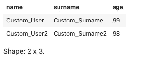

上面的脚本使用 addMapsAsRows 扩展函数生成的输出(图片由作者提供)

## 5.使用 addRow 函数将值列表添加为 dataframe 行

Krangl 的`DataFrame`类提供了几种方法来简化数据框架的工作。其中一个功能就是`addRow`。此函数通过提供单元格值列表而不指定列，向数据帧添加一行。

```
dfCustomRows.addRow(listOf("nameListed","surnameListed", 100))
```

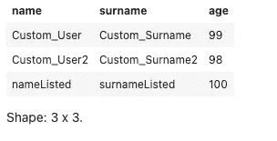

上面的脚本使用 addRow 函数产生的输出(图片由作者提供)

## 6.声明和初始化数据帧:缩写语法

Krangl 为我们提供了一种方便的符号，只需一条语句就可以使用`dataFrameOf`函数创建和初始化数据帧。

```
// Create dataframe in memory
val df: DataFrame = dataFrameOf("City name", "Country code", "population", "Timezone")(
    "Madrid", "ES", 3_255_944, "CET - Central European Time",
    "Paris", "FR", 2_138_551, "CET - Central European Time",
    "London", "GB", 8_961_989, "GMT - Greenwich Mean Time",
    "Sydney","AU",4_627_345, "AEST — Australian Eastern Standard Time"
)
```

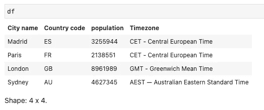

使用上面显示的缩写语法脚本创建的数据帧(图片由作者提供)

## 7.使用数据对象声明和初始化数据帧

如前所述，Krangl 利用反射从任何可迭代类型创建数据帧，比如 map。然而，这种行为可以扩展到我们自己的自定义数据类。如下所示，我们定义了`Employee`数据类来创建雇员列表。Krangl 允许我们使用`asDataFrame`函数，通过自动将类属性映射到 dataframe 列，从自定义数据对象列表中创建 dataframe 对象。

```
data class Employee(val name:String, val salary: Int, val system:String)

val emploList = listOf(Employee(name = "Mark User",
                                salary = 60000, 
                                system= "Windows"),
                       Employee(name = "Danny User",
                                salary = 70000, 
                                system= "Linux"))

val dfFromCustomObjects = emploList.asDataFrame()
```

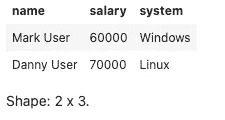

来自自定义数据对象列表的数据帧(图片由作者提供)

# 使用 Krangl 导入数据

我们已经看到使用 Krangl 创建 dataframe 对象是多么容易。然而，处理数据时最常见的场景是从外部源(文件、数据库或在线存储库)导入数据。在本节中，我们将讨论克兰格尔图书馆在这些问题上提供的可能性。

## 1.从本地 CSV 文件导入数据

Krangl 从类`DataFrame`中提供了方法`readCSV`，这使得将数据从 [CSV](https://www.loc.gov/preservation/digital/formats/fdd/fdd000323.shtml#identification) (逗号分隔值)文件加载到 Krangl DataFrame 对象的过程变得极其简单。

首先，让我们从公共数据集存储库中下载一个 CSV 文件，例如，[芝诺多](https://zenodo.org/)。点击[这里](https://zenodo.org/record/4679520/files/unemployment_rate.csv?download=1)，你将下载一个包含 2006 年至 2019 年欧盟国家失业率的数据集。下载后，文件必须上传到我们的 Jupyter 笔记本环境，如下图所示:

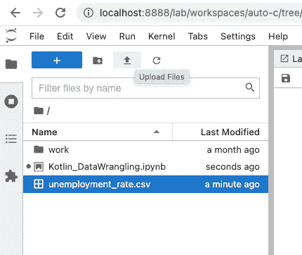

将 CSV 文件上传到 Jupyter 实验室环境(图片由作者提供)

最后，执行下面的脚本将创建包含 CSV 文件中存储的数据的 Krangl dataframe 对象。

```
// Read data from disk and load it into a dataframe
val df_csv = DataFrame.readCSV("unemployment_rate.csv")
```

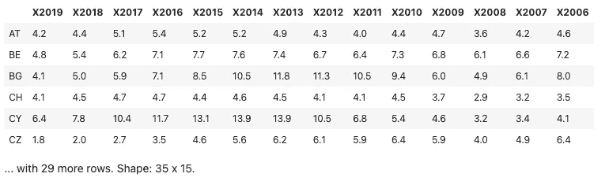

从 CSV 文件加载数据时创建的 Dataframe(图片由作者提供)

## 2.从本地 CSV 文件导入数据(自定义分隔符)

尽管 CSV 文件的名称来自逗号(，)字符，但通常会发现 CSV 文件使用不同的字符作为分隔符。最常见的是分号(；)、制表符(\t)、竖线(|)或空格。

> *Krangl* 依赖于[*Apache-commons-csv*](https://commons.apache.org/proper/commons-csv/)*库来处理 CSV 数据格式，所以为了告诉 Krangl 使用不同的分隔符，我们需要导入这个库。*

*为了说明这个场景，我们将使用另一个名为 [Opendatasoft](https://public.opendatasoft.com/) 的公共数据门户。该门户允许将数据集导出为 CSV 文件，但使用分号(；)作为分隔符。点击[此处](https://public.opendatasoft.com/explore/dataset/geonames-all-cities-with-a-population-1000/download/?format=csv&disjunctive.cou_name_en=true&q=population+%3E+1000000&timezone=Europe/Berlin&lang=en&use_labels_for_header=true&csv_separator=%3B)，您将能够下载一个以分号分隔的 CSV 文件，其中包含世界上所有人口超过 100 万的城市。然后将文件上传到 Jupyter 环境，并运行以下脚本来创建数据帧。*

```
*// adding apache commons csv dependency
@file:Repository("https://repo1.maven.org/maven2")
@file:DependsOn("org.apache.commons:commons-csv:1.9.0")

// Import CSVFormat class
import org.apache.commons.csv.CSVFormat

val df_csv_custom_delimter = DataFrame.readCSV(
  fileOrUrl="geonames-all-cities-with-a-population-1-million.csv",
  format=CSVFormat.DEFAULT.withDelimiter(';').withHeader())*
```

*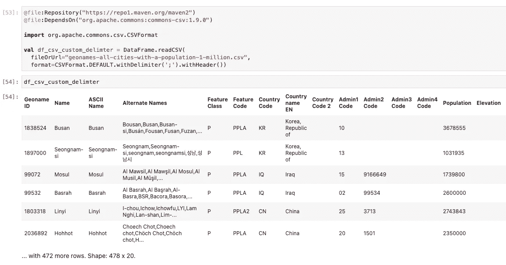*

*从分号(；)CSV 文件(图片作者提供)*

## *3.从远程 CSV 文件导入数据*

*如今，大多数数据集都可以在网上获得，并且可以通过 HTTP(s)协议访问。因此，您不需要下载文件并将其存储在您的环境中来使用它。Krangl 允许你从远程数据源加载数据帧，只需使用`readCSV`方法，用一个特定的 URL 作为参数，而不是一个文件名。为了测试这个特性，我们将使用一个在公共的 [GitHub](https://github.com/) 存储库中可用的数据集，即 VEGA 存储库，它包含一个关于机场信息的 CSV 文件，并通过以下 URL 提供:`[https://raw.githubusercontent.com/vega/vega/main/docs/data/airports.csv](https://raw.githubusercontent.com/vega/vega/main/docs/data/airports.csv)`*

```
*DataFrame.readCSV("https://raw.githubusercontent.com/vega/vega/main/docs/data/airports.csv")*
```

**

*使用 CSV 远程文件中的数据创建的数据帧(图片由作者提供)*

## *4.从 JSON 文件导入数据集*

*尽管 CSV 是导出表格数据时最常用的格式之一，但它不是唯一的格式。JSON 格式的使用日益流行，Krangl 意识到了这一点。因此，Krangl 提供了方法`fromJSON`,这两种方法都接受——文件路径或者将数据导入数据帧的远程 URL。*

```
*DataFrame.fromJson("https://raw.githubusercontent.com/vega/vega/main/docs/data/cars.json")*
```

*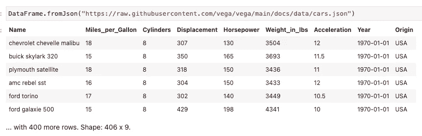*

*使用来自 JSON 远程文件的数据创建的 Dataframe(图片由作者提供)*

# *使用 Krangl 导出数据*

*将数据导入数据框架是处理数据项目的第一步。通常，一旦创建了数据帧，就应该执行一些操作来更新和清理数据，以便为进一步的分析做好准备。这种活动被称为数据争论，Krangl 在这方面提供了出色的支持。然而，用 Krangl 进行数据操作是一个广泛的话题，所以我决定将它排除在本文的范围之外。*

*然而，在结束这篇文章之前，我不想不提到 Krangl 是如何帮助我们保存已经处理过的数据帧的。*

*为了说明它，让我们获得下面的数据帧，并执行一些基本操作来更新它。*

```
*val df_cities: DataFrame = dataFrameOf("City name", "Country code", "Population", "Timezone")(
    "Madrid", "ES", 3_255_944, "CET - Central European Time",
    "Paris", "FR", 2_138_551, "CET - Central European Time",
    "London", "GB", 8_961_989, "GMT - Greenwich Mean Time",
    "Sydney","AU",4_627_345, "AEST — Australian Eastern Standard Time",
    "Amsterdam", "NL", 883_000, "CET - Central European Time"
)*
```

*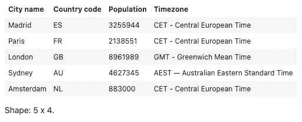*

*数据帧 df_cities(图片由作者提供)*

*也就是说，我们将选择那些城市人口低于 400 万的行，然后按城市名称对结果数据帧进行排序。*

```
 *val df_to_export = df_cities
                      .filter {it["Population"] lt 4_000_000 } 
                      .sortedBy("City name")*
```

*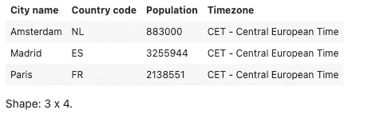*

*过滤和排序后要导出的数据帧(图片由作者提供)*

*现在，让我们使用 Krangl 函数导出结果数据帧(名为`df_to_export`)。*

## *1.将数据帧导出到 CSV 文件*

*将数据帧导出为 CSV 文件就像调用方法`writeCSV`一样简单，使用一个文件对象作为参数，该文件对象具有要创建的文件的名称。*

```
*import java.io.*

df_to_export.writeCSV(File("cities.csv"))*
```

*运行脚本后，创建了文件`cities.csv`，如下图所示。*

*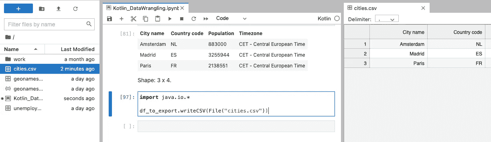*

*将数据帧导出为 cities.csv 文件(图片由作者提供)*

## *2.使用自定义分隔符将数据帧导出到 CSV 文件*

*Krangl 允许我们为导出 CSV 文件定义分隔符。正如之前在谈到导入 CSV 文件时所解释的，Krangl 依赖于 [apache-commons-csv](https://commons.apache.org/proper/commons-csv/) 库。因此，当必须定义自定义分隔符时，CSVFormat 类将完成这一任务，如下面的脚本所示:*

```
*df_to_export.writeCSV(file=File("cities2.csv"), 
                      format=CSVFormat.DEFAULT.withDelimiter(';').withHeader())*
```

## *3.将数据帧导出到 JSON*

*最后，我们将展示如何将数据帧导出为 JSON 对象。下面的脚本使用了由类`DataFrame`提供的方法`toJsonString()`。*

```
*df_to_export.toJsonString(prettyPrint = true, asObject = false)*
```

*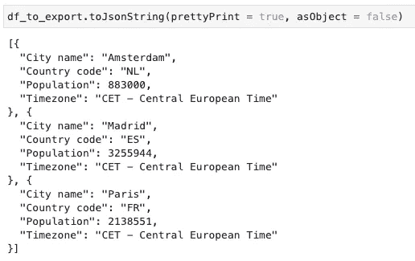*

*将数据帧导出为 JSON 对象(图片由作者提供)*

*另外，请注意，该方法提供了一些参数来定制输出。*

*   *当`prettyPrint`参数设置为 false 时，它将在一行中写入对象，否则将显示 JSON 对象的可读版本。*
*   *如果参数`asObject`为真，将生成带有嵌套对象的 JSON 对象。*

# *结论*

*当在基于 Kotlin 的数据科学项目中处理表格数据时，Krangl 是一个很好的选择(但不是唯一的选择)。它简洁明了的语法、扩展能力以及与 JVM 生态系统中其他工具的兼容性为支持您的研究和生产解决方案提供了坚实的基础。*

*在本文中，我们解释了如何使用 Kotlin 和 Krangl 创建数据框架来支持数据科学项目。我们使用带有 Kotlin 内核的 Jupyter Lab 实现了一些示例，并讨论了将不同格式(CSV、JSON…)的外部数据源导入到 Krangl 数据帧中。最后，还介绍了一套由 Krangl 提供的保存和导出数据帧的方法。*

*请随时留下您在文章中发现的评论、见解或错误。在以后的文章中，我们将更深入地探索 Krangl，重点关注数据争论任务以及与其他基于 Kotlin 的数据科学库的交互。因此，欢迎您的反馈，因为它将始终有助于提高文章的质量。*

*感谢您的阅读，我强烈希望这篇教程能够帮助您开始使用 Kotlin 和 Krangl 进行数据科学项目。*

# *参考*

*   *[https://docs.docker.com/engine/reference/run/](https://docs.docker.com/engine/reference/run/)*
*   *[https://jupyter.org/documentation](https://jupyter.org/documentation)*
*   *[https://kotlinlang.org/](https://kotlinlang.org/)*
*   *[https://kotlinlang.org/docs/reflection.html](https://kotlinlang.org/docs/reflection.html)*
*   *[https://towards data science . com/how-to-create-a-docker-image-with-jupyter-notebook-kot Lin-2e 8 bbf 212 f 81](https://towardsdatascience.com/how-to-create-a-docker-image-with-jupyter-notebook-kotlin-2e8bbf212f81)*
*   *【https://github.com/holgerbrandl/krangl *
*   *[https://github.com/vega/](https://github.com/vega/)*
*   *[https://public . opendatasoft . com/explore/dataset/geonames-all-cities-a-a-population-1000/export](https://public.opendatasoft.com/explore/dataset/geonames-all-cities-with-a-population-1000/export)*
*   *[https://commons . Apache . org/proper/commons-CSV/API docs/org/Apache/commons/CSV/CSV format . html # withDelimiter-char-](https://commons.apache.org/proper/commons-csv/apidocs/org/apache/commons/csv/CSVFormat.html#withDelimiter-char-)*
*   *[https://docs.oracle.com/javase/specs/index.html](https://docs.oracle.com/javase/specs/index.html)*