# 数据科学建模:如何在 Python 中使用线性回归

> 原文：<https://betterprogramming.pub/data-science-modeling-how-to-use-linear-regression-with-python-fdf6ca5481be>

## 看看 R、均方误差等等

布莱恩·亨利奎兹、克里斯·卡扎基斯和迪安·索伯莱特

[活动发起人](https://unsplash.com/photos/pypeCEaJeZY?utm_source=unsplash&utm_medium=referral&utm_content=creditCopyText)在 [Unsplash](https://unsplash.com/search/photos/data?utm_source=unsplash&utm_medium=referral&utm_content=creditCopyText) 上的照片

# **简介和目标**

线性回归是数据科学中广泛使用的技术，因为实现和解释线性回归模型相对简单。

本教程将使用 Python 遍历 80 种谷物数据集的简单和多元线性回归模型，并将讨论一些相关的回归指标，但我们并不假设之前有使用 Python 进行线性回归的经验。80 种谷物的数据集可以在[这里](https://www.kaggle.com/crawford/80-cereals)找到。

以下是一些**目标**:

*   理解 R 的含义和局限性
*   了解线性回归的评估指标以及何时使用它们
*   使用 80 种谷物数据集实现简单的多元线性回归模型

# 探索数据

下载数据集后，导入必要的 Python 包和谷物数据集本身:

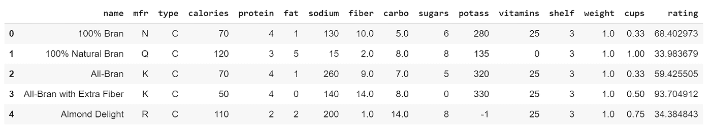

来自麦片的输出. head()

这里我们看到每一行是一个品牌的谷物，每一列是一个营养(蛋白质，脂肪等。)或谷物的识别特征(制造商、类型)。注意**等级**是响应或因变量。

接下来，我们创建了数据集每个特征之间相关性的 pairs 图，并从这个可视化中选择了三个预测变量:**卡路里**、**纤维**和**糖**。显示每个相关性的图太大了，不能在这里分享，但是我们可以用一个更小的 pairs 图来仔细观察，它只包括我们的预测变量。使用`seaborn.pairplot`，我们可以看到三个带有拟合最小二乘法直线的散点图:

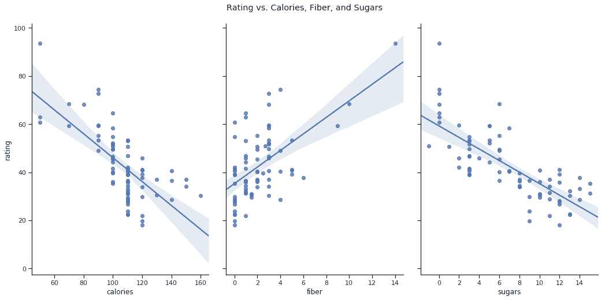

每个预测变量与响应变量的成对图

现在我们对数据更加熟悉了，我们可以开始建立我们的线性回归模型。

> 注:为了便于传达概念，我们不使用数据的测试/训练分割来计算 R 和调整的 R 值。但请认识到，使用随机选择的观测值的测试/训练分裂被认为是最佳实践，这就是我们在本教程快结束时呈现我们的误差和 AIC/BIC 的方式。

# 线性回归模型

我们想讨论 R 及其对线性回归模型的意义。但是要准确理解 R 是什么，首先我们需要理解什么是线性模型。让我们来看一个散点图，比较一份麦片中的**卡路里**和它的**等级**:

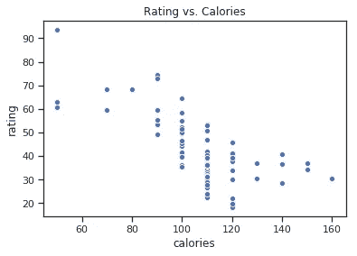

**评分**和**卡路里**的散点图

我们可以清楚地看到，含有更多热量的谷类食品通常受到较差的评价。如果我们假设这两个变量之间存在某种关系，那么我们可以构建一个模型，根据卡路里的数量来预测一种谷物的等级。

为了验证这种关系实际上是线性的，我们可以在图上画出模型的残差并寻找模式。残差中的清晰模式可能表明另一个模型，如二次模型或对数模型，可能更好地描述这两个变量之间的关系。让我们检查残差:

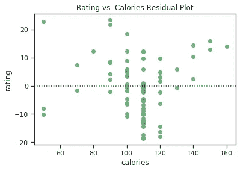

残差中没有明确的模式，因此没有证据表明存在更好的拟合非线性方程。

对于线性回归，我们会对公式感兴趣:

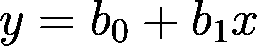

**x** 是响应变量 **y** 的预测变量

要制作模型，我们可以使用 scipy**linregresse**方法。

我们得到以下输出:

*   **linregression result**(**斜率**=*-0.49701318979564285*，**截距**=*95.78802384439143*，**右值**=*-0.6893760311652586*，.

第一项是 **b_1** ，第二项是 **b_0** ，第三项是 **R** 值，也称**相关系数**。R 值的范围从 1 到-1，衡量解释变量和响应变量之间的关系强度。卡路里相对于等级的 R 值为 *-.689* ，这表明这两个变量之间存在很强的负相关关系。R 值离 0 越远，模型预测值就越好。

# 稀有

通过平方 R，我们得到决定系数，R，R 是一个值，它表示 y 变量的变化中有多少百分比可以用 x 变量的变化来解释。高 R 值表示模型更强。让我们看看数据集中的一些 R 值:

我们打印以下内容:

*   **带杯预测器的模型 R**:*0.0412740112014871*
*   **带卡路里预测值的模型 R**:*0.472393123451636*

这些 R 值向我们表明**卡路里**比**杯**更能预测**等级**。

简单的线性回归是有用的，但是，我们经常想看看如何用几个变量来预测一个变量。让我们从谷物中取出一片，加上所有感兴趣的变量，得到一个 2D 预测值阵列。**卡路里**、**纤维**和**糖**在我们之前查看相关对图时似乎是很好的预测指标，所以让我们来看看使用这三种物质的模型:

我们得到以下输出:

*   **R**:*0.843669504178866*
*   **R 已调整**:*0.807124823500374*

我们发现 R 值从一元模型中的 *.475* (以**卡路里**为预测因子)增加到 *.848* 。这似乎表明我们的模型的预测能力增加了。

然而，让我们在这个多元线性回归模型中添加一个较差的预测器 **cups** ，看看会发生什么:

该代码给出以下输出:

*   **R**:*0.849343364*
*   **R 调整后**:*0.788668182288071*

回想一下，在单一变量的情况下，每份麦片的杯数似乎与消费者评级几乎没有关联。但是当我们把它加到模型中时，总体 R 增加到 *.849* ，这意味着模型的预测能力提高了。然而，根据我们所知，这个四变量模型应该不比三变量模型好。根据 R 值的计算方式，向模型中添加更多的变量总是会增加 R 值。因此，我们需要比较*调整后的* R 值，这减轻了由于额外变量导致的 R 增加。调整后的 R 的公式为

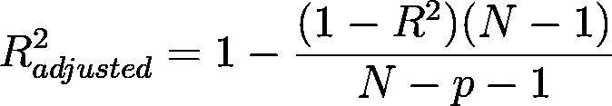

n-总样本量，p-预测数

由此我们发现三变量模型的调整后 R 为 *.807* ，而四变量模型的调整后 R 为 *.788* 。因此，根据这一标准，三变量模型更好。

r 是评估线性模型与数据拟合程度的最重要指标之一，因此对其含义有一个直观的理解非常重要。在实现线性回归模型时，了解 R 的局限性以及如何减轻这些局限性同样重要。

# **均方误差**

回归模型有许多不同的评估指标。最流行的指标之一，我们首先要讨论的是**均方误差** **(MSE)** 。

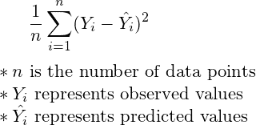

[信号源](https://study.com/academy/lesson/estimation-of-r-squared-variance-of-epsilon-definition-examples.html)

MSE 是一个评估指标，用于测量观察值和预测值之间的平均方差。换句话说，MSE 告诉我们线性回归模型有多准确或不准确——MSE 越低，模型预测值就“越好”。让我们找出回归模型的 MSE:

我们的变量 **mse** 返回为 *26.6329* 。

我们可以使用的另一个评估指标是**均方根误差** **(RMSE)** ，它就是我们的 MSE 的平方根。使用 Python 数学模块中的平方根函数，`**sqrt(mse)**`返回为 *5.1607* 。

值得注意的是，我们的 RMSE 值与响应变量使用相同的单位(我们取误差平方的平方根)。我们的 RMSE 值 *5.1607* 在**评级**变量的 0-100 范围内相对较低，因此我们的多元线性回归模型在预测谷物品牌的评级方面“表现良好”。但是我们可能会用到其他错误。

# 平均绝对误差

我们要考虑的下一个回归评估指标是**平均绝对误差(MAE)。**

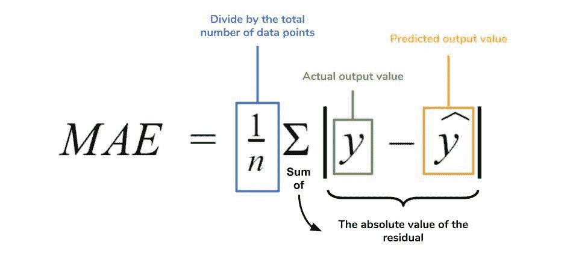

[来源](https://www.dataquest.io/blog/understanding-regression-error-metrics/)

因为 MSE 是残差的平方，所以 MSE 比 MAE 更严厉地“惩罚”了实际值和预测值之间的较大差异。由于平方项，MSE 比 MAE 对异常值更敏感。

如果我们认为数据集中的异常值在分析数据时并不重要，我们可以在 MSE 之前转向 MAE，因为异常值的残差不会因为残差的平方而被夸大。让我们找到梅:

我们的 **mae** 变量返回 *3.6153* 。鉴于**评级**的 0-100 范围，我们的 MAE 相对较小，因此我们的 MAE 表明我们的模型在其预测中相当准确。

# **平均绝对百分比误差(MAPE)**

我们要考虑的最后一个回归评估指标是**平均绝对百分比误差(MAPE)** 。

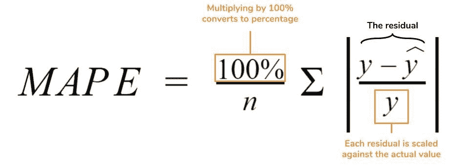

[来源](https://www.dataquest.io/blog/understanding-regression-error-metrics/)

MAPE 用百分比给出了预测模型的准确性。请注意梅和 MAPE 公式的相似之处。像梅一样，MAPE 并没有受到异常值的太大影响。但是，请谨慎使用 MAPE，因为

*   MAPE 容易被零误差除(见求和中的分母)；
*   如果实际值很小，MAPE 可以变得很大(再次参见求和中的除法运算)；
*   MAPE 偏向于小于观测值的预测。

让我们为我们的模型找到 MAPE:

我们的 MAPE 函数返回以下百分比: *8.458* %。因此，我们的预测平均“偏离”约 8.5%。

# AIC 和 BIC

**【阿凯克信息标准】**和 **BIC(贝叶斯信息标准)**是评估您的回归模型并确定最佳预测子集(哪个模型更适合)的客观方法。

当您向模型添加参数时，它总是会更好一些。但这样你就有丢失真实潜在模式信息的风险。因此，在参数的数量和模型的误差量之间有一个权衡。AIC 和 BIC 评估了模型解释你预测的变量的额外变化的能力，但没有过度拟合模型。

## 美国化学师学会(American Institute of Chemists)

AIC 允许您估计模型中丢失的信息量，以便您可以比较哪些模型效果最好，并选择更合适的预测子集。更具体地说，AIC 值是指数据的真实似然函数与模型的拟合似然函数之间的相对距离。距离越小，模型就越接近数据的真实表示。AIC 用这个公式表示:

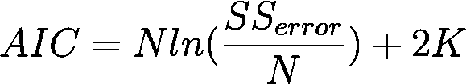

n 个观察值，K 个参数拟合+ 1

如果我们使用 AIC 方法比较两个模型的拟合度，AIC 值较低的模型拟合度较好。

让我们找出我们之前使用的两个多元回归模型的 AIC 值。一个有三个预测器，另一个有四个。首先，我们将定义要插入公式的值，然后运行公式:

这将产生以下输出:

*   **具有三个预测值的模型的 AIC**:*60 . 3233831*
*   **四预测模型的 AIC**:*62.380026097*

从我们看到的情况来看，具有三个预测值的模型具有较低的 AIC 值，因此比具有四个预测值的模型更适合(但在本例中并不太适合)。

## BIC

BIC 类似于 AIC，但是在惩罚你的模型增加更多参数方面要严厉得多。它由以下公式表示:

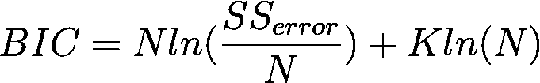

n 个观察值，K 个参数拟合+ 1

如果我们使用 BIC 方法比较两个模型的拟合度，BIC 值较低的模型拟合度更好，类似于 AIC 方法的过程。

让我们找到我们刚刚使用的相同的两个模型的 BIC 值。这里唯一的区别是我们将参数的数量乘以:

这将产生以下输出:

*   三预测模型的 BIC:*63*
*   **具有四个预测值的模型的 BIC**:*66 . 14887*

从这里我们可以看到，具有三个预测值的模型具有较低的 BIC 值，因此比具有四个预测值的模型更适合。因为 BIC 惩罚比 AIC 惩罚更严格，所以对于它们各自的模型，BIC 方法的值大于 AIC 方法的值。

由于罚款的不同，AIC 可以选择一个比 BIC 有更多参数的模型。建议您同时使用 AIC 和 BIC，并根据两组结果对您的模型做出决策。在这种情况下，AIC 和 BIC 彼此同意，选择了相同的模式。

# 关键词汇

总而言之，我们讨论了

*   **R** :线性回归模型预测响应变量的强度指标
*   **调整后的 R** :多元线性回归模型在校正模型中参数数量的同时，解释因变量方差的能力有多强的指标
*   **MSE(均方误差):**极大惩罚离群值的评价度量；当异常值代表数据集的真实现象时，这可能是您将计算和使用的第一个错误
*   **RMSE(均方根误差):**MSE 的平方根；与响应变量共享相同的单位，因此 RMSE 可能比 MSE 更“可解释”
*   **MAE(平均绝对误差):**用于在测量误差时降低异常值重要性的评估指标；当异常值*不代表数据集的真实现象时使用*
*   **MAPE(平均绝对百分比误差):**用百分比来衡量回归模型的准确性；当响应变量取小值时，容易出现运行时错误或异常大的值
*   **AIC(赤池信息标准):**对不同模型中丢失的信息量的评估，对参数的增加进行惩罚。不管你的数据有多大，它总是有机会选择太大的模型。最好与 BIC 一起使用。
*   **BIC(贝叶斯信息标准):**与 AIC 类似，但处罚更重。不管你的数据有多大，它总是有可能选择太小的模型。最好与 AIC 一起使用。

# 结论

在本教程中，我们展示了如何用 Python 实现简单和多元线性回归模型，以及评估这些模型及其误差的不同方法。

使用您自己的数据集时，您可以选择使用这些方法中的任何一种来评估您的回归模型和误差。但是，使用这些模型并查看它们的结果如何一致或不同，以决定哪一个模型最能代表您的数据，这可能是您最感兴趣的。

现在，您应该更容易实现自己的线性回归模型，并且更加了解所有讨论的回归指标之间的相似性和差异。