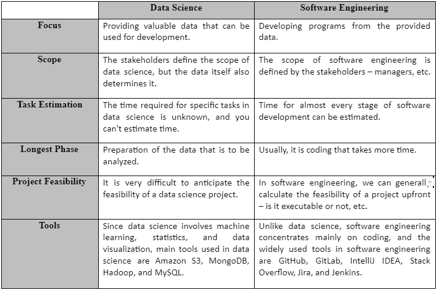
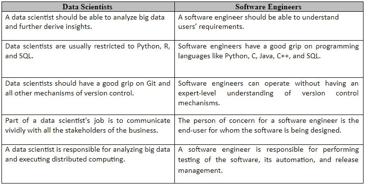
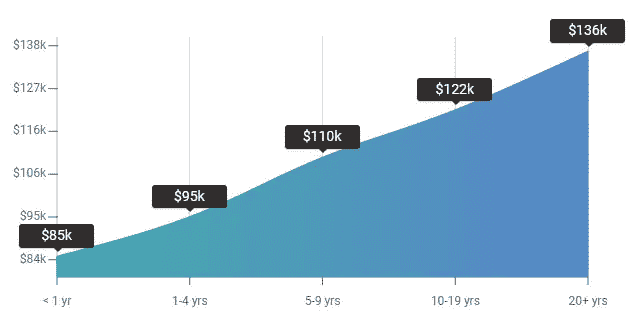
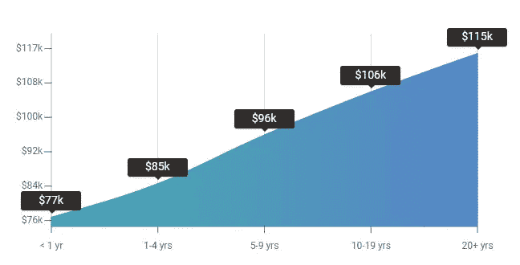

# 数据科学家与软件工程师——谁赚得更多？

> 原文：<https://betterprogramming.pub/data-scientists-vs-software-engineers-who-earns-more-df6a3e921f42>

## 两条职业道路的详细比较

来自 [Pexels](https://www.pexels.com/photo/man-in-black-jacket-sitting-beside-window-5483060/?utm_content=attributionCopyText&utm_medium=referral&utm_source=pexels) 的 [cottonbro](https://www.pexels.com/@cottonbro?utm_content=attributionCopyText&utm_medium=referral&utm_source=pexels) 摄影

虽然数据科学家和软件工程师的关注点和主要目标可能非常相似，但是实现它们的方法和工具却非常不同。

数据科学家和软件工程师都致力于自动化流程，以提高效率和帮助企业。

数据科学家将更全面地处理问题——建立问题陈述、查询给定数据、探索性数据分析、模型构建和开发，以及最终解释结果。

另一方面，软件工程师主要专注于开发功能、程序和应用程序来帮助最终用户。

在本文中，我们将同时详细探讨软件工程师和数据科学家之间的异同。

# 什么是数据科学？

数据科学可以被描述为从各种媒介中提取数据并将其转化为知识。只有在企业对数据有了所需的特定理解之后，他们才能做出重要的决策。

在过去的十年中，数据科学的重要性大幅提升，对数据科学家的需求也大幅增加。

企业处于一个非常好的竞争环境中，只有在正确的时间做出正确的决定，才能跟上竞争的步伐。

没有数据科学家和数据科学的帮助，这是不可能的。

# 什么是软件工程？

与数据科学不同，数据科学非常庞大，很难解释，软件工程是不言自明的。它包括使用数据科学和开发技能开发新的程序和软件。

然而，一旦程序被开发出来，软件工程师的工作并没有结束。我们知道没有没有错误的软件这种东西，软件工程师的次要角色是不断地修补现有的软件，并确保它按照要求运行。

# 数据科学家和软件工程师的区别

数据科学家是数据驱动的全面发展的个人，他们拥有分析数据的高级技术技能。

有了给定的数据，他们就可以构建复杂的定量算法来组织和综合广泛的信息，并从中提取所需的信息。

另一方面，软件工程师通常使用数据科学家提供的知识为最终用户开发程序。

没有数据科学家，软件工程师很难操作，没有软件工程师，数据科学家的角色就变得过时了。

但是，在我们开始阐述软件工程师和数据科学家之间的区别之前，我们先来看看他们各自领域之间的区别——数据科学和软件工程

由作者创建

现在我们已经对数据科学和软件工程进行了比较分析，我们将看看软件工程师和数据科学家之间的区别:

由作者创建

# 软件工程师和数据科学家所需的资格和技能

正如我们之前所讨论的，软件工程师的主要精力集中在编码上，而数据科学家则致力于机器学习、统计、数据可视化，从而从混乱中创造秩序。

因此，这两个领域所需的技能各不相同，相关专业人员的资格也各不相同。

在本节中，我们将详细了解软件工程师和数据科学家所需的技能和资格:

## ● **数据科学家**

数据科学家所需的技能如下:

*   领域知识
*   统计和概率
*   数据挖掘技术
*   机器学习语言
*   定量分析
*   编程知识
*   科学和商业知识
*   大数据处理:包括非结构化和结构化数据(NoSQL 数据库和 SQL)
*   构建数据产品并使数据可视化，使其易于理解。

 [## 2020 年要学习的 12 大数据科学技能

### 必须用这些数据科学技能提升自己的技能

towardsdatascience.com](https://towardsdatascience.com/top-12-data-science-skills-to-learn-in-2020-5f635d7d98bf) 

## ● **软件工程师**

下面是一个软件工程师拥有的技能列表:

*   了解和分析最终用户需求
*   核心编程语言(比如，c++，java，c 等等。)
*   数据建模技能
*   软件测试
*   软件配置工具(木偶，厨师等。)
*   构建和发布技能
*   项目管理技能

虽然软件工程师和数据科学家通常至少拥有各自领域的学士学位，但软件工程师不需要与数据科学家相同的正规教育水平。

许多软件工程师都是自学的。编码训练营在这方面提供了大量的帮助，因为任何对计算机有基本了解的人都可以通过训练营学习编码。

另一方面，虽然你可以获得数据科学学位或选择数据科学训练营，但这一领域的准入门槛非常高。

# 数据科学与软件工程的职业道路

数据科学与软件工程的职业道路

人们问得最多的一个问题是，他们应该在数据科学和软件工程之间选择什么职业道路。

在这一部分，我们将告诉你如何成为一名数据科学家或软件工程师。此外，你将能够轻松地进行选择。

## ● **数据科学**

从非常初级的数据科学家到经验丰富的高级数据科学家，他们的职业道路在职责、技能水平、日常任务和技术人员最喜欢的话题(总体薪酬科学)方面有很大不同。

当我们为数据科学家寻找任何类型的技术角色时，通常有两种主要途径:个人贡献者途径和管理途径。

数据科学中的个人贡献者路径涉及数据科学家，他们主要从事核心数据科学项目，贡献代码，运行分析，并构建 ETL 管道，从而构建机器学习模型。

另一方面，数据科学中的管理途径包括经验丰富的数据科学家，他们制定数据战略，管理其他技术人员，并致力于解决公司的所有数据难题。

数据科学中的两条道路都源于同一旅程——从入门级数据科学家到高级数据科学家职位，这是他们后来发生分歧的地方。

随着数据科学家的职业发展，个人贡献者可以自己决定是成为经理还是忠于专业数据科学。

## ● **软件工程师**

另一方面，与数据科学相比，软件工程师的职业道路非常不同。如果你想成为一名软件工程师，你必须精通至少一门编程语言。此外，如前所述，该领域的准入门槛不像数据科学那样高。

同样，随着技术的发展，软件工程中的机会也在以同样的速度扩大和形成。

对于渴望在自己的领域提升职业生涯的有抱负的软件工程师来说，许多现实的职业道路在等待着他们，这些道路不仅能保证可持续的工作，还能保证高薪工作:

*   后端开发人员
*   工具和企业软件开发人员
*   嵌入式系统开发人员
*   前端开发人员
*   移动工程师
*   游戏开发者
*   全栈工程师
*   图形工程师
*   数据工程师
*   DevOps 工程师
*   测试中的软件开发工程师
*   嵌入式系统工程师
*   安全工程师

然而，这并不是全部，作为一名软件工程师，您可以为自己探索许多其他选择。

# 谁赚的多？

来自[佩克斯](https://www.pexels.com/photo/crop-man-counting-dollar-banknotes-4386431/?utm_content=attributionCopyText&utm_medium=referral&utm_source=pexels)的[卡罗琳娜·格拉博斯卡](https://www.pexels.com/@karolina-grabowska?utm_content=attributionCopyText&utm_medium=referral&utm_source=pexels)的照片

数据科学是一个新的领域，它提供了一个非常不错的职业，工资超过 165，000 美元。然而，这并不意味着他们比软件工程师挣得多，因为这完全取决于个人和他们所利用的机会。

由于现在软件工程是一个既定的职业，有经验的软件工程师甚至可以挣到 16 万美元。虽然对软件工程的需求似乎只会增加，但数据科学家的工资最终会赶上软件工程师。

## **●按小时付费**

由 [ZipRecruiter](https://www.ziprecruiter.com/Salaries/Data-Scientist-Salary) 反映的今年的统计数据显示，美国数据科学家的平均时薪为 57.41 美元。然而，这是一个平均值，在一些州，数据科学家每小时的收入可能高达 90 美元，而在其他州，可能低至 18 美元。

然而，对于软件工程师来说，这与平均时薪(48.27 美元)相差无几，这一点在[招聘网站](https://www.ziprecruiter.com/Salaries/Software-Engineer-Salary)上有所反映。这条平均曲线上端的软件工程师的收入可能高达 68.27 美元，曲线下端的软件工程师的收入可能低至 23 美元。

## ●按位置付费

数据科学家排名靠前的州是加利福尼亚州、纽约州和德克萨斯州。这些州提供的平均薪资分别为 16 万美元、15.2 万美元和 13.5 万美元。佐治亚州也为数据科学家提供了具有竞争力的薪酬，起薪为 11 万美元。

根据 ZipRecruiter 的调查，[软件工程师薪资最高的州是加利福尼亚州、马萨诸塞州和纽约州，平均薪资分别为 16 万美元、14.5 万美元和 12 万美元。在其他州，平均价格通常低于 10 万美元。](https://www.ziprecruiter.com/Salaries/What-Is-the-Average-Software-Engineer-Salary-by-State)

## ●按经验水平付费

PayScale[提供的数据显示，数据科学家的平均工资为 96481 美元。基于经验水平的数据科学家工资如下:](https://www.payscale.com/research/US/Job=Data_Scientist/Salary)

来源— [工资等级](https://www.payscale.com/research/US/Job=Data_Scientist/Salary)

*   入门级——85000 美元
*   1 至 4 年——95，066 美元
*   5 至 9 年——109912 美元
*   10 至 19 年——121，781 美元

根据 [PayScale](https://www.payscale.com/research/US/Job=Software_Engineer/Salary) 提供的经验水平，以下是全美软件工程师的平均工资:

来源:[薪级表](https://www.payscale.com/research/US/Job=Software_Engineer/Salary)

*   入门级——77166 美元
*   1 至 4 年——85，004 美元
*   5 至 9 年——96355 美元
*   10 至 19 年——106，408 美元

# 我应该成为数据科学家还是软件工程师？

这个问题的答案就在你自己身上。只有你知道你的兴趣在哪里，你擅长什么，这就是为什么你应该自己回答这个问题。

对你的朋友来说可能是软件工程，但对你来说可能不是。

就这两个领域的范围而言，这两个领域都是未来的，在未来几年，这两个领域的工作数量只会增加。

虽然有人可能会说软件工程的需求量很大，这是正确的，但数据科学也在逐渐发生变化。

现在我们几乎可以在所有的大公司找到数据科学家，随着 AI 革命的到来，越来越多的公司正在雇佣数据科学家。

我们能建议的是，如果你是一个喜欢构建的人，软件工程适合你，但如果你是一个喜欢在混乱中构建秩序的极客(像《美丽心灵》中的约翰·纳西一样)，数据科学适合你！

## 想了解作者？

在 [Linkedin](https://www.linkedin.com/in/claire-d-costa-a0379419b/) 和 [Twitter](https://twitter.com/ClaireDCosta2) 上与我联系。