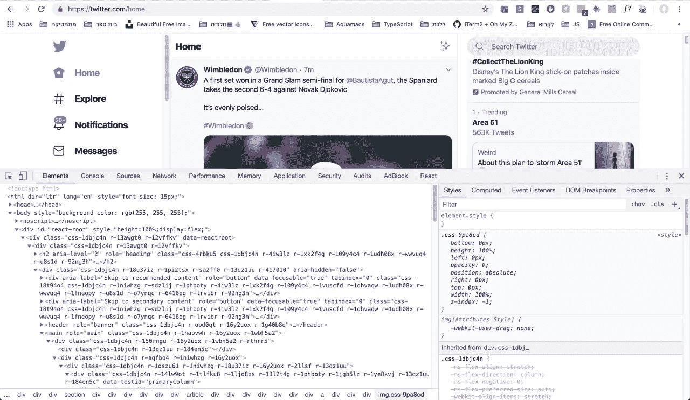
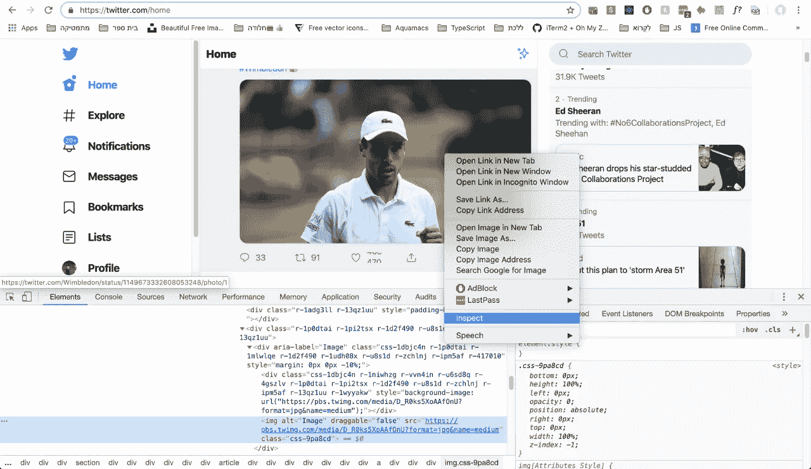
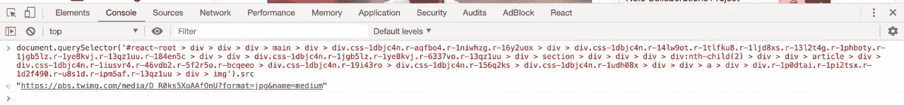
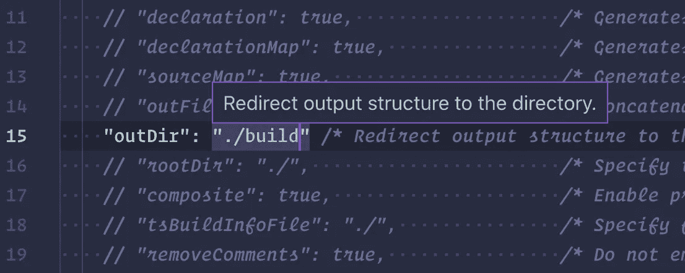
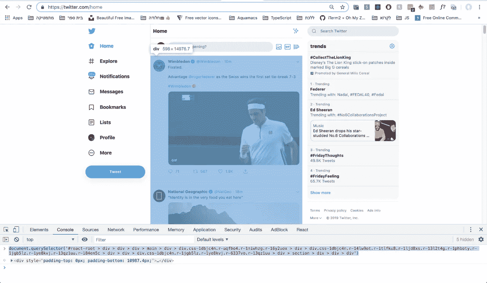

# Node.js 101 中的数据抓取

> 原文：<https://betterprogramming.pub/data-scraping-in-node-js-101-c549cf400af1>

## 不用那些讨厌的数据库收集数据


由[马库斯·斯皮斯克](https://unsplash.com/@markusspiske?utm_source=unsplash&utm_medium=referral&utm_content=creditCopyText)在 [Unsplash](https://unsplash.com/search/photos/data?utm_source=unsplash&utm_medium=referral&utm_content=creditCopyText) 上拍摄

Web 抓取是创建动态网站的一种很好的方式，而不必联系数据库来获取信息。

要开始网络抓取，你应该知道一个网站是如何构建的。如果你右击一个页面，点击 inspect(在 Chrome 上)，你可以看到开发者工具。



这向您展示了网站的 HTML/CSS/JavaScript 代码的结构，以及网络性能、错误、安全性等等。

现在，假设我想在 JavaScript 控制台中以编程方式抓取你在 Twitter 上看到的第一张图片。

嗯，我可以右键单击图像，单击 inspect，右键单击 dev 工具中的元素，然后复制 CSS 选择器。



然后，我可以做一个`document.querySelector(<<SELECTOR>>).src`操作，这将给出我想要的图像的 URL，我可以在网页上使用它，例如:



这个*就是*网页抓取！我能够在不访问数据库的情况下从网站上收集数据(一张图片)。但是这非常冗长乏味，所以为了更有效地抓取网页，我使用 Node.js 和 Puppeteer。

如果您还不知道， [Node.js](https://nodejs.org/) 是一个允许 JavaScript 在服务器端运行的运行时环境。而 [Puppeteer](https://github.com/GoogleChrome/puppeteer) 是 Google 写的一个‘无头 Chrome node API’(基本上就是让你在服务器上写 DOM JavaScript 代码)。

仅供参考，因为我喜欢打字稿，我将在这个项目中使用这种语言。如果您想使用 TypeScript，请在您的系统上安装它。如果在终端中运行`tsc -v`有效，就可以开始了！

好的，首先，确保您的系统上安装了 Node.js 和 npm(节点包管理器)。如果您通过运行以下程序之一得到了一个`command not found`或其他相关的东西，我建议您看看这篇关于如何安装 Node 的文章。

```
$ npm -v # should be 6.0.0 or higher $ node -v # should be 9.0.0 or higher
```

太好了！让我们开始一个新项目并安装依赖项:

```
$ mkdir Web-Scraping-101 && cd Web-Scraping-101 
$ npm init # go through all defaults 
$ npm i puppeteer # the google npm scraping package 
$ tsc --init # initialize typescript 
$ npm i @types/puppeteer # type declarations
```

现在，在您选择的文本编辑器中打开该文件夹。将`tsconfig.json`文件中的`outDir`选项编辑为`./build`，并取消对该行的注释，如下所示:



在文件夹的根目录下创建一个新文件:

```
$ touch app.ts
```

在`app.ts`中添加:

```
console.log("Twitter, here we come");
```

要运行它，在终端中，写下:`tsc && node build/app.js`

注意:`tsc`将所有的类型脚本文件构建到配置文件中定义的`outDir`目录中，`node`运行一个 JavaScript 文件。

如果你看到*Twitter，我们来了*出现在终端，你已经让它工作了！**

**现在，我们将开始实际刮使用木偶师。将这个样板木偶代码添加到`app.ts`文件中:**

**请通读上面注释的代码，感受一下正在发生的事情。**

**现在您可以看到我们如何访问一个网页，使用 DOM 操作收集信息，并将这些信息返回到 Node js 程序，我们已经准备好抓取 Twitter 了。**

**首先，将`await page.goto("https://example.com")`编辑成`await page.goto("https://twitter.com")`。**

**接下来，我们需要能够从中间栏(实际的 Twitter 提要)获取帖子。经过一些调查，我发现这个选择器实际上是选择中间列提要的`div`:**

```
**document.querySelector("#react-root > div > div > div > main > div > div.css-1dbjc4n.r-aqfbo4.r-1niwhzg.r-16y2uox > div > div.css-1dbjc4n.r-14lw9ot.r-1tlfku8.r-1ljd8xs.r-13l2t4g.r-1phboty.r-1jgb5lz.r-1ye8kvj.r-13qz1uu.r-184en5c > div > div > div.css-1dbjc4n.r-1jgb5lz.r-1ye8kvj.r-6337vo.r-13qz1uu > div > section > div > div > div");
// the above returns the div for the middle column twitter feed**
```

**这是一个代表什么的图像:**

****

**为了从中间一列获取所有的图像，我最终为`page.evaluate()`函数做了如下工作:**

**现在，如果我想编译一个所有图像源的列表并将它们打印到控制台，我所要做的就是在`page.evaluate()`函数之外编写这个:**

```
**console.log(dimensions.sources);**
```

**这就对了。您刚刚从 Twitter feed 中抓取了图像数据。**

**最后一个挑战是将这些数据集成到 Express.js 服务器中，这样当用户访问根站点时，就可以看到所有这些抓取的图像。**

# **资源**

*   **[Node.js](https://nodejs.org/en/)**
*   **[打字稿](https://www.typescriptlang.org/)**
*   **[Express.js](https://expressjs.com/)**

**感谢阅读！**