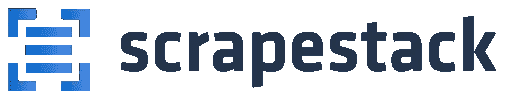
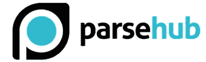
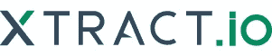

# 2022 年你应该知道的 7 大数据抓取工具

> 原文：<https://betterprogramming.pub/data-scraping-tools-7cb76eeab89e>

## [网页抓取](https://rakiabensassi.medium.com/list/software-engineering-7a179a23ebfd)

## 如何保持领先地位，并从网络上的公共数据中获得竞争优势


[马约菲](https://unsplash.com/@mayofi?utm_source=medium&utm_medium=referral)在 [Unsplash](https://unsplash.com?utm_source=medium&utm_medium=referral) 上的照片。

2020 年 10 月，脸书向联邦法院提起诉讼，指控两家公司使用两个恶意的 Chrome 扩展在未经授权的情况下从脸书、Instagram、Twitter、LinkedIn、YouTube 和亚马逊收集数据。

这两个扩展都从用户的在线账户中收集了公开和非公开的数据。这些公司利用这些数据出售“营销情报”和其他服务。

那么什么是数据抓取呢？

在本文中，我将解决这一技术，解释我们如何以合法的方式从中受益，并列出市场上零编码提取数据的七个顶级工具。

```
**Table of Contents**[**What Is Data Scraping?**](#47fc)
[**Use Cases**](#470d)
  ∘ [Tracking prices](#8b3e)
  ∘ [Market and competitive intelligence](#9c6d)
  ∘ [Social listening](#372c)
  ∘ [Machine learning (ML)](#7a5b)
  ∘ [Website transitions](#9f3d)
  ∘ [News monitoring](#37ae)
  ∘ [Analyzing the performance of your content](#19a9)[**Web Scraping Tools**](#2109)
  ∘ [Octoparse](#24af)
  ∘ [ScrapingBee](#793d)
  ∘ [ScrapingBot](#2e5e)
  ∘ [scrapestack](#b2b1)
  ∘ [Scraper API](#541d)
  ∘ [ParseHub](#6aef)
  ∘ [Xtract.io](#37b9)
[**Final Thoughts**](#095e)
```

# 什么是数据抓取？

数据抓取或 web 抓取是从网站或应用程序(人类可读的输出)提取信息并将其保存在电子表格或本地文件中的一种形式。

这种技术并不违法，但是它的目的和应用方式可能会违法。在下面的视频中，您可以看到我是如何使用 web scraper 从我的中型个人资料中获取数据列表的:

使用[octoporparse](https://www.octoparse.com/)的一个简单的 web 抓取场景:从我的中型配置文件中提取数据

如您所见，收集到的数据以表格的形式返回，包括每篇文章的名称、日期、URL、回复数量以及我发布的内容的更多详细信息。

# 用例

Web 抓取不需要重复键入或复制粘贴，并且具有广泛的应用。可以在各种场景下无限用途使用。例如，营销人员使用它来简化他们的流程。

常见的使用案例包括:

## 1.跟踪价格

通过收集亚马逊和其他平台上的产品及其价格信息，你可以监控竞争对手的价格，然后优化你的价格策略。

## **2。**市场和竞争情报

如果你正积极寻求进入一个新的市场，并希望确定你的机会，收集和分析数据有助于你做出准确和自信的决定。

## 3.社交倾听

> “社交倾听是监控社交媒体渠道对您的品牌、竞争对手、产品等的提及情况的过程。”— [托尼·陈](https://blog.hootsuite.com/social-listening-business/)

Talkwalker、HootSuite 和 Brandwatch 是一些社交媒体收听和跟踪平台。

## 4.机器学习

而 ML 和 AI 是用来优化数据抓取工具性能的，网页抓取和 ML 的另一半关系也是如此。

网络是基于[机器学习](https://medium.com/swlh/a-question-to-future-proof-your-work-bde6d9546fef)算法的重要数据源。通过大规模提取公共数据，你可以为你的机器学习模型提供信息。

## 5.网站转型

企业将他们的站点转移到更现代的环境并不罕见。在这种情况下，拥有保存大量关键信息的大型过时网站(例如政府网站)的公司可能希望使用 web scraper 快速轻松地将数据从其旧网站导出到新平台。

## 6.新闻监控

随着在线每日产生的信息量的增长，新闻监控和分析变得越来越流行。它可以节省您的时间，并帮助您准确准确地跟踪您感兴趣的主题。

新闻监控的来源包括新闻网站、网站、评论网站、博客和社交网络。

## 7.分析内容的性能

如果你是博客作者或内容创作者，你可以使用网络抓取工具来导出你的帖子、视频、推文等数据。按照与上面视频中类似的场景，将。

以表格形式保存数据比简单地在浏览器视图中查看更有用。原因如下:

*   该列表可排序和编辑。
*   你可以很容易地把它插入数据库。
*   你可以回头看看这个清单，找到你要找的东西。
*   您可以使用数据可视化工具将提取的表格转换为图表，这有助于为未来的内容做出更好的决策。

# 网页抓取工具

抓取数据需要正确解析源页面，呈现 [JavaScript](/javascript-history-and-future-71b0ceb737aa) ，以可用的形式获取数据，并在需要时进行过滤。

利用数据搜集工具比做极其繁琐的手工工作更实际。您的流程将会更加快速地工作，而不需要了解任何技术细节。

下面列出了 2021 年市场上最好的七种数据抓取工具。

## 1.八解析


资料来源:octoparse.com

Octoparse 是一个易于使用的工具，可以为编码者和非编码者抓取 web 数据。它有一个免费的计划和一个付费的试用版。

主要特点:

*   处理所有网站:无限滚动，分页，
    登录，[下拉菜单，](/angular-custom-autocomplete-7ffb479477e7)，AJAX 等。
*   通过 Excel、CSV、JSON、API 访问提取的数据，或保存到数据库。
*   云服务:在 Octoparse 的云平台上抓取和访问数据。
*   计划在一天、一周或一个月的任何特定时间运行擦除任务，如果需要实时擦除，则可以在每分钟运行。
*   自动 IP 轮换，防止 IP 被封锁。
*   广告拦截，优化页面的[加载时间](/build-me-an-angular-app-with-memory-leaks-please-36302184e658)，减少 HTTP 请求数量。
*   用于精确数据提取的 XPath 和 RegEx 选择器。
*   支持 Windows 和 Mac 系统。
*   简单项目免费计划，标准 75 美元/月，专业 209 美元/月，数据服务计划 399 美元/月起，爬虫服务计划 189 美元/月起，企业定制定价模式。

## 2.报废蜜蜂


资料来源:scrapingbee.com

ScrapingBee API 处理无头浏览器并旋转代理。它还有一个专门用于谷歌搜索抓取的 API。

主要特点:

*   [JS 渲染](/programming-buzzwords-9e94a3544eed)
*   自动代理旋转
*   它可以直接用在 Google Sheets 和 Chrome 网络浏览器上。
*   支持[谷歌搜索](https://javascript.plainenglish.io/google-search-console-api-8b13128da267)抓取。
*   1000 次 API 调用免费，29 美元/月的自由职业计划，99 美元/月的启动计划，249 美元/月的商业计划，以及企业定制定价模型。

## 3.报废机器人


来源:scraping-bot.io

ScrapingBot 提供了针对不同抓取需求定制的 API:一个用于检索页面的原始 HTML 的 API，一个专门用于零售网站抓取的 API，以及一个用于从房地产网站抓取房产列表的 API。

主要特点:

*   JS 渲染(无头 Chrome)。
*   高质量的代理。
*   整页 HTML。
*   最多 20 个并发请求。
*   地理定位。
*   一个 ScrapingBot Prestashop 附件，您可以将其集成到您的网站上，直接从 Prestashop 仪表板监控竞争对手的价格。
*   100 积分的免费计划，47 美元/月的自由职业者计划，120 美元/月的创业计划，361 美元/月的商业计划，845 美元/月的企业计划。

## 4.刮刀堆



资料来源:scrapestack.com

Scrapestack 是一个实时 web 抓取 REST API。它允许你在几毫秒内抓取网页，处理数百万个代理 IP、浏览器和验证码。

主要特点:

*   允许并发的 API 请求。
*   支持验证码求解和 JS 渲染。
*   HTTPS 加密。
*   100 多个地理位置。
*   1，000 个请求的免费计划，19.99 美元/月的基本计划，79.99 美元/月的专业计划，199.99 美元/月的商业计划，以及企业的定制定价模型。

## 5.刮刀 API


资料来源:scraperapi.com

Scraper API 处理代理、浏览器和验证码。很容易整合。您只需要用您的 API 键和 URL 向 API 端点发送一个 GET 请求。

主要特点:

*   JS 渲染。
*   地理定位。
*   它拥有住宅/移动代理池，用于价格抓取、搜索引擎抓取、社交媒体抓取等。
*   1000 次免费 API 调用，29 美元/月的爱好计划，99 美元/月的启动计划，249 美元/月的商务计划，以及企业定制定价模式。

## 6.ParseHub



资料来源:parsehub.com

ParseHub 是一个不需要任何编码技能的 web 抓取工具。

主要特点:

*   易于使用的图形界面。
*   通过 Excel、CSV、JSON 或 API 连接访问提取的数据。
*   XPATH，正则表达式，CSS 选择器。
*   与 Tableau 集成以提供数据可视化。
*   支持 Windows、Mac 和 Linux。
*   它有免费计划、每月 149 美元的标准计划、每月 499 美元的专业计划和企业定制定价模式。

## 7.Xtract.io



来源:xtract.io

Xtract.io 是一个使用 AI、ML 和 NLP 等技术构建的灵活平台。

可以对其进行定制，以将 web 数据、社交媒体帖子、pdf、文本文档、历史数据甚至电子邮件抓取和组织成可消费的业务就绪格式。

主要特点:

*   适合收集数据的解决方案，如产品目录信息、财务信息、租赁数据、位置数据、公司和联系信息、招聘信息、评论和评级。
*   预配置的工作流可自动化整个数据提取过程。
*   根据预构建的业务规则清理和验证数据，确保严格的数据质量，以实现完整性和准确性。
*   导出到 JSON，文本文件，HTML，CSV，TSV 等。
*   旋转代理并绕过验证码，轻松提取实时数据。
*   它有一个定制的定价模型。

# 最后的想法

数据抓取有大量的用例，不仅限于将数据从一个地方移动到另一个地方。

无论您是软件开发人员、数据科学家、机器学习爱好者、营销人员还是初创公司，您都可以通过利用这种做法来获得智能和效率，并促进您的业务。

考虑一下这个:即使你不打算在工作中使用它，就这个话题对自己进行教育也是明智的，因为它很可能变得更加重要，并对未来产生深远的影响。

🧠💡感谢阅读！我为一群聪明、好奇的人写关于工程、技术和领导力的文章。 [**加入我的免费电子邮件简讯独家访问**](https://rakiabensassi.substack.com/) 或注册媒体[这里](https://rakiabensassi.medium.com/membership)。