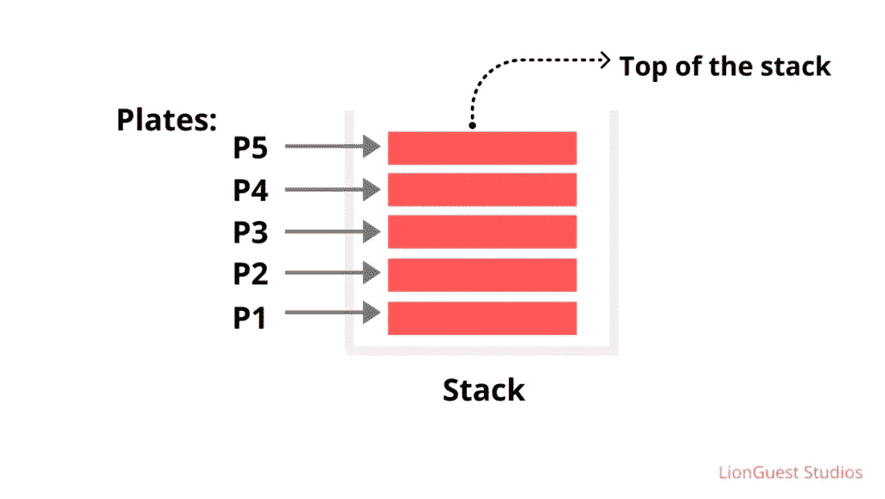
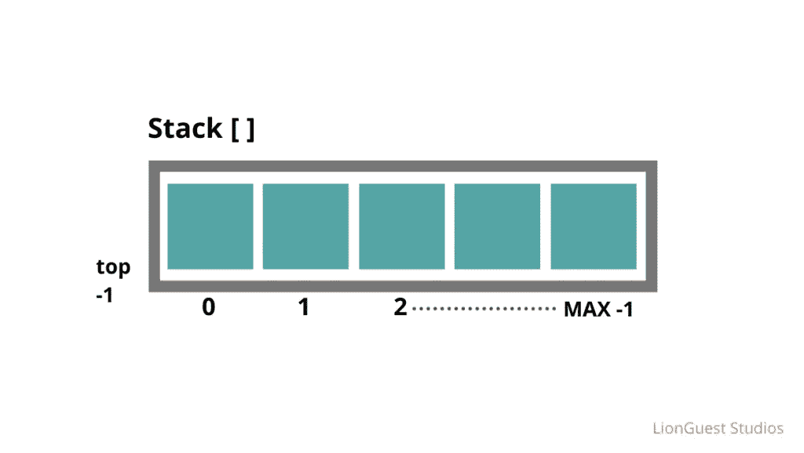
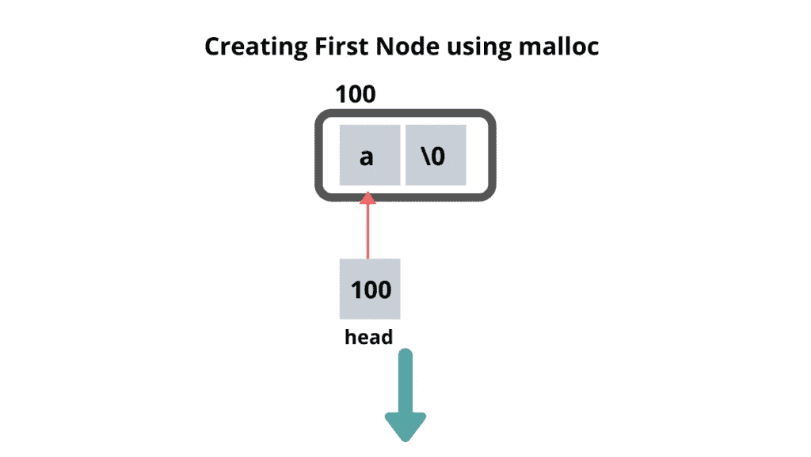
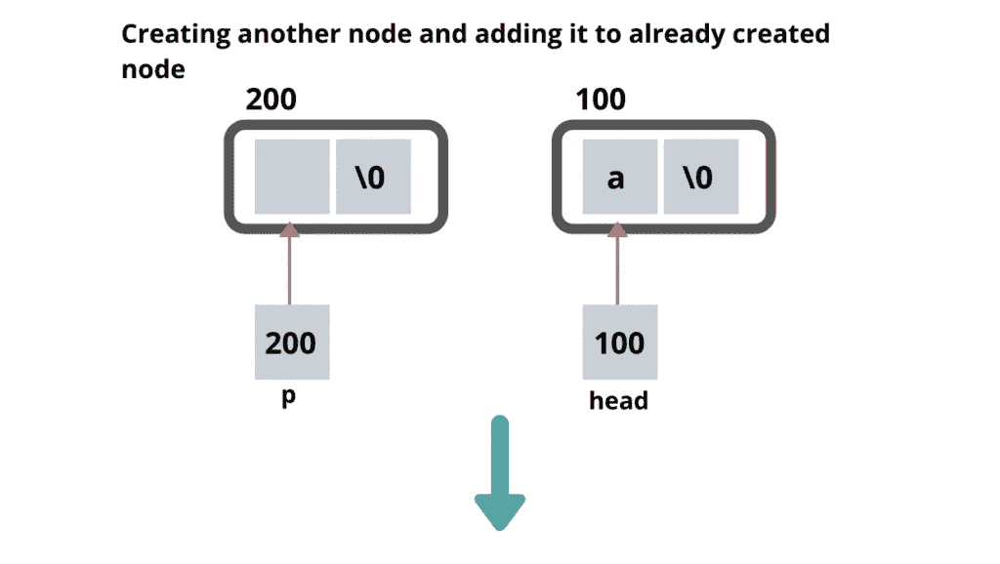
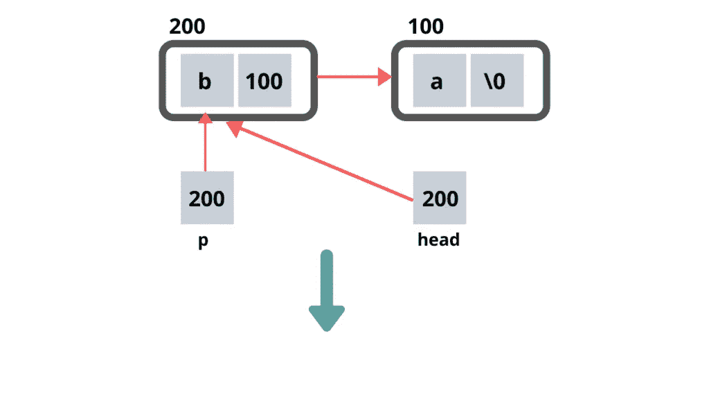
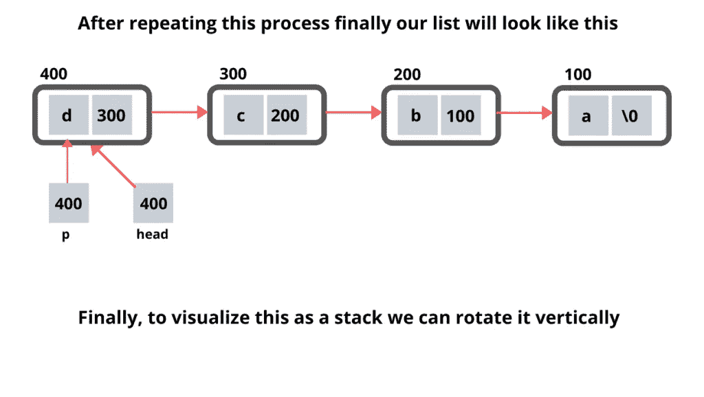

# 数据结构:堆栈介绍

> 原文：<https://betterprogramming.pub/data-structures-an-introduction-to-stacks-a902cd830018>

## 数组很棒，但是你试过堆栈吗？

[食客集体](https://unsplash.com/@eaterscollective?utm_source=unsplash&utm_medium=referral&utm_content=creditCopyText)在 [Unsplash](https://unsplash.com/s/photos/stack?utm_source=unsplash&utm_medium=referral&utm_content=creditCopyText) 上的照片

在这篇博文中，我们将使用 C 编程语言学习、实现和全面介绍堆栈数据结构。

在理解栈数据结构之前，你应该对*数组*和*链表*有很好的理解，因为只有借助这两种数据结构，我们才能实现栈。

一般来说，对于实现任何数据结构，无论是堆栈、队列、树等。，我们必须使用数组或者链表。

如果你可以预测数据结构的大小(需要多少内存)，那么你可以使用数组，否则，你可以使用链表动态分配内存。

# 推荐给初学者的资源

*   [*破解编码访谈:189 个编程问题及解答*](https://www.amazon.com/Cracking-Coding-Interview-Programming-Questions/dp/0984782850) 盖尔·拉克曼·麦克道尔著。
*   [*算法简介*](https://www.amazon.com/Introduction-Algorithms-3rd-MIT-Press/dp/0262033844) 托马斯·h·科尔曼著。

# 栈的概念

将堆叠视为从底部到顶部垂直放置的一系列*板*。

假设有五个板块，P1、P2、P3、P4 和 P5，你想把它们组织成一堆(也就是把它们一个放在另一个上面)，那么你会怎么做呢？

显然，你会拿起第一个盘子，P1，在它上面，你会把盘子 P2，然后下一个盘子，等等，直到你把最后一个盘子，即 P5。

这一切形成了一堆板块，如下图所示。

堆栈的图示视图

而且，无论何时你想要接近或取出一个特定的板，你必须首先看到你想要接近的板是否在顶部。

假设我们想要访问 P3，那么在到达 P3 板块之前，首先必须从堆栈中移除 P5 和 P4 板块。

堆栈也称为后进先出(LIFO ),意思是最后插入堆栈的元素将首先从堆栈中移除。

# 堆栈上的操作

1.  推入:将元素插入堆栈。
2.  从堆栈中删除一个元素。

# 堆栈的实现

有两种方法可以实现堆栈数据结构。

## 1.使用数组

在这个表示中，我们将使用索引以`0`开始的数组来实现堆栈。

在插入或删除一个元素之前，我们必须检查两个条件，第一个是溢出条件，第二个是下溢条件。

*溢出条件*只是检查堆栈是否已满。如果它已经满了，那么你就不能在栈中插入一个新元素。

*下溢条件*检查堆栈是否为空，因为如果堆栈已经为空，并且如果我们试图删除一个甚至不存在的元素，因为堆栈已经为空，我们肯定会得到一个错误。

这些是我们必须检查的一些极限情况，以确保我们的程序在任何情况下都能完美运行，没有任何错误。

使用数组的堆栈实现

使用数组的堆栈实现

这里，`top` 指针跟踪堆栈的最顶端位置。如果顶部指针的值是`-1`，那么它代表堆栈是空的。这一点也适用于栈的链表表示。

在堆栈中，当我们弹出一个元素时，我们实际上并没有像在链表中那样从堆栈中删除该元素。这里，我们只是减少了顶部指针，而那个特定堆栈块中的值仍然存在。

在数组中插入和删除元素的时间复杂度为 O(1)，即常数时间。

## 2.使用链接列表

在这个表示中，我们将使用一个链表来实现堆栈数据结构。

我们知道，链表由不同的节点组成，每个节点有两个东西。一个是*数据*，另一个是指向下一个节点的*指针*。

但是，在插入元素之前，我们首先必须创建一个新节点，然后将该节点添加到一个链表中。这里，我们也必须检查上溢和下溢条件。

使用链表的堆栈实现

使用链表的堆栈实现

链表中元素的插入和删除的*时间复杂度*也取 O(1)，即常数时间。

更多这样的博客请访问 [LionGuest 工作室](https://liongueststudios.com/)。

感谢阅读。