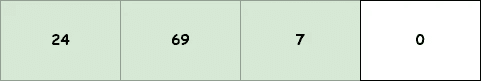
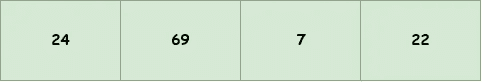
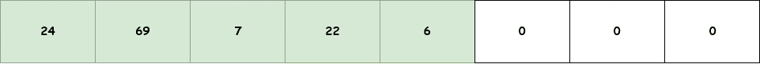
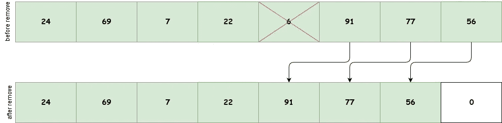
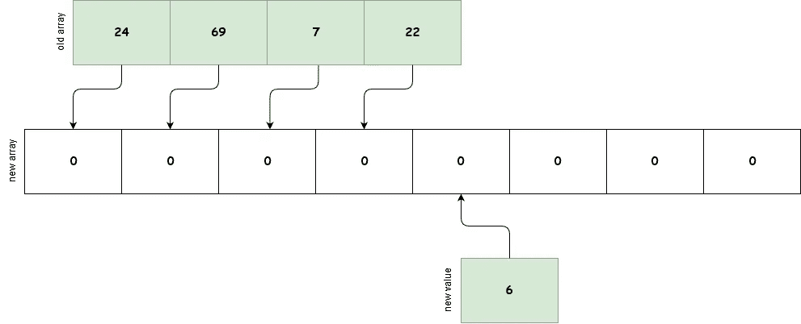
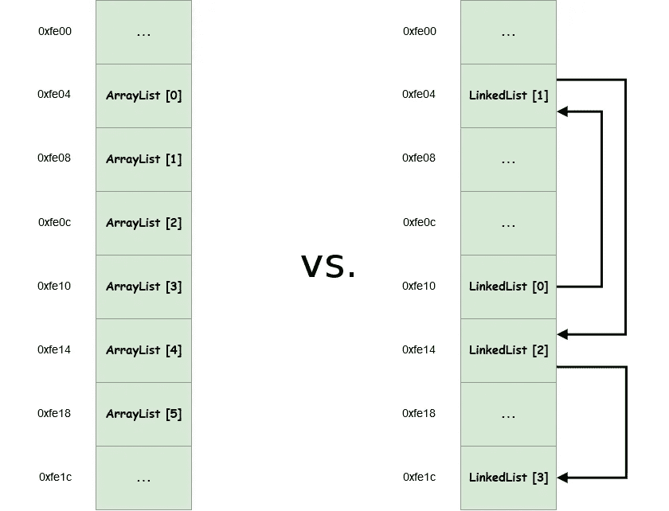
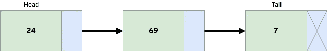
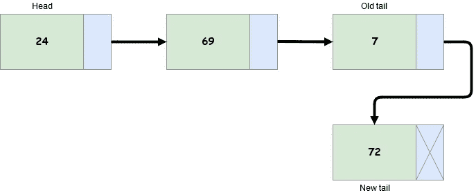
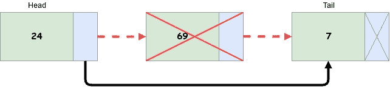

# 数据结构。什么是列表？

> 原文：<https://betterprogramming.pub/data-structures-whats-a-list-ca04b0ba9fa2>

## 列表数据结构及其实现的详细指南——数组列表和链表

塞缪尔·泽勒在 [Unsplash](https://unsplash.com?utm_source=medium&utm_medium=referral) 上的照片

你知道数据结构是如何运作的吗？

掌握数据结构对每个软件工程师来说都是必不可少的。在这里，我将尽力提供新的和有趣的信息。

好了，我们开始吧！

当谈到[列表](https://en.wikipedia.org/wiki/List_(abstract_data_type))数据结构时，我们应该提到它定义了一组连续的元素，您可以向其中添加新元素，删除或更改现有的元素。

列表数据结构通常有两个非常独特的实现——[数组列表](https://en.wikipedia.org/wiki/Dynamic_array)和[链表](https://en.wikipedia.org/wiki/Linked_list)。

我们将讨论数组列表和链表，并解释它们背后的思想。

# 数组表

让我们来看看列表的第一个也是最常用的实现——数组列表。

## 概观

数组列表基本上是一个自调整大小的[数组](https://en.wikipedia.org/wiki/Array_data_structure)，或者换句话说，是一个[动态数组](https://en.wikipedia.org/wiki/Dynamic_array)。

数组列表背后的魔法肯定没那么复杂。让我们揭开这个秘密。

事实是，它只是在幕后管理一个普通的静态数组。

这种数据结构的行为与普通数组完全一样，但具有一个额外的容量属性，每次超出该属性时都会调用大小扩展。

大小为 3、容量为 4 的数组列表

这意味着这种数据结构可以按需增长，而传统的静态数组则不能，因为它有一个预定义的最大大小。

这给我们带来了数组列表的优点和缺点。

数组列表和数组作为一个整体的奇妙之处在于，因为它们的元素在内存中是连续的，所以它们可以极大地从 [CPU 缓存](https://www.infoworld.com/article/3217388/how-to-speed-your-code-using-cpu-caches.html)中获益[。这极大地提高了操作数据结构的速度。](https://www.infoworld.com/article/3217388/how-to-speed-your-code-using-cpu-caches.html)

一件不太妙的事情是，调整大小操作有时会由于我们将在后面提到的问题而失败。

除此之外，数组列表有时会使用比实际需要更多的空间。

## 使用

当您迫切需要存储项目，但事先不知道需要多少空间时，对这种数据结构的需求最为明显。

此外，当您经常需要从数据结构中添加或获取元素时，数组列表将非常适合，因为这些操作快速而高效。

如果需要经常删除或插入元素，那么选择数据结构并不是很好。

## 复杂性

*   加法(元素)→ O(1)
*   移除(元素)→ O(n)
*   insert(元素，索引)→ O(n)
*   get(索引)→ O(1)

## 履行

好吧，让我们看看真正的东西。

我们首先来看一个典型的数组列表定义。

操作和变量的数组列表定义

现在让我们继续实现构造函数。

数组列表无参数和容量参数构造函数

接下来，我们将展示一些典型数组列表操作的实现。

**添加操作**

这个操作在大多数情况下是快速的，当它不快速时，是在数组列表必须增加其容量的情况下。

为了了解调整大小是如何工作的，让我们考虑一下这个数组列表。

大小为 4、容量为 4 的数组列表

上图中的数组列表已经达到了它的容量，在下一次添加操作时，将会触发调整大小机制。

大小为 5、容量为 8 的数组列表

这是容量溢出添加操作后您将得到的结果—容量加倍的数组列表。

让我们看看代码。

数组列表添加操作

**移除 At 操作**

移除数组列表中的元素是一个相当慢的操作。

这是因为当您删除一个元素时，为了保持内部静态数组数据结构的连续性，您必须将所有跟在已删除元素后面的元素向左移动一个位置。

内部数组列表移除元素操作

操作时删除数组列表

**移除操作**

这个操作差不多可以用`removeAt` 操作来概括。

数组列表删除操作

**插入操作**

`insert`操作类似于`removeAt`操作，但为了给新元素腾出空间，从指定索引的相反方向移动元素。

数组列表插入操作

**调整尺寸操作**

女士们先生们，这是标志性的调整大小操作。

这种操作可以被认为是这种数据结构的缺点，因为它可能相当慢..

这是因为数组列表不能简单地替换它当前的静态数组。正如我们之前提到的，它需要创建一个新的、更大的静态数组，并用当前存储的数据填充它。

这个操作需要时间。

内部数组列表调整大小操作

除了速度慢之外，调整大小操作有时还会由于[内存碎片](https://library.softwareverify.com/memory-fragmentation-your-worst-nightmare/)而失败。

正如我们之前提到的，这个操作还会使数据结构占用比实际需要更多的空间。这种情况下，我们只需要存储很少的额外元素，但没有足够的空间来存储它们，因此数据结构的大小会翻倍，这会导致不必要的大数据结构。

好了，说够了(嗯，实际上是阅读，但是嘿，你说到点子上了)，让我们编码吧。

数组列表调整大小操作

看到了吗？看起来没有听起来那么恐怖。

**获取操作**

最后但同样重要的是，简单的`get`操作是一个非常快速的操作，它只是通过索引来检索元素。

数组列表获取操作

你可以在[我的 GitHub 页面](https://github.com/danielgospodinow/PracticeWorkspace/blob/master/c%2B%2B/dsp2k19/DataStructures/data_structures/array_list/array_list.hpp)找到这个通用 C++数组列表的完整源代码。

# 链表

现在是时候看看列表的第二个最常见的实现了——链表。

## 概观

链表是一种数据结构，它的思想与数组列表相似，但不同之处在于它的元素以完全不同的方式存储。

这种数据结构的元素分布在整个内存中，而数组列表是按顺序排列的。

数组列表与链表内存布局

因为元素在内存中不是连续的，所以链表中的每个元素都必须存储下一个元素的地址。

head 标记注释列表的第一个元素，而 tail 标记注释最后一个元素

这带来了一些好处，也带来了一些坏处。

缺点之一是，由于链表的非顺序内存布局特性，它不能提供对元素的快速随机访问。

另一个被认为是缺点的事情是，伴随数据结构的每个数据节点的所有指针都存在内存开销。

此外，同样由于其非顺序内存布局，链表无法从 CPU 的缓存优化中获益。

现在我们继续讲优点。

优点之一是链表可以安全地增长，而没有由于内存碎片而失败的风险，因为它的元素分布在整个内存中。为单个元素找到自由空间比为一系列元素找到自由空间更容易，数组列表就是这种情况。

另外，需要指出的一点是，链表只使用它需要的内存，不像数组链表那样会分配很多额外的空闲空间，从而浪费宝贵的内存。

## 使用

与数组列表数据结构一样，当您需要存储某种元素但不知道它们的总量时，您会发现链表非常有用。

链表非常适合需要经常从一组元素的开头或结尾添加或删除元素的应用程序。

如果对元素移除、获取或插入操作有很高的需求，那么选择数据结构并不是很好。

照片由[梅勒妮·庞格拉茨](https://unsplash.com/@melanie_sophie?utm_source=medium&utm_medium=referral)在 [Unsplash](https://unsplash.com?utm_source=medium&utm_medium=referral) 上拍摄

## 复杂性

*   加法(元素)→ O(1)
*   移除(元素)→ O(n)
*   insert(元素，索引)→ O(n)
*   get(索引)→ O(n)

## 履行

链表的实现比数组稍微复杂一些，所以要准备好面对很多问题。

让我们再次用一些 C++代码来弄脏我们的手。

链表中的元素被称为*节点、*，它们通过引用相互连接。每个节点都有一个`nextElement` 属性。

让我们首先定义我们的元素，我们也称之为节点。

单一元素(节点)实现

现在让我们定义链表本身。

链接列表定义

和它的构造函数。

链表构造函数

现在让我们展示最重要操作的实现。

**添加操作**

`add`操作非常有效，因为这是一件非常简单的事情。

所有需要做的就是更新尾部元素。

具有新添加元素的链表 72

我们可以在下面的代码中看到这一点。

链表添加操作

**插入操作**

插入操作的整体速度很大程度上取决于新元素必须插入的位置。

这里所要做的就是将一个指针从一个指定的元素直接指向下一个元素，并在它们之间引入新元素。

在链表中的元素 69 之后插入元素 104

让我们编码这个。

链表插入操作

**移除 At 操作**

`removeAt`操作与`insert`操作具有相同的复杂性。

这也只是一个替换指针的问题，但是操作是否快速完全取决于必须移除的元素的位置。

移除链表中的元素 69

这是代码。

操作时移除链表

**移除操作**

这个操作再次被总结为`removeAt`操作。

链表移除操作

**获取操作**

`get`的操作听起来很简单。唯一的问题是，它不如数组列表中的对应元素那么快。

链表获取操作

咻…好了，就这些了。

这里我们只展示了最重要的操作的实现。剩下的，加上这个通用链表的全部源代码，可以在这里找到。

# 数组列表和链表的比较

好吧，只是做一个简单快速的比较:

*   数组列表快速添加和获取元素，而链表可以快速添加或删除数据结构开头和结尾的元素。
*   链表没有内存碎片的问题，不像它的替代品，数组列表。
*   数组列表可以从 CPU 缓存优化中受益，不像它的替代品链表。
*   与分配额外内存的数组列表相比，链表只使用它需要的内存。

使用哪一种完全取决于您想要完成的任务类型。

# 结论

数组列表和链表都是最常用的数据结构。

它们适合几乎所有的用例。

也就是说，使用它们时感到舒适是非常重要的。