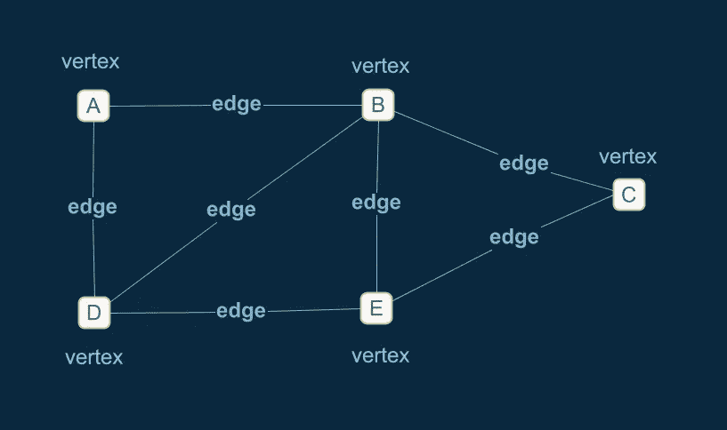
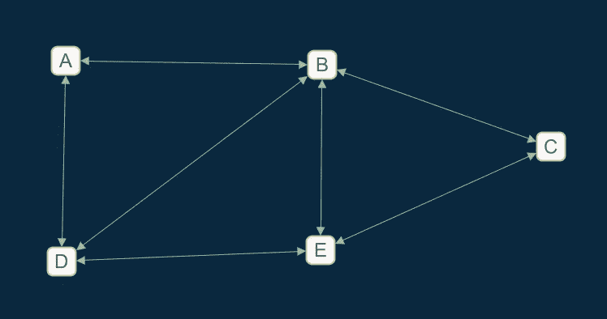
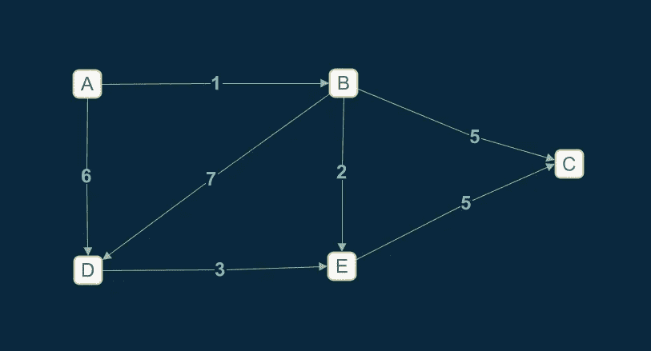
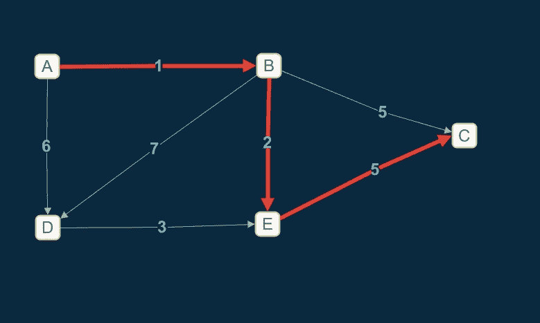
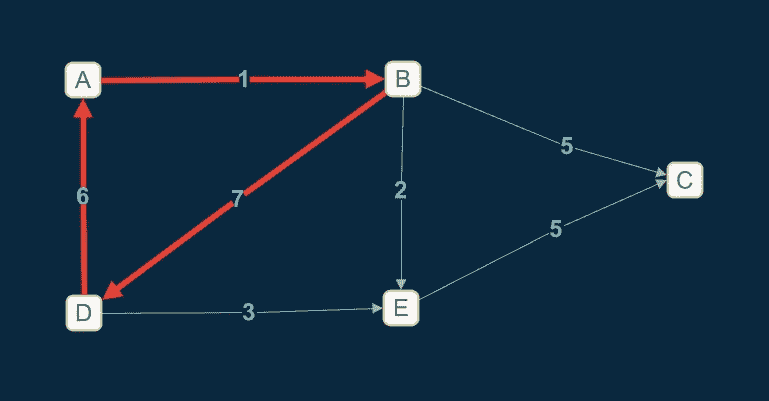
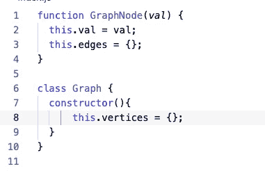
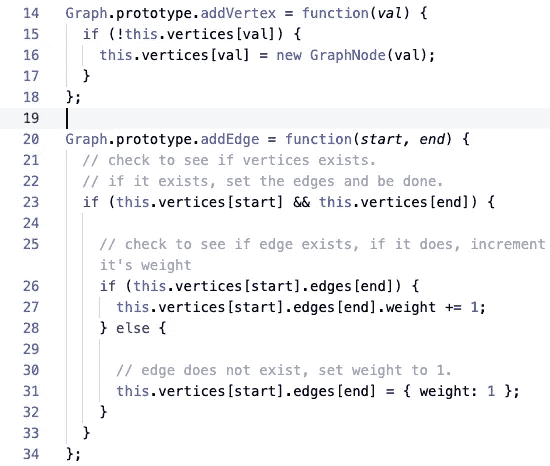
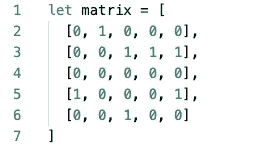

# JavaScript 的数据结构:图形

> 原文：<https://betterprogramming.pub/data-structures-with-javascript-graphs-42084ec4db22>

## 我们来谈谈图形数据结构

由[法比奥](https://unsplash.com/@fabioha?utm_source=medium&utm_medium=referral)在 [Unsplash](https://unsplash.com?utm_source=medium&utm_medium=referral) 拍摄的照片。

图形数据结构是节点的集合。但是与树不同的是，没有关于节点应该如何连接的规则。没有根节点、父节点或子节点。此外，节点被称为顶点，它们由边连接。下面是一个图表的示例:

作者照片。

通常，图的边比顶点多。边数多于顶点数的图称为稠密图。如果边比顶点少，那么它是一个稀疏图。

在一些图中，边是有方向的。这些被称为有向图或有向图。边都是双向的图称为无向图、无序图或简称为图。默认情况下，图被认为是无序的。

作者照片。

在一些图中，边可以有权重。这些被称为加权图。重量通常被称为成本。每个成本代表什么取决于应用。例如，每个成本可能是你在社交网络中认识某人的概率、交通堵塞率等。

作者照片。

路径是图形数据结构的另一个重要部分。它是图中顶点的序列。如果从一个顶点到另一个顶点有一条路，则认为图是连通的。

作者照片。

一个圈是一条起点也是终点的路径。树是一种特殊类型的图，它包括从起始顶点(根)到某个其他顶点的路径。然而，该树没有循环。

作者照片。

# **图形表示**

图可以表示为一组顶点和一组边。让我们来看看这张图表:

*   G = (V，E)
*   V = {A，B，C，D，E}

我们可以列出所有的顶点，并将它们存储在对象`V`中。每条边可以作为一对顶点列出。

对于加权图，我们可以将每条边的成本添加到以下符号中:

*   V = {A，B，C，D，E}
*   E = {(A，B，1)，(D，A，6)，(B，D，7)，(D，E，3)，(B，E，3)，(B，C，5)，(E，C，5)}

在无向图中，我们必须分别列出所有可能的方向:

*   E = {(A，B)、(A，D)、(B，A)、(C，D)、(B，D)、(B，E)、(C，B)、(C，E)、(D，A)、(D，B)、(D，E)、(E，B)、(E，B)、(E，C)、(E，D) }

# **实现**

图可以通过邻接表和邻接矩阵来实现。

## **邻接表**

有了邻接表，我们就有了一个顶点的主列表。对于每条边，每个起始顶点都维护一个结束顶点列表。每个顶点都有一个它的近邻列表。

我们可以用面向对象的方式实现它。下面是 JavaScript 中图形和顶点的样子:

同样，让我们创建添加顶点和边的方法:

## **邻接矩阵**

使用邻接矩阵，每个顶点都被写成网格中的行标题和列标题。如果边存在于顶点之间，那么它的权重可以由适当的行和列的交点来表示。对于无向图，我们可以简单地用一个布尔值来表示每条边。

邻接矩阵可以在二维数组中实现。图的实际连通性将由边的 2D 阵列来定义:

# **结论**

使用矩阵优于列表的主要优点是，确定两个顶点之间是否存在边需要简单的数组查找。但是一个矩阵在空间上不是很有效率。例如，对于稀疏图，矩阵的大部分将是空的。对于一个无向图，一半的存储信息只是简单的复制。您应该使用哪种方法取决于您所代表的应用程序和信息以及您如何处理它。

图形是一种非常流行的数据结构。谷歌地图用它来计算路线。WWW 被认为是一个图，网站之间的每个链接都是一条边。脸书用一个未被发现的图表向你推荐朋友。应用是无限的！在下一篇文章中，我们将讨论如何使用不同的图表。

不断学习，不断成长。

感谢阅读！