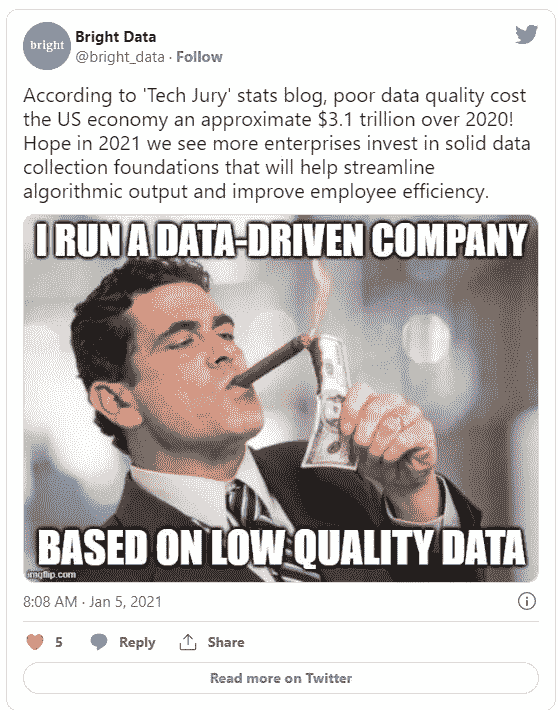

# 数据测试:被忽视的一步

> 原文：<https://betterprogramming.pub/data-testing-the-neglected-step-a783450f34f0>

## 为什么您的数据平台存在信任问题？

[疾控中心](https://unsplash.com/@cdc?utm_source=medium&utm_medium=referral)在 [Unsplash](https://unsplash.com?utm_source=medium&utm_medium=referral) 拍摄的照片

上周，我和我的经理讨论了测试驱动开发及其在敏捷世界中的相关性。我们都来自核心的软件工程背景，分享了我们过去的经验。同时努力解决我们数据平台中的数据质量问题。

这时，他提到 TDD 非常适合数据，因为工程师们知道在接收数据之前会发生什么。他们可以编写测试，以确保所获取的数据与业务、工程和建模预期相匹配。我完全同意，在这里我将从软件工程的角度写更多关于数据测试的情况。

# 数据测试的状态

这条推文恰当地代表了数据测试的现状，以及低质量数据组织所吹嘘的。数据测试是分析和数据科学的一个重要组成部分，由于数据团队的优先级和缺乏技能和流程，数据测试主要被搁置。

不是说每个人都这样，但是测试几百万条记录，几十亿字节的数据，吓得工程师不敢测试。软件工程已经经历了多年的迭代，成熟的方法不时地被开发和执行。然而，数据工程还不是一个新概念，还没有达到交付高质量成果所需的成熟度。

数据管道可能很复杂，需要执行一个或多个 ELT/ETL 步骤。在每个阶段测试输出将有助于建立对数据的信心，从长远来看可以识别回归问题。不幸的是，大多数团队跳过了数据验证这一关键步骤，开始在建模数据的基础上创建报告。防止下游问题的最好方法之一是在数据进入数据平台之前添加数据质量检查。

如果这不是一个选项，您当然可以在获取数据后将它们作为第一项任务。不要尝试手动进行这些检查，而是使用测试技术来运行自动化测试，以验证数据的不同方面。

数据战略要求构建一个复杂的现代数据平台，以实现组织内部数据的民主化。有许多方法可以产生可扩展的现代数据平台，并且大多数组织已经成功地开发了它们。痛苦的事实是，他们仍然受到信任问题的困扰。如果数据质量很差，一个优秀的数据平台是没有价值的。相反，excel 中的高质量数据更有帮助。不要忘记，最终目标是从数据中获得洞察力，以帮助您的组织做出明智的决策。数据平台只是 it 的推动者，而不是目的地。

# 数据测试的挑战

数据测试不像特性测试那样简单，成功执行它的复杂性使得它在数据工程领域不受欢迎并被忽视。这不应该阻止您测试数据和相关的转换，以确保数据是可接受的，并且是高质量的，以获得洞察力。一些挑战包括如下:

## 体积和异质性

彻底测试千兆字节的数据本身就是一个挑战。随着每天生成的数据量的增加，这个问题的规模也在扩大。手动审核这种规模的数据既慢又容易出错。向它添加需要测试的数据类型以及它随时间变化的可能性会扩大范围。

## 数据的可用性

由于您组织的数据治理和安全政策，在生产中测试实际数据可能是不允许的。这意味着您要么测试在非生产环境中复制的模糊数据，要么创建测试数据。无论哪种方式，都会有您不会发现的测试用例，并且只会在您的生产环境中公开。

## 理解数据

当工程团队执行数据测试时，他们可能不完全理解数据的复杂性。可以在一定程度上测试原始数据的接收，但是测试转换需要对数据、业务规则及其与其他数据集的关系有深刻的理解。

## 缺乏专业知识

所有组织都在努力招聘相关人才，软件行业有如此多的机会，招聘专家人才很有挑战性。测试大数据需要不同的思维方式，而不仅仅是测试一个功能。创建和维护测试用例需要技术人员、数据管理员、数据所有者和其他利益相关者之间的协调，然后将它们自动化，以确保它涵盖数据的数量、种类、价值和速度。

# 前进的道路

数据测试是必须的，应该在将数据管道放入生产环境之前进行。类似于软件测试，它将有助于提前识别预期的问题。数据的美在于它的方差和体积。工程师可以在接受的模式上创建测试，验证数据的类型、值、分布、数量和预期的变化。有助于测试数据和增加用户信任度的一些技巧包括:

## 自动化

手工测试的时代已经结束，你越快意识到这一点，对你和你的组织就越好。手动测试大数据是不可能的，也不是面向未来的。自动化是持续快速测试数据中所有排列的唯一方法。您可以利用许多开源工具/框架来自动测试您的数据——其中一些甚至通过分析您的数据预先生成测试，并有可能在以后进行调整。

## 逐步测试

在管道的不同部分测试数据是一个很好的实践。不要只在最后一层测试。增加从摄取到转换的测试将有助于尽早发现问题。数据转换可能会变得非常复杂，建议在转换前后添加数据测试。一个好的测试策略应该包括对摄取的、精选的/准备的、建模的和分析的数据的测试。您用于数据的术语可能会改变，但概念仍然成立。

## 传授…额外技能

虽然测试在软件工程中是一个老概念，但在大数据测试中仍然相对较新。该行业在不断成长和学习，尝试新的更好的方法来构建高质量的数据集。信任您的数据的唯一方法是让您的团队掌握数据测试的技能。持续的协作、头脑风暴、非正式会议和建立数据测试实践有助于创造一个不断学习的环境。

## 数据的 TDD

我从为数据实现 TDD 的概念开始。老实说，我没有听说过有人这样做，如果你在实践 TDD 的艺术来测试你的数据，我会很感兴趣。当工程师编写接收数据的管道时，他们很可能知道并理解数据及其形式。

如果他们可以首先编写测试，期望摄取的数据适合测试用例，这将使数据摄取步骤更加可信。类似地，当用户在获取的数据上创建转换时，期望就已经设定好了。在编写转换之前拥有测试用例将能够更快地测试精选的数据。

## 数据测试策略

虽然我最后才提到，但这是建立对数据信任的第一个支柱。从长远来看，拥有一个清晰的、记录良好的数据测试策略将会节省您的返工和测试时间。当您创建了一个先例，工程师在生产中部署管道之前必须对其进行测试时，您就定义了一个流程并实现了一个网关守卫，以确保用户不会与垃圾数据进行交互。

进一步解释工具、框架和实现将阐明组织在该主题上的立场，并在多个数据团队之间带来一致性。不要忘记不时地重新审视你的策略，并根据工程师的反馈进行更新。

# 结论

“我们相信上帝。所有其他人都必须带数据。”—w . Edwards Deming 的这句话表明了数据对组织的重要性。

我认为数据的规模和数量已经发生了相当大的变化，是时候稍微调整一下这句话了。在我看来，它应该读作

> “我们相信上帝。所有其他人必须带来值得信赖的数据。”