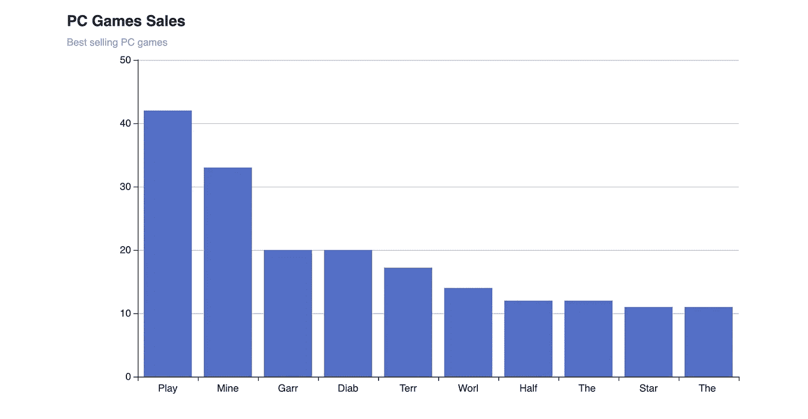

# 围棋中的数据可视化

> 原文：<https://betterprogramming.pub/data-visualization-in-go-e3135d93f8a8>

## 构建漂亮的图表

照片由[米卡·鲍梅斯特](https://unsplash.com/@mbaumi?utm_source=medium&utm_medium=referral)在 [Unsplash](https://unsplash.com?utm_source=medium&utm_medium=referral) 上拍摄

本文将展示如何使用 Golang 来分析、处理和可视化数据。这是一个初学者友好的教程，并不真正需要任何水平的 Golang 专业知识。

我们将使用来自 [Kaggle](https://www.kaggle.com/khaiid/most-selling-pc-games) 的畅销电脑游戏数据集。您可以下载数据集，并将其作为`games.csv`保存在您的工作目录中，以便继续使用。

# **读取数据集**

我们正在处理的数据集包含显示几款电脑游戏在一段时间内销售数量的数据。

首先，我们需要将数据集读入我们的 Go 程序。让我们创建一个新的入口文件`main.go`，然后创建一个主函数，并在这里添加下面的代码片段。

从上面的片段来看:

1.  我们使用 Golang 的`os`包打开数据集的文件，提供文件名作为参数，并将数据集保存为`file`
2.  声明两个变量来保存游戏名称和每个游戏的销售额。`games`是一片`string`而`sales`则是一片`float64`
3.  如果在读取文件时出现错误，我们将记录错误并退出程序。
4.  我们使用`encoding/csv`包创建了一个新的 CSV 阅读器。在这里，我们提供读取文件作为参数。然后，我们将阅读器的 LazyQuote 属性设置为 true，以便在 CSV 文件中未加引号的字段上添加引号。
5.  然后，我们使用创建的阅读器读取 CSV 文件，并将其保存为`records`。如果在读取文件时发生错误，我们记录错误并退出程序。

这里应该注意的是，CSV 数据集将被读取为`records`，每一行都被表示为一个数组元素，即标题将是数组中的第一个元素，随后，每一行也是如此。

我们需要做的下一件事是格式化得到的记录。我们创建了一个新函数来处理这个问题。该函数接受字符串片`[][]string`的一片`record`，返回与`gameNames`和`sales`类型相同的两个变量

1.  我们创建了新的变量`gameName []string{}`和`sales []float64{}`
2.  我们在这里创建一个`for`循环，遍历`records`的每个元素。注意循环是如何从第一个索引而不是第 0 个索引开始的，这是为了删除 CSV 头。
3.  然后，我们将数据追加到创建的`gamesNames`切片中。游戏的名字出现在数据集的第一列，这解释了为什么我们在`records` `r[0]`中附加每个元素的第 0 个索引
4.  我们还将数据添加到创建的`sales`切片中。销售数字出现在数据集的第二列，这解释了为什么追加`records` `r[1]`中每个元素的第一个索引也注意到了我们如何在将`string`追加到`sales.`之前将其转换为`float64`
5.  然后我们返回两个切片；`gameNames`和`sales`

从主函数中，我们现在可以调用`formatRecords`函数并相应地更新`gameNames`和`sales`变量，如下所示

# **数据集映射**

现在，我们需要映射我们的记录，这样它就被表示为一个键/值对的映射，键是游戏的名称，值是销售额，就像`map[string]float64{ "game1": 20.5, "game2": 3 }`一样。我们还将按照销售数量的降序对地图进行排序。我们通过创建另一个像这样的函数来实现。

1.  我们创建一个新的映射变量`dataMap`，键为`string`，值为`float64`
2.  循环遍历`gameNames`切片，对于切片中的每个名称，我们将数据映射值设置为游戏名称，将密钥设置为当前索引`sales`的值

此时，我们已经能够将我们的记录转换成`gameNames`与销售数量的关系图。接下来要做的是对数据进行排序。为此，我们需要实现自定义排序。你可以在 Golang [这里](https://gobyexample.com/sorting)了解更多关于排序的信息

这是怎么回事？？？

1.  我们创建一个具有`Value`(字符串)和`Key`(浮动 64)属性的结构类型`Data`。这代表了我们的数据存在的格式
2.  我们还创建了一个类型为`[]Data`的变量`DataList`。
3.  然后我们创建三个函数`Len, Swap and Less`。在 Golang 中实现自定义排序需要这些函数。
4.  现在，在`mapData`函数中，我们创建了一个新数据，它是一个类型为`DataList`的切片，其长度将是`dataMap`的长度。然后我们迭代`dataMap`并相应地设置填充`data`切片
5.  然后我们使用 Golang 的排序包对填充的`data`进行排序。请注意，我们做了反向排序，因为我们希望按降序排序。
6.  然后我们返回数据。

我们可以这样调用主函数中的`mapData`函数；

此时，我们已经能够读取、分析和清理我们的数据。下一步是在图表上可视化数据，我们将利用条形图，其中 X 轴显示游戏名称，Y 轴显示销售数量。为此，我们将利用 [go-echat](https://github.com/go-echarts/go-echarts) 库。这个库对于 Golang 中的数据可视化非常有用。

1.  我们需要在您的终端中运行`$ go get -u github.com/go-echarts/go-echarts/v2/.`来添加库。
2.  我们将只绘制数据集中的前 10 个数据，请记住，我们已经按照销售数量的降序对数据集进行了排序。

那么，这里发生了什么？

1.  在`createChart`函数中，我们将排序后的数据作为参数传递。
2.  我们用 go-echart 库创建了一个新的条形图实例
3.  我们在条形图上设置了一些全局选项，包括图表标题和副标题。
4.  我们设置 X 轴数据，这是游戏名称，也是我们排序数据图的关键
5.  下一件事是生成 Y 轴数据，它代表每款 PC 游戏的销售数量。这是通过新函数`generateBarItems`完成的，该函数将`sortedData`作为参数。在这个函数中，我们遍历了`sortedData`，并相应地追加了条形数据。这表示为`items`
6.  回到`createChart`函数，我们使用`os`包的`Create`方法创建一个新的 HTML 文件(`games.html)`)。然后，我们在新的 HTML 文件中呈现图表。

这样，我们就能够从我们的数据集生成一个条形图。你现在可以运行`go run main.go`来编译和运行程序。您可以打开新的 HTML 文件来查看图表

作者图片

现在，我们已经了解了如何读取文件(CSV)，处理文件内容，然后用文件内容创建图表。代码可以在这个[库](https://github.com/horlabyc/data-visualization)中找到。感谢阅读。